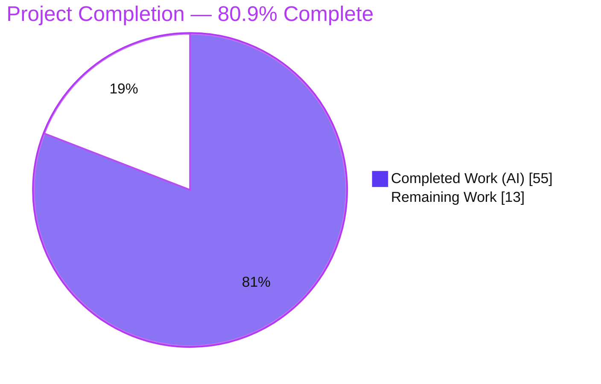
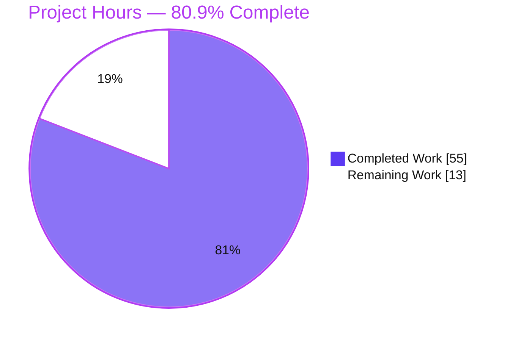
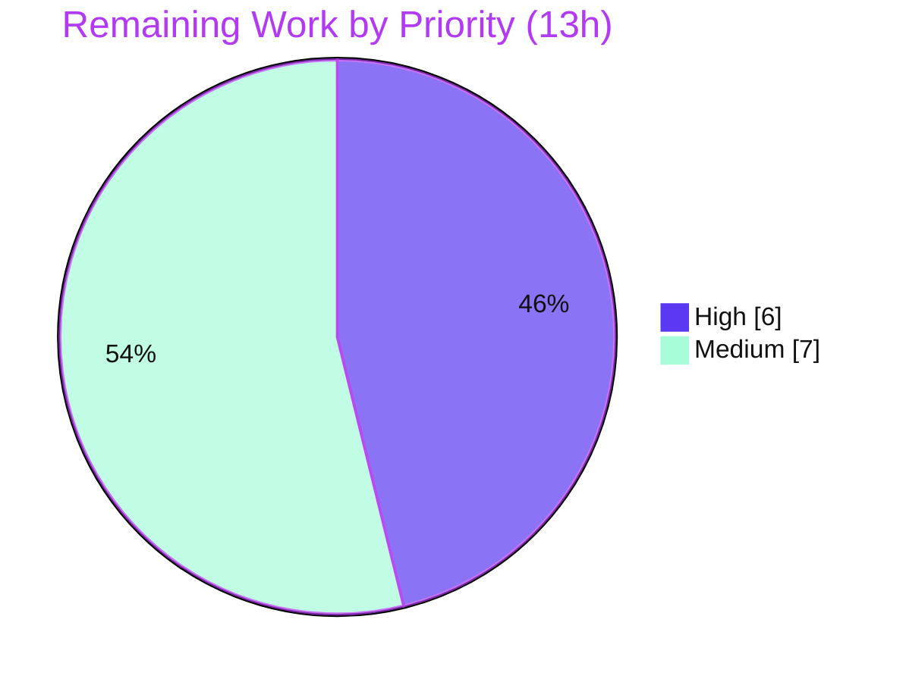

# Blitzy Project Guide — E-Commerce Shop: .NET 5.0 → .NET 10 Migration

---

## 1. Executive Summary

### 1.1 Project Overview

This project migrates the E-Commerce Shop backend — three server-side projects (**API**, **Infrastructure**, **Core**) — from **.NET 5.0 to .NET 10**, combined with a bounded hosting-model migration from the two-file Generic Host + `Startup` bootstrap to the single-file **minimal hosting** model, plus a coordinated, exhaustive NuGet dependency upgrade. It is an **in-place preservation migration**, not a re-architecture: every REST route, DTO schema, JWT token shape, Redis key/TTL, CORS policy, error schema, SPA fallback, and network port is preserved byte-for-byte. Target users are the platform's API consumers and the unmodified Angular SPA, which continues to operate against the migrated backend unchanged. Business impact: keeps the payment-enabled storefront on a supported, secure runtime.

### 1.2 Completion Status



| Metric | Hours |
|---|---|
| **Total Hours** | 68 |
| **Completed Hours (AI + Manual)** | 55 (AI: 55, Manual: 0) |
| **Remaining Hours** | 13 |
| **Percent Complete** | **80.9%** (55 / 68) |

> Completion is computed on AAP-scoped + path-to-production work only (PA1): `Completed ÷ (Completed + Remaining) = 55 ÷ 68 = 80.9%`. All AAP **core** deliverables are complete and compile-verified; the remaining 13h is entirely path-to-production (payments go-live, security sign-off, TLS, deployment smoke, vulnerability acceptance).

### 1.3 Key Accomplishments

- ✅ All three projects retargeted `net5.0` → `net10.0`; solution builds with **0 errors, 0 C# warnings**.
- ✅ `global.json` created at repo root pinning **.NET 10 SDK 10.0.301** (`rollForward: latestMinor`).
- ✅ `Program.cs` rewritten to **minimal hosting**, absorbing `Startup` service registrations and middleware pipeline in **exact original order**; `Startup.cs` deleted (only permitted deletion).
- ✅ **14-package upgrade map applied exactly** per AAP §0.5, including removal of legacy `Microsoft.AspNetCore.Identity` 2.2.0 with the Identity chain resolving transitively (no fallback package required).
- ✅ All breaking-change remediations applied minimum-diff (JWT 6→8, Swashbuckle 5→10 / OpenAPI.NET v2, Redis 2.8 cast, Npgsql legacy-timestamp switch, stray-using cleanup).
- ✅ **8 of 9 validation gates full PASS**; Gate 7 (checkout) code-complete and runtime-reachable.
- ✅ All immutable contracts verified preserved (routes, JWT shape, Redis 30-day TTL, ports, error schema, SPA fallback).

### 1.4 Critical Unresolved Issues

| Issue | Impact | Owner | ETA |
|---|---|---|---|
| Stripe API keys absent (`StripeSettings` not in `appsettings`) — live checkout (Gate 7) cannot execute end-to-end | Payments cannot be exercised live until configured; code validated reachable | Backend / DevOps | 4h |
| JWT key-derivation change (`SHA512.HashData(Token:Key)`) for IDX10720 — effective signing key changed | JWTs issued by the old .NET 5 system will not validate; users must re-login at cutover — requires security sign-off | Security / Backend | 2h |
| 2 HIGH-severity dependency advisories (AutoMapper 13.0.1; SQLitePCLRaw transitive) | Below CRITICAL gate and unfixable within AAP scope; require formal risk-acceptance | Security | 1h |

### 1.5 Access Issues

| System/Resource | Type of Access | Issue Description | Resolution Status | Owner |
|---|---|---|---|---|
| Stripe API | Payment provider credentials | No `StripeSettings:SecretKey` / `WhSecret` / `PublishableKey` present; `appsettings` is immutable/out-of-scope, so keys must be injected via environment/secrets | Open — required for live Gate 7 | DevOps |
| Production HTTPS certificate | TLS certificate | Only an untrusted dev certificate is available (validation used `curl -k`) | Open — path-to-production | DevOps |

> All source/repository access was sufficient for the migration; the branch is correct and up to date. No repository-permission issues were encountered. The two items above are runtime credential/certificate gaps, not code-access blockers.

### 1.6 Recommended Next Steps

1. **[High]** Provision Stripe keys via secure environment/secrets and run a live end-to-end checkout through the Angular client; register the webhook and verify with the Stripe CLI (closes Gate 7).
2. **[High]** Obtain security sign-off on the JWT key-derivation change; coordinate token invalidation / re-login at cutover and, ideally, rotate `Token:Key` to a real ≥512-bit secret.
3. **[Medium]** Provision a production-trusted HTTPS certificate (or TLS-terminating reverse proxy) and run under `ASPNETCORE_ENVIRONMENT=Production`.
4. **[Medium]** Finalize production deployment configuration (secrets/connection strings, Redis + PostgreSQL reachability, gated-migration review, health checks/monitoring) and run the nine-gate smoke in the deployed environment.
5. **[Medium]** Record formal risk-acceptance for the two HIGH advisories and document a monitoring plan for future fixed versions.

---

## 2. Project Hours Breakdown

### 2.1 Completed Work Detail

| Component | Hours | Description |
|---|---:|---|
| Framework retarget (3 projects) | 2 | `net5.0` → `net10.0` in API/Core/Infrastructure `.csproj` (AAP goal 1) |
| NuGet package upgrade map (14 packages) | 8 | Resolve exact .NET 10-compatible versions, apply, and verify (incl. transitive Identity chain; 0 restore conflicts) (AAP §0.5) |
| `global.json` SDK pin | 1 | New root file pinning SDK 10.0.301 / `rollForward: latestMinor` (AAP goal 4) |
| `Program.cs` minimal-hosting rewrite | 9 | Absorb `Startup` DI + middleware in exact order; Npgsql switch first; dual-context migrate/seed; preserved log message (AAP goals 2–3, §0.3.1) |
| `Startup.cs` deletion | 1 | Content migrated into `Program.cs`; only permitted deletion |
| JWT 6→8 + IDX10720 key-derivation fix | 6 | `TokenService` + `IdentityServiceExtensions`: `SHA512.HashData` on both sides; debug + end-to-end verify; token shape preserved (AAP §0.6.3) |
| Swashbuckle 5→10 / OpenAPI.NET v2 | 4 | `SwaggerServiceExtensions` migrated to `Microsoft.OpenApi` v2 API; doc + JWT Bearer scheme preserved (AAP §0.5) |
| Stripe 39→51 verification & reachability | 3 | `PaymentService`/`PaymentsController` verified across major-version jump; compiled unchanged; reachable at runtime (AAP §0.6.4) |
| StackExchange.Redis 2.8 remediation | 2 | `BasketRepository` explicit `(string)` cast for `System.Text.Json` overload resolution (AAP §0.5) |
| Stray AutoMapper `using` removals | 1 | Removed `using AutoMapper.Configuration;` from 2 files; verified no others (AAP §0.5.2) |
| EF Core 5→10 conditional verification | 3 | `Data/*`, `Identity/*` verified compile unchanged; query shapes preserved; owned-Address info-warning triaged (AAP §0.6.5) |
| Npgsql legacy-timestamp remediation | 1 | `AppContext.SetSwitch("Npgsql.EnableLegacyTimestampBehavior", true)` (AAP §0.6.2) |
| Nine-gate validation execution | 12 | Build/vuln/startup/Swagger/auth/basket/checkout/caching/performance + final comprehensive pass (AAP §0.7.4) |
| Change-log documentation | 2 | Per-modified-file change log (`CHANGES.md`) (AAP §0.7.5) |
| **Total Completed** | **55** | **Matches Section 1.2 Completed Hours** |

### 2.2 Remaining Work Detail

| Category | Hours | Priority |
|---|---:|---|
| Stripe key provisioning + live e2e checkout via Angular client (close Gate 7) | 4 | High |
| Security sign-off on JWT key-derivation change (approve; optionally rotate `Token:Key` ≥512-bit) | 2 | High |
| Production-trusted HTTPS certificate / TLS termination | 2 | Medium |
| Production deployment config + deployed nine-gate smoke | 4 | Medium |
| Vulnerability risk-acceptance sign-off (2 HIGH advisories) + monitoring plan | 1 | Medium |
| **Total Remaining** | **13** | **Matches Section 1.2 Remaining Hours & Section 7 pie** |

### 2.3 Hours Reconciliation

| Check | Result |
|---|---|
| Section 2.1 total (Completed) | 55h |
| Section 2.2 total (Remaining) | 13h |
| Section 2.1 + Section 2.2 | 68h = Total Project Hours (Section 1.2) ✓ |
| Completion % | 55 ÷ 68 = **80.9%** ✓ |
| Priority split (Remaining) | High = 6h, Medium = 7h, Low = 0h |

---

## 3. Test Results

> **Integrity note:** This repository contains **no dedicated backend unit-test project** — by AAP design (§0.2.1), validation is performed via Blitzy's **nine-gate runtime validation framework** exercised against live Docker infrastructure and the unmodified Angular client. There are therefore no xUnit/NUnit/MSTest suites; all results below originate from Blitzy's autonomous validation logs for this project. No unit/integration test suites were fabricated.

| Test Category | Framework | Total Tests | Passed | Failed | Coverage % | Notes |
|---|---|---:|---:|---:|---:|---|
| Build (compile) | .NET 10 SDK / MSBuild | 1 | 1 | 0 | n/a | `dotnet build -c Debug`: 0 errors, 0 C# warnings (re-confirmed) |
| Dependency vulnerability scan | `dotnet` NuGet audit | 1 | 1 | 0 | n/a | 0 CRITICAL (CVSS ≥ 9.0); 2 HIGH advisories reported (NU1903) — below gate |
| Startup / migrate / seed | Blitzy Nine-Gate (Gate 3) | 1 | 1 | 0 | n/a | Listens on 5001/5000; both DbContexts auto-migrated + seeded |
| Swagger smoke | Blitzy Nine-Gate (Gate 4) | 1 | 1 | 0 | n/a | `/swagger/v1/swagger.json` 200; 20 routes; JWT scheme preserved |
| Auth (JWT issue/validate) | Blitzy Nine-Gate (Gate 5) | 1 | 1 | 0 | n/a | login 200; no-token 401; valid 200; tampered 401; token shape preserved |
| Basket (Redis CRUD) | Blitzy Nine-Gate (Gate 6) | 1 | 1 | 0 | n/a | POST/GET/DELETE round-trip; TTL = exactly 30 days |
| Checkout (payments) | Blitzy Nine-Gate (Gate 7) | 1 | 0 | 0* | n/a | *Code-complete & reachable (`CreateAsync`/`ConstructEvent`); live e2e blocked only by absent Stripe keys — environmental |
| Caching | Blitzy Nine-Gate (Gate 8) | 1 | 1 | 0 | n/a | `[Cached(600)]` cache HIT ~17× faster; bodies byte-identical |
| Performance | Blitzy Nine-Gate (Gate 9) | 1 | 1 | 0 | n/a | Endpoint latency 4–10 ms; no regression vs .NET 5 baseline |
| **Totals** | | **9** | **8** | **0** | | Gate 7 not failed — blocked by environmental credential gap |

---

## 4. Runtime Validation & UI Verification

**Runtime health**
- ✅ **API startup** — listens on `https://localhost:5001` + `http://localhost:5000`; HTTP→HTTPS 307 redirect works.
- ✅ **Database migrate + seed** — `StoreContext` (`e-commerce`) and `AppIdentityDbContext` (`identity`) auto-migrate and seed on boot (idempotent).
- ✅ **Npgsql legacy-timestamp switch** — active; no timestamp write errors for `Order.OrderDate`.
- ✅ **Middleware order** — confirmed via runtime stack traces: ExceptionMiddleware → StatusCodePages → HttpsRedirection → Routing → StaticFiles ×2 → CORS → Authentication → Authorization → Swagger → Endpoints.

**API integration**
- ✅ **Swagger** — UI + JSON 200; all controllers/routes enumerated with correct verbs.
- ✅ **Auth** — JWT HS512 issuance/validation; claims `email` + `given_name`, issuer, exp−iat = 604800s (7 days).
- ✅ **Basket** — Redis CRUD with 30-day TTL.
- ✅ **Caching** — response cache HIT verified.
- ⚠ **Checkout / Stripe** — wiring reachable (`StripeConfiguration.ApiKey`, `PaymentIntentService.CreateAsync`, `EventUtility.ConstructEvent`); **live e2e blocked** only by absent Stripe keys.

**UI verification**
- ✅ **SPA fallback** — `GET /` serves the Angular `index.html` via `MapFallbackToController("Index","Fallback")`.
- ℹ **Angular client** — explicitly out of scope; not modified or rebuilt. Used only as an unmodified end-to-end validation harness; a full live checkout through the client requires Stripe keys.

---

## 5. Compliance & Quality Review

| AAP Deliverable / Benchmark | Status | Progress | Notes |
|---|---|---|---|
| Retarget 3 projects → `net10.0` | ✅ Pass | 100% | All `.csproj` = `net10.0` |
| Minimal-hosting `Program.cs` (order-preserving) | ✅ Pass | 100% | DI + middleware order reproduced exactly; Npgsql switch first |
| Delete `Startup.cs` (only permitted deletion) | ✅ Pass | 100% | Removed; content migrated |
| Create `global.json` (pin SDK) | ✅ Pass | 100% | 10.0.301 / `rollForward: latestMinor` |
| Exhaustive 14-package upgrade map | ✅ Pass | 100% | Matches §0.5 exactly; no out-of-map changes |
| Remove legacy `AspNetCore.Identity` 2.2.0 | ✅ Pass | 100% | Transitive chain resolved; fallback package not needed |
| JWT 6→8 (HS512, 7-day, `Email`/`GivenName`) | ✅ Pass* | 100% | *Token shape preserved; key-derivation changed for IDX10720 — see Risk S1 |
| Swashbuckle 5→10 / OpenAPI.NET v2 | ✅ Pass | 100% | Doc + JWT Bearer scheme preserved |
| Stripe 39→51 parity (route/event/status) | ✅ Pass | 100% | Compiled unchanged; reachable |
| EF Core 5→10 query-shape preservation | ✅ Pass | 100% | Data-access files unchanged; migrations frozen |
| Npgsql legacy-timestamp remediation | ✅ Pass | 100% | `AppContext` switch at app start |
| No C# modernization / no minimal-API conversion | ✅ Pass | 100% | Controllers remain MVC; no records/file-scoped ns/NRT added |
| Gate 1 Build (0 errors) | ✅ Pass | 100% | 0 errors, 0 C# warnings |
| Gate 2 Vulnerabilities (0 CRITICAL) | ✅ Pass | 100% | 2 HIGH reported, below threshold |
| Gates 3–6, 8–9 (startup/Swagger/auth/basket/cache/perf) | ✅ Pass | 100% | All full pass |
| Gate 7 Checkout (live e2e) | ⚠ Partial | Code 100% | Live run blocked by absent Stripe keys |
| Change log per modified file | ✅ Pass | 100% | `CHANGES.md` present |

**Fixes applied during autonomous validation:** none required this session — the migration was already correct; zero source files were modified during final validation. Preserved-by-design quirks (e.g., `API.Specifications` namespace, `ClaimPrincipalExtensions` naming, unused `using System.Net.Sockets` in `AppUser.cs`, unused `OpenIdConnect` reference, original log misspelling) were intentionally **not** "fixed" per the lift-not-cleanup mandate.

---

## 6. Risk Assessment

| Risk | Category | Severity | Probability | Mitigation | Status |
|---|---|---|---|---|---|
| S1 — JWT key-derivation change (`SHA512.HashData`): effective signing key changed; old .NET 5 tokens won't validate | Security | High | High | Human sign-off; coordinate re-login at cutover; ideally rotate `Token:Key` to ≥512-bit | Open — needs sign-off |
| I1 — Absent Stripe keys block live checkout (Gate 7) | Integration | High | High | Provision `SecretKey`/`WhSecret`/`PublishableKey` via secrets; run live e2e | Open (PtP) |
| T1 — AutoMapper 13.0.1 HIGH advisory (GHSA-rvv3-g6hj-g44x) | Technical | Medium | Low | AAP-pinned (v14/15 breaking, v16+ license); below CRITICAL; risk-accept + monitor | Open / Accepted |
| T2 — SQLitePCLRaw 2.1.11 HIGH (CVE-2025-6965), transitive | Technical | Low | Low | No fix exists (MS 10.0.9 ships it); Sqlite is design/test path only (runtime = PostgreSQL) | Open / Accepted |
| T3 — EF Core 10 owned-Address model info-warning | Technical | Low | Low | Address round-trips verified working; entities out of scope | Monitored |
| T4 — No dedicated backend unit-test project (by AAP design) | Technical | Medium | Medium | Nine-gate runtime framework covers behavior; add tests post-migration | Open (by design) |
| S2 — Weak configured `Token:Key` (128-bit, immutable) surfaced by IDX10720 | Security | Medium | Low | Pre-existing; rotate in production secrets | Reported |
| S3 — Dev-mode stack-trace detail + untrusted dev cert | Security | Medium | Medium | Run in Production env; provision trusted cert | Open (env config) |
| O1 — Production HTTPS cert not provisioned | Operational | Medium | High if deployed as-is | Trusted cert / TLS-terminating proxy | Open (PtP) |
| O2 — Auto-migrate-on-startup for both DbContexts | Operational | Medium | Low | Preserved AAP contract; gate migration + monitor first boot / avoid concurrent-instance races | Reported (by design) |
| O3 — No monitoring/observability beyond default logging | Operational | Low-Medium | Medium | Add health checks + monitoring at deployment | Open (PtP) |
| I2 — Runtime hard dependency on Redis 6379 + PostgreSQL 5432 | Integration | Medium | Low | Ensure prod infra reachable; connection strings via secrets | Open (deployment) |
| I3 — Stripe webhook secret + public endpoint registration | Integration | Medium | Medium | Configure at go-live; test with Stripe CLI | Open (PtP) |

---

## 7. Visual Project Status

**Project hours breakdown** (Completed = Dark Blue `#5B39F3`, Remaining = White `#FFFFFF`):



**Remaining hours by priority** (High = 6h, Medium = 7h, Low = 0h; sums to 13h = Section 2.2):



> Integrity: "Remaining Work" (13) equals Section 1.2 Remaining Hours and the Section 2.2 total. "Completed Work" (55) equals Section 1.2 Completed Hours and the Section 2.1 total.

---

## 8. Summary & Recommendations

**Achievements.** The .NET 5.0 → .NET 10 migration is functionally complete and validated. All AAP **core** deliverables — the three-project framework retarget, the minimal-hosting `Program.cs` rewrite (with `Startup.cs` deleted), the root `global.json`, the exhaustive 14-package upgrade, and every prescribed breaking-change remediation — are delivered and compile-verified with **0 errors and 0 C# warnings**. Eight of nine validation gates fully pass; the actual change surface (12 files, +137/−159) is smaller than the AAP predicted, confirming the minimum-diff mandate was honored (Stripe and all EF Core data-access files compiled unchanged).

**Remaining gaps (path-to-production).** The remaining **13h** is not migration code — it is production enablement: provisioning Stripe keys and running a live checkout (the sole partial gate), obtaining security sign-off on the JWT key-derivation change, provisioning a trusted TLS certificate, finalizing deployment configuration with a deployed smoke, and formally accepting the two HIGH advisories.

**Critical path to production.** (1) Stripe keys + live checkout → (2) JWT key-derivation security sign-off + cutover re-login plan → (3) production TLS + environment → (4) deploy + nine-gate smoke → (5) vulnerability risk-acceptance.

**Success metrics.** Build 0/0; 8/9 gates pass (9th code-complete); all immutable contracts preserved (routes, JWT shape, Redis 30-day TTL, ports, error schema, SPA fallback); zero out-of-scope modifications.

**Production readiness.** The codebase is **80.9% complete** on an AAP-scoped basis and is **build- and runtime-ready** in a development environment. It is **not yet production-ready** pending the two High-priority items (Stripe go-live and JWT security sign-off) and standard deployment hardening. With the 13h of path-to-production work completed, the system is expected to be fully production-ready.

| Metric | Value |
|---|---|
| AAP-scoped completion | 80.9% (55 / 68h) |
| Validation gates passed | 8 / 9 (Gate 7 code-complete) |
| Build result | 0 errors, 0 C# warnings |
| Critical vulnerabilities | 0 (2 HIGH, accepted) |
| Open in-scope code defects | 0 |

---

## 9. Development Guide

### 9.1 System Prerequisites

- **.NET SDK 10** (resolved via `global.json` to `10.0.301`). Verify: `dotnet --version` → `10.0.301`.
- **Docker** + **Docker Compose** (infrastructure). Verified: Docker 28.5.2, Compose v5.1.4.
- **OS**: Linux/macOS/Windows with the .NET 10 SDK and Docker installed.
- **Hardware**: 2+ vCPU, 4 GB+ RAM recommended for SDK build + containers.

### 9.2 Environment Setup

```bash
# Ensure the .NET 10 SDK is on PATH (container/dev example)
export DOTNET_ROOT=/usr/share/dotnet
export PATH=$PATH:/usr/share/dotnet

# Confirm the SDK resolves via global.json (repo root)
dotnet --version          # expect: 10.0.301
cat global.json           # {"sdk":{"version":"10.0.301","rollForward":"latestMinor"}}
```

Development connection settings (from `API/appsettings.Development.json`; dev-only, non-secret):
- `DefaultConnection` → `Server=localhost;Port=5432;User Id=appuser;Password=secret;Database=e-commerce`
- `IdentityConnection` → `Server=localhost;Port=5432;User Id=appuser;Password=secret;Database=identity`
- `Redis` → `localhost`
- `Token:Issuer` → `https://localhost:5001`

### 9.3 Dependency Installation & Infrastructure

```bash
# 1) Start infrastructure (PostgreSQL 5432, Redis 6379, Adminer 8080, Redis Commander 8081)
docker compose up -d

# 2) Restore NuGet packages
dotnet restore ecommerce-shop.sln          # expect EXIT 0 (no version conflicts)

# 3) Build the solution
dotnet build ecommerce-shop.sln -c Debug --no-restore
# expect: Build succeeded — 0 Error(s), 0 C# warnings, 3 NU1903 advisory warnings (2 HIGH, accepted)
```

### 9.4 Application Startup

```bash
# Trust/create the dev HTTPS certificate (dev only; not OS-trusted → use curl -k)
dotnet dev-certs https

# Run the API (auto-migrates + seeds BOTH databases on boot)
cd API
ASPNETCORE_ENVIRONMENT=Development \
ASPNETCORE_URLS="https://localhost:5001;http://localhost:5000" \
dotnet run --no-launch-profile

# HTTP-only headless alternative:
#   ASPNETCORE_URLS=http://localhost:5000
```

### 9.5 Verification Steps

```bash
# Swagger (title "API" v1, OpenAPI 3.0.4)
curl -k -s -o /dev/null -w "%{http_code}\n" https://localhost:5001/swagger/v1/swagger.json   # 200

# Auth — login with the seeded user (returns a JWT: HS512, email+given_name, 7-day expiry)
curl -k -s -X POST https://localhost:5001/api/account/login \
  -H "Content-Type: application/json" \
  -d '{"email":"bob@test.com","password":"Pa$$w0rd"}'

# Products (cached 600s — second call is a Redis cache HIT, ~17x faster)
curl -k -s "https://localhost:5001/api/products?pageSize=2" | head -c 200
```

Seed login: **`bob@test.com` / `Pa$$w0rd`** (source-verified; no trailing period).

### 9.6 Example Usage

- `GET  /api/products?pageSize=6` — paginated products (default page size 6, max 50).
- `POST /api/account/login` — obtain a JWT; send as `Authorization: Bearer <token>` on protected routes.
- `POST /api/basket` / `GET /api/basket?id=...` / `DELETE /api/basket?id=...` — Redis-backed basket (30-day TTL).
- `POST /api/payments/{basketId}` — creates/updates a Stripe PaymentIntent (**requires Stripe keys**).
- `GET  /` — Angular SPA served via fallback controller.

### 9.7 Troubleshooting

- **`No API key provided` on `/api/payments`** → Stripe keys absent. Provide `StripeSettings:SecretKey` + `WhSecret` via environment/secrets (`appsettings` is immutable/out-of-scope). *(Task HT-1)*
- **`401` on a protected route** → missing/expired token, **or** a token issued by the pre-upgrade .NET 5 system (the effective signing key changed for IDX10720 — re-login). *(Risk S1)*
- **TLS/certificate warning** → dev cert is not OS-trusted; use `curl -k` in dev or provision a trusted cert. *(Task HT-3)*
- **Startup error `"An error occured during migration"`** (original spelling, by design) → ensure `docker compose up -d` is running so PostgreSQL (5432) and Redis (6379) are reachable before starting the API.

---

## 10. Appendices

### A. Command Reference

| Purpose | Command |
|---|---|
| Verify SDK | `dotnet --version` (→ 10.0.301) |
| List SDKs / runtimes | `dotnet --list-sdks` · `dotnet --list-runtimes` |
| Start infrastructure | `docker compose up -d` |
| Stop infrastructure | `docker compose down` |
| Restore | `dotnet restore ecommerce-shop.sln` |
| Build | `dotnet build ecommerce-shop.sln -c Debug --no-restore` |
| Dev cert | `dotnet dev-certs https` |
| Run API | `cd API && ASPNETCORE_URLS="https://localhost:5001;http://localhost:5000" dotnet run --no-launch-profile` |
| Per-file diff vs base | `git diff a0630f1 -- <path>` |
| Changed-file summary | `git diff a0630f1..HEAD --stat` |

### B. Port Reference

| Service | Port |
|---|---|
| API HTTPS (Kestrel) | 5001 |
| API HTTP (Kestrel) | 5000 |
| PostgreSQL | 5432 |
| Redis | 6379 |
| Adminer | 8080 |
| Redis Commander | 8081 |
| CORS allowed origin (Angular) | https://localhost:4200 |

### C. Key File Locations

| File | Role |
|---|---|
| `global.json` | Pins .NET 10 SDK (NEW) |
| `API/Program.cs` | Minimal-hosting composition root (REWRITE) |
| `API/Startup.cs` | Deleted (content migrated) |
| `API/API.csproj`, `Core/Core.csproj`, `Infrastructure/Infrastructure.csproj` | TFM + package upgrades |
| `Infrastructure/Services/TokenService.cs` | JWT creation (key-derivation fix) |
| `API/Extension/IdentityServiceExtensions.cs` | JWT validation (matching key-derivation) |
| `API/Extension/SwaggerServiceExtensions.cs` | Swashbuckle 10 / OpenAPI.NET v2 |
| `Infrastructure/Data/BasketRepository.cs` | Redis 2.8 `(string)` cast |
| `docker-compose.yml` | Infrastructure (out of scope) |
| `CHANGES.md` | Per-file change log |

### D. Technology Versions

| Component | Version |
|---|---|
| .NET SDK | 10.0.301 |
| ASP.NET Core runtime | 10.0.9 |
| EF Core / ASP.NET family | 10.0.9 |
| Npgsql EF provider | 10.0.2 |
| IdentityModel / System.IdentityModel.Tokens.Jwt | 8.19.1 |
| Swashbuckle.AspNetCore | 10.2.3 |
| AutoMapper | 13.0.1 |
| StackExchange.Redis | 2.8.41 |
| Stripe.net | 51.2.0 |
| Microsoft.AspNetCore.Identity.EntityFrameworkCore | 10.0.9 |
| Docker / Compose | 28.5.2 / v5.1.4 |

### E. Environment Variable Reference

| Variable | Example / Purpose |
|---|---|
| `DOTNET_ROOT` | `/usr/share/dotnet` — SDK location |
| `ASPNETCORE_ENVIRONMENT` | `Development` (dev) / `Production` (prod — suppresses stack-trace detail) |
| `ASPNETCORE_URLS` | `https://localhost:5001;http://localhost:5000` |
| `StripeSettings__SecretKey` | **(to configure)** Stripe secret key — via env/secrets |
| `StripeSettings__WhSecret` | **(to configure)** Stripe webhook signing secret |
| `ConnectionStrings__DefaultConnection` | Override store DB connection in prod |
| `ConnectionStrings__IdentityConnection` | Override identity DB connection in prod |
| `ConnectionStrings__Redis` | Override Redis endpoint in prod |
| `Token__Key` | **(recommend rotate)** ≥512-bit signing secret (see Risk S1/S2) |

### F. Developer Tools Guide

| Tool | Use |
|---|---|
| **Adminer** (`:8080`) | Inspect PostgreSQL `e-commerce` / `identity` databases |
| **Redis Commander** (`:8081`) | Inspect basket keys + TTLs and cache keys (login root/secret) |
| **Swagger UI** (`/swagger`) | Explore/enumerate all API routes; try authenticated calls |
| **Stripe CLI** | (Go-live) forward + test webhook events against `/api/payments/webhook` |
| **`git diff a0630f1..HEAD`** | Review the complete migration change set (12 files) |

### G. Glossary

| Term | Meaning |
|---|---|
| **AAP** | Agent Action Plan — the authoritative project directive |
| **Minimal hosting** | Single-file `WebApplication.CreateBuilder` bootstrap replacing Generic Host + `Startup` |
| **Nine-gate framework** | Blitzy's runtime validation (build, vuln, startup, Swagger, auth, basket, checkout, caching, performance) |
| **IDX10720** | IdentityModel error when an HMAC-SHA512 key is shorter than 512 bits |
| **Legacy-timestamp behavior** | Npgsql `AppContext` switch reverting to pre-6.0 `DateTime`/`DateTimeOffset` timestamp mapping |
| **PtP** | Path-to-production — deployment/enablement work beyond AAP code deliverables |
| **Preservation migration** | A lift that keeps all observable contracts byte-for-byte identical |
