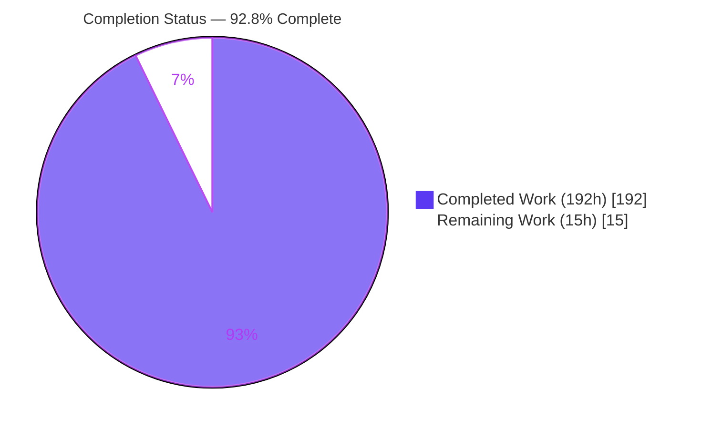
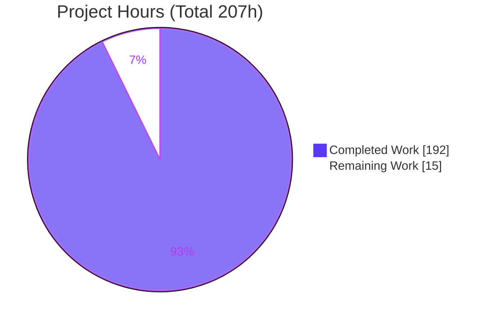
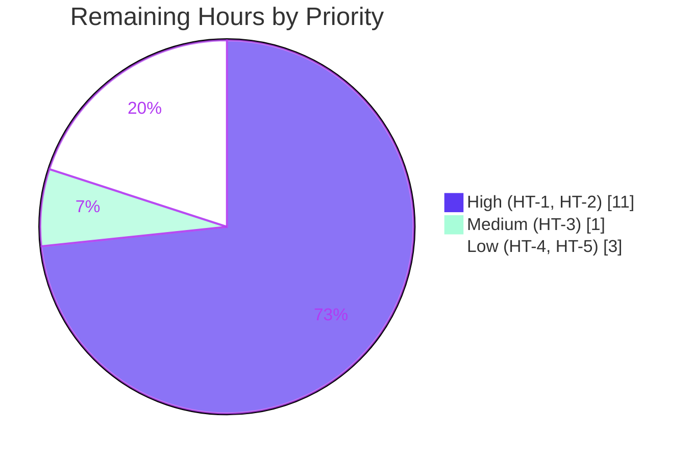

# Blitzy Project Guide — E-Commerce Shop Automated Test Suite

> ⚠️ **Historical snapshot (dated).** This guide documents the earlier **"Add Testing"** engagement on branch `blitzy-bc9729c4-…` (HEAD `738df1d`) and **predates the Real-Time Inventory & Flash Sale feature** that has since been added to this codebase. Consequently:
> - Its scope statements, the test counts below (e.g. "321 backend / 91 frontend / 412 in-scope"), and the §D/§E reference tables are a **point-in-time snapshot** of that engagement and no longer reflect the current test suite or full configuration surface.
> - For the current feature — the four REST endpoints, the SignalR hub/events, reservation/rate-limit/TTL behavior, error contracts, config keys, and limitations — see the **"Real-Time Inventory & Flash Sale"** section in `README.md` and the feature entry at the end of `CHANGES.md`. The current operator environment-variable reference is augmented in §E below.

> **Engagement type:** Add Testing (unit + integration/load) · **Stack:** .NET 5.0 backend + Angular 11 SPA
> **Branch:** `blitzy-bc9729c4-3c5b-4c15-a797-e9d49001ce13` · **HEAD:** `738df1d` · **Baseline:** `a0630f1`
> **Brand colors:** Completed / AI Work = **Dark Blue `#5B39F3`** · Remaining = **White `#FFFFFF`** · Headings = Violet-Black `#B23AF2` · Highlight = Mint `#A8FDD9`

---

## 1. Executive Summary

### 1.1 Project Overview

The E-Commerce Shop is a full-stack online storefront consisting of a .NET 5 ASP.NET Core Web API (Core / Infrastructure / API layers) backed by PostgreSQL and Redis, paired with an Angular 11 single-page front end. This engagement adds a comprehensive, repeatable automated test suite — unit tests with mocked dependencies plus integration and load tests against real infrastructure — **without altering documented production runtime behavior**. The target users are the development and QA teams who gain a regression safety net covering financial, security, caching, and concurrency paths. Business impact: substantially reduced defect risk on the highest-blast-radius flows (order pricing, payment-intent calculation, JWT issuance, authorization) and a foundation for continuous integration.

### 1.2 Completion Status



| Metric | Hours |
|--------|-------|
| **Total Hours** | **207** |
| Completed Hours (AI: 192 + Manual: 0) | 192 |
| Remaining Hours | 15 |
| **Percent Complete** | **92.8%** |

> Completion % is computed with the PA1 AAP-scoped methodology: `Completed ÷ (Completed + Remaining) = 192 ÷ 207 = 92.8%`. All AAP functional requirements are delivered; the remaining 15h is exclusively path-to-production work (human review + CI/CD).

### 1.3 Key Accomplishments

- ✅ Created **4 xUnit test projects** (`Core.Tests`, `Infrastructure.Tests`, `API.Tests`, `API.IntegrationTests`) and registered all four in `ecommerce-shop.sln`.
- ✅ Authored **321 backend tests (100% pass)** — 214 unit + 107 integration/load — and **91 in-scope frontend tests (100% pass)**.
- ✅ Provisioned **real PostgreSQL + Redis via Testcontainers** (digest-pinned `postgres:13` / `redis:6`, isolated per-class, dynamic ports) — no reuse of the shared `docker-compose` infra; verified **zero flakiness across 3 consecutive runs**.
- ✅ Met/exceeded **every documented coverage threshold** — backend critical paths (`OrderService`, `PaymentService`, `TokenService`, `ExceptionMiddleware`) at 100%; frontend Lines 93.9%.
- ✅ Enforced **no live Stripe calls** anywhere (mocked in unit, stubbed in integration, offline signing for the webhook test).
- ✅ Added coverage tooling: `karma.conf.js` LCOV reporter + headless launcher; `coverage.runsettings` (Cobertura + LCOV) with per-namespace filters.
- ✅ Preserved the legacy `app.component.spec.ts` verbatim and left all tech-debt tooling (Protractor, TSLint) untouched, exactly per the binding constraints.
- ✅ Introduced only **one minimal, annotated production seam** (`PaymentService` Stripe factory) with production behavior unchanged.

### 1.4 Critical Unresolved Issues

| Issue | Impact | Owner | ETA |
|-------|--------|-------|-----|
| _None blocking._ All AAP-scoped functionality is delivered and green. | No release-blocking defects | — | — |
| 3 legacy `AppComponent` assertions fail (out-of-scope, preserve-verbatim) | Cosmetic CI noise only; not a regression — requires a product disposition decision, not a fix | Product Owner | See HT-3 (1h) |

### 1.5 Access Issues

| System/Resource | Type of Access | Issue Description | Resolution Status | Owner |
|-----------------|----------------|-------------------|-------------------|-------|
| CI/CD platform | Pipeline config | No CI workflow exists in the repo (only Git LFS hooks); the suite is not yet enforced on PRs | Open — see HT-2 | DevOps |
| Docker registry (CI) | Image pull | Testcontainers pulls `postgres:13` / `redis:6` by digest; air-gapped CI needs a cached mirror | Advisory | DevOps |

> No repository, credential, or third-party API access issues prevented autonomous validation. Backend build/tests and frontend tests were executed successfully in the working environment.

### 1.6 Recommended Next Steps

1. **[High]** Perform senior code review and merge the test suite PR (HT-1).
2. **[High]** Implement a CI/CD pipeline that runs the backend and frontend suites with coverage gates, provisioning Docker for Testcontainers and handling the Angular 11 / Node OpenSSL caveat (HT-2).
3. **[Medium]** Make a product-owner triage decision on the 3 preserved legacy `AppComponent` assertions (HT-3).
4. **[Low]** Automate ReportGenerator per-namespace coverage rollup + threshold enforcement in CI (HT-4).
5. **[Low]** Document toolchain/environment prerequisites for future contributors (HT-5).

---

## 2. Project Hours Breakdown

### 2.1 Completed Work Detail

| Component | Hours | Description |
|-----------|-------|-------------|
| Test project scaffolding & tooling research | 8 | 4 `.csproj` created + `ecommerce-shop.sln` registration; research-backed version selection (Testcontainers, FluentAssertions licensing, Moq SponsorLink pin, Coverlet, `Mvc.Testing`) all matching the `net5.0` target |
| Core.Tests (entities + specifications) | 16 | 81 tests over Core entities (state/`GetTotal()`/enum display) and all 5 specification classes (predicate/include/sort/paging), honoring the `API.Specifications` namespace quirk |
| Infrastructure.Tests (services + data-access) | 26 | 56 tests: `OrderService` (server-side price authority, stale-order), `PaymentService` (amount math, price correction), `TokenService` (JWT), `ResponseCacheService`; `GenericRepository`/`UnitOfWork`/`BasketRepository`/`SpecificationEvaluator` over in-memory/SQLite + mocked Redis |
| API.Tests (controllers + middleware + filters + errors) | 30 | 77 tests: all 7 controllers with mocked collaborators, `ClaimsPrincipal` injection, `UserManager`/`SignInManager` `IUserStore` pattern, `ModelState` seeding; `ExceptionMiddleware`, `CachedAttribute`, `MappingProfiles`, 3 error models + `ControllerTestHelpers` |
| API.IntegrationTests (Testcontainers harness + 8 categories) | 52 | 107 tests: `CustomWebApplicationFactory` + `ContainerFixture` (`IAsyncLifetime`, PG+Redis, `WaitStrategy`) + collection + Stripe stub; Contract 47, Migrations 17, Caching 11, Concurrency 8, Payments 7, Resilience 13, Load 2 |
| Frontend specs (guards/interceptors/services/components) | 28 | 91 tests across 16 colocated `*.spec.ts` using `TestBed`, `HttpClientTestingModule`, `HttpTestingController`, `RouterTestingModule`, Jasmine spies |
| Coverage configuration | 3 | `karma.conf.js` (`lcovonly` reporter + `ChromeHeadlessNoSandbox` launcher; kept `html`+`text-summary`); `coverage.runsettings` (Cobertura+LCOV, Include/Exclude/Migrations filters) |
| PaymentService testability seam | 1 | Minimal annotated `protected virtual CreatePaymentIntentService()` factory; production default unchanged |
| Coverage measurement & threshold tuning | 8 | Per-component/per-namespace measurement to hit ≥90% critical-path and aggregate gates |
| Constraint compliance & determinism validation | 6 | 3× consecutive full-suite runs (zero flakiness), `WaitStrategy` polling (no fixed sleeps), constraint audit |
| QA & code-review remediation cycles | 14 | 10 review-driven commits (QA findings, code-review fixes, assertion strengthening, container-engine pinning, coverage-gap closure) |
| **Total Completed** | **192** | |

### 2.2 Remaining Work Detail

| Category | Hours | Priority |
|----------|-------|----------|
| Human PR review & merge of the test suite (65 files / ~15,182 LOC) | 5 | High |
| CI/CD pipeline integration (backend + frontend suites, coverage gates, Docker-in-CI, Node/OpenSSL handling) | 6 | High |
| Legacy `AppComponent` assertion triage decision (disposition of 3 preserved out-of-scope failures) | 1 | Medium |
| ReportGenerator per-namespace coverage rollup + threshold gate automation | 2 | Low |
| Toolchain/environment documentation (.NET SDK, Node/OpenSSL, Docker, headless Chrome) | 1 | Low |
| **Total Remaining** | **15** | |

### 2.3 Methodology & Reconciliation

- **Completed (192h) + Remaining (15h) = Total (207h)** → matches the Section 1.2 metrics table exactly.
- **Completion = 192 ÷ 207 = 92.8%.**
- All AAP functional requirements are classified **Completed**; there are **no Partially-Completed or Not-Started AAP items**. The remaining hours are 100% path-to-production activities required to operationalize the delivered suite.

---

## 3. Test Results

All tests below originate from Blitzy's autonomous validation logs and were independently re-executed during this assessment.

| Test Category | Framework | Total Tests | Passed | Failed | Coverage % | Notes |
|---------------|-----------|-------------|--------|--------|------------|-------|
| Core unit (entities + specifications) | xUnit 2.4.2 + FluentAssertions | 81 | 81 | 0 | Entities 100% / Specs 100% | `API.Specifications` namespace quirk honored |
| Infrastructure unit (services + data-access) | xUnit + Moq + EF InMemory/SQLite | 56 | 56 | 0 | Critical-path (Order/Payment/Token) 100% | Server-side price authority + JWT + Redis TTL |
| API unit (controllers + middleware + filters + errors) | xUnit + Moq | 77 | 77 | 0 | Controllers 98.1% / Middleware 100% | Auth + `ModelState` + Dev/Prod exception paths |
| API integration & load (real infra) | xUnit + Testcontainers + `Mvc.Testing` | 107 | 107 | 0 | End-to-end pipeline | Contract 47 · Migrations 17 · Caching 11 · Concurrency 8 · Payments 7 · Resilience 13 · Load 2 — **zero flakiness over 3 runs** |
| **Backend subtotal** | — | **321** | **321** | **0** | Aggregate line 95.32% | — |
| Frontend unit (in-scope) | Jasmine 3.8 + Karma 6.1 | 91 | 91 | 0 | Lines 93.9% / Branches 86.15% / Functions 88.35% | 16 named guards/interceptors/services/components |
| **In-scope total** | — | **412** | **412** | **0** | — | 100% in-scope pass rate |

**Documented out-of-scope (not counted above):** `app.component.spec.ts` contains 3 CLI-default assertions that fail (`NullInjectorError [BasketService → HttpClient]`) because the production `AppComponent` diverged from the 2021 Angular template. The file is under a **preserve-verbatim** constraint (last edited 2021-08-05, ~5 years before this engagement) and its failures are intentionally left visible — not a regression from this work.

---

## 4. Runtime Validation & UI Verification

**Backend build & runtime**
- ✅ **Operational** — `dotnet build -c Release`: 0 warnings, 0 errors across all 7 projects.
- ✅ **Operational** — API boots under `ASPNETCORE_ENVIRONMENT=Development`, auto-applies EF Core migrations, and seeds data (6 brands / 4 types / 18 products / 4 delivery methods).
- ✅ **Operational** — `GET /api/products` → 200 (18 products); `/brands` → 6; `/types` → 4; `/products/2` → 200; `/products/99999` → 404 (structured `ApiResponse`).
- ✅ **Operational** — `POST /api/account/login` (`bob@test.com` / `Pa$$w0rd`) → 200 with a JWT issued by `TokenService`; `GET /api/account` with Bearer → 200, without → 401; `/api/account/address` → 200.

**Infrastructure integration**
- ✅ **Operational** — Testcontainers provisions real PostgreSQL + Redis per test class (dynamic ports, digest-pinned images, `WaitStrategy` readiness, auto-disposed).
- ✅ **Operational** — Redis caching semantics, 30-day basket TTL, cache miss→hit, deterministic key, and non-200-not-cached all validated.
- ✅ **Operational** — Fail-closed resilience: with Redis/PostgreSQL stopped mid-test, the pipeline returns a structured `ApiException` 500.
- ✅ **Operational** — Stripe webhook signature verification uses **offline** test-mode signing; no live Stripe calls.

**Front end**
- ✅ **Operational** — `ng test --watch=false --browsers=ChromeHeadless --code-coverage` runs the in-scope suite green and emits an LCOV report.
- ⚠ **Partial (by design)** — 3 legacy `AppComponent` assertions fail as documented above (out-of-scope, preserve-verbatim).

---

## 5. Compliance & Quality Review

| Benchmark / Constraint (AAP) | Requirement | Status | Notes |
|------------------------------|-------------|--------|-------|
| Scaffolding gate | `dotnet test` builds all test projects with zero errors | ✅ Pass | 0/0 build; 4 projects registered in solution |
| Backend pass rate | 100% of authored tests pass | ✅ Pass | 321/321 |
| Frontend pass rate | 100% of in-scope specs pass | ✅ Pass | 91/91 in-scope |
| Coverage — critical paths | ≥90% (Order/Payment/Token/ExceptionMiddleware) | ✅ Pass | 100% |
| Coverage — backend aggregate | Line ≥70 / Branch ≥60 / Func ≥75 | ✅ Pass | Line 95.32% |
| Coverage — frontend aggregate | Line ≥60 / Branch ≥50 / Func ≥65 / critical ≥80 | ✅ Pass | Lines 93.9% / Branches 86.15% / Functions 88.35% |
| Real infra only in integration | No mocking PG/Redis/HTTP transport | ✅ Pass | Testcontainers; verified in fixture |
| No live Stripe calls | Mock/stub/offline signing only | ✅ Pass | Offline webhook signing |
| No shared docker-compose reuse | Isolated disposable containers per class | ✅ Pass | Dynamic ports, digest-pinned |
| Minimal annotated production change | Only where strictly required, with comment | ✅ Pass | Single `PaymentService` seam, fully annotated, default unchanged |
| Preserve `app.component.spec.ts` | Verbatim, no edits | ✅ Pass | Unmodified since 2021-08-05 |
| Leave Protractor / TSLint untouched | Out of scope | ✅ Pass | No changes |
| No inventory/flash-sale scope | Must not be introduced *by this test-only engagement* | ✅ Pass | Not added by this engagement (the Real-Time Inventory & Flash Sale feature was introduced later — see `README.md`) |
| Naming convention | `MethodName_StateUnderTest_ExpectedBehavior` | ✅ Pass | Applied across backend |
| Test code isolation | 4 test projects or colocated `*.spec.ts` | ✅ Pass | No leakage into production projects |
| Determinism | Zero flakiness, no fixed sleeps | ✅ Pass | 3 consecutive clean runs; `WaitStrategy` |

**Fixes applied during autonomous validation:** container-engine version pinning to the .NET 5 era; strengthened `AccountController` auth/identity assertions; hardened stub/startup resilience tests; closed coverage gaps (basket TTL expiry, conflicting-payload concurrency, payment null-basket 400); restored test integrity & coverage measurement (QA findings M-16/17/18/33). **Outstanding compliance items:** none — all constraints satisfied.

---

## 6. Risk Assessment

| Risk | Category | Severity | Probability | Mitigation | Status |
|------|----------|----------|-------------|------------|--------|
| Angular 11 + Node 17+ OpenSSL incompatibility (`ERR_OSSL_EVP_UNSUPPORTED`) | Technical | Medium | High | Set `NODE_OPTIONS=--openssl-legacy-provider` or pin Node 14/16 in CI | Identified / Documented |
| 3 out-of-scope `AppComponent` failures may confuse CI gating | Technical | Low | Medium | Gate CI on in-scope specs; product triage (HT-3) | Documented |
| SUT targets EOL runtimes (.NET 5, Angular 11) | Technical | Low | Low | Framework upgrade is a separate future engagement | Noted |
| No production behavior change (test-only; seam is `protected virtual`) | Security | Low | Low | Seam reviewed & annotated; default unchanged | Mitigated |
| Stripe test-key hygiene — no real secret in CI/logs | Security | Medium | Low | Test-mode keys only; keep secrets out of source | Compliant |
| Seeded test credentials must never seed production | Security | Low | Low | Seed routines are dev/test only | Noted |
| Testcontainers requires a running Docker daemon in CI | Operational | Medium | Medium | Provision Docker (DinD/socket) in CI (HT-2) | Identified |
| Container image availability in air-gapped CI | Operational | Low | Low | Pre-cache images / registry mirror | Noted |
| Integration runtime (~47s + container startup) adds CI time | Operational | Low | Medium | Shared collection fixture amortizes startup | Mitigated |
| CI/CD not yet wired — suite not enforced on PRs | Integration | Medium | High | Implement CI workflow (HT-2) | Open |
| ReportGenerator per-namespace threshold gate not automated | Integration | Low | Medium | Add reportgenerator + gate (HT-4) | Open |
| Determinism re-confirmation in target CI environment | Integration | Low | Low | Run integration suite 3× in CI once | Recommended |

> No High-severity risks: the engagement is test-only, the suite is fully green, and there is zero production behavior change.

---

## 7. Visual Project Status

**Project hours breakdown** (Completed = Dark Blue `#5B39F3`, Remaining = White `#FFFFFF`):



**Remaining work by priority** (15h total):



**Remaining hours per category (Section 2.2):**

| Category | Hours |
|----------|-------|
| Human PR review & merge | 5 |
| CI/CD pipeline integration | 6 |
| Legacy assertion triage | 1 |
| ReportGenerator automation | 2 |
| Toolchain documentation | 1 |
| **Total** | **15** |

> Integrity check: "Remaining Work" (15) equals Section 1.2 Remaining Hours (15) and the sum of the Section 2.2 Hours column (15).

---

## 8. Summary & Recommendations

**Achievements.** This engagement took the E-Commerce Shop from effectively **zero automated test coverage** to a comprehensive, green suite of **412 in-scope tests** (321 backend + 91 frontend) with real-infrastructure integration testing via Testcontainers. Every AAP functional requirement is delivered, every documented coverage threshold is met or exceeded, all binding constraints are satisfied, and the integration suite exhibits zero flakiness across three consecutive runs. The only production change is a single, minimal, annotated Stripe testability seam that leaves runtime behavior unchanged.

**Remaining gaps.** The outstanding **15h** is exclusively path-to-production work, not AAP shortfall: a senior human review & merge, CI/CD pipeline integration (with Docker-in-CI and the Angular 11 / Node OpenSSL handling), a product decision on the preserved legacy spec, and two optional automation/documentation tasks.

**Critical path to production.** (1) Review & merge the PR → (2) stand up the CI pipeline enforcing both suites and coverage gates → (3) resolve the legacy-spec disposition. Items 4–5 can follow without blocking release.

**Production readiness.** The delivered test suite is **production-ready as authored**: it compiles, runs green, and validates the highest-risk financial, security, caching, and concurrency paths end-to-end. It is not yet **operationalized** (enforced in CI), which is the primary remaining activity.

| Success Metric | Target | Actual |
|----------------|--------|--------|
| Backend test pass rate | 100% | 100% (321/321) |
| Frontend in-scope pass rate | 100% | 100% (91/91) |
| Critical-path coverage | ≥90% | 100% |
| Integration flakiness (3 runs) | 0 | 0 |
| **Overall completion (AAP-scoped)** | — | **92.8%** |

> **The project is approximately 93% complete.** The suite is fully functional and validated; remaining effort is human review and CI/CD operationalization.

---

## 9. Development Guide

### 9.1 System Prerequisites

- **.NET SDK 5.0.x** (verified with `5.0.408`) — targets `net5.0`.
- **Node.js + Angular CLI 11.2.x.** Angular 11 bundles a legacy webpack that is incompatible with the OpenSSL 3 provider in Node 17+. Use **Node 14/16** for native execution, **or** set `NODE_OPTIONS=--openssl-legacy-provider` on Node 17+.
- **Docker Engine** (verified `28.5.2`) — required for the integration/load tests (Testcontainers) and for running local infra when manually starting the API.
- **Headless Chrome/Chromium** — for the frontend coverage command.

### 9.2 Environment Setup

```bash
# From the repository root
# (Optional) local infra for MANUALLY running the API — NOT used by integration tests
docker compose up -d          # Redis :6379, PostgreSQL :5432 (appuser/secret), Adminer :8080, Redis Commander :8081

# Frontend dependencies
cd client && npm ci && cd ..
```

Backend connection strings live in `API/appsettings.Development.json` (`DefaultConnection` → `e-commerce` DB, `IdentityConnection` → `identity` DB, `Redis` → `localhost`). **Integration tests override all of these** through `CustomWebApplicationFactory` to point at Testcontainers endpoints — the shared compose infra is never reused.

### 9.3 Dependency Installation

```bash
# Backend (offline-friendly; restores from the NuGet cache)
dotnet restore ecommerce-shop.sln

# Frontend
cd client && npm ci && cd ..
```

### 9.4 Build

```bash
dotnet build ecommerce-shop.sln -c Release --no-restore
# Expected: Build succeeded. 0 Warning(s) / 0 Error(s)
```

### 9.5 Running the Tests

```bash
# ---- Backend: all projects with coverage ----
dotnet test --configuration Release --logger trx --collect:"XPlat Code Coverage"

# ---- Backend: a single project ----
dotnet test Core.Tests/Core.Tests.csproj -c Release
dotnet test Infrastructure.Tests/Infrastructure.Tests.csproj -c Release
dotnet test API.Tests/API.Tests.csproj -c Release
dotnet test API.IntegrationTests/API.IntegrationTests.csproj -c Release   # requires Docker

# ---- Backend: filter to one class ----
dotnet test --filter "FullyQualifiedName~OrderServiceTests"

# ---- Backend: LCOV alongside Cobertura ----
dotnet test --collect:"XPlat Code Coverage;Format=cobertura,lcov"

# ---- Frontend: run once with coverage (from client/) ----
cd client
export CHROME_BIN=/usr/bin/google-chrome
export NODE_OPTIONS=--openssl-legacy-provider     # only needed on Node 17+
ng test --watch=false --browsers=ChromeHeadless --code-coverage
# In containerized CI, prefer the provided no-sandbox launcher:
# ng test --watch=false --browsers=ChromeHeadlessNoSandbox --code-coverage
```

**Expected results:** Backend `Passed! Failed: 0` for each project (Core 81, Infrastructure 56, API 77, Integration 107 = **321**). Frontend `TOTAL: 3 FAILED, 91 SUCCESS` — the 3 failures are the documented out-of-scope legacy `AppComponent` assertions; **all 91 in-scope specs pass**. An LCOV report is written to `client/coverage/client/lcov.info`.

### 9.6 Running the Application (optional)

```bash
docker compose up -d                      # ensure Redis + PostgreSQL are up
dotnet run --project API                  # auto-migrates + seeds; serves http://localhost:5000 / https://localhost:5001
# In a second terminal, serve the SPA:
cd client && npm start                     # http://localhost:4200
```

### 9.7 Verification

```bash
# Use HTTPS with -k (self-signed dev cert); plain http://localhost:5000 only 307-redirects to https and returns no body
curl -sk https://localhost:5001/api/products | head -c 200      # 200, 18 products
curl -sk -o /dev/null -w "%{http_code}\n" https://localhost:5001/api/products/99999   # 404 (structured ApiResponse)
curl -sk -X POST https://localhost:5001/api/account/login \
  -H "Content-Type: application/json" \
  -d '{"email":"bob@test.com","password":"Pa$$w0rd"}'          # 200 + JWT
```

### 9.8 Troubleshooting

- **`ERR_OSSL_EVP_UNSUPPORTED` during `ng test`/`ng build`** → export `NODE_OPTIONS=--openssl-legacy-provider` (Node 17+) or use Node 14/16.
- **Testcontainers "Docker not available"** → start the Docker daemon or mount `/var/run/docker.sock`; confirm with `docker info`.
- **Headless Chrome crashes in a container** → use the `ChromeHeadlessNoSandbox` launcher already defined in `client/karma.conf.js`.
- **3 `AppComponent` spec failures** → expected and out-of-scope (preserve-verbatim); not a regression.
- **Integration images missing offline** → pre-pull `postgres:13` and `redis:6`, or point Testcontainers at a registry mirror.

---

## 10. Appendices

### A. Command Reference

| Purpose | Command |
|---------|---------|
| Restore | `dotnet restore ecommerce-shop.sln` |
| Build (Release) | `dotnet build ecommerce-shop.sln -c Release` |
| All backend tests + coverage | `dotnet test --configuration Release --collect:"XPlat Code Coverage"` |
| Single test class | `dotnet test --filter "FullyQualifiedName~OrderServiceTests"` |
| LCOV + Cobertura | `dotnet test --collect:"XPlat Code Coverage;Format=cobertura,lcov"` |
| Coverage rollup (optional) | `reportgenerator -reports:**/coverage.cobertura.xml -targetdir:coveragereport` |
| Frontend tests + coverage | `ng test --watch=false --browsers=ChromeHeadless --code-coverage` |
| Frontend single spec | `ng test --watch=false --browsers=ChromeHeadless --include='**/auth.guard.spec.ts'` |
| Run API | `dotnet run --project API` |
| Local infra | `docker compose up -d` |

### B. Port Reference

| Service | Port |
|---------|------|
| API (HTTP) | 5000 |
| API (HTTPS) | 5001 |
| PostgreSQL | 5432 |
| Redis | 6379 |
| Adminer | 8080 |
| Redis Commander | 8081 |
| Angular dev server (`ng serve`) | 4200 |
| Integration test containers | **dynamic** (assigned by Testcontainers) |

### C. Key File Locations

| Artifact | Path |
|----------|------|
| Solution | `ecommerce-shop.sln` |
| Backend unit tests | `Core.Tests/`, `Infrastructure.Tests/`, `API.Tests/` |
| Backend integration tests | `API.IntegrationTests/` |
| Testcontainers fixture | `API.IntegrationTests/Infrastructure/ContainerFixture.cs` |
| Integration host factory | `API.IntegrationTests/Infrastructure/CustomWebApplicationFactory.cs` |
| Stripe integration stub | `API.IntegrationTests/Infrastructure/StripePaymentServiceStub.cs` |
| In-memory context helper | `Infrastructure.Tests/Helpers/TestStoreContextFactory.cs` |
| Controller test helpers | `API.Tests/Helpers/ControllerTestHelpers.cs` |
| Coverage config | `coverage.runsettings` |
| Karma config | `client/karma.conf.js` |
| Frontend specs | `client/src/app/**/*.spec.ts` |
| Preserved legacy spec | `client/src/app/app.component.spec.ts` |
| Production seam | `Infrastructure/Services/PaymentService.cs` |

### D. Technology Versions

| Component | Version |
|-----------|---------|
| .NET SDK / target | 5.0.408 / `net5.0` |
| Angular / TypeScript / RxJS | 11.2.1 / 4.1.2 / 6.6.0 |
| xUnit / runner.visualstudio / NET.Test.Sdk | 2.4.2 / 2.4.5 / 17.4.0 |
| Moq | 4.18.4 (pinned < 4.20 — SponsorLink) |
| FluentAssertions | 6.12.0 (Apache-2.0; pinned < 8.0) |
| coverlet.collector | 3.2.0 |
| EntityFrameworkCore.InMemory | 5.0.8 |
| AspNetCore.Mvc.Testing | 5.0.17 |
| Testcontainers.PostgreSql / .Redis | 3.9.0 |
| Jasmine / Karma / karma-coverage | ^3.8.0 / ~6.1.0 / ~2.0.3 |
| Docker Engine | 28.5.2 |
| Container images | `postgres:13`, `redis:6` (digest-pinned) |

### E. Environment Variable Reference

| Variable | Value / Example | Purpose |
|----------|-----------------|---------|
| `ASPNETCORE_ENVIRONMENT` | `Development` | Selects `appsettings.Development.json`; enables dev exception detail |
| `NODE_OPTIONS` | `--openssl-legacy-provider` | Required for Angular 11 webpack on Node 17+ |
| `CHROME_BIN` | `/usr/bin/google-chrome` | Headless Chrome binary for Karma |
| `ConnectionStrings__DefaultConnection` | `Server=localhost;Port=5432;...;Database=e-commerce` | Store DB (overridden in integration tests) |
| `ConnectionStrings__IdentityConnection` | `...;Database=identity` | Identity DB (overridden in integration tests) |
| `ConnectionStrings__Redis` | `localhost` | Redis (overridden in integration tests) |
| `StripeSettings__SecretKey` | *(test-mode key)* | Stripe test key — never a live secret; no live calls |
| `SIGNALR_HUB_PATH` | `/hubs/inventory` | Real-Time Inventory & Flash Sale — SignalR hub route; both the server hub mapping and the JWT query-string `access_token` check resolve through this value |
| `RESERVATION_TTL_SECONDS` | `300` | Real-Time Inventory & Flash Sale — how long a stock reservation is held before automatic expiry/release |
| `FLASH_SALE_POLL_INTERVAL_MS` | `5000` | Real-Time Inventory & Flash Sale — cadence of the background reservation-expiry sweep |

### F. Developer Tools Guide

- **Coverlet + `coverage.runsettings`** — emits Cobertura + LCOV; `Include` limited to `[Core]`/`[Infrastructure]`/`[API]`; `ExcludeByFile` drops EF `**/Migrations/*.cs`; test assemblies and xUnit excluded.
- **ReportGenerator (optional global tool)** — `reportgenerator -reports:**/coverage.cobertura.xml -targetdir:coveragereport` rolls Cobertura up into per-namespace/per-class percentages for threshold verification (offline environments can parse the Cobertura XML directly).
- **Testcontainers** — provisions isolated `postgres:13` + `redis:6` per test class with `WaitStrategy` readiness (no fixed sleeps) and automatic disposal via `IAsyncLifetime`; `testcontainers/ryuk` handles orphan cleanup.
- **Karma reporters** — `html`, `text-summary`, and `lcovonly`; launchers `ChromeHeadless` and `ChromeHeadlessNoSandbox` (for containerized CI).

### G. Glossary

| Term | Meaning |
|------|---------|
| AAP | Agent Action Plan — the authoritative requirements/scope document for this engagement |
| SUT | System Under Test — the production code being exercised by the tests |
| Testcontainers | Library that provisions throwaway Docker containers (PostgreSQL/Redis) for integration tests |
| `WebApplicationFactory<Startup>` | ASP.NET Core in-process test host used to drive the full HTTP pipeline |
| Fail-closed | Behavior where infrastructure loss yields a safe, structured error (HTTP 500) rather than degraded/unsafe success |
| Coverlet | Cross-platform .NET code-coverage collector (Cobertura/LCOV output) |
| LCOV | Line-coverage report format consumed by `--code-coverage` pipelines |
| Seam | A minimal, annotated production change enabling substitution of a dependency under test |
| Preserve-verbatim | Constraint requiring a file (`app.component.spec.ts`) to remain byte-for-byte unchanged |
