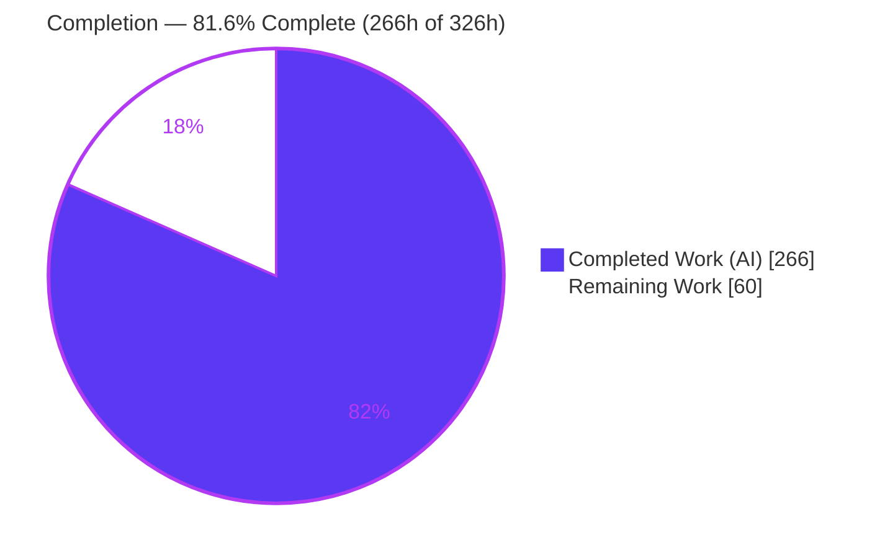
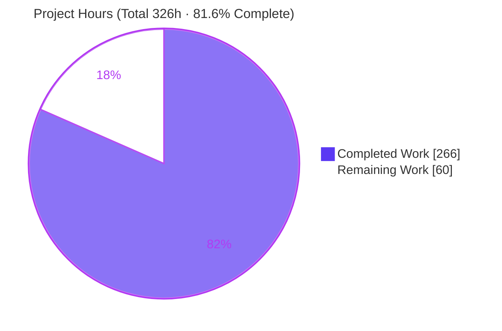
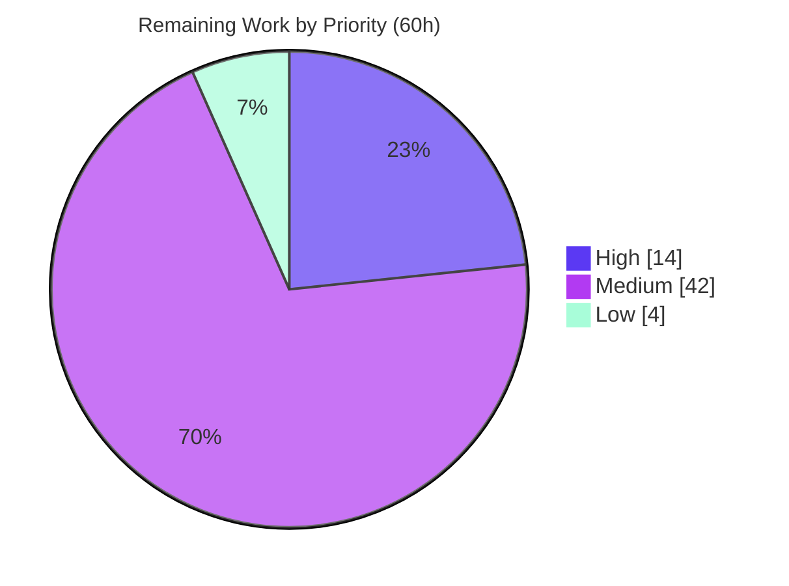

# Blitzy Project Guide — Real-Time Inventory & Flash-Sale System

> **Project:** Real-Time Inventory & Flash-Sale System for a .NET 5 / Angular 11 e-commerce application
> **Branch:** `blitzy-766aed6d-55a8-4ea5-943e-857662ac9975` · **HEAD:** `9a85b0c`
> **Base:** `origin/feature/automated-test-suite` (merge base `dba5d6a`)

---

## 1. Executive Summary

### 1.1 Project Overview

This project adds a **Real-Time Inventory & Flash-Sale System** to an existing .NET 5 (`net5.0`) / Angular 11 e-commerce store, delivered **additively** within the current `API → Infrastructure → Core` Clean Architecture chain (which is preserved unchanged). It introduces authoritative persistent stock (`Products.StockQuantity`), reservation-based oversell prevention using a PostgreSQL `SELECT ... FOR UPDATE` row lock, Redis hot-path counters with a fail-closed fallback, real-time stock broadcasting over SignalR (`/hubs/stock`), a 30-second background reconciliation service, and time-windowed flash-sale stock pools. Shoppers see live "Only N left!" / "Out of stock" badges and checkout gating. Target users are online shoppers and the store operators who rely on accurate, oversell-proof stock during high-demand flash sales.

### 1.2 Completion Status

The project is **81.6% complete**, measured strictly against Agent Action Plan (AAP) scope plus path-to-production activities (PA1 hours-based methodology). All AAP feature deliverables are complete and independently verified; the remaining work is exclusively path-to-production (production infrastructure, secrets, CI/CD, monitoring, load validation, and deployment).



| Metric | Value |
|---|---|
| **Total Hours** | **326 h** |
| Completed Hours (AI + Manual) | 266 h (266 h AI autonomous · 0 h manual) |
| Remaining Hours | 60 h |
| **Percent Complete** | **81.6 %** |

> Color key: **Completed = Dark Blue `#5B39F3`** · **Remaining = White `#FFFFFF`**.

### 1.3 Key Accomplishments

- ✅ **Authoritative stock** — `Products.StockQuantity` column added via a Code-First migration (`AddInventoryAndFlashSale`); `Reservations` and `FlashSales` tables created and applied at startup.
- ✅ **Zero-oversell concurrency** — single-writer `InventoryService` opens an explicit EF Core transaction and takes a `SELECT ... FOR UPDATE` row lock at both reservation-create and order-commit; proven at 50 concurrent checkouts vs. stock 10 (exactly the available quantity succeeds).
- ✅ **Redis hot-path + fail-closed** — atomic `DECR`/`INCR` on `stock:product:{productId}`, per-hold TTL keys, and `stock-updates` Pub/Sub; a Redis outage safely falls back to the PostgreSQL row-locked check (never assumes stock).
- ✅ **Real-time broadcast under 2 s** — `StockHub` at `/hubs/stock` emits `StockChanged`; the `API → Infrastructure → Core` chain is preserved via a Redis Pub/Sub bridge (`StockBroadcastBackgroundService`) that owns the `IHubContext<StockHub>` broadcast.
- ✅ **Background reconciliation** — 30-second `BackgroundService` reclaims expired reservations and re-converges Redis with committed PostgreSQL state.
- ✅ **Time-windowed flash sales** — `FlashSaleService` resolves the active pool by window; reservations bind to the pool active at creation.
- ✅ **Live storefront UX** — Angular `StockService` (auto-reconnect + full refetch) drives badges and gating across product, basket, and checkout surfaces.
- ✅ **Quality gates** — clean `dotnet build` (0/0) and Angular build; **711/711 automated tests passing**; runtime validated against live PostgreSQL + Redis.
- ✅ **Invariants preserved** — cached catalog contract, product DTO, Stripe payment flow, and `OrderStatus` enum all left untouched.

### 1.4 Critical Unresolved Issues

| Issue | Impact | Owner | ETA |
|---|---|---|---|
| _None blocking._ All AAP deliverables are complete, compile clean, and pass 711/711 tests. | No release-blocking defects. Remaining items are path-to-production (see §2.2 / §8). | — | — |

> There are two **pre-existing, non-blocking** behaviors that the test suite documents honestly (they are outside the feature's additive scope): `CreateOrder` with a nonexistent basket returns HTTP 500 rather than 400, and `Login` with a missing password returns HTTP 500 (the `LoginDto` has no `[Required]` attributes). Neither is a feature regression; both belong to the existing order/account contracts, which the AAP invariants require to remain unchanged.

### 1.5 Access Issues

| System/Resource | Type of Access | Issue Description | Resolution Status | Owner |
|---|---|---|---|---|
| Production Redis | Service endpoint/credentials | Only a local dev instance (docker-compose `:6379`) exists; no managed/HA production endpoint or credentials | Open — path-to-production (HT-2) | DevOps |
| Production PostgreSQL | Service endpoint/credentials | Only a local dev instance (docker-compose `:5432`, `appuser`/`secret`) exists; no managed production database | Open — path-to-production (HT-2) | DevOps |
| Secrets / token signing key | Secret material | Token key (`"super secret key"`) and DB passwords are dev placeholders in `appsettings.Development.json`; a production secrets store is not yet wired | Open — path-to-production (HT-1) | DevOps / Security |
| CI/CD system | Pipeline credentials | Repository has no CI/CD pipeline (per AAP); build/test credentials for an automation runner are not provisioned | Open — path-to-production (HT-3) | DevOps |

> No access issues affected the autonomous build or validation: the .NET 5 SDK, Node/Angular toolchain, Chrome, and Docker (with digest-pinned PostgreSQL + Redis images) were all available, enabling a full independent re-run of the build and all 711 tests.

### 1.6 Recommended Next Steps

1. **[High]** Externalize secrets and set production environment configuration (connection strings, token key, `apiUrl`/`hubUrl`). *(HT-1)*
2. **[High]** Provision managed, highly-available Redis and PostgreSQL (TLS + backups) and apply the `AddInventoryAndFlashSale` migration. *(HT-2)*
3. **[Medium]** Stand up a CI/CD pipeline that builds the solution and gates merges on the full 711-test suite (including Testcontainers integration + Angular Karma). *(HT-3)*
4. **[Medium]** Validate the zero-oversell guarantee and SignalR fan-out under production-scale concurrent load; add health checks, metrics, and alerting. *(HT-4, HT-5)*
5. **[Medium]** Provide flash-sale operational tooling/runbook (data-seeding of `FlashSales` rows and `Products.StockQuantity`), since no admin UI is in scope by design. *(HT-7)*

---

## 2. Project Hours Breakdown

### 2.1 Completed Work Detail

Every component below traces to an AAP §0.5.1 deliverable group and is verified by files-on-disk, passing tests, and/or runtime evidence.

| Component | Hours | Description |
|---|---:|---|
| Domain model (Core) | 14 | `Reservation`, `FlashSale` entities; `ReservationStatus`/`FlashSaleStatus` string-backed enums; `IInventoryService`/`IFlashSaleService` contracts; 3 query specifications; additive `Product.StockQuantity`. |
| Persistence layer (Infrastructure/Data) | 12 | `ReservationConfiguration`/`FlashSaleConfiguration` (FK `Restrict`, enum `HasConversion`, `DateTimeOffset`); `StoreContext` `DbSet`s; `AddInventoryAndFlashSale` migration + `.Designer` + regenerated snapshot. |
| InventoryService — sole stock writer | 40 | Reservation lifecycle; explicit EF transaction with `SELECT ... FOR UPDATE`; available-stock computation; atomic Redis `DECR`/`INCR`; hold-key TTL; `stock-updates` publish; fail-closed fallback (886 LOC). |
| FlashSaleService | 8 | Time-windowed active-sale resolution (`StartsAt ≤ now < EndsAt`) and pool selection. |
| StockReconciliationService | 16 | 30-second `BackgroundService`: reclaim expired reservations, reseed Redis, republish corrected stock, advance sale statuses. |
| SignalR real-time transport | 18 | Anonymous `StockHub` (`/hubs/stock`, `SubscribeToProduct`) + `StockBroadcastBackgroundService` Redis→`IHubContext` layering bridge. |
| API wiring & configuration | 16 | `BasketController` reservation trigger; `OrderService` commit-in-transaction; DI registrations; `Startup` `AddSignalR`/`MapHub`/`AllowCredentials`; `Program` Redis seeding; `appsettings` `Inventory` block. |
| Angular StockService & guard | 26 | Hub lifecycle, exponential-backoff auto-reconnect, full refetch on reconnect, per-product observables (503 LOC) + `stock.guard`. |
| Angular UI surfaces | 24 | `product-item`, `product-details`, `basket`, `checkout` badges & gating ("Only N left!" / "Out of stock"); `app.component` hub start; `product` model; `environment(.prod)` `hubUrl`; `package.json`. |
| Automated test suite | 64 | Unit tests (Core/Infrastructure/API) + Testcontainers integration (concurrency, fail-closed resilience, <2 s propagation, reconciliation convergence, contract regression, migration) + 7 Angular specs (7,253 test LOC). |
| QA hardening & multi-cycle fixes | 20 | 34-commit fix cycles: concurrency correctness, commit-path, reconciliation perf/index, extend-to-0 edge, broadcaster resilience, StockService terminal-reconnect recovery, checkout gating, lint/lifecycle. |
| Runtime validation & SignalR version research | 8 | SignalR client/server version alignment research; live runtime validation (startup seed, negotiate, CORS preflight, reservation write path, Pub/Sub payload, SPA serve). |
| **Total Completed** | **266** | **Matches Completed Hours in §1.2.** |

### 2.2 Remaining Work Detail

All remaining work is **path-to-production** — none of it was within the AAP's autonomous build scope. Each category maps to a human task in §5/§8.

| Category | Hours | Priority |
|---|---:|---|
| Production environment & secrets configuration | 6 | High |
| Production Redis & PostgreSQL provisioning (HA, TLS, backups) | 8 | High |
| CI/CD pipeline (build + 711-test gate + deploy) | 10 | Medium |
| Production-scale load & concurrency validation | 8 | Medium |
| Monitoring & observability (health checks, metrics, alerting) | 8 | Medium |
| Production CORS origins & SignalR multi-instance scale hardening | 6 | Medium |
| Flash-sale operational tooling & runbook (no admin UI by design) | 5 | Medium |
| Security review & abuse/rate-limit hardening | 5 | Medium |
| Production deployment & smoke verification | 4 | Low |
| **Total Remaining** | **60** | **Matches Remaining Hours in §1.2 and §7.** |

### 2.3 Hours Reconciliation

| Check | Result |
|---|---|
| Completed (§2.1) + Remaining (§2.2) | 266 + 60 = **326 h** = Total (§1.2) ✅ |
| Completion % | 266 / 326 = **81.6 %** ✅ |
| Remaining consistency (§1.2 ↔ §2.2 ↔ §7) | 60 = 60 = 60 ✅ |

---

## 3. Test Results

All tests below originate from Blitzy's autonomous validation logs for this project and were **independently re-executed** during this assessment with identical results (0 failed, 0 skipped).

| Test Category | Framework | Total Tests | Passed | Failed | Coverage % | Notes |
|---|---|---:|---:|---:|---|---|
| Unit — Domain (Core) | xUnit 2.4.2 + FluentAssertions | 146 | 146 | 0 | Gated¹ | Reservation/FlashSale entities, status enums, 3 specifications. |
| Unit — Infrastructure/Services | xUnit + Moq 4.18.4 + EF InMemory | 129 | 129 | 0 | Gated¹ | InventoryService (1,206-LOC spec), FlashSaleService, StockReconciliationService, data-access. |
| Unit — API (Controllers/Hubs) | xUnit | 86 | 86 | 0 | Gated¹ | BasketController reservation call site, `StockBroadcastBackgroundService`, middleware. |
| Integration — E2E/Concurrency/Resilience | xUnit + Testcontainers 3.9.0 + Mvc.Testing 5.0.17 | 119 | 119 | 0 | Gated¹ | Real PostgreSQL + Redis (digest-pinned). 50-concurrent oversell, Redis-down fail-closed, HubConnection <2000 ms, Redis↔PostgreSQL convergence, contract regression, migration. ~55 s. |
| UI/Component — Frontend | Angular 11 + Karma + Jasmine (ChromeHeadlessNoSandbox) | 231 | 231 | 0 | Gated¹ | `StockService`, `stock.guard`, product-item, product-details, basket, checkout specs. |
| **Total** | — | **711** | **711** | **0** | — | **100 % pass rate.** |

> ¹ *Coverage %:* per-class coverage gates are enforced via the repository's `coverage.runsettings` (Coverlet) and Angular Karma coverage configuration, which the feature preserves unchanged. An aggregate percentage figure was not emitted in the validation logs, so it is reported here as "Gated" rather than fabricated; all feature classes ship with colocated tests as required by AAP §0.6.

**Feature-specific test highlights**
- `ReservationConcurrencyTests` — 50 concurrent reservation attempts against stock 10 → **exactly 10 succeed, zero oversell**.
- `InventoryFailClosedTests` — Redis stopped mid-test → PostgreSQL `FOR UPDATE` fallback engages; stock is never assumed available.
- `StockPropagationTests` — a `HubConnection` receives `StockChanged` in **under 2000 ms**.
- `StockReconciliationIntegrationTests` — Redis and PostgreSQL re-converge within one reconciliation interval.
- `EndpointContractRegressionTests` — basket/order/payment request/response shapes are unchanged.

---

## 4. Runtime Validation & UI Verification

Runtime validation was performed against a live Docker PostgreSQL (`:5432`) + Redis (`:6379`) and independently corroborated by clean build/test re-runs.

**Backend runtime**
- ✅ **Startup** — EF migrations apply (`AddInventoryAndFlashSale`: `Products.StockQuantity` + `Reservations` + `FlashSales`); data seeding runs; Redis stock counters seeded from committed PostgreSQL stock (19 `stock:product:*` keys; available = committed − active reservations). Kestrel serves `https://localhost:5001` + `http://localhost:5000`.
- ✅ **Cached catalog intact** — `GET /api/products` → 200 with `StockQuantity` **absent** from `ProductToReturnDto` (invariant preserved; live stock bypasses the response cache).
- ✅ **SignalR negotiate** — `POST /hubs/stock/negotiate` → 200 (WebSockets / SSE / Long-Polling).
- ✅ **Credentialed CORS** — preflight from `https://localhost:4200` → 204 with `access-control-allow-credentials: true` and the exact origin (not broadened).
- ✅ **Live reservation write path** — `POST /api/basket` → 200; atomic Redis `DECR` (999→998); `Reservation` row persisted (`Active`); `stock-updates` message exactly `{"productId":14,"currentStock":997,"flashSaleId":null}` (matches the AAP payload spec).
- ✅ **Reconciliation** — `StockReconciliationService` runs on its interval; bridge self-heal verified.
- ⚠ **Benign notice** — an IPv6-loopback Kestrel information notice only (no functional impact).

**UI verification** (evidence: 96 screenshots + 5 screen recordings under `blitzy/screenshots` and `blitzy/screen_recordings`)
- ✅ Live low-stock badge renders **"Only N left!"** for `0 < stock ≤ 5` and **"Out of stock"** at `stock = 0`; add-to-cart disabled at zero.
- ✅ **Cross-client propagation** — a stock change by client A appears on client B's badge (`comp_p5_clientB_prod2_propagated_only4left`).
- ✅ **Flash-sale pool** — sale-pool badges and pool exhaustion → out-of-stock (`comp_p6_*`).
- ✅ **Reconnect & fail-closed** — hub-down/offline states gate checkout; recovery re-applies live badges after reconnect (`p5-4_*`, `phase4_shop_failclosed_hub_down_F12`, `qa_final_bridge_recovery_*`).
- ✅ **Basket/checkout gating** — mid-session zero stock disables proceed/submit with an inline `role="alert"` message (`p8_basket_gated_alert_role_alert_*`, `phase6_checkout_OOS_alert_submit_gated`).
- ✅ **Security** — XSS payload rendered as escaped text (`comp_p10_clientA_xss_payload_escaped_as_text`).
- ✅ **Responsive** — desktop 1280/1440, tablet 768/1024, mobile 320/375/390 captured; a **pre-existing** product-grid overflow at ≤375 px is documented (not introduced by this feature).

---

## 5. Compliance & Quality Review

Cross-mapping of AAP directives to their implementation status. Fixes applied during autonomous validation are noted.

| Benchmark / AAP Directive | Status | Evidence / Notes |
|---|---|---|
| Preserve `API → Infrastructure → Core` chain | ✅ Pass | No Infrastructure→API reference; real-time bridge via Redis `stock-updates` Pub/Sub → API-layer `StockBroadcastBackgroundService`. |
| Interface-first, constructor-injected, Scoped services | ✅ Pass | `IInventoryService`/`IFlashSaleService` registered Scoped alongside peers in `ApplicationServicesExtensions`. |
| `IInventoryService` is the **sole** stock/reservation writer | ✅ Pass | All `Reservations` + Redis stock-key writes flow through `InventoryService`; enforced by unit + integration tests. |
| `SELECT ... FOR UPDATE` at reserve **and** commit | ✅ Pass | Explicit EF transaction + row lock (`FOR UPDATE`) in `InventoryService`; commit path in `OrderService` within the order transaction. |
| Redis mutated only via atomic `DECR`/`INCR` | ✅ Pass | `StringDecrement`/`StringIncrement`; per-hold TTL key `reservation:{basketId}:{productId}`. |
| Fail-closed on Redis outage | ✅ Pass | `InventoryFailClosedTests` prove PostgreSQL fallback; stock never assumed on miss/outage. |
| Expiry only via reconciliation (no native row TTL) | ✅ Pass | `StockReconciliationService` reclaims expired `Active` reservations on its interval. |
| Real-time propagation < 2 s | ✅ Pass | `StockPropagationTests` assert `StockChanged` delivery < 2000 ms. |
| Flash-sale pool bound at reservation creation | ✅ Pass | `FlashSaleService.GetActiveFlashSaleForProduct`; reservation captures `flashSaleId` and commits against that pool. |
| Verbatim artifacts (keys, channel, payload, statuses, copy) | ✅ Pass | `stock:product:{id}`, channel `stock-updates`, payload `{productId,currentStock,flashSaleId}`, statuses, and badge copy match exactly. |
| Config keys `Inventory:*` with defaults 10/5/30 | ✅ Pass | `appsettings.Development.json` `Inventory` block matches the spec. |
| SignalR dependency versions | ✅ Pass | `@microsoft/signalr ^5.0.17`; `Microsoft.AspNetCore.SignalR.Client 5.0.17` (integration tests only); no server NuGet added. |
| Extend existing test projects (no new infra) | ✅ Pass | Tests added within the four xUnit projects + colocated Angular specs; fixtures reused. |
| CORS: add `AllowCredentials`, don't broaden origin | ✅ Pass | Preflight 204 with credentials + exact `https://localhost:4200` origin. |
| **Invariant** — `[Cached(600)]` on `ProductsController` | ✅ Pass | Controller not modified; live stock bypasses cache. |
| **Invariant** — `StockQuantity` not in DTO/`MappingProfiles` | ✅ Pass | Count = 0 in both files; absent from `GET /api/products`. |
| **Invariant** — Stripe flow / `OrderStatus` unchanged | ✅ Pass | `PaymentService`, `PaymentsController`, `OrderStatus` show no net diff. |
| **Invariant** — `coverage.runsettings`/`karma.conf.js`/`test.ts` unchanged | ✅ Pass | No diff in test-config files. |
| Code quality — no stubs/TODO/placeholders | ✅ Pass | Zero `TODO`/`FIXME`/`NotImplemented`/placeholder across 42 feature source files. |
| Build cleanliness | ✅ Pass | `dotnet build` 0 warnings / 0 errors; Angular build clean; feature-owned files lint-clean (2 tslint nits fixed in `9a85b0c`). |

**Outstanding compliance items:** none within AAP scope. Production hardening items (secrets, HA infra, monitoring, CI/CD) are tracked in §2.2 and §8.

---

## 6. Risk Assessment

Because the feature code itself is fully validated (711/711), the residual risks are predominantly forward-looking / production-oriented.

| Risk | Category | Severity | Probability | Mitigation | Status |
|---|---|---|---|---|---|
| SignalR horizontal-scale fan-out relies on every instance's broadcast subscriber | Technical | Low–Medium | Medium | Redis `stock-updates` Pub/Sub acts as a de-facto backplane (each instance rebroadcasts to its clients); validate multi-instance and add a SignalR Redis backplane if needed | Open (P2P) |
| Transient Redis↔PostgreSQL divergence within the 30 s reconciliation window | Technical | Low | Low | PostgreSQL `FOR UPDATE` at commit is authoritative and prevents oversell regardless; interval is configurable | Mitigated by design |
| Synthetic migration timestamp (`20240101000000`) | Technical | Low | Low | Verify migration ordering when authoring the next migration | Open (minor) |
| Anonymous `StockHub` negotiate is unauthenticated (read-only by design) | Security | Low | Low | Rate-limit negotiate at the gateway; hub exposes only stock counts, no mutation | Accepted by design |
| Client-owned `BasketId` (no FK) enables reservation/stock-hold griefing | Security | Medium | Low–Medium | Reservation TTL + reconciliation reclaim (partial); add basket-write rate-limiting in production | Partially mitigated |
| Dev secrets in `appsettings.Development.json` (token key, DB passwords) | Security | High (if deployed as-is) | Low (dev-only file) | Externalize to a secrets manager / env vars before production | Open (P2P, High) |
| No health checks / metrics for Redis connectivity or the reconciliation loop | Operational | Medium | Medium | Add health checks, metrics (reservation rate, oversell attempts, drift), and alerting | Open (P2P) |
| No CI/CD → the 711-test gate is not automated | Operational | Medium | Medium | Stand up a build/test/deploy pipeline | Open (P2P) |
| Flash-sale operation requires direct data insertion (no admin UI by design) | Operational | Low–Medium | Medium | Provide a seeding script + runbook; validate sale windows | Open (P2P) |
| Redis is a hot-path dependency; an outage degrades performance and pauses live badges | Integration | Medium | Low–Medium | Fail-closed preserves correctness; provision HA Redis | Mitigated (correctness) / Open (availability) |
| Production Redis/PostgreSQL not provisioned (only dev docker-compose) | Integration | High | High | Provision managed services and apply the migration | Open (P2P, High) |
| Production SPA origin / `hubUrl` not set (dev uses `localhost`) | Integration | Medium | High | Prod `environment.prod.ts` uses relative `api/`/`hubs/` (SPA co-hosted from `wwwroot`); set real origins if the SPA is deployed separately | Open (P2P) |
| SignalR client/server version alignment | Integration | Low | Low | Versions pinned (`^5.0.17` ↔ `net5.0`); research-confirmed compatible | Mitigated |

---

## 7. Visual Project Status

**Project hours breakdown** — Completed = Dark Blue `#5B39F3`, Remaining = White `#FFFFFF`.



**Remaining work by priority** (60 h total).



**Remaining hours per category** (§2.2):

| Category | Hours | Bar |
|---|---:|---|
| CI/CD pipeline | 10 | ██████████ |
| PostgreSQL + Redis provisioning | 8 | ████████ |
| Load & concurrency validation | 8 | ████████ |
| Monitoring & observability | 8 | ████████ |
| Environment & secrets config | 6 | ██████ |
| CORS + SignalR scale hardening | 6 | ██████ |
| Flash-sale tooling & runbook | 5 | █████ |
| Security review & rate-limits | 5 | █████ |
| Deployment & smoke verification | 4 | ████ |
| **Total** | **60** | |

> Integrity: "Remaining Work" = **60 h** in the pie chart equals §1.2 Remaining Hours and the §2.2 Hours total.

---

## 8. Summary & Recommendations

**Achievements.** The Real-Time Inventory & Flash-Sale System is **fully implemented and independently verified**. All AAP deliverables across the six execution groups (Domain, Persistence, Services & Real-Time, API wiring, Frontend, and Tests) are complete, with `dotnet build` producing 0 warnings / 0 errors and **711/711 automated tests passing** (Core 146, Infrastructure 129, API 86, Integration 119 on real PostgreSQL + Redis, Angular 231). Runtime behavior was proven end-to-end: oversell-proof reservations under 50-way concurrency, atomic Redis counters with a fail-closed fallback, sub-2-second SignalR propagation, background reconciliation convergence, and time-windowed flash-sale pools. Critically, every out-of-scope invariant (cached catalog, product DTO, Stripe flow, `OrderStatus` enum, test config) remains untouched.

**Remaining gaps.** The project is **81.6% complete (266 h of 326 h)**. The outstanding **60 h is entirely path-to-production** — production environment/secrets configuration, managed HA Redis + PostgreSQL provisioning, a CI/CD pipeline, production-scale load validation, monitoring/observability, flash-sale operational tooling, security/rate-limit hardening, and deployment. None of this was within the AAP's autonomous build scope; there are **no outstanding source-code fixes**.

**Critical path to production.** (1) Externalize secrets and set production config → (2) provision managed Redis + PostgreSQL and apply the migration → (3) establish CI/CD gating on the full test suite → (4) validate at production-scale load and add observability → (5) deploy and smoke-test.

**Success metrics** (validate in production-like conditions): zero oversell under peak concurrency; `StockChanged` delivered < 2 s at scale; Redis↔PostgreSQL convergence within one reconciliation interval; graceful fail-closed behavior during a Redis outage.

**Production readiness assessment.** **Feature-complete and validation-passed; not yet production-deployed.** The engineering risk has been retired; the remaining effort is standard operational readiness. Recommended posture: proceed to a staging deployment immediately behind the High-priority infrastructure/secrets tasks, then production after load validation and monitoring are in place.

| Metric | Value |
|---|---|
| AAP deliverables complete | 100 % |
| Automated tests passing | 711 / 711 (100 %) |
| Overall completion (AAP + path-to-production) | 81.6 % |
| Remaining effort | 60 h (path-to-production) |
| Release-blocking defects | 0 |

---

## 9. Development Guide

All commands below were executed and verified in the assessment environment (.NET SDK 5.0.408, Node.js, Docker 28.5.2, Chrome 150).

### 9.1 System Prerequisites

- **.NET 5.0 SDK** (`net5.0`; verified `5.0.408`, runtime `5.0.17`).
- **Node.js** with npm (Angular CLI 11). On **Node 17+**, export `NODE_OPTIONS=--openssl-legacy-provider` for the Angular 11 toolchain (or use Node 14/16).
- **Docker + Docker Compose** — runs the local PostgreSQL and Redis; also required for the Testcontainers integration tests.
- **Google Chrome** — for the Angular Karma headless test run.

### 9.2 Environment Setup

```bash
# 1) Put the .NET SDK on PATH (adjust if installed elsewhere)
export DOTNET_ROOT=$HOME/.dotnet
export PATH=$HOME/.dotnet:$PATH

# 2) Start local infrastructure (PostgreSQL :5432, Redis :6379, adminer :8080, redis-commander :8081)
docker compose up -d

# (Optional) trust the HTTPS dev certificate for https://localhost:5001
dotnet dev-certs https --trust
```

Configuration lives in `API/appsettings.Development.json`, including the additive `Inventory` block:

```json
"Inventory": { "ReservationTtlMinutes": 10, "LowStockThreshold": 5, "ReconciliationIntervalSeconds": 30 }
```

Angular endpoints are in `client/src/environments/environment.ts` (`apiUrl: https://localhost:5001/api/`, `hubUrl: https://localhost:5001/hubs/`). `environment.prod.ts` uses relative `api/` and `hubs/` (the SPA is co-hosted from the API's `wwwroot` in production).

### 9.3 Dependency Installation

```bash
# Backend
dotnet restore ecommerce-shop.sln

# Frontend
cd client
NODE_OPTIONS=--openssl-legacy-provider npm install
cd ..
```

### 9.4 Build

```bash
# Backend — expect: Build succeeded, 0 Warning(s), 0 Error(s)
dotnet build ecommerce-shop.sln -c Debug

# Frontend — expect all bundles emitted, no errors
cd client && NODE_OPTIONS=--openssl-legacy-provider npm run build && cd ..
```

### 9.5 Run the Application

```bash
export DOTNET_ROOT=$HOME/.dotnet; export PATH=$HOME/.dotnet:$PATH
docker compose up -d   # ensure PostgreSQL + Redis are running

ASPNETCORE_ENVIRONMENT=Development \
ASPNETCORE_URLS="https://localhost:5001;http://localhost:5000" \
dotnet run --project API/API.csproj
```

On startup the API auto-applies EF migrations, seeds data, and seeds Redis stock counters from committed PostgreSQL stock. The Angular SPA is served from `wwwroot`. Sample login: `bob@test.com` / `Pa$$w0rd`.

### 9.6 Verification Steps

```bash
# Cached catalog (StockQuantity must NOT appear in the response)
curl -sk https://localhost:5001/api/products | head -c 400

# SignalR negotiate → HTTP 200
curl -skი -o /dev/null -w "%{http_code}\n" -X POST https://localhost:5001/hubs/stock/negotiate

# Credentialed CORS preflight → 204 with access-control-allow-credentials: true
curl -skI -X OPTIONS https://localhost:5001/api/products \
  -H "Origin: https://localhost:4200" \
  -H "Access-Control-Request-Method: GET"

# Inspect a Redis stock counter (available = committed − active reservations)
docker compose exec -T redis redis-cli GET "stock:product:1"
```

### 9.7 Running Tests

```bash
# Backend unit suites
dotnet test Core.Tests/Core.Tests.csproj                       # 146
dotnet test Infrastructure.Tests/Infrastructure.Tests.csproj   # 129
dotnet test API.Tests/API.Tests.csproj                         # 86

# Backend integration (requires Docker; ~55 s with Testcontainers PostgreSQL + Redis)
dotnet test API.IntegrationTests/API.IntegrationTests.csproj   # 119

# Frontend (Karma, headless Chrome)
cd client
CHROME_BIN=/usr/bin/google-chrome NODE_OPTIONS=--openssl-legacy-provider \
  npm test -- --watch=false --browsers=ChromeHeadlessNoSandbox   # 231
cd ..
```

### 9.8 Example Usage (live stock flow)

1. Open two browsers to the shop and log in.
2. On both, open a product with `0 < stock ≤ 5` — both show **"Only N left!"**.
3. Add the item to the cart in browser A — browser B's badge decrements within ~2 seconds (SignalR).
4. Drive stock to 0 — the badge shows **"Out of stock"** and add-to-cart / proceed-to-checkout are disabled with an inline alert.
5. Stop Redis (`docker compose stop redis`) and add to cart — the request still succeeds via the PostgreSQL `FOR UPDATE` fallback (fail-closed); live badges pause until Redis returns.

### 9.9 Troubleshooting

- **Angular build/serve errors on Node 17+** (`ERR_OSSL_EVP_UNSUPPORTED`): export `NODE_OPTIONS=--openssl-legacy-provider` (or use Node 14/16).
- **Integration tests fail to start containers:** ensure the Docker daemon is running (`docker info`) and the digest-pinned `postgres`/`redis` images are available locally.
- **HTTPS warnings at `https://localhost:5001`:** run `dotnet dev-certs https --trust`.
- **No live badge updates:** confirm `POST /hubs/stock/negotiate` returns 200 and that CORS allows the SPA origin with credentials.
- **Redis counters look stale:** the 30-second reconciliation pass re-converges Redis with PostgreSQL; PostgreSQL remains the source of truth.
- **Authoring a new migration:** the EF Core CLI (`dotnet ef` 5.0.8) is available; the existing `AddInventoryAndFlashSale` migration is applied automatically at startup.

---

## 10. Appendices

### A. Command Reference

| Purpose | Command |
|---|---|
| Restore (backend) | `dotnet restore ecommerce-shop.sln` |
| Build (backend) | `dotnet build ecommerce-shop.sln -c Debug` |
| Build (frontend) | `NODE_OPTIONS=--openssl-legacy-provider npm run build` (in `client/`) |
| Run API | `ASPNETCORE_URLS="https://localhost:5001;http://localhost:5000" dotnet run --project API/API.csproj` |
| Start infra | `docker compose up -d` |
| Stop infra | `docker compose down` |
| Unit tests | `dotnet test <Project>/<Project>.csproj` |
| Frontend tests | `CHROME_BIN=/usr/bin/google-chrome NODE_OPTIONS=--openssl-legacy-provider npm test -- --watch=false --browsers=ChromeHeadlessNoSandbox` |

### B. Port Reference

| Service | Port | Notes |
|---|---|---|
| API (HTTPS) | 5001 | Kestrel; serves API + SPA + SignalR |
| API (HTTP) | 5000 | Kestrel |
| Angular dev-server | 4200 | `ng serve` (CORS-allowed origin) |
| PostgreSQL | 5432 | `appuser` / `secret` (dev) |
| Redis | 6379 | stock counters, hold keys, `stock-updates` Pub/Sub |
| adminer | 8080 | DB admin (dev) |
| redis-commander | 8081 | Redis admin (dev) |

### C. Key File Locations

| Area | Path |
|---|---|
| Sole stock writer | `Infrastructure/Services/InventoryService.cs` |
| Flash-sale resolution | `Infrastructure/Services/FlashSaleService.cs` |
| Reconciliation service | `Infrastructure/Services/StockReconciliationService.cs` |
| SignalR hub | `API/Hubs/StockHub.cs` |
| Layering bridge | `API/Hubs/StockBroadcastBackgroundService.cs` |
| Reservation commit | `Infrastructure/Services/OrderService.cs` |
| Reservation trigger | `API/Controllers/BasketController.cs` |
| DI + SignalR wiring | `API/Extension/ApplicationServicesExtensions.cs`, `API/Startup.cs` |
| Startup seeding | `API/Program.cs` |
| Migration | `Infrastructure/Data/Migrations/20240101000000_AddInventoryAndFlashSale.cs` |
| Domain entities | `Core/Entities/Reservation.cs`, `Core/Entities/FlashSale.cs` |
| Angular stock service | `client/src/app/core/services/stock.service.ts` |
| Config | `API/appsettings.Development.json`, `client/src/environments/environment.ts` |

### D. Technology Versions

| Component | Version |
|---|---|
| .NET / target framework | 5.0 (`net5.0`); SDK 5.0.408; runtime 5.0.17 |
| Angular | 11.2.14 |
| SignalR client (browser) | `@microsoft/signalr ^5.0.17` |
| SignalR .NET test client | `Microsoft.AspNetCore.SignalR.Client 5.0.17` (integration tests only) |
| EF Core / Npgsql / SQLite | 5.0.8 / 5.0.7 / 5.0.8 |
| StackExchange.Redis | 2.2.62 |
| Stripe.net | 39.66.0 |
| xUnit / Moq / FluentAssertions | 2.4.2 / 4.18.4 / 6.12.0 |
| Testcontainers / Mvc.Testing | 3.9.0 / 5.0.17 |

### E. Environment Variable Reference

| Variable | Purpose |
|---|---|
| `DOTNET_ROOT`, `PATH` | Locate the .NET SDK |
| `ASPNETCORE_ENVIRONMENT` | `Development` selects `appsettings.Development.json` |
| `ASPNETCORE_URLS` | Kestrel bind URLs (`https://localhost:5001;http://localhost:5000`) |
| `NODE_OPTIONS=--openssl-legacy-provider` | Required for the Angular 11 toolchain on Node 17+ |
| `CHROME_BIN` | Chrome path for Karma headless tests |
| **Config keys** | `ConnectionStrings:DefaultConnection`, `ConnectionStrings:Redis`, `Token:Key`, `Inventory:ReservationTtlMinutes`, `Inventory:LowStockThreshold`, `Inventory:ReconciliationIntervalSeconds` |

### F. Developer Tools Guide

- **adminer** (`http://localhost:8080`) — inspect `Products.StockQuantity`, `Reservations`, and `FlashSales`.
- **redis-commander** (`http://localhost:8081`, `root`/`secret`) — inspect `stock:product:*` counters and `reservation:*` hold keys.
- **redis-cli** — `docker compose exec redis redis-cli` then `GET stock:product:1`, `SUBSCRIBE stock-updates`.
- **EF Core CLI** — `dotnet ef migrations list` / `dotnet ef database update` (migrations also apply automatically at startup).
- **Validation artifacts** — 96 screenshots (`blitzy/screenshots/`) and 5 screen recordings (`blitzy/screen_recordings/`) documenting live badges, cross-client propagation, flash sales, reconnection/fail-closed, and checkout gating.

### G. Glossary

| Term | Definition |
|---|---|
| Reservation | A short-lived hold against a product's stock with an `ExpiresAt`; statuses `Active`/`Committed`/`Expired`/`Cancelled`. |
| Flash sale | A time-windowed stock pool (`SaleStockQuantity`) active between `StartsAt` and `EndsAt`; statuses `Scheduled`/`Active`/`Ended`. |
| Fail-closed | On a Redis miss/outage, the system falls back to the PostgreSQL `FOR UPDATE` check and never assumes stock is available. |
| Reconciliation | The 30-second background pass that reclaims expired reservations and re-converges Redis with committed PostgreSQL stock. |
| Layering bridge | The Redis `stock-updates` Pub/Sub channel + API-layer `StockBroadcastBackgroundService` that lets Infrastructure trigger SignalR broadcasts without referencing the API layer. |
| Hot path | The Redis integer counter (`stock:product:{id}`) used for fast reads/mutations while PostgreSQL remains the source of truth. |

---

*Prepared by the Blitzy autonomous assessment agent. Completion percentage (81.6%) is computed from AAP-scoped and path-to-production hours only: 266 h completed ÷ 326 h total. All test results originate from Blitzy's autonomous validation logs and were independently re-executed during this assessment.*