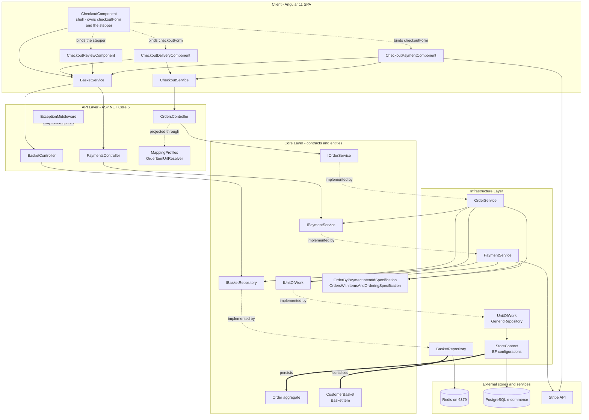
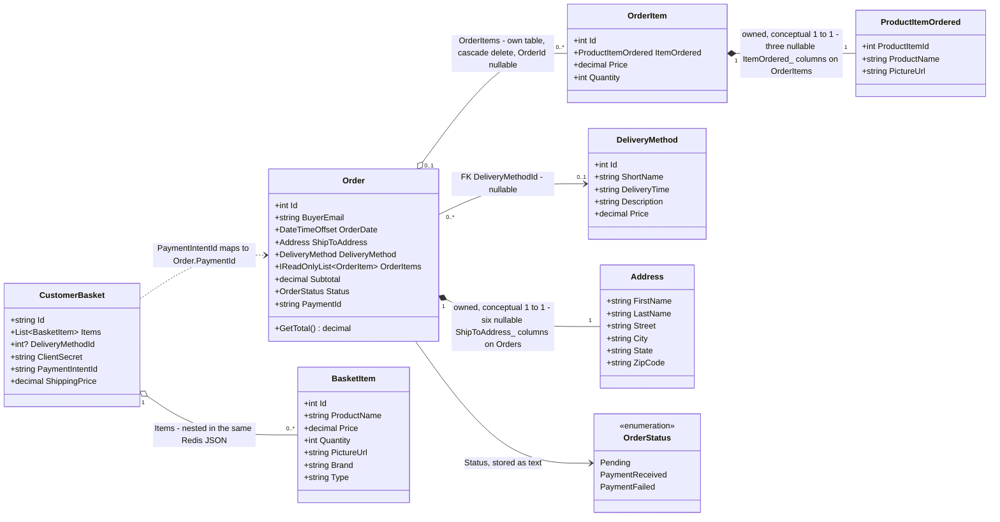
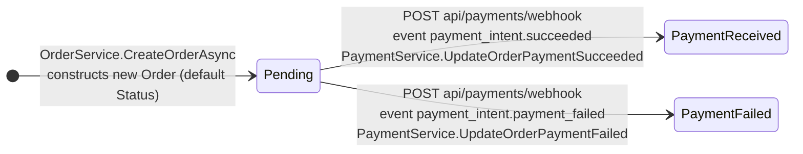
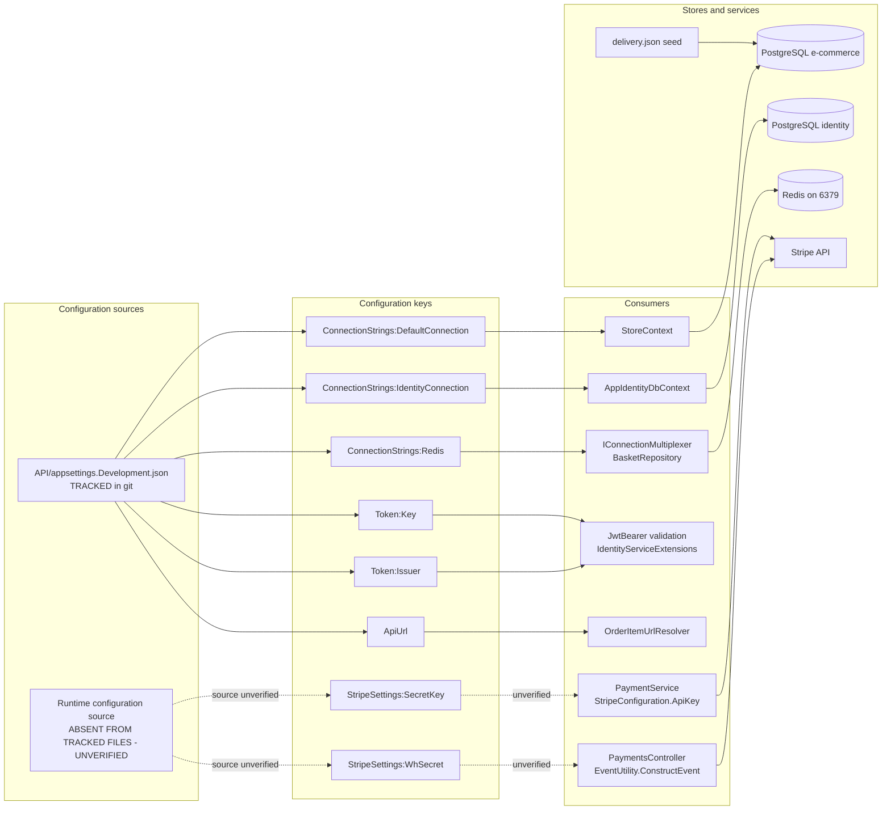

# Checkout Workflow — Basket, Order and Payment Reference (F-003 / F-004 / F-005)

This document is the source-grounded reference for the end-to-end checkout workflow: the path that carries a Redis-resident `CustomerBasket` `Core/Entities/CustomerBasket.cs:L16-L22` through Stripe PaymentIntent creation `Infrastructure/Services/PaymentService.cs:L52-L76`, server-authoritative order materialisation into PostgreSQL `Infrastructure/Services/OrderService.cs:L30-L55`, client-side basket teardown `client/src/app/basket/basket.service.ts:L150-L154`, and asynchronous Stripe webhook-driven order-status settlement `API/Controllers/PaymentsController.cs:L40-L67`. It is written for a developer who has to change checkout safely, so every mechanic in [Section 6](#6-key-mechanics) and every failure mode in [Section 8](#8-failure-modes--edge-cases) closes by stating what breaks downstream when you touch it.

**Citation convention.** Every factual statement carries an inline locator immediately after the claim. Source files use `path:Lnn` or `path:Lnn-Lnn` (for example `API/Controllers/PaymentsController.cs:L44`), prose documents in this repository use `path:§heading` (for example `CHANGES.md:§9.6`), and configuration keys use `path:key.path`. All such paths are repository-relative, and each locator is repeated in full rather than abbreviated, so that any single claim can be checked without reading the sentence before it. Statements about behaviour that this repository exercises but does not itself define carry a bracketed `[ext-N]` marker instead, keyed to the numbered list of official sources below.

**Unverified convention.** Any statement that cannot be confirmed from repository source is marked with a bold `**unverified**` label rather than asserted as fact. Unverified statements fall into exactly three categories, and the complete set is enumerated here so the convention can be audited rather than trusted. **First, configuration this repository does not contain:** the value and shape of `StripeSettings:SecretKey`, read at `Infrastructure/Services/PaymentService.cs:L29`, and the same two properties of `StripeSettings:WhSecret`, read at `API/Controllers/PaymentsController.cs:L27` — neither key appears in any tracked configuration file. Four further properties of those two keys are unverifiable for the same reason and are labelled wherever they arise: **which configuration source supplies either key at runtime**, **the precedence order among whatever sources are present**, **which settings file a running instance actually loads**, and **whether the backing source re-reads a changed value**. No code in this repository settles any of the four: the host is built with `Host.CreateDefaultBuilder(args)` `API/Program.cs:L46-L47` and nothing here adds, removes or reorders a configuration provider, while `Startup` merely receives the already-built `IConfiguration` `API/Startup.cs:L19-L23`. **Second, framework- or provider-side behaviour this repository cannot evidence and that no source in the list below settles:** the lifetime of a client secret across an intent amendment, AutoMapper's precedence between two registrations for one destination member, the frequency of controller activation, container-storage durability, the empty-response status code the framework selects for an action whose return type is a bare `Task`, the serialised body the framework produces for an action that returns a null reference, whether the serialiser emits any member at all for a method such as `Order.GetTotal()`, the decimal scale a money value carries on the wire, the members of Stripe's event envelope beyond the two the webhook reads, whether Stripe accepted a card confirmation whose client-side promise later failed, the exception type a client library raises on a failed request, whatever provokes a database save failure, the exact `UPDATE` column list the provider emits for an entry that was marked `Modified` — as distinct from which properties the change tracker stages, which *is* verifiable — the relative completion order of the browser's own confirmation handling and Stripe's webhook delivery — two paths this repository starts but never sequences against each other — and three Angular-side runtime outcomes: **where an exception thrown by a component method goes once it leaves that method**, since nothing in either of the two client modules this document covers catches it — no `try` surrounds the two call sites concerned `client/src/app/basket/basket.service.ts:L24-L25` and `client/src/app/checkout/checkout.component.ts:L52-L56` — which leaves the destination to the framework default; **what a template renders for an `*ngIf` bound through the `async` pipe to an observable property that was never assigned**; and **whether a view is rendered at all after its component's `ngOnInit` throws**. **Third, every comparison drawn against the project's technical specification**, which is an external document rather than a repository file, as the next paragraph explains. Framework and provider behaviour that one of those numbered sources *does* settle is never placed in this category: it is attributed inline with an `[ext-N]` marker instead. Stripe's webhook behaviour is the clearest case and is deliberately absent from the list above. Its published retry schedule and the ceiling on that schedule, its manual resend path, and the possibility that the same event arrives more than once are settled by [ext-1]; the composition of the `Stripe-Signature` header is settled by [ext-1] and [ext-2] between them. All of that is therefore stated as fact with those markers in [Section 6.3](#63-stripe-webhook-signature-verification) and [Section 8.2](#82-invalid-webhook-signatures) rather than hedged as unverifiable. The boundary is drawn narrowly on purpose: those sources describe retries that are bounded, a resend an operator can trigger by hand, and duplicate receipt as an outcome an endpoint is expected to guard against [ext-1] — they do not state a formal delivery guarantee, so no such guarantee is asserted anywhere in this document. Nothing outside those three categories is inferred or invented.

**External and non-repository sources.** Two classes of source sit outside this repository and therefore cannot carry a `path:Lnn` locator. Each gets an explicit convention rather than a silent omission — `tech spec §N` for the first and `[ext-N]` for the second.

- **The project's technical specification.** A reference of the form `tech spec §N` points at the pre-existing specification document for this project. That document is **not a file in this repository** — no repository path resolves it — so nothing it says can be verified from here. Every comparison this document draws against it is consequently labelled **unverified** on the specification's side. The code side of each comparison always carries a real locator, and where the two disagree the code is authoritative and the divergence is recorded as observed behaviour.
- **Framework and provider documentation.** Behaviour contributed by ASP.NET Core, Entity Framework Core, AutoMapper, StackExchange.Redis, Swashbuckle or Stripe — as distinct from behaviour written in this repository — is attributed inline with a bracketed `[ext-N]` marker keyed to this list:

    - **[ext-1]** Stripe, *Receive Stripe events in your webhook endpoint* — https://docs.stripe.com/webhooks
    - **[ext-2]** Stripe, *Resolve webhook signature verification errors* — https://docs.stripe.com/webhooks/signature
    - **[ext-3]** Microsoft, *Format response data in ASP.NET Core Web API* — https://learn.microsoft.com/en-us/aspnet/core/web-api/advanced/formatting
    - **[ext-4]** Microsoft, *Routing in ASP.NET Core* — https://learn.microsoft.com/en-us/aspnet/core/fundamentals/routing
    - **[ext-5]** Microsoft, *Model validation in ASP.NET Core MVC* — https://learn.microsoft.com/en-us/aspnet/core/mvc/models/validation
    - **[ext-6]** Microsoft, *DbContext Lifetime, Configuration, and Initialization* — https://learn.microsoft.com/en-us/ef/core/dbcontext-configuration/
    - **[ext-7]** Microsoft, *Using Transactions — EF Core* — https://learn.microsoft.com/en-us/ef/core/saving/transactions
    - **[ext-8]** Microsoft, *Change Tracking in EF Core* — https://learn.microsoft.com/en-us/ef/core/change-tracking/
    - **[ext-9]** AutoMapper, *Flattening* — https://docs.automapper.org/en/stable/Flattening.html
    - **[ext-10]** StackExchange.Redis, *Configuration* — https://stackexchange.github.io/StackExchange.Redis/Configuration.html
    - **[ext-11]** Microsoft, *How to customize property names and values with System.Text.Json* — https://learn.microsoft.com/en-us/dotnet/standard/serialization/system-text-json/customize-properties
    - **[ext-12]** Microsoft, *RangeAttribute Class (System.ComponentModel.DataAnnotations)* — https://learn.microsoft.com/en-us/dotnet/api/system.componentmodel.dataannotations.rangeattribute
    - **[ext-13]** Stripe, *stripe-dotnet* — `EventUtility.ConstructEvent` **as it exists in the release this repository installs**: its default signature-freshness tolerance, its default API-version check, the order in which it parses the `Stripe-Signature` header relative to computing anything, and the conditions for which it documents a `StripeException`. Pinned to commit `45dd67e0cf697ba989b1b14e98b01d68b8a54335`, which is the source commit the installed package's NuGet `.nuspec` declares for the `Stripe.net` version referenced at `Infrastructure/Infrastructure.csproj:L15`; the library's `master` branch is a later release line and is deliberately not cited as evidence for that version — https://github.com/stripe/stripe-dotnet/blob/45dd67e0cf697ba989b1b14e98b01d68b8a54335/src/Stripe.net/Services/Events/EventUtility.cs
    - **[ext-14]** Microsoft, *HttpRequestRewindExtensions.EnableBuffering Method* — https://learn.microsoft.com/en-us/dotnet/api/microsoft.aspnetcore.http.httprequestrewindextensions.enablebuffering
    - **[ext-15]** Stripe, *API keys* — the publishable/secret key distinction and where each may be used — https://docs.stripe.com/keys
    - **[ext-16]** Stripe, *Best practices for managing secret API keys* — https://docs.stripe.com/keys-best-practices
    - **[ext-17]** Stripe, *stripe-dotnet* — `StripeConfiguration.ApiVersion`, the single Stripe API version a given release of the library pins. Pinned to the same commit `45dd67e0cf697ba989b1b14e98b01d68b8a54335` as [ext-13], for the same reason — https://github.com/stripe/stripe-dotnet/blob/45dd67e0cf697ba989b1b14e98b01d68b8a54335/src/Stripe.net/Infrastructure/Public/StripeConfiguration.cs
    - **[ext-18]** Microsoft, *Enable Cross-Origin Requests (CORS) in ASP.NET Core* — that CORS is a W3C standard by which a server relaxes the browser's same-origin policy rather than a security feature, that an API is not made safer by allowing it, and that the browser rather than the server enforces it: the server executes the request and returns the response, and the client is what blocks the response from the calling script — https://learn.microsoft.com/en-us/aspnet/core/security/cors
    - **[ext-19]** Swashbuckle, *Swashbuckle.AspNetCore* — `SwaggerGenerator.GenerateResponses`, `SwaggerGenerator.GenerateResponse` and the `ResponseDescriptionMap` those two methods read, **as they exist in the release this repository installs**: that an operation whose supported-response set comes back empty is defaulted to a single HTTP 200 entry, that every generated response's description is looked up by matching its status code against a fixed table of generic phrases — `Success` for any `2xx`, `Bad Request` for `400`, `Server Error` for any `5xx` — rather than authored, and that each response body's schema is derived from the CLR type the framework infers for the action. Pinned to commit `90a6382eab701ced8ed6bf4a2c60ed760fd232db`, the commit the upstream repository's `v5.6.3` tag resolves to, where `v5.6.3` is the `Swashbuckle.AspNetCore` version referenced at `API/API.csproj:L15` and the upstream repository is the one the installed package's NuGet `.nuspec` names in its `<repository>` element — that element carries the Git URL alone and, unlike the `Stripe.net` package pinned at [ext-13], declares no commit of its own, so it is the version tag rather than the package metadata that binds this link to the installed release; the library's `master` branch is a later release line and is deliberately not cited as evidence for that version — https://github.com/domaindrivendev/Swashbuckle.AspNetCore/blob/90a6382eab701ced8ed6bf4a2c60ed760fd232db/src/Swashbuckle.AspNetCore.SwaggerGen/SwaggerGenerator/SwaggerGenerator.cs
    - **[ext-20]** Microsoft, *.NET runtime* — `LoggerExtensions.LogInformation`, `FormattedLogValues` and `LogValuesFormatter`, the three types that turn a message template and its arguments into a log line, **as they exist in the framework version this project targets** `API/API.csproj:L4`: that the extension method hands the template and its arguments to a `FormattedLogValues`, that the formatter collects only the names it finds between `{` and `}` in the template, that rendering ends in a `string.Format` against a template rewritten from those names, and that the structured view exposes one entry per named placeholder plus a final `{OriginalFormat}` entry — so an argument with no placeholder to receive it contributes to neither the rendered message nor the structured state. Pinned to commit `cf258a14b70ad9069470a108f13765e0e5988f51`, the source commit the NuGet `.nuspec` of `Microsoft.Extensions.Logging.Abstractions` 5.0.0 declares, that being the release line carried by the `net5.0` framework this project targets `API/API.csproj:L4`; this is the same package-metadata idiom used for [ext-13] rather than the version-tag idiom [ext-19] had to fall back on. No `PackageReference` in the three project files names that package — it arrives with the framework, and the logger it supplies is the `ILogger<PaymentsController>` the webhook controller injects `API/Controllers/PaymentsController.cs:L9, L19, L22`. The runtime repository's default branch is a later release line and is deliberately not cited as evidence for this one — https://github.com/dotnet/runtime/tree/cf258a14b70ad9069470a108f13765e0e5988f51/src/libraries/Microsoft.Extensions.Logging.Abstractions/src

**Illustrative-excerpt convention.** Every fenced block in this document is an illustration, never an executed transcript, and each carries an explicit label saying so. A `csharp` fence is introduced by the label *Illustrative source excerpt — not an executed transcript* and reproduces a short passage of real repository source. A `json` or `text` fence appears under an **Example** label in [Section 4](#4-api-reference) that names it an illustrative shape rather than a captured transcript, and depicts the members of a real DTO, entity or seed file with placeholder values chosen to fit each declared type. Every fence is cross-checked against the exact signature, route, DTO or column it depicts. Nothing here was captured from a running process, because the solution declares only three projects — API, Core and Infrastructure — and contains no test project `ecommerce-shop.sln:L6, L8, L10`.

**Line-number caveat.** Locators refer to the repository state at authoring time. Drift is expected rather than erroneous. If the cited lines no longer contain the cited symbol, treat the statement as needing review — that pairing of claim to locator is the maintainability mechanism this document relies on. It has to be, because nothing in the repository can regenerate this content: the only machine-readable description of the in-scope API surface is the reflection-derived OpenAPI document registered at `API/Startup.cs:L45` and served at `API/Startup.cs:L83`, and none of the three checkout controllers carries a single XML documentation comment for it to read `API/Controllers/BasketController.cs:L21-L40`, `API/Controllers/OrdersController.cs:L28-L61`, `API/Controllers/PaymentsController.cs:L30-L67`.

**Contents.**

- [1. Overview](#1-overview)
- [2. End-to-end sequence](#2-end-to-end-sequence)
- [3. Component & responsibility map](#3-component--responsibility-map)
- [4. API reference](#4-api-reference)
- [5. Data model](#5-data-model)
- [6. Key mechanics](#6-key-mechanics)
- [7. Order status lifecycle](#7-order-status-lifecycle)
- [8. Failure modes & edge cases](#8-failure-modes--edge-cases)
- [9. Configuration dependencies](#9-configuration-dependencies)

**Endpoint count.** The in-scope API surface is often described as eight endpoints, because the three distinct `BasketController` actions — `GetBasketById` `API/Controllers/BasketController.cs:L21-L26`, `UpdateBasket` `API/Controllers/BasketController.cs:L28-L34` and `DeleteBasketAsync` `API/Controllers/BasketController.cs:L36-L40` — are usually collapsed into the single phrase "basket CRUD". Counted individually against the code, the set is **nine** endpoints, and [Section 4](#4-api-reference) documents all nine. Nine is a superset of eight, so the extra row is not additional scope; it is the third basket action stated explicitly.

**Scope.** This document covers only the Shopping Basket (F-003), Order Processing (F-004) and Payment Processing (F-005) features. Those three feature identifiers and the seventeen requirement identifiers beneath them are drawn from the requirement catalogue at `tech spec §2.2`, which is external to this repository and therefore **unverified** here. What *is* verified is the code surface each identifier maps onto, tabulated below. This document does not describe product catalog browsing, filtering or pagination; authentication and token issuance internals; response caching; customer address management; Angular modules outside `client/src/app/basket/` and `client/src/app/checkout/`; or deployment beyond the runtime dependencies named in [Section 9](#9-configuration-dependencies). Five components outside the three features are mentioned only where checkout touches them directly, each bounded to the sentence or table row that explains the contact.

**Requirement traceability.** All seventeen in-scope requirement identifiers are mapped individually below. One caveat governs the whole table: the catalogue that names these identifiers is an external document, so its wording cannot be quoted or checked from here and the identifier-to-behaviour binding is **unverified** on the catalogue's side. The "Behaviour realised in code" column therefore states what the code actually does for each identifier, derived from the cited symbol rather than from catalogue text, and every one of those citations is verifiable in this repository.

| RQ | Behaviour realised in code | Source symbol and locator | Documented in |
|---|---|---|---|
| F-003 RQ-001 | Retrieve a basket by its client-generated id, answering with an empty basket rather than a 404 when no key exists | `BasketController.GetBasketById` `API/Controllers/BasketController.cs:L21-L26` reaching `BasketRepository.GetBasketAsync` `Infrastructure/Data/BasketRepository.cs:L18-L22` | [4](#4-api-reference) row 1, [8.5](#85-basket-not-found) |
| F-003 RQ-002 | Create or replace a basket wholesale from a client payload, returning the re-read result | `BasketController.UpdateBasket` `API/Controllers/BasketController.cs:L28-L34` reaching `BasketRepository.UpdateBasketAsync` `Infrastructure/Data/BasketRepository.cs:L24-L32` | [4](#4-api-reference) row 2, [5](#5-data-model) |
| F-003 RQ-003 | Delete a basket by id, discarding the repository's boolean result | `BasketController.DeleteBasketAsync` `API/Controllers/BasketController.cs:L36-L40` reaching `KeyDeleteAsync` `Infrastructure/Data/BasketRepository.cs:L34-L37` | [4](#4-api-reference) row 3, [2](#2-end-to-end-sequence) step 3 |
| F-003 RQ-004 | Hold the basket in Redis as serialised JSON under a 30-day expiry, carrying items plus the delivery-method, client-secret and intent fields | `BasketRepository.UpdateBasketAsync` `Infrastructure/Data/BasketRepository.cs:L27` over the shape at `Core/Entities/CustomerBasket.cs:L16-L22` | [5](#5-data-model), [9](#9-configuration-dependencies) |
| F-004 RQ-001 | Create an order from a basket on behalf of the authenticated buyer | `OrdersController.CreateOrder` `API/Controllers/OrdersController.cs:L28-L36` reaching `OrderService.CreateOrderAsync` `Infrastructure/Services/OrderService.cs:L24-L61` | [4](#4-api-reference) row 4, [2](#2-end-to-end-sequence) step 2 |
| F-004 RQ-002 | Resolve the buyer identity from the bearer token rather than from the request body | `RetrieveEmailFromPrincipal` on the action's principal `API/Controllers/OrdersController.cs:L31` under the class-level `[Authorize]` `API/Controllers/OrdersController.cs:L16` | [4](#4-api-reference) row 4, [9](#9-configuration-dependencies) |
| F-004 RQ-003 | Price every line item from the database rather than from the basket, and compute the subtotal from those prices | `OrderService.CreateOrderAsync` product re-read `Infrastructure/Services/OrderService.cs:L32-L34` and subtotal `Infrastructure/Services/OrderService.cs:L40` | [6.1](#61-server-side-price-verification-against-the-database-during-order-and-intent-creation), [8.1](#81-tampered-basket-prices) |
| F-004 RQ-004 | Attach the shipping address as an owned type and the delivery method by foreign key | `Infrastructure/Services/OrderService.cs:L38, L52` configured by `Infrastructure/Data/Config/OrderConfiguration.cs:L12` | [5](#5-data-model) |
| F-004 RQ-005 | Commit the order as one batch through a single Unit of Work completion | `Infrastructure/Services/OrderService.cs:L55` reaching `UnitOfWork.Complete` `Infrastructure/Data/UnitOfWork.cs:L40-L43` | [6.2](#62-unit-of-work-commit), [8.3](#83-unit-of-work-save-failure) |
| F-004 RQ-006 | List a buyer's own orders and retrieve one by id, eager-loading items and delivery method | `API/Controllers/OrdersController.cs:L38-L55` over `Core/Specifications/OrdersWithItemsAndOrderingSpecification.cs:L7-L19` | [4](#4-api-reference) rows 5-6, [5](#5-data-model) |
| F-004 RQ-007 | Expose the selectable delivery methods the shopper chooses between | `OrdersController.GetDeliveryMethods` `API/Controllers/OrdersController.cs:L57-L61` reaching `Infrastructure/Services/OrderService.cs:L75-L78` | [4](#4-api-reference) row 7, [5](#5-data-model), [9](#9-configuration-dependencies) |
| F-005 RQ-001 | Create a Stripe PaymentIntent for a basket that does not yet carry one | `Infrastructure/Services/PaymentService.cs:L56-L67` | [2](#2-end-to-end-sequence) step 1, [6.1](#61-server-side-price-verification-against-the-database-during-order-and-intent-creation) |
| F-005 RQ-002 | Update the existing intent instead when the basket already carries an id | `Infrastructure/Services/PaymentService.cs:L69-L76` | [8.4](#84-re-submitted-intents) |
| F-005 RQ-003 | Compute the charge amount server-side from database prices plus the delivery-method price | `Infrastructure/Services/PaymentService.cs:L36-L50` with the amount expressions at `Infrastructure/Services/PaymentService.cs:L60, L73` | [6.1](#61-server-side-price-verification-against-the-database-during-order-and-intent-creation) |
| F-005 RQ-004 | Return the intent id and client secret on the basket so the browser can confirm the card | `Infrastructure/Services/PaymentService.cs:L65-L66, L78` returned at `API/Controllers/PaymentsController.cs:L37` | [4](#4-api-reference) row 8, [2](#2-end-to-end-sequence) step 1 |
| F-005 RQ-005 | Accept asynchronous Stripe deliveries and authenticate them by signature over the raw payload | `PaymentsController.StripeWebhook` `API/Controllers/PaymentsController.cs:L40-L44` | [4](#4-api-reference) row 9, [6.3](#63-stripe-webhook-signature-verification), [8.2](#82-invalid-webhook-signatures) |
| F-005 RQ-006 | Settle the order's status from the delivered event type | `API/Controllers/PaymentsController.cs:L49-L63` reaching `Infrastructure/Services/PaymentService.cs:L82-L106` | [7](#7-order-status-lifecycle) |

---

## 1. Overview

The checkout workflow converts a Redis-resident basket into a persisted PostgreSQL order whose payment status is settled asynchronously by Stripe. It **starts** on the Review stage of the four-step Angular stepper — `Address`, `Delivery`, `Review` and `Payment`, declared as four `cdk-step` labels at `client/src/app/checkout/checkout.component.html:L5-L16` — where a shopper who is already viewing Review presses that step's **Go to Payment** button, whose `(click)="createPaymentIntent()"` binding `client/src/app/checkout/checkout-review/checkout-review.component.html:L11-L12` is what makes the SPA issue `POST api/payments/{basketId}` with no request DTO and the empty JSON object `{}` as its body `client/src/app/basket/basket.service.ts:L25`, creating or updating a Stripe PaymentIntent and writing the intent identifier and client secret back into the basket `Infrastructure/Services/PaymentService.cs:L64-L66, L78`; the stepper moves on to Payment only afterwards, from the successful subscription callback `client/src/app/checkout/checkout-review/checkout-review.component.ts:L23-L24`. On the Payment step the SPA then calls `POST api/orders`, which re-reads every product price from the database, materialises an `Order` whose status defaults to `Pending`, and commits it `Infrastructure/Services/OrderService.cs:L32-L34, L52-L55` and `Core/Entities/OrderAggregate/Order.cs:L28`. Only after that commit does the browser confirm the card with Stripe, and only when that confirmation comes back carrying a `paymentIntent` does it clear its own basket state and navigate away `client/src/app/checkout/checkout-payment/checkout-payment.component.ts:L82-L87`. The workflow **ends** when Stripe delivers an asynchronous event to `POST api/payments/webhook` and the matching `Order` row transitions out of `Pending` into either `PaymentReceived` or `PaymentFailed` `API/Controllers/PaymentsController.cs:L40-L67` and `Infrastructure/Services/PaymentService.cs:L88, L102` — a delivery that travels from Stripe to the API rather than through the browser, so nothing in this repository establishes whether it lands before or after the browser finishes its own confirmation handling, and that relative order is **unverified**. Everything between those two endpoints is in scope; the shopper's browser is never the authority on price, and the order row exists before any card is charged.

---

## 2. End-to-end sequence

```mermaid
sequenceDiagram
    autonumber
    actor Shopper
    participant SPA as Angular SPA<br/>(checkout module)
    participant API as API Layer<br/>PaymentsController / OrdersController
    participant SVC as Infrastructure Services<br/>PaymentService / OrderService
    participant Redis as Redis<br/>CustomerBasket JSON
    participant PG as PostgreSQL e-commerce<br/>StoreContext
    participant Stripe as Stripe API

    Note over SPA,PG: Neither of the two checkout POST actions, and neither service behind them,<br/>contains a try statement. An uncaught exception at any call drawn inside<br/>STEP 1 or STEP 2 therefore leaves the action through ExceptionMiddleware<br/>as HTTP 500. Those paths are deliberately NOT drawn as arms, because they<br/>can originate at any drawn call rather than at a single branch point.

    Note over Shopper,Stripe: STEP 1 - Create or update the PaymentIntent (Review step)
    Shopper->>SPA: Click the Go to Payment button on the Review step
    SPA->>SPA: read getCurrentBasketValue().id<br/>before the observable is constructed
    SPA->>API: POST api/payments/{basketId} - Authorize, no request DTO,<br/>body is the empty JSON object, basketId travels in the route
    API->>SVC: PaymentService.CreateOrUpdatePaymentIntent(basketId)
    SVC->>Redis: GetBasketAsync(basketId)
    Redis-->>SVC: the deserialised CustomerBasket,<br/>or null when the key holds nothing
    alt Redis returned null - the basket guard runs before everything below
        SVC-->>API: null, returned before any product read,<br/>any Stripe call and any write-back
        API-->>SPA: ApiResponse 400 - Problem with your basket
        SPA->>Shopper: console log plus toastr.error(error.message)<br/>and the stepper stays on Review
    else Redis returned a CustomerBasket
        opt basket.DeliveryMethodId has a value
            SVC->>PG: GetByIdAsync(DeliveryMethod) for basket.DeliveryMethodId
            PG-->>SVC: DeliveryMethod.Price, which becomes shippingPrice
        end
        loop for every item in basket.Items
            SVC->>PG: GetByIdAsync(Product) for item.Id
            PG-->>SVC: the authoritative Product.Price
            opt the basket price differs from that price
                SVC->>SVC: overwrite item.Price in memory
            end
        end
        alt basket.PaymentIntentId is empty
            SVC->>Stripe: PaymentIntentService.CreateAsync<br/>Amount in cents, Currency usd, PaymentMethodTypes card
            Stripe-->>SVC: PaymentIntent id plus ClientSecret,<br/>both copied onto the basket
        else basket.PaymentIntentId already set
            SVC->>Stripe: PaymentIntentService.UpdateAsync(id)<br/>Amount only - no Currency, no PaymentMethodTypes
            Stripe-->>SVC: updated PaymentIntent (ClientSecret NOT refreshed)
        end
        SVC->>Redis: UpdateBasketAsync - attempted write, result discarded<br/>(corrected prices plus intent fields, 30-day expiry on success)
        Note over SVC,Redis: A StringSetAsync that reports failure persists nothing and makes the<br/>repository return null, and this method discards that result - so the two<br/>arrows below still hand ClientSecret and PaymentIntentId to the browser.<br/>What that costs depends on which Stripe arm ran. On the create arm the<br/>intent id existed only on the in-memory basket, so Redis never receives<br/>it, STEP 2 re-reads null into Order.PaymentId and STEP 5 - which matches<br/>only on that column - leaves the order uncorrelated and stuck at Pending.<br/>On the update arm that id came out of Redis and was never reassigned, so<br/>it is still stored and correlation survives - what is lost is only this<br/>pass's price corrections and the fresh 30-day expiry.
        SVC-->>API: the in-memory CustomerBasket, not a Redis read-back
        API-->>SPA: 200 with ClientSecret and PaymentIntentId on the basket
        SPA->>SPA: basketSource.next(basket) inside the map callback,<br/>which itself returns no value
        SPA->>Shopper: appStepper.next() advances the stepper to the Payment step
    end

    Note over Shopper,Stripe: STEP 2 - Create the Order from the basket
    Shopper->>SPA: Submit payment on the Payment step
    SPA->>SPA: loading = true, then read the published basket<br/>back out of basketSource
    SPA->>API: POST api/orders (Authorize, OrderDto)
    API->>SVC: OrderService.CreateOrderAsync(email, deliveryMethodId, basketId, address)
    SVC->>Redis: GetBasketAsync(basketId) - no null guard on this path
    loop for every item in basket.Items
        SVC->>PG: GetByIdAsync(Product) for item.Id
        PG-->>SVC: the row each OrderItem is built from - price, name and picture
    end
    SVC->>PG: GetByIdAsync(DeliveryMethod) for the posted deliveryMethodId<br/>- unconditional here, unlike STEP 1
    PG-->>SVC: the DeliveryMethod stored on the Order and read by GetTotal
    SVC->>PG: GetEntityWithSpec(OrderByPaymentIntentIdSpecification)
    PG-->>SVC: a prior Order carrying the same PaymentId, or null
    opt a prior Order came back
        SVC->>PG: Repository(Order).Delete(existingOrder)
        SVC->>SVC: OrderService calls PaymentService.CreateOrUpdatePaymentIntent<br/>passing the intent id into the parameter named basketId
        SVC->>Redis: GetBasketAsync(intent id) - the first thing that method does
        alt no basket is stored under that key - the normal case, since the only key the browser writes is a GUID
            Redis-->>SVC: null
            SVC->>SVC: the null guard returns before any Stripe call<br/>and the caller discards the result
        else a basket does exist under a key equal to the intent id
            Redis-->>SVC: that CustomerBasket
            opt that other basket names a delivery method
                SVC->>PG: GetByIdAsync(DeliveryMethod) for its DeliveryMethodId
                PG-->>SVC: DeliveryMethod.Price, the shipping input of this second frame
            end
            loop for every item in that other basket
                SVC->>PG: GetByIdAsync(Product) for item.Id
                PG-->>SVC: the authoritative Product.Price
                opt that other basket's price differs from that price
                    SVC->>SVC: overwrite item.Price in memory
                end
            end
            alt that other basket's PaymentIntentId is empty
                SVC->>Stripe: PaymentIntentService.CreateAsync<br/>Amount in cents, Currency usd, PaymentMethodTypes card
                Stripe-->>SVC: PaymentIntent id plus ClientSecret,<br/>both copied onto that other basket
            else that other basket's PaymentIntentId already set
                SVC->>Stripe: PaymentIntentService.UpdateAsync(id)<br/>Amount only - nothing assigned back
                Stripe-->>SVC: updated PaymentIntent (ClientSecret NOT refreshed)
            end
            SVC->>Redis: UpdateBasketAsync for that other basket<br/>- this frame's result is discarded by OrderService too
        end
    end
    SVC->>PG: Repository(Order).Add(new Order, Status = Pending)
    SVC->>PG: UnitOfWork.Complete() - one SaveChangesAsync
    PG-->>SVC: the number of state entries the save wrote
    alt the save wrote nothing - the non-positive result guard
        SVC-->>API: null, returned before the Order is handed back
        API-->>SPA: ApiResponse 400 - Problem creating order
        SPA->>Shopper: the awaited createOrder rejects into catch - console log<br/>and loading = false, with no card confirmation and no teardown
    else the save wrote at least one row
        SVC-->>API: the new Order entity, Status Pending
        API-->>SPA: 200 with the Order entity
        Note over Shopper,Stripe: STEP 3 - Basket teardown (client-side, success branch only)
        SPA->>Stripe: stripe.confirmCardPayment(clientSecret)
        Note over SPA,Stripe: From this call onward the browser-result path below and the<br/>webhook-delivery path that follows it are independent.<br/>Nothing in this repository orders their completion, so the<br/>top-to-bottom layout is presentational and their relative<br/>completion order is unverified.
        Stripe-->>SPA: paymentResult - either a paymentIntent or an error
        alt paymentResult.paymentIntent is present
            SPA->>SPA: BasketService.deleteLocalBasket(id) - clears subjects plus localStorage
            SPA->>Shopper: navigate to checkout/success carrying the created Order
        else paymentResult.error is returned instead
            SPA->>Shopper: toastr.error(paymentResult.error.message)<br/>local basket and Redis key both left intact
        end
        SPA->>SPA: loading = false after either returned-result branch<br/>while a thrown confirmation logs and resets it in the catch
        Note right of Redis: The Redis key is NOT deleted on either branch.<br/>It survives until the 30-day expiry lapses.
    end

    Note over Shopper,Stripe: STEP 4 - Stripe delivers the webhook event<br/>(independent of STEP 3 - may arrive before, during or after it)
    Stripe->>API: POST api/payments/webhook (anonymous, Stripe-Signature header)
    API->>API: EventUtility.ConstructEvent(rawJson, signature, WhSecret)
    alt construction or verification throws - no try statement on this action
        API-->>Stripe: ExceptionMiddleware answers HTTP 500 with an ApiException body,<br/>so nothing in STEP 5 runs
    else the event is constructed and its signature verifies against WhSecret
        Note over Shopper,Stripe: STEP 5 - The Order status is updated
        alt event type is neither of the two the switch handles
            API->>API: neither switch case matches and the switch declares no default arm,<br/>so no handler runs and no Order is read or written
            API-->>Stripe: EmptyResult (HTTP 200) from the unconditional return
        else event type is one of the two the switch handles
            alt event type is payment_intent.succeeded
                API->>SVC: PaymentService.UpdateOrderPaymentSucceeded(intent.Id)
                SVC->>PG: GetEntityWithSpec(OrderByPaymentIntentIdSpecification)
                PG-->>SVC: the matching Order, or null when no row carries the PaymentId
            else event type is payment_intent.payment_failed
                API->>SVC: PaymentService.UpdateOrderPaymentFailed(intent.Id)
                SVC->>PG: GetEntityWithSpec(OrderByPaymentIntentIdSpecification)
                PG-->>SVC: the matching Order, or null when no row carries the PaymentId
            end
            alt no Order carries this PaymentId
                SVC-->>API: null - returned before any assignment and before any commit
                API->>API: the log call dereferences order.Id and throws
                API-->>Stripe: ExceptionMiddleware answers HTTP 500 with an ApiException body
            else an Order carries this PaymentId
                SVC->>SVC: assign order.Status on the entity already in memory<br/>- PaymentReceived on the succeeded handler,<br/>PaymentFailed on the failed one
                opt only when the handler that ran was UpdateOrderPaymentSucceeded
                    SVC->>PG: Repository(Order).Update(order) - Attach plus<br/>Entry(order).State = Modified on the change tracker
                end
                SVC->>PG: UnitOfWork.Complete() - one SaveChangesAsync,<br/>the only statement in this arm that reaches the database
                SVC-->>API: the mutated Order
                API-->>Stripe: EmptyResult (HTTP 200)
            end
        end
    end
```

**Figure 1 — Checkout Workflow End-to-End Sequence** traces the whole path across seven participants. Every conditional the code evaluates on this path is drawn inside this single diagram, and each one is drawn **at the point where control actually diverges** rather than at the point where the outcome becomes visible — so an operation the code skips is not drawn before the guard that skips it. In order the conditions are: the basket guard that returns before any other work when Redis holds nothing `Infrastructure/Services/PaymentService.cs:L34`; the conditional delivery-method read `Infrastructure/Services/PaymentService.cs:L36`; the per-item loop `Infrastructure/Services/PaymentService.cs:L43` with the price-comparison test inside it `Infrastructure/Services/PaymentService.cs:L46`; the create-versus-update PaymentIntent alternative `Infrastructure/Services/PaymentService.cs:L56`; the order path's own per-item loop `Infrastructure/Services/OrderService.cs:L30`; the optional stale-order replacement `Infrastructure/Services/OrderService.cs:L46` together with the miss-versus-hit Redis alternative nested inside it `Infrastructure/Services/PaymentService.cs:L31, L34` and `Infrastructure/Data/BasketRepository.cs:L20-L21`, and — on that alternative's hit arm — the whole of the same method body a second time, meaning its own delivery-method test, its own per-item loop with its own price-comparison test inside that loop, and its own create-versus-update PaymentIntent alternative `Infrastructure/Services/PaymentService.cs:L36, L43, L46, L56`; the commit-result guard that decides whether an `Order` is handed back at all `Infrastructure/Services/OrderService.cs:L57` and `API/Controllers/OrdersController.cs:L34`, which is what gates the card confirmation that follows it `client/src/app/checkout/checkout-payment/checkout-payment.component.ts:L82-L83`; the success-versus-error payment-result alternative that gates basket teardown `client/src/app/checkout/checkout-payment/checkout-payment.component.ts:L84-L90`; the signature check on the webhook, which either yields an event or throws `API/Controllers/PaymentsController.cs:L44`; the handled-versus-unhandled event-type test and, within the handled arm, the choice between the two cases the `switch` declares `API/Controllers/PaymentsController.cs:L49-L63`; and the matched-versus-unmatched `PaymentId` alternative that decides whether anything is written at all `Infrastructure/Services/PaymentService.cs:L86, L100`. Exactly one block in the diagram is **not** a conditional the code evaluates, and it is labelled so as to say so: the `opt` around `Repository<Order>().Update(order)` inside the matched arm marks the one call the two handler bodies do not share `Infrastructure/Services/PaymentService.cs:L89` and `Infrastructure/Services/PaymentService.cs:L102-L103`. It is drawn as a block because the two handler arms above it have already converged on that shared arm, so without it the diagram would attribute a call to a body that never makes it. The exact block inventory is stated mechanically beneath the legend rather than counted twice.



**Legend for Figure 1.** Solid arrows are outbound calls; dashed arrows are returns. **Every arrow's two endpoints are the participants the call actually crosses**, and an arrow whose head and tail are the same participant is work that stays inside that participant — a field assignment, a guard returning, or one Infrastructure service invoking another, since `OrderService` and `PaymentService` are the same participant here `Infrastructure/Services/OrderService.cs:L9` and `Infrastructure/Services/PaymentService.cs:L12`. That rule has one consequence worth stating outright, because it is the difference between what the diagram draws and what a database sees: **an arrow drawn to `PG` is not by itself a database round trip**. Reads are — `FindAsync` `Infrastructure/Data/GenericRepository.cs:L22` and `FirstOrDefaultAsync` `Infrastructure/Data/GenericRepository.cs:L30-L33` both query. But `Repository(Order).Add`, `Repository(Order).Update` and `Repository(Order).Delete` only stage work on the `StoreContext` change tracker: `Add` is the synchronous `DbSet.Add` `Infrastructure/Data/GenericRepository.cs:L45-L48`, `Update` is `Attach` followed by setting the entry's state to `Modified` `Infrastructure/Data/GenericRepository.cs:L50-L54`, and `Delete` is `DbSet.Remove` `Infrastructure/Data/GenericRepository.cs:L56-L59` — none of the three issues SQL. The statement that does is `UnitOfWork.Complete()`, a bare `SaveChangesAsync` `Infrastructure/Data/UnitOfWork.cs:L40-L43` — so on any path where both appear, the staging arrows are drawn before it and the write happens at it. An assignment to a property of an entity the change tracker is already holding is drawn as an `SVC` self-message for the same reason: it crosses nothing, and it becomes an UPDATE only when a later `Complete()` runs `Infrastructure/Services/PaymentService.cs:L88, L91` and `Infrastructure/Services/PaymentService.cs:L102-L103`. `alt`/`else` blocks are mutually exclusive outcomes of the condition named in the arm label, `opt` blocks execute only when their condition holds, and `loop` blocks repeat once per element of the collection named in the label — so anything drawn inside a block does **not** happen on the paths that block excludes. Blocks nest: what is drawn inside an arm is reached only through that arm, and **nothing drawn after a block is conditional on which arm of that block was taken**. Two step bands are deliberately nested for exactly that reason — the `STEP 3` band sits inside the arm where the order commit wrote at least one row `Infrastructure/Services/OrderService.cs:L57`, and the `STEP 5` band sits inside the arm where the event was constructed and verified `API/Controllers/PaymentsController.cs:L44` — which is how the diagram states that card confirmation and status settlement are consequences of those gates rather than unconditional next steps. Where a block has an arm that ends the interaction, **that arm is drawn first and the arm carrying the workflow onward is drawn last**, mirroring the guard-clause order of the code it describes `Infrastructure/Services/PaymentService.cs:L34`, `Infrastructure/Services/OrderService.cs:L57`, `API/Controllers/OrdersController.cs:L34` and `API/Controllers/PaymentsController.cs:L49-L63`; blocks whose arms both converge on a following arrow are drawn in the source order of the code instead `API/Controllers/PaymentsController.cs:L51, L57`.

Nine notes appear. The five `Note over Shopper,Stripe` bands delimit the five workflow steps and are the anchors the narration below groups under. The remaining four are annotations rather than steps. The `Note over SPA,PG` at the top records what the diagram deliberately does **not** draw: neither checkout POST action nor either service behind them contains a `try` statement `Infrastructure/Services/PaymentService.cs:L27-L79`, `Infrastructure/Services/OrderService.cs:L24-L61`, `API/Controllers/PaymentsController.cs:L30-L38` and `API/Controllers/OrdersController.cs:L28-L36`, so an uncaught exception at any call drawn in step 1 or step 2 unwinds into `ExceptionMiddleware` and becomes HTTP 500 with an `ApiException` body `API/Middleware/ExceptionMiddleware.cs:L31-L39`. Those paths are **not** drawn as arms on purpose: an exception can originate at any of the drawn calls rather than at a single branch point, so no single arm could carry it without misplacing the calls that precede it. The webhook's verification failure **is** drawn as an arm, because there it is one identified call that either yields an event or throws `API/Controllers/PaymentsController.cs:L44`. The `Note over SVC,Redis` in step 1 records the consequence of the basket rewrite failing, traced through to settlement `Infrastructure/Data/BasketRepository.cs:L29` and `Infrastructure/Services/PaymentService.cs:L78-L79`. The `Note over SPA,Stripe` in step 3 records that the browser-result path and the webhook-delivery path are independent from the confirmation call onward, and the `Note right of Redis` records the deliberate absence of a server-side basket delete. Because those two paths are independent, the diagram's top-to-bottom order below the confirmation call is presentational: nothing in this repository establishes which of them completes first, so their relative completion order is **unverified**. The number `autonumber` attaches to each arrow is the key the narration references, so every arrow has exactly one narration entry and every entry has exactly one arrow — **eighty-three** of each, spanning the entry endpoint `API/Controllers/PaymentsController.cs:L30-L38` through to the exit endpoint `API/Controllers/PaymentsController.cs:L40-L67`.

Nineteen block constructs are drawn — **ten `alt` blocks, six `opt` blocks and three `loop` blocks** — and each sits where the code branches rather than where the branch becomes visible `Infrastructure/Services/PaymentService.cs:L34, L36, L43, L46, L56`, `Infrastructure/Services/OrderService.cs:L30, L46, L57`, `API/Controllers/OrdersController.cs:L34`, `client/src/app/checkout/checkout-payment/checkout-payment.component.ts:L84`, `API/Controllers/PaymentsController.cs:L44, L49` and `Infrastructure/Services/PaymentService.cs:L86, L89, L100`. Every one of the ten `alt` blocks carries exactly **two** arms, because every condition they express is a two-outcome test in the code — the basket guard `Infrastructure/Services/PaymentService.cs:L34`, the intent create-versus-update test `Infrastructure/Services/PaymentService.cs:L56`, the re-call's Redis miss-versus-hit `Infrastructure/Data/BasketRepository.cs:L20-L21`, that re-call's own create-versus-update test, which is the same statement reached a second time `Infrastructure/Services/PaymentService.cs:L56`, the commit-result guard `Infrastructure/Services/OrderService.cs:L57`, the payment-result test `client/src/app/checkout/checkout-payment/checkout-payment.component.ts:L84`, the verification outcome `API/Controllers/PaymentsController.cs:L44`, the handled-versus-unhandled event-type test and the choice between the two declared cases `API/Controllers/PaymentsController.cs:L49-L63`, and the matched-versus-unmatched `PaymentId` test `Infrastructure/Services/PaymentService.cs:L86, L100`. **Five** of the nineteen sit at the top level of the diagram — the step 1 outcome `alt`, the step 2 per-item `loop`, the step 2 stale-order `opt`, the step 2 commit-result `alt` and the step 4 verification `alt` — and the remaining **fourteen** are nested inside another block, because the condition each of them tests is only reached on that outer arm. Inside the arm where Redis returned a basket sit the delivery-method `opt`, the per-item `loop`, the price-comparison `opt` within that loop and the intent `alt` `Infrastructure/Services/PaymentService.cs:L34, L36-L50, L56`. Inside the stale-order `opt` sits the miss-versus-hit `alt` `Infrastructure/Services/OrderService.cs:L46, L49`, and inside that alternative's hit arm sits the same set of four again — a delivery-method `opt`, a per-item `loop`, a price-comparison `opt` inside that loop and an intent `alt` — because the re-call runs the same method body against whatever basket it found `Infrastructure/Services/PaymentService.cs:L36-L50, L56`. That symmetry is the point: the two frames are drawn with the same four blocks because they are literally the same four statements `Infrastructure/Services/PaymentService.cs:L27-L79`, and a frame drawn with fewer would imply the re-call takes a shorter path than it does. Inside the arm where the commit wrote at least one row sits the payment-result `alt` `Infrastructure/Services/OrderService.cs:L57` and `client/src/app/checkout/checkout-payment/checkout-payment.component.ts:L82-L84`. And inside the arm where the event was constructed and verified sits the handled-versus-unhandled event-type `alt`, whose handled arm in turn contains both the succeeded-versus-failed `alt` and the `PaymentId` match `alt` `API/Controllers/PaymentsController.cs:L44-L63`, with the sixth `opt` nested one level deeper still, inside that match `alt`'s matched arm, around the single call only the succeeded handler makes `Infrastructure/Services/PaymentService.cs:L89`. That last nesting is what the code requires: an event of neither handled type calls no handler at all and reaches the single unconditional `return new EmptyResult();` directly `API/Controllers/PaymentsController.cs:L49-L65`, so neither the handler choice nor the match test may be drawn where an unhandled event could fall into it. Two of the nesting relationships carry a whole step band with them, which is the diagram's way of saying that step 3 happens only on a successful commit `Infrastructure/Services/OrderService.cs:L57` and step 5 only on a constructed, verified event `API/Controllers/PaymentsController.cs:L44`.

- The **step 1 outcome `alt`/`else`** is drawn immediately after the Redis return, because that is where the code decides: `if (basket == null) return null;` is the statement that follows the read `Infrastructure/Services/PaymentService.cs:L31, L34`, so the delivery-method read `Infrastructure/Services/PaymentService.cs:L36-L41`, the per-item price re-read `Infrastructure/Services/PaymentService.cs:L43-L50`, both Stripe calls `Infrastructure/Services/PaymentService.cs:L64, L75` and the Redis write-back `Infrastructure/Services/PaymentService.cs:L78` are **all** drawn inside the second arm and nowhere else — on the null arm none of them runs. It carries **two** arms because the guard it expresses has two outcomes, and they are the two arms of the Review component's subscription `client/src/app/checkout/checkout-review/checkout-review.component.ts:L23-L27`. The 400 arm is narrower than "the request failed": the controller returns `BadRequest(new ApiResponse(400, "Problem with your basket"))` on exactly one condition — `PaymentService` returning `null`, which happens only when Redis holds no basket under that key `API/Controllers/PaymentsController.cs:L34-L36` and `Infrastructure/Services/PaymentService.cs:L34` — and on every other completion it hands back the basket itself, as the bare `return basket;` that the action's declared `ActionResult<CustomerBasket>` carries to the caller as an HTTP 200 whose body is that object `API/Controllers/PaymentsController.cs:L32, L37` — there is no `Ok(...)` wrapper on this path, unlike the order action's success return `API/Controllers/OrdersController.cs:L35`. Every **other** way this endpoint can fail is an uncaught exception rather than a second arm, and it is not drawn: see *Exception paths are not drawn as arms* below.
    That same block is drawn explicitly for a second reason: the stepper advance is not a consequence of pressing the button — the button only starts the request `client/src/app/checkout/checkout-review/checkout-review.component.html:L11-L12`, and `appStepper.next()` sits in the success callback `client/src/app/checkout/checkout-review/checkout-review.component.ts:L24` while the error callback logs and raises a toast without moving the stepper `client/src/app/checkout/checkout-review/checkout-review.component.ts:L26-L27`. The success arm also carries the arrow that matters most downstream: the response is published onto `basketSource` from inside `createPaymentIntent`'s `map` callback `client/src/app/basket/basket.service.ts:L27-L28`, and that BehaviorSubject — not the subscriber's `response` argument, which is `undefined` because the `map` callback returns no value `client/src/app/basket/basket.service.ts:L27-L29` — is what the Payment step later reads `client/src/app/checkout/checkout-payment/checkout-payment.component.ts:L80`.
- The **step 1 `opt`**, drawn inside that second arm, is the delivery-method read, and it is optional because the property it tests is nullable: `if (basket.DeliveryMethodId.HasValue)` `Infrastructure/Services/PaymentService.cs:L36` over an `int?` `Core/Entities/CustomerBasket.cs:L18`. When a value is present the method is read by id and its `Price` becomes the local `shippingPrice` `Infrastructure/Services/PaymentService.cs:L38-L40`; when it is absent no read is issued at all and `shippingPrice` keeps the zero it was initialised with `Infrastructure/Services/PaymentService.cs:L32`. That one local is the whole of the shipping contribution to the amount both Stripe arms compute `Infrastructure/Services/PaymentService.cs:L60, L73` — and it is truncated on the way, as [Section 6.1](#61-server-side-price-verification-against-the-database-during-order-and-intent-creation) sets out.
- The **step 1 `loop`** and the **`opt` nested inside it** are the price re-read, and they are two constructs rather than one because the read happens for every item while the overwrite happens only for some. `foreach (var item in basket.Items)` `Infrastructure/Services/PaymentService.cs:L43` issues one product read per item `Infrastructure/Services/PaymentService.cs:L45`, and `if (item.Price != productItem.Price)` `Infrastructure/Services/PaymentService.cs:L46` is what decides whether the basket's own price is replaced `Infrastructure/Services/PaymentService.cs:L48`. An item whose price already agrees is read and left untouched. Drawing the comparison as its own block keeps that distinction visible: the read is unconditional per item, the write is not.
- The **step 1 intent `alt`/`else`**, also inside that second arm, is the create-versus-update decision, evaluated at `Infrastructure/Services/PaymentService.cs:L56`; both arms reach Stripe, and only the create arm assigns a client secret back `Infrastructure/Services/PaymentService.cs:L65-L66`.
- The **step 2 `loop`** is the order path's own per-item read `Infrastructure/Services/OrderService.cs:L30`, and it carries no nested comparison because this path never compares: every `OrderItem` is constructed from the product row outright `Infrastructure/Services/OrderService.cs:L32-L34`, so there is no condition for a block to express. The contrast with the step 1 loop is the subject of [Section 6.1](#61-server-side-price-verification-against-the-database-during-order-and-intent-creation).
- The **step 2 `opt`** executes only when a prior order already carries the same Stripe intent identifier `Infrastructure/Services/OrderService.cs:L46`. Its second call is drawn as **two** arrows rather than one, because two distinct things happen and they cross different boundaries. The first is internal to the Infrastructure layer: `OrderService` calls `PaymentService.CreateOrUpdatePaymentIntent` `Infrastructure/Services/OrderService.cs:L49`, passing the intent id into a parameter declared `basketId` `Infrastructure/Services/PaymentService.cs:L27` — a service-to-service call that reaches no datastore. The second is the first thing that method then does: a Redis lookup keyed on the value it was handed `Infrastructure/Services/PaymentService.cs:L31` and `Infrastructure/Data/BasketRepository.cs:L20`. Drawing the pair separately keeps method ownership and the store boundary distinct; collapsing them into a single arrow to Redis would attribute a `PaymentService` method to the datastore. What that lookup returns is not fixed, which is why the nested `alt`/`else` described next is drawn inside this block rather than one outcome being assumed. Either way the caller assigns the return value to nothing `Infrastructure/Services/OrderService.cs:L49`.
- The **nested step 2 `alt`/`else`**, drawn inside that `opt`, is the outcome of the re-call's Redis lookup, and it is the one condition in this diagram that the code does not decide for itself. The guard it feeds tests only whether a basket came back `Infrastructure/Services/PaymentService.cs:L34`, and what comes back depends on whether any basket happens to be stored under a key equal to the intent id `Infrastructure/Data/BasketRepository.cs:L20-L21`. The **miss** arm is the normal case, because the only key the browser ever writes is the GUID it generated `client/src/app/shared/models/basket.ts:L21-L24` and `Infrastructure/Data/BasketRepository.cs:L27`, and on it the guard returns and **Stripe is never reached**. The **hit** arm is drawn rather than omitted because that miss is a naming accident and not an invariant: `POST api/basket` is anonymous and accepts any non-null string as the id `API/Controllers/BasketController.cs:L28-L34` and `API/Dtos/CustomerBasketDto.cs:L8`, so a basket stored under a key equal to an intent id makes the lookup hit and the re-call runs the full intent path instead of returning at the guard `Infrastructure/Services/PaymentService.cs:L36-L78`.
- The **four blocks nested inside that hit arm** — a delivery-method `opt`, a per-item `loop`, a price-comparison `opt` inside that loop and a create-versus-update `alt` — are the same four constructs step 1 draws, and they appear a second time because the re-call executes the same method body against the basket it found `Infrastructure/Services/PaymentService.cs:L36, L43, L46, L56`. Drawing all four rather than a summarising arrow is what makes the two frames comparable: the re-call does not take an abbreviated path, it takes the identical one `Infrastructure/Services/PaymentService.cs:L27-L79`, so each conditional the first frame draws is reached again here and is drawn again here. Their arrows go to `PG`, `Stripe` and `Redis` rather than collapsing into a single `SVC` self-message, because that is where the work actually goes: the delivery-method and product rows are read from PostgreSQL `Infrastructure/Services/PaymentService.cs:L38-L39, L45`, and that basket is written back to Redis `Infrastructure/Services/PaymentService.cs:L78`. The two nested blocks are the two places the second frame's behaviour is *conditional on that other basket's own data* rather than on anything about the order being created. The price-comparison `opt` is the same asymmetry step 1 draws — one product read per item unconditionally `Infrastructure/Services/PaymentService.cs:L45`, an overwrite only where `if (item.Price != productItem.Price)` holds `Infrastructure/Services/PaymentService.cs:L46-L48` — so an item of that other basket whose price already agrees is read and left alone. The create-versus-update `alt` is selected by that other basket's own `PaymentIntentId` `Infrastructure/Services/PaymentService.cs:L56`: on the create arm `CreateAsync` runs with an amount, a currency and a payment-method type `Infrastructure/Services/PaymentService.cs:L58-L64` and the returned id and client secret are both assigned onto that basket `Infrastructure/Services/PaymentService.cs:L65-L66`; on the update arm `UpdateAsync` sends an amount alone `Infrastructure/Services/PaymentService.cs:L71-L75` and **nothing is assigned back at all** `Infrastructure/Services/PaymentService.cs:L69-L76`. Which arm runs therefore decides whether the Redis write-back that follows carries new intent fields or only corrected prices. `OrderService` assigns the whole result to nothing `Infrastructure/Services/OrderService.cs:L49`, so every one of these effects lands on that other basket and on Stripe rather than on the order being created.
- The **step 2 commit-result `alt`/`else`** is the gate that decides whether checkout continues at all, and it is the reason step 3 is drawn inside one of its arms rather than after the block. `Complete()` returns a count `Infrastructure/Data/UnitOfWork.cs:L42`, `if (result <= 0) return null;` turns a non-positive count into a `null` service result `Infrastructure/Services/OrderService.cs:L57`, and the controller turns that `null` into `BadRequest(new ApiResponse(400, "Problem creating order"))` `API/Controllers/OrdersController.cs:L34` rather than into an order. It carries **two** arms, the two outcomes of that one count test; a commit that *throws* never reaches the test at all `Infrastructure/Services/OrderService.cs:L55-L57` and is one of the exception paths the diagram does not draw. Only the second arm reaches the card confirmation, because the client awaits the order call before it confirms — `const createdOrder = await this.createOrder(basket);` precedes `const paymentResult = await this.confirmPaymentWithStripe(basket);` inside one `try` `client/src/app/checkout/checkout-payment/checkout-payment.component.ts:L81-L83` — so a failed order call lands in the `catch` `client/src/app/checkout/checkout-payment/checkout-payment.component.ts:L92-L95` with the confirmation, the teardown and the navigation all unreached `client/src/app/checkout/checkout-payment/checkout-payment.component.ts:L83-L90`.
- The **step 3 `alt`/`else`**, nested inside that successful-commit arm, is the payment-result branch `client/src/app/checkout/checkout-payment/checkout-payment.component.ts:L84`. Basket teardown and the success navigation happen **only** in the first arm `client/src/app/checkout/checkout-payment/checkout-payment.component.ts:L85-L87`; the second arm raises a toast and leaves both the local basket and the Redis key in place `client/src/app/checkout/checkout-payment/checkout-payment.component.ts:L89`.
- The **step 4 `alt`/`else`** is the construction-and-verification outcome, and it is drawn as a block — unlike the step 1 and step 2 exception paths — because here the failure belongs to **one identified call** rather than to any call on a path: `EventUtility.ConstructEvent` either returns an event or throws, and nothing on the action catches it `API/Controllers/PaymentsController.cs:L44`. The arm label names the outcome rather than an exception type, because a header that is absent or malformed, or a null secret, fails inside that call before the comparison the pinned library documents a `StripeException` for — so the concrete type is **unverified** here, as [Section 6.3](#63-stripe-webhook-signature-verification) and [Section 8.2](#82-invalid-webhook-signatures) set out. On the throwing arm the request ends in `ExceptionMiddleware` with an HTTP 500 `API/Middleware/ExceptionMiddleware.cs:L31-L39` and **no** part of step 5 runs — no switch is evaluated, no handler is called and no order is read `API/Controllers/PaymentsController.cs:L49-L63`. That is why the whole `STEP 5` band sits inside the verifying arm.
- The **step 5 event-type `alt`/`else`**, nested inside that verifying arm, is the webhook `switch` `API/Controllers/PaymentsController.cs:L49`. Its **first** arm is every event type the endpoint does not handle: because the `switch` declares no `default` arm `API/Controllers/PaymentsController.cs:L49-L63`, such an event calls no handler, reads and writes no order, and reaches the single unconditional `return new EmptyResult();` directly `API/Controllers/PaymentsController.cs:L65` — an HTTP 200 with no body. That arm is drawn first, and everything a handler does is drawn inside the **second** arm, precisely so that an unhandled event cannot fall into any of it: the handler choice and the `PaymentId` match test both sit within the second arm rather than after the block `API/Controllers/PaymentsController.cs:L51-L61`.
- The **step 5 handler `alt`/`else`**, nested one level deeper, is the choice between the two event strings the `switch` does declare — `"payment_intent.succeeded"` `API/Controllers/PaymentsController.cs:L51` and `"payment_intent.payment_failed"` `API/Controllers/PaymentsController.cs:L57`. Neither arm terminates the interaction, so the two are drawn in the source order of the cases rather than terminal-arm-first, and both converge on the match test that follows them `Infrastructure/Services/PaymentService.cs:L84-L86, L98-L100`.
- The **step 5 `PaymentId` `alt`/`else`** is the match test, and it sits beside the handler choice inside the handled-event arm because it is reached only when a handler ran. It is drawn explicitly because settlement is conditional on it rather than guaranteed by reaching a handler. Its unmatched arm is drawn first and its matched arm second, following the guard-clause order of the handlers themselves `Infrastructure/Services/PaymentService.cs:L86, L100`. Both handlers resolve the order through the Specification and return `null` when nothing matches `Infrastructure/Services/PaymentService.cs:L86` and `Infrastructure/Services/PaymentService.cs:L100`, so the status assignment and the commit sit **inside** the matched arm `Infrastructure/Services/PaymentService.cs:L88-L91` and `Infrastructure/Services/PaymentService.cs:L102-L103` and never execute on the unmatched one. The unmatched arm does not fall quietly through to the 200 either — the controller dereferences `order.Id` in its log call with no null guard `API/Controllers/PaymentsController.cs:L55` and `API/Controllers/PaymentsController.cs:L61`, so the request ends in `ExceptionMiddleware` instead `API/Middleware/ExceptionMiddleware.cs:L31-L39`.
- The **step 5 `opt`**, nested inside that matched arm, is the last block in the diagram and the only one whose condition is not a test the code performs. Both handlers reach this point having already assigned a status to an entity the change tracker holds, and that assignment is drawn as an `SVC` self-message rather than an arrow to `PG` because that is all it is — `order.Status = OrderStatus.PaymentReceived;` `Infrastructure/Services/PaymentService.cs:L88` and `order.Status = OrderStatus.PaymentFailed;` `Infrastructure/Services/PaymentService.cs:L102` are field assignments on the object the preceding read materialised `Infrastructure/Services/PaymentService.cs:L85` and `Infrastructure/Services/PaymentService.cs:L99`, and neither of them touches the database. What the two handler bodies do **not** share is the statement between that assignment and the commit: the succeeded handler calls `_unitOfWork.Repository<Order>().Update(order);` `Infrastructure/Services/PaymentService.cs:L89`, which is `Attach` plus an explicit `Entry(entity).State = EntityState.Modified` `Infrastructure/Data/GenericRepository.cs:L50-L54`, and the failed handler goes straight from the assignment to `Complete()` with no such call `Infrastructure/Services/PaymentService.cs:L102-L103`. That single-call difference is why the block exists: the succeeded-versus-failed `alt` above has already converged, so an arrow drawn unconditionally in this arm would claim both handlers make a call only one of them makes. Its label names the handler rather than a condition for exactly that reason. What the two arms then share is the commit — one `Complete()` on either path `Infrastructure/Services/PaymentService.cs:L91` and `Infrastructure/Services/PaymentService.cs:L103`, a bare `SaveChangesAsync` `Infrastructure/Data/UnitOfWork.cs:L40-L43` — which is the single arrow in this arm that reaches PostgreSQL at all, and the reason both statuses land in the database despite only one of them being staged explicitly is examined in [Section 7](#7-order-status-lifecycle).

The right-hand note on Redis records the deliberate absence of a server-side basket delete anywhere on this path `Infrastructure/Services/OrderService.cs:L24-L61`.

**Exception paths are not drawn as arms.** Both checkout POSTs can fail in a way no block in Figure 1 expresses, and the diagram says so in a note rather than in an arm. Nothing on either path catches anything: neither `Infrastructure/Services/PaymentService.cs` nor `API/Controllers/PaymentsController.cs` contains a `try` statement, and neither does `Infrastructure/Services/OrderService.cs` or `API/Controllers/OrdersController.cs`. So a failure in the intent path's Redis read `Infrastructure/Services/PaymentService.cs:L31`, in either of its PostgreSQL reads `Infrastructure/Services/PaymentService.cs:L38-L39, L45`, in its Stripe SDK calls `Infrastructure/Services/PaymentService.cs:L64, L75` or in its Redis write-back `Infrastructure/Services/PaymentService.cs:L78` — and likewise a failure in the order path's Redis read `Infrastructure/Services/OrderService.cs:L27`, in the dereference of a missing basket `Infrastructure/Services/OrderService.cs:L30`, in any of its PostgreSQL reads `Infrastructure/Services/OrderService.cs:L32, L38, L44` or in the commit itself `Infrastructure/Services/OrderService.cs:L55` — unwinds out of the action into `ExceptionMiddleware` `API/Middleware/ExceptionMiddleware.cs:L31` and becomes **HTTP 500** with an `ApiException` body `API/Middleware/ExceptionMiddleware.cs:L35-L39`. Drawing that as an arm of either outcome block would be wrong in sequence-diagram terms rather than merely imprecise: a failure at the Stripe call happens **after** the product reads that precede it, so an arm placed beside the arm holding those reads would depict a 500 reached without them. Two consequences are worth carrying anyway, because they are what a maintainer needs. First, the response distinguishes the *class* of failure and not the cause: outside Development the body is built from the status code alone `API/Middleware/ExceptionMiddleware.cs:L39`, while in Development the same middleware serialises the exception's message and stack trace into it `API/Middleware/ExceptionMiddleware.cs:L37-L38`, and in every environment it hands the exception object itself to the logger before writing any response `API/Middleware/ExceptionMiddleware.cs:L33`. Second, the client behaves identically to the drawn 400 arms: the Review component has one error callback rather than one per status and calls `appStepper.next()` on neither `client/src/app/checkout/checkout-review/checkout-review.component.ts:L23-L28`, and the Payment component has one `catch` that logs and clears the loading flag `client/src/app/checkout/checkout-payment/checkout-payment.component.ts:L92-L95`, leaving the confirmation, the teardown and the navigation unreached `client/src/app/checkout/checkout-payment/checkout-payment.component.ts:L83-L90`. What either browser then *displays* additionally depends on global HTTP error handling registered outside this document's scope. On the intent path, reaching an exception also means the corrected prices were never written back, because the write-back is the last statement before the return `Infrastructure/Services/PaymentService.cs:L78-L79`. These paths are examined as failure modes in [Section 8.3](#83-unit-of-work-save-failure) and [Section 8.5](#85-basket-not-found).

### Step 1 — Create or update the PaymentIntent (arrows 1-23)

1. A shopper who is **already on** the Review stage — declared as `[label]="'Review'"` at `client/src/app/checkout/checkout.component.html:L11` and rendered by the child component wired in at `client/src/app/checkout/checkout.component.html:L12` — presses that step's **Go to Payment** button, whose `(click)="createPaymentIntent()"` binding `client/src/app/checkout/checkout-review/checkout-review.component.html:L11-L12` is the event that starts this workflow. Arriving on Review issues nothing; the button press does.
2. Before any HTTP request exists, `BasketService.createPaymentIntent()` dereferences `this.getCurrentBasketValue().id` while assembling the URL `client/src/app/basket/basket.service.ts:L24-L25`. That read happens eagerly, in the method body rather than inside the observable, so when the `BehaviorSubject` still holds its initial `null` `client/src/app/basket/basket.service.ts:L15-L16` the method throws synchronously and the request is never sent — the subscription's error callback never runs either, because there is no subscription yet `client/src/app/checkout/checkout-review/checkout-review.component.ts:L23-L28`; see [Section 8.5](#85-basket-not-found).
3. With a basket present the SPA issues `POST api/payments/{basketId}` with no request DTO and the empty JSON object `{}` as the body — `this.http.post(this.baseUrl + 'payments/' + this.getCurrentBasketValue().id, {})` at `client/src/app/basket/basket.service.ts:L25`.
4. The controller delegates straight to the payment service with no work of its own `API/Controllers/PaymentsController.cs:L34`.
5. The service loads the basket from Redis `Infrastructure/Services/PaymentService.cs:L31`, which issues `StringGetAsync` against the raw basket id `Infrastructure/Data/BasketRepository.cs:L20`.
6. Redis returns either the deserialised basket or `null` when the key is empty `Infrastructure/Data/BasketRepository.cs:L21`; the service guards that case immediately `Infrastructure/Services/PaymentService.cs:L34`, on the statement that immediately follows the read `Infrastructure/Services/PaymentService.cs:L31-L34`. That position is why every arrow below this one sits inside one of the two arms rather than above them: the guard runs before any other work in the method `Infrastructure/Services/PaymentService.cs:L36-L78`.
7. **Null arm.** `if (basket == null) return null;` is that statement `Infrastructure/Services/PaymentService.cs:L34`, so this arm returns before the delivery-method read `Infrastructure/Services/PaymentService.cs:L36-L41`, before the per-item product re-read `Infrastructure/Services/PaymentService.cs:L43-L50`, before either Stripe call `Infrastructure/Services/PaymentService.cs:L64, L75` and before the Redis write-back `Infrastructure/Services/PaymentService.cs:L78`. Nothing is read from PostgreSQL, nothing is sent to Stripe and nothing is written back to Redis on this path, which is what the arm's emptiness below this arrow records.
8. **Null arm — and this is the only condition that produces a 400.** The controller answers `BadRequest(new ApiResponse(400, "Problem with your basket"))` on exactly one input: the payment service returning `null` `API/Controllers/PaymentsController.cs:L35-L36`, which happens only at the basket guard `Infrastructure/Services/PaymentService.cs:L34` and therefore only when Redis holds no key under that id `Infrastructure/Data/BasketRepository.cs:L21`. The message text is supplied explicitly by the controller, as the envelope constructor's second argument `API/Controllers/PaymentsController.cs:L35-L36`, so the status-code switch inside the envelope never runs for this response: that switch is a fallback the constructor applies only when the `message` parameter arrives null `API/Errors/ApiResponse.cs:L5-L8`, and none of its four status-code cases contains this string `API/Errors/ApiResponse.cs:L17-L20`. Editing the switch consequently does not change what this endpoint returns; editing the controller's literal does. No other failure on this path is turned into a 400 anywhere.
9. **Null arm.** The Review component's error callback logs the error to the browser console `client/src/app/checkout/checkout-review/checkout-review.component.ts:L26` and raises `toastr.error(error.message)` `client/src/app/checkout/checkout-review/checkout-review.component.ts:L27`. It does **not** call `appStepper.next()`, so the shopper stays on Review with no `ClientSecret` published and no way to reach the Payment step `client/src/app/checkout/checkout-review/checkout-review.component.ts:L23-L28`.
10. **Basket-found arm.** When the basket names a delivery method the service reads it by id: `if (basket.DeliveryMethodId.HasValue)` `Infrastructure/Services/PaymentService.cs:L36` guards the read `Infrastructure/Services/PaymentService.cs:L38-L39`, which resolves through `FindAsync` `Infrastructure/Data/GenericRepository.cs:L22`. The property is nullable `Core/Entities/CustomerBasket.cs:L18`, so when it holds nothing this arrow does not happen at all.
11. **Basket-found arm.** That method's `Price` becomes the local `shippingPrice` `Infrastructure/Services/PaymentService.cs:L40`, which was initialised to zero before the guard `Infrastructure/Services/PaymentService.cs:L32` — so a basket carrying no delivery method ships at zero rather than failing. This local is the only shipping input to the amount both intent arms compute `Infrastructure/Services/PaymentService.cs:L60, L73`, and the truncation applied to it on the way is set out in [Section 6.1](#61-server-side-price-verification-against-the-database-during-order-and-intent-creation). It is not written onto `CustomerBasket.ShippingPrice`: that property exists `Core/Entities/CustomerBasket.cs:L22` and this method never assigns it `Infrastructure/Services/PaymentService.cs:L27-L79`.
12. **Basket-found arm.** Inside `foreach (var item in basket.Items)` `Infrastructure/Services/PaymentService.cs:L43`, for each item the service reads the product row by the item's id `Infrastructure/Services/PaymentService.cs:L45`.
13. **Basket-found arm.** The read resolves through `FindAsync`, so the returned price is the database's `Infrastructure/Data/GenericRepository.cs:L22`.
14. **Basket-found arm.** Only where the basket's price disagrees with the database — `if (item.Price != productItem.Price)` `Infrastructure/Services/PaymentService.cs:L46` — is the basket's own price overwritten in memory `Infrastructure/Services/PaymentService.cs:L46-L48`. An item whose price already agrees is read and left untouched, which is why the overwrite is drawn as a block inside the loop rather than as an unconditional step `Infrastructure/Services/PaymentService.cs:L43-L50`.
15. **Basket-found arm.** When the basket carries no intent id yet, a new PaymentIntent is created `Infrastructure/Services/PaymentService.cs:L64` from a `PaymentIntentCreateOptions` carrying **three** members, not one: the amount computed at `Infrastructure/Services/PaymentService.cs:L60`, `Currency = "usd"` `Infrastructure/Services/PaymentService.cs:L61`, and `PaymentMethodTypes = new List<string> {"card"}` `Infrastructure/Services/PaymentService.cs:L62`. Those two literals are the whole of what this repository says about the outbound payment currency and the accepted payment method — both are hardcoded here and read from no configuration key `Infrastructure/Services/PaymentService.cs:L58-L63`. The branch is selected at `Infrastructure/Services/PaymentService.cs:L56`.
16. **Basket-found arm.** Stripe returns the intent, whose id and client secret are copied onto the basket `Infrastructure/Services/PaymentService.cs:L65-L66`.
17. **Basket-found arm.** When the basket already carries an intent id, the existing intent is updated instead `Infrastructure/Services/PaymentService.cs:L75`, and its `PaymentIntentUpdateOptions` carries **only** the recomputed amount `Infrastructure/Services/PaymentService.cs:L71-L74`, recomputed by the same expression as the create branch `Infrastructure/Services/PaymentService.cs:L73`. Neither `Currency` nor `PaymentMethodTypes` is sent on this branch `Infrastructure/Services/PaymentService.cs:L71-L74`; the intent keeps whatever it was created with, so the two literals of arrow 15 are set once per intent rather than on every pass.
18. **Basket-found arm.** The update branch returns the updated intent but assigns nothing back to the basket, so `ClientSecret` keeps its original value `Infrastructure/Services/PaymentService.cs:L69-L76`.
19. **Basket-found arm.** The service **attempts** to write the corrected basket — adjusted prices plus the intent fields — back to Redis `Infrastructure/Services/PaymentService.cs:L78`. A successful `StringSetAsync` stores it under the basket id with a fresh 30-day expiry `Infrastructure/Data/BasketRepository.cs:L27`; a failed one makes the repository return `null` instead `Infrastructure/Data/BasketRepository.cs:L29`. The service discards that return value either way `Infrastructure/Services/PaymentService.cs:L78`, so this arrow records an attempted write and not a confirmed one. **What a failure here costs is not the same on both Stripe arms, and the difference is the whole of the risk.** The determining fact is where the intent id was at the moment of the write. On the **create** arm it existed only on the in-memory basket, because `basket.PaymentIntentId = intent.Id` had just assigned it there and nothing else had stored it `Infrastructure/Services/PaymentService.cs:L65-L66`; those two fields are the only durable record tying this basket to the Stripe intent `Core/Entities/CustomerBasket.cs:L19-L20`, so a failed write means Redis never receives them at all. Step 2 then re-reads Redis for the same basket rather than trusting anything the browser holds `Infrastructure/Services/OrderService.cs:L27` and copies whatever it finds into `Order.PaymentId` `Infrastructure/Services/OrderService.cs:L52` — `null` on that first pass `Core/Entities/CustomerBasket.cs:L20` — even though arrows 20 and 21 hand the browser a usable `ClientSecret` and it goes on to confirm the card `client/src/app/checkout/checkout-payment/checkout-payment.component.ts:L99`. Because both webhook handlers resolve the order on that one column `Core/Specifications/OrderByPaymentIntentIdSpecification.cs:L9` and `Infrastructure/Services/PaymentService.cs:L84, L98`, step 5 then matches no row, the order is never moved off `Pending` `Core/Entities/OrderAggregate/Order.cs:L28`, and the handler's unguarded `order.Id` log turns the delivery into a 500 that Stripe re-attempts `API/Controllers/PaymentsController.cs:L55, L61`. On the **update** arm none of that follows, and it is worth being exact about why: this arm is reached precisely because the basket read out of Redis at the top of the method already carried a non-empty `PaymentIntentId` `Infrastructure/Services/PaymentService.cs:L31, L56`, and the arm reassigns nothing to the basket at all `Infrastructure/Services/PaymentService.cs:L69-L76`. The stored value is therefore still in Redis whether this write succeeds or fails, step 2 still reads it into `Order.PaymentId` `Infrastructure/Services/OrderService.cs:L27, L52`, and the webhook still correlates. What a failed write costs on that arm is narrower: this pass's price corrections `Infrastructure/Services/PaymentService.cs:L43-L50` and the fresh 30-day expiry a successful set would have applied `Infrastructure/Data/BasketRepository.cs:L27` — so the key keeps counting down from whenever it was last written successfully. The create-arm chain is traced in full in [Section 6.1](#61-server-side-price-verification-against-the-database-during-order-and-intent-creation).
20. **Basket-found arm.** The service hands back its own in-memory `CustomerBasket` `Infrastructure/Services/PaymentService.cs:L79` — the same object the loop mutated rather than a value read back out of Redis. The repository's return from the write-back is discarded `Infrastructure/Services/PaymentService.cs:L78` and `Infrastructure/Data/BasketRepository.cs:L29-L31`, so the object crossing this boundary is identical whether that write succeeded or failed.
21. **Basket-found arm.** The controller returns the basket carrying `ClientSecret` and `PaymentIntentId` `API/Controllers/PaymentsController.cs:L37` — the service's own in-memory instance rather than anything read back out of Redis `Infrastructure/Services/PaymentService.cs:L78-L79`, so the response body is identical whether the write of arrow 19 succeeded or failed.
22. **Basket-found arm.** Inside `createPaymentIntent`'s `map` callback the SPA publishes that response onto its basket `BehaviorSubject` — `this.basketSource.next(basket)` `client/src/app/basket/basket.service.ts:L27-L28`. This arrow is the handoff the rest of checkout depends on: the callback itself returns no value `client/src/app/basket/basket.service.ts:L27-L29`, so the Review subscriber's `response` argument is `undefined` and carries nothing `client/src/app/checkout/checkout-review/checkout-review.component.ts:L23`. The only path by which the `ClientSecret` and `PaymentIntentId` reach the Payment step is this subject, read back at `client/src/app/checkout/checkout-payment/checkout-payment.component.ts:L80` and consumed for confirmation at `client/src/app/checkout/checkout-payment/checkout-payment.component.ts:L99`.
23. **Basket-found arm.** Only now does the stepper move: the success callback calls `this.appStepper.next()` `client/src/app/checkout/checkout-review/checkout-review.component.ts:L24`, on the stepper reference the shell passes down `client/src/app/checkout/checkout.component.html:L12`.

### Step 2 — Create the Order from the basket (arrows 24-58)

24. The shopper submits on the Payment step, entering `submitOrder()` at `client/src/app/checkout/checkout-payment/checkout-payment.component.ts:L78`.
25. The method first sets `this.loading = true` `client/src/app/checkout/checkout-payment/checkout-payment.component.ts:L79`, then reads the basket straight back out of the `BehaviorSubject` published by arrow 22 — `const basket = this.basketService.getCurrentBasketValue()` `client/src/app/checkout/checkout-payment/checkout-payment.component.ts:L80` and `client/src/app/basket/basket.service.ts:L62-L64`. Nothing is re-fetched from the server at this point, so the intent identifier and client secret used from here on are the ones step 1 pushed onto that subject.
26. The SPA posts to `api/orders` `client/src/app/checkout/checkout.service.ts:L17` with the payload assembled at `client/src/app/checkout/checkout-payment/checkout-payment.component.ts:L115-L121`.
27. The controller resolves the buyer email from the principal `API/Controllers/OrdersController.cs:L31`, maps the address DTO to the order-aggregate address `API/Controllers/OrdersController.cs:L32`, and calls the order service `API/Controllers/OrdersController.cs:L33`.
28. The service fetches the basket from Redis `Infrastructure/Services/OrderService.cs:L27` — with no null check, which is the subject of [Section 8.5](#85-basket-not-found).
29. Inside `foreach (var item in basket.Items)` `Infrastructure/Services/OrderService.cs:L30` the service reads each product row by the basket item's id `Infrastructure/Services/OrderService.cs:L32`, again resolving through `FindAsync` `Infrastructure/Data/GenericRepository.cs:L22`.
30. Each `OrderItem` is then built from that row outright: `new ProductItemOrdered(productItem.Id, productItem.Name, productItem.PictureUrl)` `Infrastructure/Services/OrderService.cs:L33` and `new OrderItem(itemOrdered, productItem.Price, item.Quantity)` `Infrastructure/Services/OrderService.cs:L34`. Only the quantity comes from the basket; the price, the product name and the picture all come from the database. Unlike step 1 this loop contains no comparison and writes nothing back `Infrastructure/Services/OrderService.cs:L30-L36`, which is the asymmetry [Section 6.1](#61-server-side-price-verification-against-the-database-during-order-and-intent-creation) examines.
31. The delivery method is read next, by the id the client posted `Infrastructure/Services/OrderService.cs:L38` and `client/src/app/checkout/checkout-payment/checkout-payment.component.ts:L118`. This read is **unconditional** here, unlike step 1's `HasValue` guard `Infrastructure/Services/PaymentService.cs:L36`, because the value arrives as a non-nullable `int` on both the service signature `Core/Interfaces/IOrderService.cs:L9` and the request DTO `API/Dtos/OrderDto.cs:L6` — an id the client omits therefore arrives as `0` and is looked up as `0` rather than being skipped.
32. What comes back is stored on the order rather than priced into the subtotal: the subtotal is the sum of the database-sourced item prices and their quantities alone `Infrastructure/Services/OrderService.cs:L40`, the `DeliveryMethod` itself is passed into the `Order` constructor `Infrastructure/Services/OrderService.cs:L52` and `Core/Entities/OrderAggregate/Order.cs:L8-L16`, and it is `GetTotal()` that adds its `Price` on top `Core/Entities/OrderAggregate/Order.cs:L31-L34`.
33. It looks for an existing order carrying the same Stripe intent id `Infrastructure/Services/OrderService.cs:L43-L44`.
34. The lookup resolves through `GetEntityWithSpec`, which is a `FirstOrDefaultAsync` over `Orders` `Infrastructure/Data/GenericRepository.cs:L30-L33`, so it yields either one prior order whose `PaymentId` equals this intent id `Core/Specifications/OrderByPaymentIntentIdSpecification.cs:L9` or `null`. That result is exactly what `if (existingOrder != null)` reads `Infrastructure/Services/OrderService.cs:L46`, which is why the block below is drawn as optional rather than as a step. The column carries no index — the migration's complete set of four `CreateIndex` calls covers `OrderItems.OrderId`, `Orders.DeliveryMethodId` and two catalog columns and nothing else `Infrastructure/Data/Migrations/20211212023144_PostGres initial.cs:L137-L155`, and the snapshot's `Order` block declares `PaymentId` with a column type alone and carries exactly one `HasIndex`, on `DeliveryMethodId` `Infrastructure/Data/Migrations/StoreContextModelSnapshot.cs:L62-L76` — so this is an unindexed scan on every order creation — see [Section 6.4](#64-stale-order-replacement-by-paymentintentid).
35. When one exists, that order is marked for deletion `Infrastructure/Services/OrderService.cs:L48`.
36. `OrderService` then calls back into the payment service with the intent id — `await _paymentService.CreateOrUpdatePaymentIntent(basket.PaymentIntentId);` `Infrastructure/Services/OrderService.cs:L49`. This arrow is a **service-to-service call inside the Infrastructure layer** and reaches no datastore of its own; both classes live in the same project `Infrastructure/Services/OrderService.cs:L9` and `Infrastructure/Services/PaymentService.cs:L12`, and `OrderService` holds the payment service through its constructor-injected `IPaymentService` `Infrastructure/Services/OrderService.cs:L15, L17`. It is drawn separately from the Redis lookup that follows so that the method's owner is not conflated with the store the method happens to read.
37. The first thing that method does with the value it was handed is a Redis lookup: the parameter is declared `basketId` `Infrastructure/Services/PaymentService.cs:L27`, so the intent id is passed straight to `GetBasketAsync` `Infrastructure/Services/PaymentService.cs:L31` and reaches `StringGetAsync` keyed on that intent id `Infrastructure/Data/BasketRepository.cs:L20`. **This** is the arrow that crosses into Redis, and it is the reason the re-call normally does nothing rather than reaching Stripe — see [Section 6.4](#64-stale-order-replacement-by-paymentintentid).
38. For a basket the SPA created, Redis holds nothing under an intent id — the only key ever written is the browser-generated GUID `client/src/app/shared/models/basket.ts:L21-L24` and `Infrastructure/Data/BasketRepository.cs:L27` — so the lookup returns empty and the repository yields `null` `Infrastructure/Data/BasketRepository.cs:L20-L21`. That is the **miss** arm of the alternative, and it is the normal case rather than an invariant, which is why the diagram draws both arms rather than hardcoding this one.
39. On the miss arm the null guard returns immediately `Infrastructure/Services/PaymentService.cs:L34`, so **no Stripe call is made and no basket is rewritten**; the caller assigns the returned `null` to nothing `Infrastructure/Services/OrderService.cs:L49`, which makes the whole re-call a no-op costing one wasted Redis round trip.
40. The **hit** arm exists because nothing in the code constrains a basket key to a GUID. `POST api/basket` requires no token and accepts any non-null string as the id `API/Controllers/BasketController.cs:L28-L34` and `API/Dtos/CustomerBasketDto.cs:L8`, and the repository stores the basket under exactly that string `Infrastructure/Data/BasketRepository.cs:L27`, so a basket deliberately saved under a key equal to a Stripe intent id makes this lookup return that basket instead of `null` `Infrastructure/Data/BasketRepository.cs:L20-L21`.
41. **Hit arm.** The re-call reaches the same delivery-method guard step 1 draws, over that other basket's own nullable `DeliveryMethodId` `Infrastructure/Services/PaymentService.cs:L36` and `Core/Entities/CustomerBasket.cs:L18`. When it names one, the method is read by id from PostgreSQL `Infrastructure/Services/PaymentService.cs:L38-L39`.
42. **Hit arm.** That method's `Price` becomes this second frame's own local `shippingPrice` `Infrastructure/Services/PaymentService.cs:L40`, initialised to zero on entry like the first frame's `Infrastructure/Services/PaymentService.cs:L32`. It contributes only to the amount this frame sends Stripe `Infrastructure/Services/PaymentService.cs:L60, L73` — the order being created takes its own delivery method from arrow 31 instead `Infrastructure/Services/OrderService.cs:L38`.
43. **Hit arm.** `foreach (var item in basket.Items)` runs over that other basket, reading each product row by the item's id `Infrastructure/Services/PaymentService.cs:L43, L45`.
44. **Hit arm.** The authoritative `Product.Price` comes back for that item `Infrastructure/Services/PaymentService.cs:L45`. The read itself is unconditional — one per item of that other basket — and it is the comparison that follows, not this read, that decides whether anything changes.
45. **Hit arm.** Only where that basket's price disagrees with the database — `if (item.Price != productItem.Price)` `Infrastructure/Services/PaymentService.cs:L46` — is its own price overwritten in memory `Infrastructure/Services/PaymentService.cs:L48`. An item whose price already agrees is read and left alone, which is why the overwrite is drawn as a block of its own rather than folded into the read above. This is the price verification of [Section 6.1](#61-server-side-price-verification-against-the-database-during-order-and-intent-creation) applied to a basket nobody is checking out.
46. **Hit arm.** When that other basket carries no intent id yet `Infrastructure/Services/PaymentService.cs:L56`, a new PaymentIntent is created `Infrastructure/Services/PaymentService.cs:L64` from a `PaymentIntentCreateOptions` carrying three members — the amount computed from that basket's items and its own `shippingPrice`, a currency of `usd`, and a single payment-method type `Infrastructure/Services/PaymentService.cs:L58-L63`.
47. **Hit arm.** Stripe returns that intent, and both of its fields are copied onto that other basket — `basket.PaymentIntentId = intent.Id` and `basket.ClientSecret = intent.ClientSecret` `Infrastructure/Services/PaymentService.cs:L65-L66`. This is the only branch of the second frame that gives that basket intent fields it did not already have.
48. **Hit arm.** When that other basket already carries an intent id `Infrastructure/Services/PaymentService.cs:L56`, the existing intent is updated instead `Infrastructure/Services/PaymentService.cs:L75`, and its `PaymentIntentUpdateOptions` carries only the recomputed amount — no currency and no payment-method type `Infrastructure/Services/PaymentService.cs:L71-L74`.
49. **Hit arm.** The update branch returns the updated intent but assigns nothing back to that basket `Infrastructure/Services/PaymentService.cs:L69-L76`, so its `ClientSecret` keeps its original value. What that asymmetry means for the basket actually being checked out is [Section 8.4](#84-re-submitted-intents); here it decides only whether the write-back below carries new intent fields or just corrected prices.
50. **Hit arm.** That other basket is written back to Redis under its own key `Infrastructure/Services/PaymentService.cs:L78` and `Infrastructure/Data/BasketRepository.cs:L27`. `OrderService` discards the value the whole re-call returns `Infrastructure/Services/OrderService.cs:L49`, so every effect on this arm lands on that other basket and on Stripe rather than on the order being created — see [Section 6.4](#64-stale-order-replacement-by-paymentintentid).
51. A replacement `Order` is constructed with the basket's intent id as its `PaymentId` and added to the context `Infrastructure/Services/OrderService.cs:L52-L53`; its `Status` takes the field-initialiser default `OrderStatus.Pending` `Core/Entities/OrderAggregate/Order.cs:L28`.
52. A single `Complete()` flushes the delete and the insert together `Infrastructure/Services/OrderService.cs:L55`, which is one `SaveChangesAsync` call `Infrastructure/Data/UnitOfWork.cs:L42` and the only commit on this path.
53. What that call hands back is the number of state entries written to the database rather than a SQL affected-row count [ext-8] and `Infrastructure/Data/UnitOfWork.cs:L42`. That integer is the only signal the order path gets, and the statement immediately after it is the test that reads it `Infrastructure/Services/OrderService.cs:L57` — so the two arms below are the two outcomes of this one arrow. A commit that *throws* never reaches that test at all `Infrastructure/Services/OrderService.cs:L55-L57`, which is why no third arm is drawn for it. See [Section 6.2](#62-unit-of-work-commit).
54. **Zero-count arm.** `if (result <= 0) return null;` returns before the order is handed back `Infrastructure/Services/OrderService.cs:L57`, so the caller gets `null` rather than the entity constructed above `Infrastructure/Services/OrderService.cs:L52`. This return reverses nothing: the delete and the insert were already staged and flushed by the single `Complete()` above it `Infrastructure/Services/OrderService.cs:L48-L55`, so the arm reports the outcome rather than undoing it — see [Section 8.3](#83-unit-of-work-save-failure).
55. **Zero-count arm.** The controller turns that `null` into `BadRequest(new ApiResponse(400, "Problem creating order"))` `API/Controllers/OrdersController.cs:L34`. As on the intent endpoint, the message is supplied explicitly as the envelope's second argument, so the envelope's status-code switch never runs for this response `API/Errors/ApiResponse.cs:L5-L8` and none of its four cases carries this string `API/Errors/ApiResponse.cs:L17-L20`.
56. **Zero-count arm.** `submitOrder()` awaits that call `client/src/app/checkout/checkout-payment/checkout-payment.component.ts:L82`, and what it awaits is an `HttpClient.post` observable converted with `toPromise()` `client/src/app/checkout/checkout-payment/checkout-payment.component.ts:L109-L111` and `client/src/app/checkout/checkout.service.ts:L16-L18`, so a non-2xx response arrives at the `await` as an error rather than as a value — the same error channel the Review step's callback depends on in arrow 9 `client/src/app/checkout/checkout-review/checkout-review.component.ts:L25-L27` — and the promise rejects and control jumps to the component's `catch`, which logs to the browser console and clears the loading flag `client/src/app/checkout/checkout-payment/checkout-payment.component.ts:L92-L95`. The confirmation call is consequently never reached `client/src/app/checkout/checkout-payment/checkout-payment.component.ts:L83`, and neither is the teardown or the navigation `client/src/app/checkout/checkout-payment/checkout-payment.component.ts:L84-L90`. Nothing in the component inspects a status code or surfaces the server's message on this path `client/src/app/checkout/checkout-payment/checkout-payment.component.ts:L78-L96`; the type of the object the `catch` receives is framework-side and **unverified** here.
57. **Committed arm.** With a positive count the service returns the order it constructed `Infrastructure/Services/OrderService.cs:L60`, whose `Status` is still the field-initialiser default `OrderStatus.Pending` `Core/Entities/OrderAggregate/Order.cs:L28` — nothing on this path assigns any other status.
58. **Committed arm.** The controller returns `Ok(order)` — the `Order` entity itself `API/Controllers/OrdersController.cs:L35`.

### Step 3 — Basket teardown, client-side and success-only (arrows 59-64)

This step is named for basket deletion, and the accurate description is narrower than the name in two ways. First, **no server-side deletion happens anywhere on the checkout path**: `OrderService.CreateOrderAsync` contains no call to `DeleteBasketAsync` `Infrastructure/Services/OrderService.cs:L24-L61`, and the client method invoked after payment clears only local state `client/src/app/basket/basket.service.ts:L150-L154`. Second, **even that local teardown is conditional**: it sits inside the success arm of `if (paymentResult.paymentIntent)` `client/src/app/checkout/checkout-payment/checkout-payment.component.ts:L84-L85`, so a declined or errored confirmation leaves the local basket fully intact `client/src/app/checkout/checkout-payment/checkout-payment.component.ts:L88-L89`. A genuine server-side delete does exist — `DELETE api/basket` `API/Controllers/BasketController.cs:L36-L40` reaching `BasketRepository.DeleteBasketAsync` `Infrastructure/Data/BasketRepository.cs:L34-L37`, which the client calls from `deleteBasket()` `client/src/app/basket/basket.service.ts:L141-L149` — but checkout never invokes it. The Redis key therefore survives until its 30-day expiry lapses `Infrastructure/Data/BasketRepository.cs:L27`. The project's technical specification describes the same end state for a basket, as one that persists until it is explicitly deleted or expires `tech spec §4.4.2`; that corroboration is **unverified** here, because the specification is not a file in this repository, but the code side of it is not — the expiry is set at `Infrastructure/Data/BasketRepository.cs:L27` and nothing on the checkout path deletes the key `Infrastructure/Services/OrderService.cs:L24-L61`.

59. **Committed arm only — this is the arrow the commit gates.** The SPA confirms the card with Stripe using the basket's client secret `client/src/app/checkout/checkout-payment/checkout-payment.component.ts:L99`, called at `client/src/app/checkout/checkout-payment/checkout-payment.component.ts:L83`. It is reached only because the awaited order call returned a value `client/src/app/checkout/checkout-payment/checkout-payment.component.ts:L82-L83`.
60. Stripe returns a result object, and the presence of its `paymentIntent` member is what selects the branch `client/src/app/checkout/checkout-payment/checkout-payment.component.ts:L84`.
61. **Success arm only.** The SPA calls `deleteLocalBasket(basket.id)` `client/src/app/checkout/checkout-payment/checkout-payment.component.ts:L85`, which pushes `null` onto both `BehaviorSubject`s and removes the `basket_id` entry from `localStorage` with no HTTP request at all `client/src/app/basket/basket.service.ts:L151-L153`.
62. **Success arm only.** The SPA navigates to the success route `client/src/app/checkout/checkout-payment/checkout-payment.component.ts:L87`, declared at `client/src/app/checkout/checkout-routing.module.ts:L9`, passing the created order through `NavigationExtras` state `client/src/app/checkout/checkout-payment/checkout-payment.component.ts:L86`.
63. **Error arm.** When `paymentResult.paymentIntent` is absent the component raises a toast from `paymentResult.error.message` `client/src/app/checkout/checkout-payment/checkout-payment.component.ts:L89` and nothing else happens: no teardown, no navigation, and the basket remains in both `localStorage` and Redis `client/src/app/basket/basket.service.ts:L150-L154` and `Infrastructure/Data/BasketRepository.cs:L27`.
64. Whichever of those two arms ran, control then reaches `this.loading = false` `client/src/app/checkout/checkout-payment/checkout-payment.component.ts:L91`, which is the single statement that re-enables the submit button after a *returned* result. A confirmation that **throws** instead skips that statement and lands in the `catch`, which does two things rather than one: it logs the error to the browser console `client/src/app/checkout/checkout-payment/checkout-payment.component.ts:L93` **and** restores `this.loading = false` itself `client/src/app/checkout/checkout-payment/checkout-payment.component.ts:L94`. Either way `loading` ends up `false`, which is the flag both the submit button's `[disabled]` binding and the spinner's `*ngIf` read `client/src/app/checkout/checkout-payment/checkout-payment.component.html:L27` and `client/src/app/checkout/checkout-payment/checkout-payment.component.html:L33`; what the thrown path skips is the teardown, the navigation and the toast `client/src/app/checkout/checkout-payment/checkout-payment.component.ts:L84-L90`.

### Step 4 — Stripe delivers the webhook event (arrows 65-67)

65. Stripe posts the event to the anonymous webhook route `API/Controllers/PaymentsController.cs:L40-L41`, whose body is read as raw text through a `StreamReader` rather than model-bound `API/Controllers/PaymentsController.cs:L43`.
66. The raw payload, the `Stripe-Signature` header and the endpoint signing secret are passed to `EventUtility.ConstructEvent` `API/Controllers/PaymentsController.cs:L44`, with the secret captured once in the constructor `API/Controllers/PaymentsController.cs:L27`. There is no `try`/`catch` here, which fixes this endpoint's failure contract — see [Section 6.3](#63-stripe-webhook-signature-verification).
67. **Verification-failure arm.** That call sits in no `try` statement `API/Controllers/PaymentsController.cs:L44`, so a payload, header or secret that does not verify unwinds straight into `ExceptionMiddleware` `API/Middleware/ExceptionMiddleware.cs:L31` and Stripe receives **HTTP 500** with an `ApiException` body `API/Middleware/ExceptionMiddleware.cs:L35-L39` rather than the client error the example endpoint in Stripe's own guidance answers with [ext-1]. Nothing in step 5 runs on this arm: the switch is never evaluated `API/Controllers/PaymentsController.cs:L49`, neither handler is called `API/Controllers/PaymentsController.cs:L54, L60` and no order is read or written `Infrastructure/Services/PaymentService.cs:L82-L106`. Stripe treats any non-2xx as a failed delivery and retries it on its published schedule [ext-1] — see [Section 6.3](#63-stripe-webhook-signature-verification) and [Section 8.2](#82-invalid-webhook-signatures).

### Step 5 — The Order status is updated (arrows 68-83)

68. **Unhandled-event-type arm.** When the constructed event's `Type` matches neither string, no case is entered and no handler is called: the `switch` covers only `"payment_intent.succeeded"` `API/Controllers/PaymentsController.cs:L51` and `"payment_intent.payment_failed"` `API/Controllers/PaymentsController.cs:L57` and declares **no `default` arm** `API/Controllers/PaymentsController.cs:L49-L63`. Nothing that follows this arm executes, because both the Specification lookup and the status assignment live inside the two handlers `Infrastructure/Services/PaymentService.cs:L82-L106`, and no order is read or written at all.
69. **Unhandled-event-type arm.** Control falls to the same unconditional `return new EmptyResult();` the matched arms reach `API/Controllers/PaymentsController.cs:L65`, so Stripe receives an HTTP 200 with no body. The event is therefore acknowledged as delivered while having produced no persistence effect, and nothing records that it arrived — the four log calls all sit inside the two switch arms `API/Controllers/PaymentsController.cs:L53, L55, L59, L61`.
70. On `payment_intent.succeeded` `API/Controllers/PaymentsController.cs:L51` the controller calls `UpdateOrderPaymentSucceeded` with the intent id `API/Controllers/PaymentsController.cs:L54`.
71. That handler builds `OrderByPaymentIntentIdSpecification` from the intent id `Infrastructure/Services/PaymentService.cs:L84` and resolves it through `GetEntityWithSpec` `Infrastructure/Services/PaymentService.cs:L85`, which is a `FirstOrDefaultAsync` over `Orders` `Infrastructure/Data/GenericRepository.cs:L32`.
72. PostgreSQL yields either an order whose `PaymentId` equals the intent id `Core/Specifications/OrderByPaymentIntentIdSpecification.cs:L9` or nothing at all, and the handler tests exactly that `Infrastructure/Services/PaymentService.cs:L86`.
73. On `payment_intent.payment_failed` `API/Controllers/PaymentsController.cs:L57` the controller calls `UpdateOrderPaymentFailed` `API/Controllers/PaymentsController.cs:L60`.
74. That handler builds and resolves the same Specification `Infrastructure/Services/PaymentService.cs:L98-L99` through the same `FirstOrDefaultAsync` `Infrastructure/Data/GenericRepository.cs:L32`.
75. It receives the same two possible outcomes and guards the null case identically `Infrastructure/Services/PaymentService.cs:L100`.
76. **Unmatched arm.** When no row carries the intent id both handlers return `null` at their guard — before any status assignment and before any `Complete()` `Infrastructure/Services/PaymentService.cs:L86` and `Infrastructure/Services/PaymentService.cs:L100` — so nothing is written and no commit is attempted.
77. **Unmatched arm.** The controller assigns that `null` to `order` `API/Controllers/PaymentsController.cs:L54, L60` and immediately dereferences `order.Id` inside the log call, with no null guard on either branch `API/Controllers/PaymentsController.cs:L55` and `API/Controllers/PaymentsController.cs:L61`.
78. **Unmatched arm.** The resulting exception unwinds past the unreached `return new EmptyResult();` `API/Controllers/PaymentsController.cs:L65` into `ExceptionMiddleware` `API/Middleware/ExceptionMiddleware.cs:L31`, which answers **HTTP 500** with an `ApiException` body `API/Middleware/ExceptionMiddleware.cs:L35-L39` — the same response a signature failure produces, so Stripe cannot tell the two apart: all it observes is a non-2xx and the retry decision that follows from it [ext-1]. Scope that indistinguishability to Stripe's view rather than to the server's. Server-side the two are separable, because the middleware hands the logger the exception object itself `API/Middleware/ExceptionMiddleware.cs:L33`, and a null dereference at `API/Controllers/PaymentsController.cs:L55` is not the exception the verifier raises at `API/Controllers/PaymentsController.cs:L44`; in Development the response body carries the message and stack trace as well `API/Middleware/ExceptionMiddleware.cs:L37-L38`. See [Section 8.2](#82-invalid-webhook-signatures).
79. **Matched arm only.** `Status` is assigned — `PaymentReceived` at `Infrastructure/Services/PaymentService.cs:L88`, `PaymentFailed` at `Infrastructure/Services/PaymentService.cs:L102`. This arrow is drawn as an `SVC` self-message because that is the whole of what the statement is: a property assignment on the `Order` instance the preceding read already materialised `Infrastructure/Services/PaymentService.cs:L85` and `Infrastructure/Services/PaymentService.cs:L99`. Nothing about it reaches PostgreSQL — at this point the new status exists only on a tracked object in memory, and it survives solely because `Complete()` follows. Neither handler reads the current status before overwriting it `Infrastructure/Services/PaymentService.cs:L82-L106`.
80. **Matched arm only.** Only the succeeded handler then calls `_unitOfWork.Repository<Order>().Update(order);` `Infrastructure/Services/PaymentService.cs:L89`, which is `Attach` followed by `_context.Entry(entity).State = EntityState.Modified` `Infrastructure/Data/GenericRepository.cs:L50-L54` — change-tracker bookkeeping rather than a database write. The failed handler makes no such call and goes from its assignment straight to the commit `Infrastructure/Services/PaymentService.cs:L102-L103`, which is why this arrow sits inside an `opt` rather than beside the assignment above it. The two handlers therefore stage the same status change by different means, and what that difference does and does not change about the resulting write is the subject of [Section 7](#7-order-status-lifecycle).
81. **Matched arm only.** Both handlers then commit through `Complete()` `Infrastructure/Services/PaymentService.cs:L91` and `Infrastructure/Services/PaymentService.cs:L103`, one `SaveChangesAsync` `Infrastructure/Data/UnitOfWork.cs:L42` — the single arrow in this arm that reaches the database at all. Neither handler inspects the count it returns `Infrastructure/Services/PaymentService.cs:L91, L103`.
82. **Matched arm only.** The handler returns the order it mutated `Infrastructure/Services/PaymentService.cs:L93` and `Infrastructure/Services/PaymentService.cs:L105`, which is the value the controller logs against `API/Controllers/PaymentsController.cs:L55, L61`.
83. **Matched arm only.** The controller answers Stripe with `new EmptyResult()`, an HTTP 200 with no body `API/Controllers/PaymentsController.cs:L65`. That return is unconditional and shared: it is the same statement arrow 69 reaches for an unhandled event type `API/Controllers/PaymentsController.cs:L49-L63`, so a 200 tells you only that the action ran to its end — not that a status was written.

---

## 3. Component & responsibility map

**Figure 2 — Checkout Component and Layer Map** shows the layer topology the checkout path spans, from the Angular SPA `client/src/app/basket/basket.service.ts:L13-L14` through the API Layer `API/Controllers/BaseApiController.cs:L5-L6` and the Core Layer contracts `Core/Interfaces/IOrderService.cs:L7-L13` down to the Infrastructure Layer implementations registered against them `API/Extension/ApplicationServicesExtensions.cs:L17-L22` and the two datastores plus Stripe `API/Startup.cs:L31-L42` and `Infrastructure/Services/PaymentService.cs:L29`. Read Figure 2 for the shape; the table beneath it gives each participant's single responsibility.



**Legend for Figure 2.** The diagram uses three distinct edge styles, because the relationships it shows are of three different kinds — runtime invocation, persistence mapping and registration-time indirection `API/Extension/ApplicationServicesExtensions.cs:L17-L22` and `API/Startup.cs:L29-L42` — and conflating them is how a component map starts to mislead.

- **Thin solid arrows are runtime calls** — one component invoking another in the course of a request. `CheckoutReviewComponent` calling `BasketService` `client/src/app/checkout/checkout-review/checkout-review.component.ts:L23`, `BasketService` calling the payments route `client/src/app/basket/basket.service.ts:L25`, `OrderService` depending on `IUnitOfWork` `Infrastructure/Services/OrderService.cs:L14` and `BasketRepository` reaching Redis `Infrastructure/Data/BasketRepository.cs:L20` are all of this kind.
- **Thick `==>` arrows are persistence mappings, not calls.** `StoreContext ==persists==> Order aggregate` records that the context owns the mapping and the change tracking for the aggregate `Infrastructure/Data/StoreContext.cs:L21-L23` and `Infrastructure/Data/Config/OrderConfiguration.cs:L10-L18`; the entity never invokes the context. `BasketRepository ==serialises==> CustomerBasket` points from the repository to the entity for the same reason — the repository serialises and deserialises the basket `Infrastructure/Data/BasketRepository.cs:L21, L27`, and the entity is inert `Core/Entities/CustomerBasket.cs:L16-L22`. Both arrows deliberately run from the active component to the passive type.
- **Dotted arrows are indirection: implementation, configuration, template wiring or wrapping.** Each `-.implemented by.->` edge links a Core Layer interface to the Infrastructure Layer class registered against it `API/Extension/ApplicationServicesExtensions.cs:L17-L22`. The three `-.binds.->` edges out of `CheckoutComponent` are template input bindings rather than calls: the shell declares `checkoutForm` `client/src/app/checkout/checkout.component.ts:L15` and hosts the stepper as `#appStepper` `client/src/app/checkout/checkout.component.html:L4`, then hands each down as an `@Input()` — `[checkoutForm]` to the delivery step `client/src/app/checkout/checkout.component.html:L9` and the payment step `client/src/app/checkout/checkout.component.html:L15`, and `[appStepper]` to the review step `client/src/app/checkout/checkout.component.html:L12`. The children never call the shell back; they read the object they were given `client/src/app/checkout/checkout-delivery/checkout-delivery.component.ts:L13` and `client/src/app/checkout/checkout-payment/checkout-payment.component.ts:L18`. The `-.projected through.->` edge from `OrdersController` to the mapping helpers is not a direct call either: the controller calls `IMapper` `API/Controllers/OrdersController.cs:L45, L54`, and `MappingProfiles` and `OrderItemUrlResolver` are configuration that AutoMapper consults on its behalf, registered once at startup `API/Startup.cs:L29` and `API/Helpers/MappingProfiles.cs:L21-L28`. The `-.wraps all requests.->` edge records that `ExceptionMiddleware` is registered first in the pipeline `API/Startup.cs:L59` and therefore wraps every request in the diagram.

Cylinder nodes are external datastores `API/Startup.cs:L31-L42`. Subgraph boxes are the four code layers plus the external dependencies.

Layer assignment follows the project each type physically lives in, cross-checked against the dependency-injection registrations. The five services this workflow depends on are all registered `Scoped`, in one contiguous block: `IOrderService`, `IPaymentService`, `IUnitOfWork`, `IBasketRepository` and the open generic `IGenericRepository<>` `API/Extension/ApplicationServicesExtensions.cs:L17-L22`, with `IOrderService` at `API/Extension/ApplicationServicesExtensions.cs:L17` and the open generic at `API/Extension/ApplicationServicesExtensions.cs:L22`. The `StoreContext` those five share is registered separately, through `AddDbContext` `API/Startup.cs:L31-L32`, which registers a context as scoped by default [ext-6] — so a single request resolves one context and one change tracker no matter how many of the five wrappers resolve alongside it. The Redis connection is the deliberate exception: `IConnectionMultiplexer` is a `Singleton` `API/Startup.cs:L37-L42`. Note that the extension folder is `API/Extension/` in the singular `API/Extension/ApplicationServicesExtensions.cs:L9`.

| Class/Service | Layer | One-line responsibility | Source |
|---|---|---|---|
| `BasketService` | Client (Angular SPA) | Holds the basket itself in `basketSource`, a `BehaviorSubject<IBasket>` `client/src/app/basket/basket.service.ts:L15`, and the **derived** totals in `basketTotalSource`, a `BehaviorSubject<IBasketTotals>` `client/src/app/basket/basket.service.ts:L17`; it is the only client-side caller of the basket and payment-intent endpoints, and what it does to those two subjects varies by method rather than uniformly — tabulated in [Section 5](#client-side-state-that-wraps-the-redis-basket) | `client/src/app/basket/basket.service.ts:L15-L31`, `client/src/app/basket/basket.service.ts:L42-L64` and `client/src/app/basket/basket.service.ts:L141-L154` |
| `CheckoutService` | Client (Angular SPA) | Posts the order payload and fetches delivery methods, re-sorting them price-descending in the browser | `client/src/app/checkout/checkout.service.ts:L16-L25` |
| `CheckoutComponent` | Client (Angular SPA) | The checkout shell: builds the three-group `checkoutForm`, hosts the `#appStepper` the Review step drives, and binds both down into the step components | `client/src/app/checkout/checkout.component.ts:L15, L25-L42` and `client/src/app/checkout/checkout.component.html:L4-L16` |
| `CheckoutDeliveryComponent` | Client (Angular SPA) | Loads the delivery methods on the Delivery step and, on selection, delegates to `BasketService.setShippingPrice` | `client/src/app/checkout/checkout-delivery/checkout-delivery.component.ts:L17-L26` and `client/src/app/checkout/checkout-delivery/checkout-delivery.component.html:L7` |
| `CheckoutReviewComponent` | Client (Angular SPA) | Starts PaymentIntent creation when the Review step's button is pressed, and advances the stepper only in the success callback | `client/src/app/checkout/checkout-review/checkout-review.component.ts:L22-L29` and `client/src/app/checkout/checkout-review/checkout-review.component.html:L11-L12` |
| `CheckoutPaymentComponent` | Client (Angular SPA) | Creates the order, then confirms the card with Stripe Elements, and clears local basket state only on the success branch | `client/src/app/checkout/checkout-payment/checkout-payment.component.ts:L78-L96` |
| `BaseApiController` | API Layer | Supplies the shared `[ApiController]` behaviour and the `api/[controller]` route prefix every checkout endpoint inherits | `API/Controllers/BaseApiController.cs:L5-L6` |
| `BasketController` | API Layer | Exposes the three anonymous basket actions and maps the inbound basket DTO to the entity | `API/Controllers/BasketController.cs:L21-L40` |
| `OrdersController` | API Layer | Exposes the four authorised order actions and resolves the buyer email from the JWT principal | `API/Controllers/OrdersController.cs:L16-L61` |
| `PaymentsController` | API Layer | Exposes the authorised intent endpoint and the anonymous Stripe webhook, and holds the signing secret | `API/Controllers/PaymentsController.cs:L27-L67` |
| `MappingProfiles` | API Layer | Declares the AutoMapper maps for the basket, the order-aggregate address, the order and its items | `API/Helpers/MappingProfiles.cs:L18-L28` |
| `OrderItemUrlResolver` | API Layer | Prefixes the configured `ApiUrl` onto an order-item picture URL when invoked as that member's mapping value resolver | `API/Helpers/OrderItemUrlResolver.cs:L18-L26` |
| `ExceptionMiddleware` | API Layer | Converts any unhandled exception into a camelCase `ApiException` body with HTTP 500 | `API/Middleware/ExceptionMiddleware.cs:L31-L43` |
| `IOrderService` | Core Layer | Contract for order creation and the three order read operations | `Core/Interfaces/IOrderService.cs:L9-L12` |
| `IPaymentService` | Core Layer | Contract for intent create-or-update and the two order-status mutators | `Core/Interfaces/IPaymentService.cs:L9-L11` |
| `IBasketRepository` | Core Layer | Contract for basket get, upsert and delete against Redis | `Core/Interfaces/IBasketRepository.cs:L8-L10` |
| `IUnitOfWork` | Core Layer | Contract exposing a per-entity repository accessor and a single `Complete()` commit | `Core/Interfaces/IUnitOfWork.cs:L7-L10` |
| `IGenericRepository<T>` | Core Layer | Contract for entity CRUD plus Specification-driven queries | `Core/Interfaces/IGenericRepository.cs:L10-L17` |
| `Order` | Core Layer | Aggregate root holding buyer, address, items, subtotal, status and the Stripe intent id | `Core/Entities/OrderAggregate/Order.cs:L6-L34` |
| `OrderItem` | Core Layer | Line item pairing an ordered-product snapshot with the price and quantity charged | `Core/Entities/OrderAggregate/OrderItem.cs:L3-L18` |
| `ProductItemOrdered` | Core Layer | Owned snapshot of the product as ordered, deliberately not a `BaseEntity` | `Core/Entities/OrderAggregate/ProductItemOrdered.cs:L3-L18` |
| `DeliveryMethod` | Core Layer | Seeded shipping option whose price is added to the subtotal to make the total | `Core/Entities/OrderAggregate/DeliveryMethod.cs:L3-L8` |
| `OrderStatus` | Core Layer | Three-value enumeration defining the order payment lifecycle | `Core/Entities/OrderAggregate/OrderStatus.cs:L5-L12` |
| `OrderAggregate.Address` | Core Layer | Owned six-field shipping address with no identity of its own | `Core/Entities/OrderAggregate/Address.cs:L3-L24` |
| `CustomerBasket` | Core Layer | Redis-resident basket carrying items, the chosen delivery method and the Stripe intent fields | `Core/Entities/CustomerBasket.cs:L16-L22` |
| `BasketItem` | Core Layer | Client-supplied basket line whose price is never trusted by the server | `Core/Entities/BasketItem.cs:L5-L11` |
| `OrderByPaymentIntentIdSpecification` | Core Layer | Single-predicate Specification selecting the order whose `PaymentId` matches a Stripe intent id | `Core/Specifications/OrderByPaymentIntentIdSpecification.cs:L9` |
| `OrdersWithItemsAndOrderingSpecification` | Core Layer | Eager-loads items and delivery method, ordering by date only in its list-returning constructor | `Core/Specifications/OrdersWithItemsAndOrderingSpecification.cs:L7-L19` |
| `OrderService` | Infrastructure Layer | Materialises the order from the basket using database prices, replacing any stale order first | `Infrastructure/Services/OrderService.cs:L24-L61` |
| `PaymentService` | Infrastructure Layer | Creates or updates the Stripe PaymentIntent and applies both webhook-driven status changes | `Infrastructure/Services/PaymentService.cs:L27-L106` |
| `BasketRepository` | Infrastructure Layer | Serialises the basket to Redis under a 30-day expiry and reads or deletes it by key | `Infrastructure/Data/BasketRepository.cs:L18-L37` |
| `UnitOfWork` | Infrastructure Layer | Caches one repository per entity type over a shared context and commits with one `SaveChangesAsync` | `Infrastructure/Data/UnitOfWork.cs:L24-L43` |
| `GenericRepository<T>` | Infrastructure Layer | Executes the entity reads, writes and Specification queries against `StoreContext` | `Infrastructure/Data/GenericRepository.cs:L20-L59` |
| `StoreContext` | Infrastructure Layer | EF Core context owning the `Orders`, `OrderItems` and `DeliveryMethods` sets | `Infrastructure/Data/StoreContext.cs:L21-L23` |
| `OrderConfiguration` | Infrastructure Layer | Configures the owned address, the enum-to-text status conversion and cascade delete of items | `Infrastructure/Data/Config/OrderConfiguration.cs:L12-L17` |
| `OrderItemConfiguration` | Infrastructure Layer | Configures the owned product snapshot and the item price as `decimal(18,2)` | `Infrastructure/Data/Config/OrderItemConfiguration.cs:L11-L13` |
| `DeliveryMethodConfiguration` | Infrastructure Layer | Configures the delivery-method price as `decimal(18,2)` | `Infrastructure/Data/Config/DeliveryMethodConfiguration.cs:L11-L12` |

**The client-side state the step components share is one form and one stepper, both owned by `CheckoutComponent`.** The shell builds `checkoutForm` as three nested groups in `createCheckoutForm()` `client/src/app/checkout/checkout.component.ts:L25-L42`, called from `ngOnInit` `client/src/app/checkout/checkout.component.ts:L20`, and every field in all three is `Validators.required`:

| Group | Fields | Who consumes it |
|---|---|---|
| `addressForm` | `firstName`, `lastName`, `street`, `city`, `state`, `zipCode` — six required controls `client/src/app/checkout/checkout.component.ts:L27-L34` | Gates the Address step's `[completed]` binding `client/src/app/checkout/checkout.component.html:L5`, and supplies the `shipToAddress` the order payload carries `client/src/app/checkout/checkout-payment/checkout-payment.component.ts:L119` |
| `deliveryForm` | `deliveryMethod` — one required control `client/src/app/checkout/checkout.component.ts:L35-L37` | Bound to the radio inputs on the Delivery step `client/src/app/checkout/checkout-delivery/checkout-delivery.component.html:L9`, gates that step's `[completed]` binding `client/src/app/checkout/checkout.component.html:L8` and its Next button `client/src/app/checkout/checkout-delivery/checkout-delivery.component.html:L25`, and becomes `deliveryMethodId` in the order payload `client/src/app/checkout/checkout-payment/checkout-payment.component.ts:L118` |
| `paymentForm` | `nameOnCard` — one required control `client/src/app/checkout/checkout.component.ts:L38-L40` | Read on the Payment step and passed to Stripe as `billing_details.name` on the card confirmation `client/src/app/checkout/checkout-payment/checkout-payment.component.ts:L98-L105` |

The shell also seeds `deliveryForm` from the basket on initialisation: `getDeliveryMethodValue()` reads the current basket and, when it already carries a `deliveryMethodId`, patches that value into the control as a string `client/src/app/checkout/checkout.component.ts:L52-L56`. That read is unguarded against a null basket — the subject of [Section 8.5](#85-basket-not-found).

**What `BasketService` does around a call is method-specific rather than uniform**, and the difference decides whether a request is issued at all and which of the two subjects moves `client/src/app/basket/basket.service.ts:L24-L154`. The methods this workflow touches fall into four classes.

- **HTTP-backed — a request plus a state change.** `getBasket` publishes the fetched basket, restores `shipping` from `basket.shippingPrice` and recalculates `client/src/app/basket/basket.service.ts:L42-L50`. `setBasket` subscribes internally and publishes and recalculates **only** on success, logging on failure `client/src/app/basket/basket.service.ts:L53-L59`. `createPaymentIntent` publishes the returned basket onto `basketSource` alone and does **not** recalculate the totals `client/src/app/basket/basket.service.ts:L24-L30`. `deleteBasket` clears both subjects and the `localStorage` pointer only after the DELETE succeeds, retaining all three on error `client/src/app/basket/basket.service.ts:L141-L148`.
- **Delegating — no request of its own.** `setShippingPrice` assigns `shipping`, `deliveryMethodId` and `shippingPrice`, recalculates, then hands the basket to `setBasket` to persist `client/src/app/basket/basket.service.ts:L33-L40`, so the write it causes is `setBasket`'s `client/src/app/basket/basket.service.ts:L39`.
- **Local-only — client state, no HTTP.** `deleteLocalBasket` clears both subjects and removes `basket_id` while issuing no request at all `client/src/app/basket/basket.service.ts:L150-L154`, which is exactly what makes it different from the HTTP-backed `deleteBasket` `client/src/app/basket/basket.service.ts:L141-L149`. `createBasket` is the mirror image: it mints a basket and writes its id to `localStorage` without publishing onto either subject and without issuing a request `client/src/app/basket/basket.service.ts:L85-L89`.
- **Read-only — neither.** `getCurrentBasketValue` returns `basketSource.value` and touches no subject and no endpoint `client/src/app/basket/basket.service.ts:L62-L64`, which is why the unguarded dereferences of a null basket examined in [Section 8.5](#85-basket-not-found) all occur in its callers rather than in it.

Their failure paths differ just as much, and the difference is where the error lands rather than what it says: `setBasket` and `deleteBasket` subscribe internally, so their error arms are the only handling there is and each does nothing but log `client/src/app/basket/basket.service.ts:L57-L59` and `client/src/app/basket/basket.service.ts:L146-L148`, whereas `getBasket` installs no error handling at all — it returns a cold observable carrying only a `map`, leaving every failure to whichever component subscribes `client/src/app/basket/basket.service.ts:L43-L50`. The per-method effects are tabulated against the basket shape they act on in [Section 5](#client-side-state-that-wraps-the-redis-basket).

One namespace detail is worth knowing before you move files around: both Specifications live under `Core/Specifications/` but declare `namespace API.Specifications` `Core/Specifications/OrderByPaymentIntentIdSpecification.cs:L5` and `Core/Specifications/OrdersWithItemsAndOrderingSpecification.cs:L3`. That is why Infrastructure Layer services and the Core Layer repository contract all carry `using API.Specifications;` `Infrastructure/Services/OrderService.cs:L4`, `Infrastructure/Services/PaymentService.cs:L4` and `Core/Interfaces/IGenericRepository.cs:L3` — the folder name and the namespace do not agree.

For historical context on how the basket repository came to be shaped this way, see `CHANGES.md:§6.4` "6.4. Implementing the basket repository" at `CHANGES.md:L1887`. That narrative is a build log rather than a reference: it stops at chapter 9.11 `CHANGES.md:L3674` of 3,731 lines and so never reaches payments, the Stripe webhook or the order status lifecycle, and its header still declares the stack as SQLite `CHANGES.md:L7` while the shipped code registers PostgreSQL through Npgsql `API/Startup.cs:L31-L36`.

---

## 4. API reference

Nine endpoints make up the in-scope API surface of the three features this document covers — the surface that **exists**, which is not the same thing as the surface the checkout client **invokes**. The `api/` prefix and the controller-name segment of every route come from the shared base controller, which carries `[ApiController]` and `[Route("api/[controller]")]` `API/Controllers/BaseApiController.cs:L5-L6`. Rows 1 to 3 are the endpoint surface of **F-003 Shopping Basket** `API/Controllers/BasketController.cs:L21-L40`, rows 4 to 7 that of **F-004 Order Processing** `API/Controllers/OrdersController.cs:L28-L61`, and rows 8 and 9 that of **F-005 Payment Processing** `API/Controllers/PaymentsController.cs:L30-L67`; the seventeen requirement identifiers behind those three features are enumerated in the traceability table above. Keep the two questions apart as you read the table, because six rows answer both and three do not. The Angular basket and checkout modules issue exactly six HTTP calls between them — four in `BasketService` `client/src/app/basket/basket.service.ts:L25, L43, L54, L142` and two in `CheckoutService` `client/src/app/checkout/checkout.service.ts:L17, L20` — and those six calls reach rows 1, 2, 3, 4, 7 and 8. Row 9 has no caller in the browser at all: Stripe delivers it `API/Controllers/PaymentsController.cs:L40-L44`. Rows 5 and 6 — `GET api/orders` and `GET api/orders/{id}` — are reached by neither, because neither route appears in either of those two client files `client/src/app/basket/basket.service.ts:L24-L154` and `client/src/app/checkout/checkout.service.ts:L14-L26`. [Which of these endpoints the checkout client calls](#which-of-these-endpoints-the-checkout-client-calls) below maps every row to its actual caller, and the side-effect cells of rows 5 and 6 repeat that boundary where a reader tracing checkout's blast radius will meet it.

Five of the nine require a JWT, and the two categories of anonymous access are themselves facts about the flow's trust model. The three basket endpoints are unauthenticated and keyed only by a basket id the browser generates itself — `export class Basket implements IBasket { id = uuidv4(); }` `client/src/app/shared/models/basket.ts:L21-L24` — so possession of the id is the only thing standing between a caller and a basket. The webhook is unauthenticated in the token sense and authenticated instead by Stripe's signature over the raw payload `API/Controllers/PaymentsController.cs:L44`. Read the `Auth` column below as a statement about **authentication only**. On the two protected writes, `[Authorize]` establishes *who is calling* and nothing else: neither action binds the basket id or the payment correlation it is handed to the authenticated principal `API/Controllers/PaymentsController.cs:L30-L37` and `API/Controllers/OrdersController.cs:L28-L36`. That gap is set out with its code paths in [What `[Authorize]` binds, and what it does not](#what-authorize-binds-and-what-it-does-not) below, and it is the reason the side-effect column for rows 4 and 8 records which identifier each endpoint trusts from the request.

| Method | Route | Auth | Request DTO | Response DTO | Notable side effects | Source |
|---|---|---|---|---|---|---|
| GET | `api/basket?id={id}` | Anonymous — no `[Authorize]` on class or method | `string id` bound from the query string | `CustomerBasket` | None. Reads the Redis key and returns `Ok(basket ?? new CustomerBasket(id))`, so a missing key yields an empty basket rather than a 404 | `API/Controllers/BasketController.cs:L21-L26` |
| POST | `api/basket` | Anonymous | `CustomerBasketDto` | `CustomerBasket` when the write succeeds, **or a null payload when it does not** `Infrastructure/Data/BasketRepository.cs:L29` | Writes the Redis key with a 30-day expiry after mapping DTO to entity, then returns the re-read basket; overwrites any existing basket wholesale `Infrastructure/Data/BasketRepository.cs:L27, L31`. **The success shape is conditional and the action does not narrow it.** The repository re-reads and returns the stored basket only when `StringSetAsync` reports success `Infrastructure/Data/BasketRepository.cs:L27, L31`; when it reports failure the repository returns `null` `Infrastructure/Data/BasketRepository.cs:L29`, and the action passes whatever it received to `Ok(updatedBasket)` without testing it `API/Controllers/BasketController.cs:L32-L33` — so that branch leaves as a success result rather than being converted to a 4xx or 5xx. The exact serialised body of that null result is framework behaviour and **unverified** here; what the code guarantees is only that the branch is not an error `API/Controllers/BasketController.cs:L28-L34`. The Angular client consequently takes it as success, publishing it and then recalculating `client/src/app/basket/basket.service.ts:L55-L56`, which is the null dereference traced in [the client-state table](#client-side-state-that-wraps-the-redis-basket) | `API/Controllers/BasketController.cs:L28-L34` |
| DELETE | `api/basket?id={id}` | Anonymous | `string id` bound from the query string | None — the action returns a bare `Task`, so the response has no body | Deletes the Redis key; the repository's `bool` result is discarded by the controller | `API/Controllers/BasketController.cs:L36-L40` |
| POST | `api/orders` | `[Authorize]` at class level | `OrderDto` | `Order` entity, not `OrderToReturnDto` | Re-reads every product price and the delivery method from PostgreSQL, may delete a pre-existing order carrying the same `PaymentId` and re-call the intent service, inserts a new `Order` with `Status = Pending`, then commits once; answers `BadRequest` with `ApiResponse(400,"Problem creating order")` when the service returns null. **Authorisation note:** the basket it materialises is whichever id the request body names `API/Dtos/OrderDto.cs:L5` and `API/Controllers/OrdersController.cs:L33` — the principal supplies only the `BuyerEmail` recorded on the row, taken from the token by `RetrieveEmailFromPrincipal` `API/Controllers/OrdersController.cs:L31` and `Infrastructure/Services/OrderService.cs:L52` — and the replacement lookup and delete match on `PaymentId` alone, with no buyer predicate `Core/Specifications/OrderByPaymentIntentIdSpecification.cs:L9` and `Infrastructure/Services/OrderService.cs:L43-L48` | `API/Controllers/OrdersController.cs:L16, L28-L36` |
| GET | `api/orders` | `[Authorize]` at class level | None — the buyer email comes from the JWT principal | `OrderToReturnDto` list, although the action declares an `OrderDto` list | Read-only. Eager-loads `OrderItems` and `DeliveryMethod` and orders by `OrderDate` descending. **Not called by the checkout client:** this route appears in neither of the two files that hold every checkout HTTP call `client/src/app/basket/basket.service.ts:L24-L154` and `client/src/app/checkout/checkout.service.ts:L14-L26`; whatever does issue it lies outside both of those modules, and therefore outside this document's scope — see [Which of these endpoints the checkout client calls](#which-of-these-endpoints-the-checkout-client-calls) | `API/Controllers/OrdersController.cs:L38-L46` |
| GET | `api/orders/{id}` | `[Authorize]` at class level | `int id` bound from the route | `OrderToReturnDto` | Read-only. Eager-loads the same graph but applies no ordering, and answers `NotFound` with `ApiResponse(404)` when the id and email do not match a row. **Not called by the checkout client either:** on the same evidence `client/src/app/basket/basket.service.ts:L24-L154` and `client/src/app/checkout/checkout.service.ts:L14-L26`; its caller lies outside both of those modules as well, and therefore outside this document's scope — see [Which of these endpoints the checkout client calls](#which-of-these-endpoints-the-checkout-client-calls) | `API/Controllers/OrdersController.cs:L48-L55` |
| GET | `api/orders/deliveryMethods` | `[Authorize]` at class level | None | `DeliveryMethod` list | Read-only `ListAllAsync` over the seeded table; the browser re-sorts the result price-descending before display | `API/Controllers/OrdersController.cs:L57-L61` |
| POST | `api/payments/{basketId}` | `[Authorize]` at method level | None — no DTO is bound; the SPA sends the empty JSON object `{}` as the body `client/src/app/basket/basket.service.ts:L25` and the basket id travels in the route `API/Controllers/PaymentsController.cs:L31-L32` | `CustomerBasket` | Overwrites each `item.Price` in memory from the product row, creates or updates the Stripe PaymentIntent, and **attempts** to rewrite the basket in Redis `Infrastructure/Services/PaymentService.cs:L78` — that write and its fresh 30-day expiry land only when `StringSetAsync` succeeds `Infrastructure/Data/BasketRepository.cs:L27-L31`, and the service discards the repository's result and returns its own in-memory basket either way `Infrastructure/Services/PaymentService.cs:L78-L79`. **Blast radius of that discarded result, which differs by branch:** the intent identifier and client secret exist durably only in Redis `Core/Entities/CustomerBasket.cs:L19-L20`. On the **create** branch they have just been assigned to the in-memory basket and nowhere else `Infrastructure/Services/PaymentService.cs:L65-L66`, so a set that reported failure leaves the later `POST api/orders` re-reading a basket that never received them `Infrastructure/Services/OrderService.cs:L27` and persisting `null` into `Order.PaymentId` `Infrastructure/Services/OrderService.cs:L52`, after which neither webhook handler can correlate the order through its single-column Specification `Core/Specifications/OrderByPaymentIntentIdSpecification.cs:L9` and `Infrastructure/Services/PaymentService.cs:L84, L98` and it is never moved off `Pending` `Core/Entities/OrderAggregate/Order.cs:L28` — all while this endpoint has already answered 200 with a `ClientSecret` the browser can successfully charge against `API/Controllers/PaymentsController.cs:L37` and `client/src/app/checkout/checkout-payment/checkout-payment.component.ts:L99`. On the **update** branch the correlation is not at risk, because that branch is reached only when the basket read from Redis already carried the intent id `Infrastructure/Services/PaymentService.cs:L31, L56` and it reassigns nothing `Infrastructure/Services/PaymentService.cs:L69-L76` — the stored value is still there, so a failed set costs this pass's price corrections `Infrastructure/Services/PaymentService.cs:L43-L50` and the expiry refresh `Infrastructure/Data/BasketRepository.cs:L27` rather than the order's settlement. Answers `BadRequest` with `ApiResponse(400, "Problem with your basket")` when the basket is missing. **Authorisation note:** the route `basketId` is never checked against the authenticated principal, which this action does not read at all `API/Controllers/PaymentsController.cs:L30-L37`, and the `CustomerBasket` it returns is the object carrying `ClientSecret` `Core/Entities/CustomerBasket.cs:L19` and `API/Controllers/PaymentsController.cs:L37` | `API/Controllers/PaymentsController.cs:L30-L38` |
| POST | `api/payments/webhook` | Anonymous — authenticated by the Stripe signature rather than a token | Raw JSON body plus the `Stripe-Signature` header | `EmptyResult`, an HTTP 200 with no body, on every path the action itself completes; a failed verification or an unmatched `PaymentId` produces an `ApiException` body with HTTP 500 from the middleware instead `API/Middleware/ExceptionMiddleware.cs:L35-L39` | Reads the raw request body and verifies the signature; on the two handled event types it resolves the order by `PaymentId` `Infrastructure/Services/PaymentService.cs:L84-L85, L98-L99` and mutates `Order.Status` and commits **only when a row matches** `Infrastructure/Services/PaymentService.cs:L88-L91, L102-L103` — an unmatched id returns null before any assignment or commit `Infrastructure/Services/PaymentService.cs:L86, L100` and then throws in the controller's unguarded log call `API/Controllers/PaymentsController.cs:L55, L61`. Performs no idempotency check and persists no Stripe event id | `API/Controllers/PaymentsController.cs:L40-L67` |

### Which of these endpoints the checkout client calls

The table above is the server-side contract — nine actions that **exist** across three controllers `API/Controllers/BasketController.cs:L21-L40`, `API/Controllers/OrdersController.cs:L28-L61` and `API/Controllers/PaymentsController.cs:L30-L67`. Which of them the checkout client **invokes** is a separate question, and this list answers it exhaustively rather than illustratively: every HTTP request the Angular basket and checkout modules issue is declared in one of two injectable services, `BasketService` `client/src/app/basket/basket.service.ts:L13-L21` and `CheckoutService` `client/src/app/checkout/checkout.service.ts:L11-L14`, and between them those two files hold exactly six `this.http` calls `client/src/app/basket/basket.service.ts:L25, L43, L54, L142` and `client/src/app/checkout/checkout.service.ts:L17, L20`. Read each entry below as a blast-radius statement: the rows checkout calls are the rows a checkout change can break, and the two rows it does not call are reached only through code this document does not cover.

- **Row 1 — `GET api/basket?id={id}`. Called, but not from checkout.** The caller is `BasketService.getBasket(id)` `client/src/app/basket/basket.service.ts:L42-L51`, and nothing under `client/src/app/checkout/` or `client/src/app/basket/` invokes that method — its own caller lies outside both modules, and therefore outside this document's scope. No checkout component re-fetches the basket over HTTP; the stepper reads the copy already published on `basketSource` `client/src/app/basket/basket.service.ts:L15-L16` — through `getCurrentBasketValue()` when the delivery form is patched `client/src/app/checkout/checkout.component.ts:L52-L53` and when the order is submitted `client/src/app/checkout/checkout-payment/checkout-payment.component.ts:L80`, and through `basket$` on the Review step `client/src/app/checkout/checkout-review/checkout-review.component.ts:L19-L20`.
- **Row 2 — `POST api/basket`. Called from checkout.** The caller is `BasketService.setBasket(basket)` `client/src/app/basket/basket.service.ts:L53-L60`, and checkout reaches it on the Delivery step: choosing a delivery method invokes `CheckoutDeliveryComponent.setShippingPrice` `client/src/app/checkout/checkout-delivery/checkout-delivery.component.ts:L24-L26`, which delegates to `BasketService.setShippingPrice` `client/src/app/basket/basket.service.ts:L33-L40` and ends in `setBasket` `client/src/app/basket/basket.service.ts:L39`. That is the write which puts `deliveryMethodId` and `shippingPrice` into the Redis basket `client/src/app/basket/basket.service.ts:L36-L37` before any intent is created — which is what makes the intent's shipping component resolvable at all, because `PaymentService` reads a delivery method and adds shipping to the amount only when `basket.DeliveryMethodId` already carries a value `Infrastructure/Services/PaymentService.cs:L36-L41` and `Infrastructure/Services/PaymentService.cs:L60`, the arithmetic [Section 6.1](#61-server-side-price-verification-against-the-database-during-order-and-intent-creation) sets out. The basket module reaches the same method from its own four mutation paths `client/src/app/basket/basket.service.ts:L70, L107, L118, L134`.
- **Row 3 — `DELETE api/basket?id={id}`. Not called from checkout.** The caller is `BasketService.deleteBasket(basket)` `client/src/app/basket/basket.service.ts:L141-L149`, reached only from `removeItemFromBasket` when the last line item is removed `client/src/app/basket/basket.service.ts:L129-L139`, at `client/src/app/basket/basket.service.ts:L136`. The checkout teardown calls `deleteLocalBasket` instead `client/src/app/checkout/checkout-payment/checkout-payment.component.ts:L85`, which clears the two subjects and the `basket_id` entry and issues no request whatsoever `client/src/app/basket/basket.service.ts:L150-L154`. That single difference is what leaves the Redis key alive after a completed checkout, and it is the fact [Section 2](#2-end-to-end-sequence) narrates as step 3 and [Section 8.5](#85-basket-not-found) treats as an edge case.
- **Row 4 — `POST api/orders`. Called from checkout.** The caller is `CheckoutService.createOrder(order)` `client/src/app/checkout/checkout.service.ts:L16-L18`, invoked by the payment step's private `createOrder` `client/src/app/checkout/checkout-payment/checkout-payment.component.ts:L109-L112`, which `submitOrder()` awaits at `client/src/app/checkout/checkout-payment/checkout-payment.component.ts:L82` before confirming the card at `client/src/app/checkout/checkout-payment/checkout-payment.component.ts:L83`. The ordering of those two lines is the race [Section 8.3](#83-unit-of-work-save-failure) turns on.
- **Row 5 — `GET api/orders`. Not called by the checkout client at all.** Neither client file issues a `GET` to `orders`: `CheckoutService` declares exactly two calls, a `POST` to `orders` and a `GET` to `orders/deliveryMethods` `client/src/app/checkout/checkout.service.ts:L16-L25`, and `BasketService` names no orders route anywhere `client/src/app/basket/basket.service.ts:L24-L154`. Whatever does issue that request lives outside both `client/src/app/basket/` and `client/src/app/checkout/` — the two directories whose every HTTP call is inventoried above `client/src/app/basket/basket.service.ts:L24-L154` and `client/src/app/checkout/checkout.service.ts:L14-L26` — so it is deliberately not named here, and no route, component, template or behaviour of the module it belongs to is documented anywhere in this document.
- **Row 6 — `GET api/orders/{id}`. Not called by the checkout client either**, on the same evidence `client/src/app/checkout/checkout.service.ts:L14-L26` and `client/src/app/basket/basket.service.ts:L24-L154`. Its caller lies outside both of those directories as well, on that same inventory, and is bounded here in exactly the same way as row 5.
- **Row 7 — `GET api/orders/deliveryMethods`. Called from checkout.** The caller is `CheckoutService.getDeliveryMethods()` `client/src/app/checkout/checkout.service.ts:L19-L25`, invoked by `CheckoutDeliveryComponent.ngOnInit` `client/src/app/checkout/checkout-delivery/checkout-delivery.component.ts:L17-L23`. It is the Delivery step's own load, and the place the price-descending re-sort is applied in the browser `client/src/app/checkout/checkout.service.ts:L22`.
- **Row 8 — `POST api/payments/{basketId}`. Called from checkout, and it is the entry point.** The caller is `BasketService.createPaymentIntent()` `client/src/app/basket/basket.service.ts:L24-L31`, invoked by `CheckoutReviewComponent.createPaymentIntent()` `client/src/app/checkout/checkout-review/checkout-review.component.ts:L22-L29`, which the Review step's own button triggers `client/src/app/checkout/checkout-review/checkout-review.component.html:L11`. Its response is republished onto `basketSource` `client/src/app/basket/basket.service.ts:L27-L29`, and that republished copy is what carries `clientSecret` into the card confirmation two steps later `client/src/app/checkout/checkout-payment/checkout-payment.component.ts:L98-L99`.
- **Row 9 — `POST api/payments/webhook`. No caller in the browser at all.** Neither client file references the route `client/src/app/basket/basket.service.ts:L24-L154` and `client/src/app/checkout/checkout.service.ts:L14-L26`, and the action reads its body straight from the request stream precisely because Stripe rather than the SPA is the caller `API/Controllers/PaymentsController.cs:L40-L44`. This is the workflow's exit point, and the only driver of the transitions in [Section 7](#7-order-status-lifecycle).

**What breaks if you touch this.** Rows 2, 4, 7 and 8 are the four the checkout stepper itself invokes `client/src/app/checkout/checkout-delivery/checkout-delivery.component.ts:L17-L26`, `client/src/app/checkout/checkout-review/checkout-review.component.ts:L22-L29` and `client/src/app/checkout/checkout-payment/checkout-payment.component.ts:L82-L85`, so a change to any of their routes, bound parameters, response members or status codes changes the stepper's behaviour directly. Rows 1 and 3 belong to the basket lifecycle rather than to checkout, yet row 1 still reaches checkout indirectly: it is the only call that populates the `basketSource` copy every checkout step then reads — its own `map` operator is what publishes that copy `client/src/app/basket/basket.service.ts:L42-L48`, at `client/src/app/basket/basket.service.ts:L45-L46`. Only the order-creation call is awaited as a promise `client/src/app/checkout/checkout-payment/checkout-payment.component.ts:L82` and `client/src/app/checkout/checkout-payment/checkout-payment.component.ts:L111`; the other five are subscribed rather than awaited — two inside `BasketService` itself `client/src/app/basket/basket.service.ts:L54, L142`, two at their checkout call sites `client/src/app/checkout/checkout-delivery/checkout-delivery.component.ts:L18` and `client/src/app/checkout/checkout-review/checkout-review.component.ts:L23`, and one — row 1's `getBasket`, which subscribes to nothing itself and hands back a cold observable `client/src/app/basket/basket.service.ts:L42-L51` — at a call site outside this document's scope, as row 1 above sets out — so each one's failure is handled by the error callback its own subscription supplies rather than by an exception a caller can await `client/src/app/basket/basket.service.ts:L57-L59` and `client/src/app/checkout/checkout-review/checkout-review.component.ts:L25-L27`. Rows 5 and 6 are documented here because they belong to **F-004 Order Processing**'s endpoint surface `API/Controllers/OrdersController.cs:L38-L55`, not because checkout reaches them; what couples them to this workflow is shared server-side machinery rather than a shared caller — the same Specification pair assembles their read `Core/Specifications/OrdersWithItemsAndOrderingSpecification.cs:L7-L19` and the same AutoMapper profile shapes their payload `API/Helpers/MappingProfiles.cs:L21-L28`, so a change to either reaches them as well as the orders checkout creates, whereas a change confined to those two actions themselves `API/Controllers/OrdersController.cs:L38-L55` reaches no checkout code path. Row 9 is Stripe's to call, so no browser change can affect whether or how it is invoked `API/Controllers/PaymentsController.cs:L40-L67`. Invocation and observability are separate questions, though, and they answer differently. What the webhook writes is `Order.Status` `Infrastructure/Services/PaymentService.cs:L88, L102`, and that is exactly the value rows 5 and 6 read back `API/Controllers/OrdersController.cs:L38-L55` and expose as the `Status` string on `OrderToReturnDto` `API/Dtos/OrderToReturnDto.cs:L18` and `API/Helpers/MappingProfiles.cs:L21-L23`. A change to what the webhook writes is therefore observable from the SPA — just not synchronously, not on the request that created the order, and not through the stepper, which issues neither of those two `GET`s `client/src/app/checkout/checkout.service.ts:L14-L26` and `client/src/app/basket/basket.service.ts:L24-L154`. It becomes observable on a later request, through rows 5 and 6 themselves `API/Controllers/OrdersController.cs:L38-L55` — two reads the checkout client never issues `client/src/app/checkout/checkout.service.ts:L14-L26` and `client/src/app/basket/basket.service.ts:L24-L154`, and whose callers lie outside this document's scope. The checkout flow's own final screen issues no such read either: its two buttons are `routerLink` navigations rather than requests of their own `client/src/app/checkout/checkout-succes/checkout-success-component.html:L5-L6`, and the order it renders arrived as router navigation state rather than from any call of its own `client/src/app/checkout/checkout-succes/checkout-success-component.ts:L12-L18`. What is genuinely unobservable from the browser is the webhook's *own* outcome: its status and body are written for Stripe `API/Controllers/PaymentsController.cs:L65` and `API/Middleware/ExceptionMiddleware.cs:L35-L39`, and nothing in this repository surfaces a delivery result to the SPA.

### Illustrative request and response shapes

One shape is given for each of the nine endpoints, in the order of the table above. Every one is an illustrative shape rather than a captured transcript: there is no test project in the solution — `ecommerce-shop.sln` declares exactly three, API, Core and Infrastructure `ecommerce-shop.sln:L6, L8, L10` — so each shape is assembled from the real DTO or entity declaration and the real client call site, then cross-checked member by member against the signature, route or column it describes `API/Dtos/OrderDto.cs:L5-L7` and `client/src/app/checkout/checkout-payment/checkout-payment.component.ts:L115-L121`. Values are neutral placeholders chosen to fit each declared type; the two identifiers that Stripe owns are written as obvious stand-ins, and no real Stripe key, signing secret, client secret or webhook signature appears anywhere in this document `Infrastructure/Services/PaymentService.cs:L65-L66`. That scoping is deliberate rather than incidental: the tracked development configuration does contain database passwords and a JWT signing key `API/appsettings.Development.json:L10-L11, L15`, and this document names those keys and cites their lines without reproducing any of those values — see [Section 9](#9-configuration-dependencies). Money is written as a plain number in every shape below: the stored precision this repository fixes is `decimal(18,2)`, and it is fixed on only two of the three money columns — `OrderItems.Price`, which the schema emits as `numeric(18,2)` `Infrastructure/Data/Migrations/20211212023144_PostGres initial.cs:L122` because it is configured explicitly `Infrastructure/Data/Config/OrderItemConfiguration.cs:L12-L13`, and `DeliveryMethods.Price`, `numeric(18,2)` for the same reason `Infrastructure/Data/Migrations/20211212023144_PostGres initial.cs:L20` and `Infrastructure/Data/Config/DeliveryMethodConfiguration.cs:L11-L12` — whereas the third, `Orders.Subtotal`, is plain `numeric` with no precision or scale because nothing configures it `Infrastructure/Data/Migrations/20211212023144_PostGres initial.cs:L68` and `Infrastructure/Data/Config/OrderConfiguration.cs:L12-L17`, as [Section 5](#5-data-model) sets out; and the scale a serialised `decimal` carries on the wire is **unverified** here.

**Example — GET `api/basket?id={id}`.** Illustrative response shape, not a captured transcript. There is no request body: the id travels in the query string because the action takes a bare `string id` under `[HttpGet]` `API/Controllers/BasketController.cs:L21-L22` and the client appends it as `basket?id=` `client/src/app/basket/basket.service.ts:L43`. When no Redis key exists the action returns a freshly constructed empty basket rather than a 404 `API/Controllers/BasketController.cs:L25`, so the members are exactly what the constructor sets plus the declared defaults `Core/Entities/CustomerBasket.cs:L7-L10, L16-L22`:

```json
{
  "id": "b7f1c4de-0000-4a00-9000-000000000000",
  "items": [],
  "deliveryMethodId": null,
  "clientSecret": null,
  "paymentIntentId": null,
  "shippingPrice": 0
}
```

`shippingPrice` is `0` here for a different reason than it might appear. The property carries no initialiser `Core/Entities/CustomerBasket.cs:L22` — unlike `Items`, which does `Core/Entities/CustomerBasket.cs:L17` — so an untouched basket reports the CLR default for `decimal`. It is `0` in *this* shape only because no delivery method has been chosen yet, which is the same reason `deliveryMethodId` is `null`. Once a method is selected the client writes both members together `client/src/app/basket/basket.service.ts:L33-L40`, which is why the next shape shows a non-zero value.

**Example — POST `api/basket`.** Illustrative request and response shape, not a captured transcript. The request binds `CustomerBasketDto` `API/Dtos/CustomerBasketDto.cs:L8-L13` with items shaped by `BasketItemDto` `API/Dtos/BasketItemDto.cs:L7-L20`, and the response shown is the `CustomerBasket` the repository hands back **after a write that reported success** `Infrastructure/Data/BasketRepository.cs:L31` and `API/Controllers/BasketController.cs:L32-L33` — a write that reported failure yields `null` from the repository instead `Infrastructure/Data/BasketRepository.cs:L29` and still leaves through the same untested `Ok(...)` `API/Controllers/BasketController.cs:L32-L33`, so the body below illustrates the success branch only. Both directions carry the same member set, because the DTO-to-entity maps are registered without a single member override `API/Helpers/MappingProfiles.cs:L18-L19`. The basket `id` stands in for the GUID the browser generates `client/src/app/shared/models/basket.ts:L21-L24`, the item `id` is the catalog primary key the server later uses as its price re-read key `Core/Entities/BasketItem.cs:L5` and `Infrastructure/Services/PaymentService.cs:L45`, and `deliveryMethodId` is the id of the second seeded delivery method `Infrastructure/Data/SeedData/delivery.json:L9-L15`. `shippingPrice` is `5` rather than `0` because the two members are never set independently by the Angular client: selecting a delivery method calls `setShippingPrice`, which assigns `basket.deliveryMethodId` and `basket.shippingPrice` from the same `IDeliveryMethod` in adjacent statements and then posts the basket through `setBasket` `client/src/app/basket/basket.service.ts:L33-L40`, and the price of the second seeded method is `5` `Infrastructure/Data/SeedData/delivery.json:L14`:

```json
{
  "id": "b7f1c4de-0000-4a00-9000-000000000000",
  "items": [
    {
      "id": 1,
      "productName": "Example product",
      "price": 200,
      "quantity": 1,
      "pictureUrl": "images/products/example.png",
      "brand": "Example brand",
      "type": "Example type"
    }
  ],
  "deliveryMethodId": 2,
  "clientSecret": null,
  "paymentIntentId": null,
  "shippingPrice": 5
}
```

**Example — DELETE `api/basket?id={id}`.** Illustrative shape, not a captured transcript. Neither direction carries a body. The id travels in the query string exactly as it does on the GET `client/src/app/basket/basket.service.ts:L142`, and the action's return type is a bare `Task` `API/Controllers/BasketController.cs:L36-L37`, so nothing is serialised and the `bool` the repository returns is discarded rather than surfaced `API/Controllers/BasketController.cs:L39` and `Core/Interfaces/IBasketRepository.cs:L10`:

```text
request  : DELETE api/basket?id=b7f1c4de-0000-4a00-9000-000000000000        (no body)
response : no body, no ApiResponse envelope, no deletion confirmation
```

Which empty-response status code the framework selects for a bare-`Task` action is **unverified** here; what the code guarantees is only that there is nothing to read `API/Controllers/BasketController.cs:L36-L40`.

**Example — POST `api/orders`.** Illustrative request and response shape, not a captured transcript. The request is assembled by the payment component and posted verbatim `client/src/app/checkout/checkout-payment/checkout-payment.component.ts:L115-L121` and `client/src/app/checkout/checkout.service.ts:L17`, and binds to `OrderDto` `API/Dtos/OrderDto.cs:L5-L7` whose address member is `AddressDto` `API/Dtos/AddressDto.cs:L9-L20`. The component sends no `id` for the address, which is why the `[Required]` `Id` discussed under [Endpoint contracts worth reading twice](#endpoint-contracts-worth-reading-twice) is inert `API/Dtos/AddressDto.cs:L7-L8`:

```json
{
  "basketId": "b7f1c4de-0000-4a00-9000-000000000000",
  "deliveryMethodId": 2,
  "shipToAddress": {
    "firstName": "Ada", "lastName": "Lovelace",
    "street": "1 Analytical Way", "city": "London",
    "state": "LDN", "zipCode": "EC1A"
  }
}
```

The response is the `Order` **entity**, handed back by `Ok(order)` rather than projected through `OrderToReturnDto` `API/Controllers/OrdersController.cs:L35`, so its members are the aggregate's eight declared properties `Core/Entities/OrderAggregate/Order.cs:L22-L29` plus the `Id` it inherits `Core/Entities/OrderAggregate/Order.cs:L6` and `Core/Entities/BaseEntity.cs:L5`. The delivery method and each item's owned `ItemOrdered` are left un-flattened `Core/Entities/OrderAggregate/Order.cs:L25` and `Core/Entities/OrderAggregate/OrderItem.cs:L16-L18`, and each item carries an `Id` of its own because it is an entity in its own right `Core/Entities/OrderAggregate/OrderItem.cs:L3`:

```json
{
  "id": 12,
  "buyerEmail": "ada@example.com",
  "orderDate": "2021-12-12T02:31:44.0000000+00:00",
  "shipToAddress": {
    "firstName": "Ada", "lastName": "Lovelace", "street": "1 Analytical Way",
    "city": "London", "state": "LDN", "zipCode": "EC1A"
  },
  "deliveryMethod": {
    "id": 2, "shortName": "UPS2", "deliveryTime": "2-5 Days",
    "description": "Get it within 5 days", "price": 5
  },
  "orderItems": [
    {
      "id": 30,
      "itemOrdered": {
        "productItemId": 1, "productName": "Example product",
        "pictureUrl": "images/products/example.png"
      },
      "price": 200,
      "quantity": 1
    }
  ],
  "subtotal": 200,
  "status": 0,
  "paymentId": "pi_ILLUSTRATIVE_intent_id"
}
```

Three things about that response repay attention, because each one differs from what the read endpoints return. There is no `total` member at all: the aggregate exposes its total only through the method `GetTotal()` `Core/Entities/OrderAggregate/Order.cs:L31-L34`, whereas a `Total` property exists solely on the read DTO `API/Dtos/OrderToReturnDto.cs:L17` — whether the serialiser emits anything at all for that method is **unverified** here. `status` is the `OrderStatus` enum itself `Core/Entities/OrderAggregate/Order.cs:L28` rather than the member-name string the read endpoints carry `API/Dtos/OrderToReturnDto.cs:L18`, and since no string converter for enums is registered anywhere in the pipeline `API/Startup.cs:L30` the framework's default numeric form applies [ext-11], `Pending` being the first declared member `Core/Entities/OrderAggregate/OrderStatus.cs:L7-L8`; this is the one response in the whole workflow where the status is not the string that [Section 7](#7-order-status-lifecycle) describes. And `orderItems[].itemOrdered.pictureUrl` is the stored path with no host prefix, because the resolver that prepends `ApiUrl` is registered only on the `OrderItem` to `OrderItemDto` map `API/Helpers/MappingProfiles.cs:L28` and `API/Helpers/OrderItemUrlResolver.cs:L22`, and this response never goes through that map `API/Controllers/OrdersController.cs:L35`.

**Example — GET `api/orders`.** Illustrative response shape, not a captured transcript. There is no request payload — the buyer's email is taken from the JWT principal rather than from the caller `API/Controllers/OrdersController.cs:L41`. The action declares `IReadOnlyList<OrderDto>` but returns mapped `OrderToReturnDto` instances `API/Controllers/OrdersController.cs:L39, L45`, whose members are declared at `API/Dtos/OrderToReturnDto.cs:L9-L18` and whose items are `OrderItemDto` `API/Dtos/OrderItemDto.cs:L5-L9`. The list arrives ordered by `OrderDate` descending `Core/Specifications/OrdersWithItemsAndOrderingSpecification.cs:L11`:

```json
[
  {
    "id": 12,
    "buyerEmail": "ada@example.com",
    "orderDate": "2021-12-12T02:31:44.0000000+00:00",
    "shipToAddress": {
      "firstName": "Ada", "lastName": "Lovelace", "street": "1 Analytical Way",
      "city": "London", "state": "LDN", "zipCode": "EC1A"
    },
    "deliveryMethod": "UPS2",
    "shippingPrice": 5,
    "orderItems": [
      {
        "productId": 1,
        "productName": "Example product",
        "pictureUrl": "https://localhost:5001/Content/images/products/example.png",
        "price": 200,
        "quantity": 1
      }
    ],
    "subtotal": 200,
    "total": 205,
    "status": "Pending"
  }
]
```

Four of those members are produced rather than copied across. `deliveryMethod` collapses the navigation entity to its short name `API/Helpers/MappingProfiles.cs:L22` and `shippingPrice` to that same entity's price `API/Helpers/MappingProfiles.cs:L23`. `total` has no explicit registration at all and is resolved from the aggregate's `GetTotal()` by Get-prefix flattening `Core/Entities/OrderAggregate/Order.cs:L31-L34` [ext-9], which is why it equals the subtotal plus the delivery price `Core/Entities/OrderAggregate/Order.cs:L33`. And `pictureUrl` is the stored path prefixed with the configured `ApiUrl` `API/Helpers/OrderItemUrlResolver.cs:L22`, whose tracked value is `https://localhost:5001/Content/` `API/appsettings.Development.json:L18`; that destination member is registered twice `API/Helpers/MappingProfiles.cs:L27-L28`, so which registration wins is **unverified** — the shape above assumes the resolver does.

**Example — GET `api/orders/{id}`.** Illustrative response shape, not a captured transcript, and deliberately shared with the example above: this endpoint returns exactly one `OrderToReturnDto` `API/Controllers/OrdersController.cs:L49, L54`, so its success body is the single array element shown for `GET api/orders` with the enclosing brackets removed, member for member. Two things differ. Nothing orders the result, because the single-order specification adds the same two includes but no ordering clause `Core/Specifications/OrdersWithItemsAndOrderingSpecification.cs:L14-L19`. And when the route id and the caller's email do not identify the same row, the body is the 404 `ApiResponse` envelope described under [Error-response contracts](#error-response-contracts) instead of an order `API/Controllers/OrdersController.cs:L52-L53`.

**Example — GET `api/orders/deliveryMethods`.** Illustrative response shape, not a captured transcript. There is no request payload, and the action returns the seeded rows with no projection `API/Controllers/OrdersController.cs:L60` and `Infrastructure/Services/OrderService.cs:L77`, so each element carries the entity's four declared properties `Core/Entities/OrderAggregate/DeliveryMethod.cs:L5-L8` plus the `Id` it inherits `Core/Entities/BaseEntity.cs:L5`. The four values are the seed itself `Infrastructure/Data/SeedData/delivery.json:L2-L29`:

```json
[
  { "id": 1, "shortName": "UPS1", "deliveryTime": "1-2 Days",  "description": "Fastest delivery time",         "price": 10 },
  { "id": 2, "shortName": "UPS2", "deliveryTime": "2-5 Days",  "description": "Get it within 5 days",          "price": 5 },
  { "id": 3, "shortName": "UPS3", "deliveryTime": "5-10 Days", "description": "Slower but cheap",              "price": 2 },
  { "id": 4, "shortName": "FREE", "deliveryTime": "1-2 Weeks", "description": "Free! You get what you pay for", "price": 0 }
]
```

Nothing on the server orders that list `Infrastructure/Data/GenericRepository.cs:L25-L28`, and the browser re-sorts it by price descending before rendering the radio group `client/src/app/checkout/checkout.service.ts:L22`.

**Example — POST `api/payments/{basketId}`.** Illustrative request and response shape, not a captured transcript. The SPA sends no request DTO — the body is the empty JSON object `{}` — and carries the basket id in the route `client/src/app/basket/basket.service.ts:L25`, so the request has no members to show. The response is the same `CustomerBasket` shape given for `POST api/basket`, with three differences. It is also reached differently: `POST api/basket` returns the copy the repository re-reads out of Redis after the write `Infrastructure/Data/BasketRepository.cs:L31` and `API/Controllers/BasketController.cs:L32-L33`, whereas this endpoint returns the in-memory object the service has just *attempted* to write, discarding whatever the repository handed back `Infrastructure/Services/PaymentService.cs:L78-L79`. A `StringSetAsync` that reports failure makes that repository call return `null` `Infrastructure/Data/BasketRepository.cs:L29`, and because the result is discarded the body below is byte-identical either way — so this response is not evidence that Redis holds the corrected prices:

```json
{
  "id": "b7f1c4de-0000-4a00-9000-000000000000",
  "items": [
    { "id": 1, "productName": "Example product", "price": 180, "quantity": 1,
      "pictureUrl": "images/products/example.png", "brand": "Example brand", "type": "Example type" }
  ],
  "deliveryMethodId": 2,
  "clientSecret": "ILLUSTRATIVE-client-secret-value",
  "paymentIntentId": "pi_ILLUSTRATIVE_intent_id",
  "shippingPrice": 5
}
```

The item price has moved from the 200 the client posted to the 180 held in the product row, because the service overwrites the basket's copy whenever the two disagree `Infrastructure/Services/PaymentService.cs:L46-L48` — the mechanic [Section 6.1](#61-server-side-price-verification-against-the-database-during-order-and-intent-creation) traces in full. `paymentIntentId` and `clientSecret` are assigned on the create branch `Infrastructure/Services/PaymentService.cs:L65-L66`; on the update branch the id is unchanged and the secret is never rewritten `Infrastructure/Services/PaymentService.cs:L69-L76`, which [Section 8.4](#84-re-submitted-intents) covers. `shippingPrice` comes through **unchanged at whatever the client last wrote**, which for the basket posted above is `5` `client/src/app/basket/basket.service.ts:L37`. It is preserved rather than defaulted, and the distinction matters: the service does look the shipping amount up, but into a *local* variable — `var shippingPrice = 0m` `Infrastructure/Services/PaymentService.cs:L32`, reassigned from the selected method's `Price` when the basket carries a delivery method id `Infrastructure/Services/PaymentService.cs:L36-L41` — and folds that local into the intent total `Infrastructure/Services/PaymentService.cs:L60`. It never touches `basket.ShippingPrice` `Infrastructure/Services/PaymentService.cs:L27-L79`. So the member survives the round trip untouched, and it would equally survive as `0` if the client had never set it, or as a value that disagrees with the delivery method if the client wrote one — the server neither corrects nor overwrites this member the way it corrects item prices `Infrastructure/Services/PaymentService.cs:L46-L48`.

**Example — POST `api/payments/webhook`.** Illustrative request and response shape, not a captured transcript. The body is read as raw text rather than model-bound `API/Controllers/PaymentsController.cs:L43` and is verified against the `Stripe-Signature` header `API/Controllers/PaymentsController.cs:L44`, which carries a timestamp and a `v1` signature computed over the raw payload [ext-2] and which this repository never parses itself `API/Controllers/PaymentsController.cs:L40-L67`. Only two members of the delivered event are ever read — `type` selects the branch `API/Controllers/PaymentsController.cs:L49, L51, L57` and the intent's `id` is the single value handed to the service `API/Controllers/PaymentsController.cs:L54, L60` — so the excerpt below shows those and nothing else, and the remainder of Stripe's envelope is **unverified** here:

```json
{
  "type": "payment_intent.succeeded",
  "data": { "object": { "id": "pi_ILLUSTRATIVE_intent_id" } }
}
```

Every path the controller itself completes returns HTTP 200 with no body: the action ends at `new EmptyResult()` `API/Controllers/PaymentsController.cs:L65`, and an event whose type matches neither case falls straight through the switch to that same return without touching an order `API/Controllers/PaymentsController.cs:L49-L65`. The unhandled-exception paths are the exception to that, and they do return a body. A signature check that throws never reaches the `EmptyResult` at all `API/Controllers/PaymentsController.cs:L44`, and neither does a handler that returned `null` because no order matched the intent id `Infrastructure/Services/PaymentService.cs:L86, L100` and then had its `order.Id` dereferenced by the log call that follows it `API/Controllers/PaymentsController.cs:L55, L61`. Both cases unwind to `ExceptionMiddleware`, which answers with HTTP 500 and a serialised `ApiException` body `API/Middleware/ExceptionMiddleware.cs:L31-L43` — the contract [Section 8.2](#82-invalid-webhook-signatures) traces in full.

### Error-response contracts

Deliberate error returns use `ApiResponse`, which carries `StatusCode` and `Message` `API/Errors/ApiResponse.cs:L11-L12` and fills the message from a status-code default when none is supplied — 400 "You have made a bad request", 401 "You are not authorized", 404 "Resource not found", 500 "Server Error" `API/Errors/ApiResponse.cs:L15-L22`. Unhandled exceptions instead produce `ApiException`, which adds a `Details` member `API/Errors/ApiException.cs:L5-L10` populated with the stack trace only in the Development environment `API/Middleware/ExceptionMiddleware.cs:L37-L39`.

Model-validation failures on `POST api/orders` and `POST api/basket` never reach the action. They are intercepted by the configured `InvalidModelStateResponseFactory` `API/Extension/ApplicationServicesExtensions.cs:L23-L26`, which flattens every model-state entry carrying at least one error into a plain `string[]` of error messages `API/Extension/ApplicationServicesExtensions.cs:L27-L30`. That array is not the response body. It is assigned to the `Errors` member of an `ApiValidationErrorResponose` — the misspelling is the real symbol name `API/Errors/ApiValidationErrorResponose.cs:L5` — and it is that object, not the bare array, which is returned inside the `BadRequestObjectResult` `API/Extension/ApplicationServicesExtensions.cs:L32-L36`.

The envelope a consumer has to parse therefore carries three members. `ApiValidationErrorResponose` derives from `ApiResponse` and calls `base(400)` `API/Errors/ApiValidationErrorResponose.cs:L5-L9`, which sets the inherited `StatusCode` to 400 and fills the inherited `Message` from the status-code default, because the derived constructor supplies no message `API/Errors/ApiResponse.cs:L5-L8, L11-L12`; for 400 that default is "You have made a bad request" `API/Errors/ApiResponse.cs:L17`. The third member is the `Errors` collection itself `API/Errors/ApiValidationErrorResponose.cs:L11`. All three are serialised camelCase by the framework default [ext-3], so the members on the wire are `statusCode`, `message` and `errors`.

**Example — automatic model-validation failure body.** Illustrative shape for a `POST api/basket` whose item carries a price below the minimum and a quantity of zero; not a captured transcript. The two strings are the `ErrorMessage` values configured on `BasketItemDto` `API/Dtos/BasketItemDto.cs:L11, L15`:

```json
{
  "statusCode": 400,
  "message": "You have made a bad request",
  "errors": [
    "Price must be greater than zero",
    "Quantity must be at least 1"
  ]
}
```

Those two basket-item range checks are worth reading precisely, because the boundary they enforce is not the boundary their message describes. `Price` carries `[Range(0.1, double.MaxValue)]` and `Quantity` carries `[Range(1, int.MaxValue)]` `API/Dtos/BasketItemDto.cs:L10-L16`, and both bounds of a `[Range]` are inclusive [ext-12]. A price of exactly `0.1` is therefore accepted, while every positive price below it is rejected — `0.05` fails validation even though the attribute's own message reads "Price must be greater than zero" `API/Dtos/BasketItemDto.cs:L11` — and the same inclusive rule makes a `Quantity` of exactly 1 valid `API/Dtos/BasketItemDto.cs:L15`. Note also what the price check does not do: the value is bounded but never compared against the database, which is precisely why the server re-reads prices itself in [Section 6.1](#61-server-side-price-verification-against-the-database-during-order-and-intent-creation).

Response bodies are camelCase, but nothing in the startup path configures that: `services.AddControllers();` is called with no `AddJsonOptions` argument `API/Startup.cs:L30`, and a repository-wide search finds no `AddJsonOptions` call anywhere. camelCase is the framework's own default for `System.Text.Json` in a Web API project [ext-3]. The one place the codebase configures a naming policy explicitly is inside the exception middleware, which builds its own `JsonSerializerOptions` with `JsonNamingPolicy.CamelCase` before serialising the error body `API/Middleware/ExceptionMiddleware.cs:L41`. The technical specification attributes the camelCase behaviour to `Startup.cs` `tech spec §6.3.1.1`, an attribution that is **unverified** here and that the code contradicts: the behaviour is real but its origin is the framework default [ext-3] rather than any option this project sets `API/Startup.cs:L30`.

None of the three checkout controllers carries XML documentation comments, `ProducesResponseType`, `SwaggerOperation` or an `IncludeXmlComments` registration `API/Controllers/BasketController.cs:L21-L40`, `API/Controllers/OrdersController.cs:L28-L61`, `API/Controllers/PaymentsController.cs:L30-L67`. Their OpenAPI surface — registered at `API/Startup.cs:L45` and mounted into the pipeline at `API/Startup.cs:L83` — is therefore derived entirely by reflection. Read that as a statement about the *origin* of the metadata rather than its absence, because a reflection-derived document is not an empty one. The generator emits a response entry for every operation, defaulting an operation whose supported-response set comes back empty to a single HTTP 200; it fills each entry's description by matching the status code against a fixed table of generic phrases — `Success` for any `2xx`, `Bad Request` for `400`, `Server Error` for any `5xx` — rather than from anything an author wrote; and it derives each response body's schema from the CLR type the framework infers for the action [ext-19]. So the document does carry status codes, descriptions and schemas. What reflection cannot recover is everything this section exists to supply. There is no authored account of what an operation *does*: no checkout action carries an XML documentation comment or a `SwaggerOperation` summary `API/Controllers/BasketController.cs:L21-L40`, `API/Controllers/OrdersController.cs:L28-L61`, `API/Controllers/PaymentsController.cs:L30-L67`, and the generator's own configuration block registers neither `IncludeXmlComments` nor `EnableAnnotations`, adding only a document title and a bearer security scheme `API/Extension/SwaggerServiceExtensions.cs:L11-L31`. Neither of the two error contracts this flow actually produces has its shape described there, because both are built outside the action bodies — the 400 validation envelope by the model-state factory `API/Extension/ApplicationServicesExtensions.cs:L23-L38` and the 500 `ApiException` by the exception middleware `API/Middleware/ExceptionMiddleware.cs:L35-L39` — and no checkout action declares either of them to the generator with a `ProducesResponseType` attribute. There are no examples. And there are no side effects, which is the omission that matters most on this path: a generic `Success` against `POST api/orders` `API/Controllers/OrdersController.cs:L28-L36` is accurate about the status code and silent about the fact that the same call may delete an existing order row and insert a replacement `Infrastructure/Services/OrderService.cs:L43-L53`. This section is the semantic layer that surface cannot supply.

### What `[Authorize]` binds, and what it does not

Five of the nine endpoints carry `[Authorize]` — the four order actions through the class-level attribute `API/Controllers/OrdersController.cs:L16` and the intent action through a method-level one `API/Controllers/PaymentsController.cs:L30`. What the attribute establishes is that a caller presented a bearer token whose issuer matches the configured value `API/Extension/IdentityServiceExtensions.cs:L28-L29`. It establishes nothing about which basket, which PaymentIntent or which order that caller is entitled to act on, and the four facts below are what that separation looks like in the code. Every one is stated as observed behaviour; none is a recommendation to change anything.

- **`POST api/payments/{basketId}` never reads the authenticated principal at all.** The action's only input is the route segment `API/Controllers/PaymentsController.cs:L31-L32`, it passes that segment straight to the service `API/Controllers/PaymentsController.cs:L34`, and the service uses it as the Redis key `Infrastructure/Services/PaymentService.cs:L31`. `HttpContext.User` appears nowhere in the file. Any authenticated caller who knows or guesses another shopper's basket id therefore drives that basket's intent create-or-update and receives the resulting `CustomerBasket` in the response body `API/Controllers/PaymentsController.cs:L37`, which is the object carrying `ClientSecret` `Core/Entities/CustomerBasket.cs:L19`.
- **`POST api/orders` reads the principal, but only for the buyer email.** The action takes the email from the token with `RetrieveEmailFromPrincipal` `API/Controllers/OrdersController.cs:L31` and then passes `orderDto.BasketId` — an arbitrary string from the request body `API/Dtos/OrderDto.cs:L5` — as the basket to materialise `API/Controllers/OrdersController.cs:L33`. The email lands on the new `Order` as `BuyerEmail` `Infrastructure/Services/OrderService.cs:L52`, so the row is attributed to the caller; the basket the row is built *from* is whichever one the body named.
- **The anonymous basket write accepts the two payment-correlation fields from the client.** `CustomerBasketDto` declares `ClientSecret` and `PaymentIntentId` as ordinary settable members `API/Dtos/CustomerBasketDto.cs:L11-L12`, `POST api/basket` requires no token `API/Controllers/BasketController.cs:L28-L34`, and the profile maps the DTO to the entity with no member configuration at all `API/Helpers/MappingProfiles.cs:L18`, so both values reach Redis exactly as sent `Infrastructure/Data/BasketRepository.cs:L27`. They are therefore service-written on the intent path `Infrastructure/Services/PaymentService.cs:L65-L66` **and** client-writable on the basket path, and nothing distinguishes the two origins once the JSON is stored.
- **Stale-order replacement matches on `PaymentId` alone.** The Specification's only predicate is `o => o.PaymentId == paymentIntentId` `Core/Specifications/OrderByPaymentIntentIdSpecification.cs:L9`; order creation runs it and deletes whatever it returns `Infrastructure/Services/OrderService.cs:L43-L48` without adding a `BuyerEmail` term, even though the email is in hand on the same call `Infrastructure/Services/OrderService.cs:L52`. A caller who supplies a `PaymentIntentId` that is already recorded against some other buyer's order therefore drives that lookup and that delete. Contrast the read path deliberately: `GET api/orders/{id}` is scoped, because its Specification takes both the id and the email `Core/Specifications/OrdersWithItemsAndOrderingSpecification.cs:L14-L15` — the asymmetry is between the scoped read and the unscoped replacement, not between authenticated and anonymous access.

The cross-store consequence of the last two points — that the correlation between a Redis basket and a PostgreSQL order rests on one column that carries no index and no unique constraint — none of the migration's four `CreateIndex` calls names it `Infrastructure/Data/Migrations/20211212023144_PostGres initial.cs:L137-L155`, the `Orders` constraint block declares only a primary key on `Id` and the delivery-method foreign key `Infrastructure/Data/Migrations/20211212023144_PostGres initial.cs:L72-L81`, and the snapshot's `Order` block corroborates both `Infrastructure/Data/Migrations/StoreContextModelSnapshot.cs:L62-L76` — is traced in [Section 5](#5-data-model), and the replacement mechanic itself in [Section 6.4](#64-stale-order-replacement-by-paymentintentid).

### Endpoint contracts worth reading twice

Six endpoint contracts behave differently from what their signatures suggest; each is set out below with the line that produces it, and none is a recommendation to change anything `API/Controllers/OrdersController.cs:L28-L61` and `API/Controllers/BasketController.cs:L21-L40`.

- **`POST api/orders` returns the `Order` entity, not a DTO.** The action's declared return type is `ActionResult<Order>` and its success path is `return Ok(order);` `API/Controllers/OrdersController.cs:L29, L35`. Consumers therefore receive the aggregate as serialised by the framework, not the flattened `OrderToReturnDto` the read endpoints return. The technical specification states that this endpoint returns `OrderToReturnDto` `tech spec §2.2.4` — a statement that is **unverified** here and that the code contradicts, since the action returns the entity `API/Controllers/OrdersController.cs:L35`.
- **`GET api/orders` declares one type and returns another.** The signature is `Task<ActionResult<IReadOnlyList<OrderDto>>>` `API/Controllers/OrdersController.cs:L39` while the body is `return Ok(_mapper.Map<IReadOnlyList<OrderToReturnDto>>(orders));` `API/Controllers/OrdersController.cs:L45`. The runtime payload is the `OrderToReturnDto` list; the declared `OrderDto` list is what a reflection-derived schema will advertise.
- **`GET api/basket` never returns 404.** A missing Redis key produces a freshly constructed empty basket carrying the requested id `API/Controllers/BasketController.cs:L25`, so "no such basket" and "basket with no items" are indistinguishable to the caller — see [Section 8.5](#85-basket-not-found).
- **`DELETE api/basket` returns nothing at all.** The action is declared `public async Task DeleteBasketAsync(string id)` `API/Controllers/BasketController.cs:L37`, so there is no body and no status object, even though the repository method it awaits returns `Task<bool>` `Core/Interfaces/IBasketRepository.cs:L10` and the underlying `KeyDeleteAsync` reports whether a key was actually removed `Infrastructure/Data/BasketRepository.cs:L36`. The caller cannot tell a successful delete from a no-op.
- **`AddressDto` has a `[Required]` `Id` the order flow never uses.** The property is declared `[Required] public int Id { get; set; }` `API/Dtos/AddressDto.cs:L7-L8`, but the client sends only the six address fields `client/src/app/checkout/checkout-payment/checkout-payment.component.ts:L119` and `client/src/app/checkout/checkout.component.ts:L27-L34`, and the map used by the order path targets `Core.Entities.OrderAggregate.Address` `API/Helpers/MappingProfiles.cs:L20`, which has no `Id` member at all `Core/Entities/OrderAggregate/Address.cs:L19-L24`. Because a non-nullable field is always valid as far as model validation is concerned, `[Required]` on an `int` never rejects a request [ext-5]. The property is inert and unused rather than a live failure mode.
- **Route ordering resolves `deliveryMethods` by precedence, not by declaration order.** `[HttpGet("{id}")]` is declared at `API/Controllers/OrdersController.cs:L48`, ahead of `[HttpGet("deliveryMethods")]` at `API/Controllers/OrdersController.cs:L57`. The framework's route-template precedence treats a literal segment as more specific than a parameter segment [ext-4], so `api/orders/deliveryMethods` reaches the intended action; the resolution depends on that precedence rule rather than on the order the actions appear in.

---

## 5. Data model

Eight types make up the checkout data model, split across two stores, and the split is also the feature boundary: the six PostgreSQL types are the persistence surface of **F-004 Order Processing** `Core/Entities/OrderAggregate/Order.cs:L6-L34`, while the two Redis types are that of **F-003 Shopping Basket** `Core/Entities/CustomerBasket.cs:L16-L22`, and the correlation between them is what **F-005 Payment Processing** writes `Infrastructure/Services/OrderService.cs:L52`. Six are persisted to the PostgreSQL `e-commerce` database through `StoreContext`, which declares the `Orders`, `OrderItems` and `DeliveryMethods` sets `Infrastructure/Data/StoreContext.cs:L21-L23`: `Order`, `OrderItem`, `ProductItemOrdered`, `DeliveryMethod`, the `OrderStatus` enumeration and the `OrderAggregate.Address` owned type. Two live only in Redis as serialised JSON under the basket id with a 30-day expiry `Infrastructure/Data/BasketRepository.cs:L27`: `CustomerBasket` and `BasketItem`.

**Figure 3 — Checkout Data Model** shows the structure and the relationships. Figure 3 is drawn as a `classDiagram` rather than an `erDiagram` deliberately: only a class diagram can express EF Core owned types — `Address` and `ProductItemOrdered`, which have no identity of their own and are persisted as prefixed columns on the owner's table `Infrastructure/Data/Config/OrderConfiguration.cs:L12` and `Infrastructure/Data/Config/OrderItemConfiguration.cs:L11` — and the `<<enumeration>>` stereotype on `OrderStatus` `Core/Entities/OrderAggregate/OrderStatus.cs:L5-L12`.



**Legend for Figure 3.** Four edge notations appear, and the distinction between the first two is the one that matters when you touch the schema — an owned type has no table of its own while a composed child entity does `Infrastructure/Data/Config/OrderConfiguration.cs:L12, L17`. Property types are the CLR types declared on the entities. **Multiplicities are read from the schema rather than from the aggregate's constructor — but that rule governs the three entity-to-entity edges only, and the two owned edges are the deliberate exception.** On the entity-to-entity edges, where schema and constructor disagree the diagram shows what the database permits and this legend names the constructor that intends something narrower `Infrastructure/Data/Migrations/20211212023144_PostGres initial.cs:L124` and `Core/Entities/OrderAggregate/Order.cs:L8-L16`. That direction is deliberate — the schema is what will accept or reject a row you write, so a diagram that showed only the intent would understate what you have to defend against. The two owned edges cannot follow the same rule, because **the schema does not express an owned navigation's cardinality at all**. There is no separate row to count: an owned type's members are columns on the owner `Infrastructure/Data/Migrations/StoreContextModelSnapshot.cs:L202` and `Infrastructure/Data/Migrations/StoreContextModelSnapshot.cs:L238`, and the nearest thing the schema offers is column nullability, which points the other way — all six `ShipToAddress_*` columns and all three `ItemOrdered_*` columns are nullable `Infrastructure/Data/Migrations/20211212023144_PostGres initial.cs:L61-L66, L119-L121`, and neither owned navigation is declared required in the model `Infrastructure/Data/Migrations/StoreContextModelSnapshot.cs:L210` and `Infrastructure/Data/Migrations/StoreContextModelSnapshot.cs:L244`. That absence is evidence rather than an omission in the record, and two facts about the record itself are what make it so: neither owned block adds a requiredness declaration of its own either `Infrastructure/Data/Migrations/StoreContextModelSnapshot.cs:L175-L206` and `Infrastructure/Data/Migrations/StoreContextModelSnapshot.cs:L220-L242`, and this snapshot does state requiredness explicitly where the checkout model carries it — `Order.Status` is emitted with `.IsRequired()` `Infrastructure/Data/Migrations/StoreContextModelSnapshot.cs:L65-L67`. A bare `b.Navigation(...)` line carrying nothing at all is therefore the model recording an unqualified navigation rather than a truncated entry. So the `"1" *-- "1"` on those two edges is stated as the **aggregate's conceptual shape** — every `Order` is constructed with a `ShipToAddress` `Core/Entities/OrderAggregate/Order.cs:L8-L16` and every `OrderItem` with an `ItemOrdered` `Core/Entities/OrderAggregate/OrderItem.cs:L9-L14` — and not as a constraint the database enforces. Both edge labels say so, and the practical consequence is the one [Section 5's `Address` sub-section](#the-orderaggregateaddress-owned-type) sets out: nothing at the database level prevents a null address component, so a row written outside the aggregate's constructor can carry one.

- **Filled diamond (`*--`) — an EF Core owned type.** The child declares no identity member of its own and gets no table of its own; its properties become prefixed columns on the owner's table. Exactly two relationships qualify: `Order` to `Address`, configured by `builder.OwnsOne(o => o.ShipToAddress, ...)` `Infrastructure/Data/Config/OrderConfiguration.cs:L12` and landing as the six `ShipToAddress_*` columns on `Orders` `Infrastructure/Data/Migrations/20211212023144_PostGres initial.cs:L61-L66`; and `OrderItem` to `ProductItemOrdered`, configured by `builder.OwnsOne(i => i.ItemOrdered, ...)` `Infrastructure/Data/Config/OrderItemConfiguration.cs:L11` and landing as the three `ItemOrdered_*` columns on `OrderItems` `Infrastructure/Data/Migrations/20211212023144_PostGres initial.cs:L119-L121`. Read "no identity" precisely, because the model is more specific than that phrase: neither class declares an `Id` `Core/Entities/OrderAggregate/Address.cs:L19-L24` and `Core/Entities/OrderAggregate/ProductItemOrdered.cs:L16-L18`, and EF therefore supplies a **shadow key taken from the owner** — `OrderId` for `ShipToAddress` `Infrastructure/Data/Migrations/StoreContextModelSnapshot.cs:L177-L180, L200` and `OrderItemId` for `ItemOrdered` `Infrastructure/Data/Migrations/StoreContextModelSnapshot.cs:L222-L225, L236` — which is also the foreign key binding each child to its owner `Infrastructure/Data/Migrations/StoreContextModelSnapshot.cs:L204-L205, L240-L241`. So the child is keyed, just never independently: it has no key of its own, no `DbSet` `Infrastructure/Data/StoreContext.cs:L21-L23` and no table, sharing the owner's instead `Infrastructure/Data/Migrations/StoreContextModelSnapshot.cs:L202, L238`. Two consequences follow for anyone touching the schema. Every one of those nine columns is nullable `Infrastructure/Data/Migrations/20211212023144_PostGres initial.cs:L61-L66, L119-L121` and neither navigation is declared required `Infrastructure/Data/Migrations/StoreContextModelSnapshot.cs:L210, L244`, so the database will accept an `Orders` or `OrderItems` row with the whole owned group null — which is why the `"1" *-- "1"` on these edges is conceptual, as the paragraph above states. And because the child has no independent key and no set of its own, this context exposes no `DbSet` through which to query, insert or delete one on its own `Infrastructure/Data/StoreContext.cs:L21-L23`; every read and write reaches it through the owner. The full derivation is in [Section 5's `Address` sub-section](#the-orderaggregateaddress-owned-type).
- **Hollow diamond (`o--`) — aggregate composition with a separate store.** The child is a real, independently-tabled thing that the parent owns the lifetime of. `Order` to `OrderItem` is this, not an owned type: `OrderItem` derives from `BaseEntity` and therefore has its own `Id` `Core/Entities/OrderAggregate/OrderItem.cs:L3`, it is mapped by `builder.HasMany(o => o.OrderItems).WithOne().OnDelete(DeleteBehavior.Cascade)` `Infrastructure/Data/Config/OrderConfiguration.cs:L17`, and it lives in its own `OrderItems` table with its own primary key `Infrastructure/Data/Migrations/20211212023144_PostGres initial.cs:L113-L127`. **Its multiplicity is `0..1` on the `Order` side, not `1`, and that is a schema fact rather than a drafting choice.** `OrderItem` declares no foreign-key property at all `Core/Entities/OrderAggregate/OrderItem.cs:L16-L18`, so the `WithOne()` call — which names no navigation and no `IsRequired()` `Infrastructure/Data/Config/OrderConfiguration.cs:L17` — leaves EF to create the relationship as optional: the column is generated as `OrderId = table.Column<int>(type: "integer", nullable: true)` `Infrastructure/Data/Migrations/20211212023144_PostGres initial.cs:L124`, and the model snapshot corroborates it independently as a shadow property typed `int?` `Infrastructure/Data/Migrations/StoreContextModelSnapshot.cs:L86-L87`. The database will therefore accept an `OrderItems` row whose `OrderId` is null — an item with no parent order — even though the cascade on the foreign key `Infrastructure/Data/Migrations/20211212023144_PostGres initial.cs:L129-L134` and the aggregate's own constructor, which takes the item list as a required argument `Core/Entities/OrderAggregate/Order.cs:L8-L16`, both express the opposite intent. The `0..*` on the item side is the same kind of statement: nothing requires an order to carry at least one item, because the constructor accepts whatever list it is handed `Core/Entities/OrderAggregate/Order.cs:L8-L16` and the service builds that list from the basket without a minimum-count check `Infrastructure/Services/OrderService.cs:L29-L36`. `CustomerBasket` to `BasketItem` is also drawn this way, for the Redis analogue of the same idea: the items are nested inside the one serialised JSON value `Infrastructure/Data/BasketRepository.cs:L27` rather than stored under keys of their own, and it too is `0..*` because `Items` is initialised to an empty list `Core/Entities/CustomerBasket.cs:L17`.
- **Plain arrow (`-->`) — a foreign key or a typed property.** `Order` to `DeliveryMethod` is the foreign key `DeliveryMethodId`, shown as `0..1` because the column is nullable in the schema even though the aggregate's constructor treats a delivery method as required `Infrastructure/Data/Migrations/20211212023144_PostGres initial.cs:L67` and `Core/Entities/OrderAggregate/Order.cs:L8-L16`; the `0..*` on the `Order` side records that any number of orders may reference the same method, since that column carries an index but no unique constraint `Infrastructure/Data/Migrations/20211212023144_PostGres initial.cs:L142-L145`. `Order` to `OrderStatus` is the enum-typed property, stored as text through a value conversion `Infrastructure/Data/Config/OrderConfiguration.cs:L13-L16`.
- **Dashed arrow (`..>`) — a logical cross-store correlation with no database constraint whatsoever.** `CustomerBasket ..> Order` carries no foreign key, no index and no unique constraint on the column that correlates them, and each of those three is an evidenced absence rather than an inference from the column block: `PaymentId` declares a type and nothing else `Infrastructure/Data/Migrations/20211212023144_PostGres initial.cs:L70`, the `Orders` constraint block declares only the primary key on `Id` and the delivery-method foreign key `Infrastructure/Data/Migrations/20211212023144_PostGres initial.cs:L72-L81`, none of the migration's four `CreateIndex` calls names it `Infrastructure/Data/Migrations/20211212023144_PostGres initial.cs:L137-L155`, and the snapshot's `Order` block corroborates both — one `HasIndex`, on `DeliveryMethodId`, and no `IsUnique` at all `Infrastructure/Data/Migrations/StoreContextModelSnapshot.cs:L62-L76`. The full derivation is in [Section 6.4](#64-stale-order-replacement-by-paymentintentid).

`<<enumeration>>` marks `OrderStatus` `Core/Entities/OrderAggregate/OrderStatus.cs:L5-L12`. Nullability is carried by the diagram itself rather than deferred to the tables: `CustomerBasket.DeliveryMethodId` is drawn as `int?`, which is exactly what the CLR property declares `Core/Entities/CustomerBasket.cs:L18`, and it is the one basket member the intent path guards on before reading a delivery method `Infrastructure/Services/PaymentService.cs:L36` — so a reader who takes the type from the diagram reaches the same conclusion the code does. The tables below still carry the column-level detail, because a CLR type and a PostgreSQL column do not always agree; where they diverge the table is the authority on the column and the diagram on the property `Infrastructure/Data/Migrations/20211212023144_PostGres initial.cs:L53-L70`. A `classDiagram` is used rather than an `erDiagram` deliberately — only a class diagram can express the owned-type distinction above and the `<<enumeration>>` stereotype, both of which are load-bearing here.

Column names, column types and nullability in the tables below are taken only from the migration `Infrastructure/Data/Migrations/20211212023144_PostGres initial.cs:L11-L155` and the model snapshot, whose three checkout entities are declared at `Infrastructure/Data/Migrations/StoreContextModelSnapshot.cs:L22` for `DeliveryMethod`, `Infrastructure/Data/Migrations/StoreContextModelSnapshot.cs:L46` for `Order` and `Infrastructure/Data/Migrations/StoreContextModelSnapshot.cs:L79` for `OrderItem`, and their two owned types declared at `Infrastructure/Data/Migrations/StoreContextModelSnapshot.cs:L175` for `ShipToAddress` and `Infrastructure/Data/Migrations/StoreContextModelSnapshot.cs:L220` for `ItemOrdered`. They are never inferred from CLR property types, because in several places the two disagree.

### `Order` — the aggregate root

| Property | CLR type | PostgreSQL column and type | Notes |
|---|---|---|---|
| `Id` | `int`, inherited from `BaseEntity` `Core/Entities/BaseEntity.cs:L5` | `Id` integer, identity by default `Infrastructure/Data/Migrations/20211212023144_PostGres initial.cs:L57-L58` | Primary key `Infrastructure/Data/Migrations/20211212023144_PostGres initial.cs:L74` |
| `BuyerEmail` | `string` `Core/Entities/OrderAggregate/Order.cs:L22` | `BuyerEmail` text, nullable `Infrastructure/Data/Migrations/20211212023144_PostGres initial.cs:L59` | Set from the JWT principal, never from the request body `API/Controllers/OrdersController.cs:L31` |
| `OrderDate` | `DateTimeOffset`, initialised to `DateTimeOffset.Now` `Core/Entities/OrderAggregate/Order.cs:L23` | `OrderDate` timestamp with time zone, not null `Infrastructure/Data/Migrations/20211212023144_PostGres initial.cs:L60` | Assigned by the field initialiser at construction, not by the database |
| `ShipToAddress` | `Address` `Core/Entities/OrderAggregate/Order.cs:L24` | Six text-nullable columns `ShipToAddress_FirstName`, `_LastName`, `_Street`, `_City`, `_State`, `_ZipCode` `Infrastructure/Data/Migrations/20211212023144_PostGres initial.cs:L61-L66` | Owned type, configured with `OwnsOne` `Infrastructure/Data/Config/OrderConfiguration.cs:L12` |
| `DeliveryMethod` | `DeliveryMethod` `Core/Entities/OrderAggregate/Order.cs:L25` | `DeliveryMethodId` integer, nullable `Infrastructure/Data/Migrations/20211212023144_PostGres initial.cs:L67` | Foreign key with `ReferentialAction.Restrict` `Infrastructure/Data/Migrations/20211212023144_PostGres initial.cs:L75-L80`; indexed `Infrastructure/Data/Migrations/20211212023144_PostGres initial.cs:L142-L145` |
| `OrderItems` | `IReadOnlyList<OrderItem>` `Core/Entities/OrderAggregate/Order.cs:L26` | No column; the child rows carry `OrderId` `Infrastructure/Data/Migrations/20211212023144_PostGres initial.cs:L124` | Cascade delete configured on the parent `Infrastructure/Data/Config/OrderConfiguration.cs:L17` |
| `Subtotal` | `decimal` `Core/Entities/OrderAggregate/Order.cs:L27` | `Subtotal` numeric with no precision or scale, not null `Infrastructure/Data/Migrations/20211212023144_PostGres initial.cs:L68` | Computed from database prices, never from basket prices `Infrastructure/Services/OrderService.cs:L40` |
| `Status` | `OrderStatus`, initialised to `OrderStatus.Pending` `Core/Entities/OrderAggregate/Order.cs:L28` | `Status` text, **not null** `Infrastructure/Data/Migrations/20211212023144_PostGres initial.cs:L69` | Stored as the enum member name through a value conversion `Infrastructure/Data/Config/OrderConfiguration.cs:L13-L16` |
| `PaymentId` | `string` `Core/Entities/OrderAggregate/Order.cs:L29` | `PaymentId` text, nullable `Infrastructure/Data/Migrations/20211212023144_PostGres initial.cs:L70` | Holds the Stripe PaymentIntent id; carries no index and no unique constraint — no `CreateIndex` call in the migration names it `Infrastructure/Data/Migrations/20211212023144_PostGres initial.cs:L137-L155`, the `Orders` constraint block declares only `PK_Orders` and the delivery-method foreign key `Infrastructure/Data/Migrations/20211212023144_PostGres initial.cs:L72-L81`, and the snapshot's `Order` block carries one `HasIndex` and it is on `DeliveryMethodId` `Infrastructure/Data/Migrations/StoreContextModelSnapshot.cs:L62-L76` |
| `GetTotal()` | method returning `decimal` `Core/Entities/OrderAggregate/Order.cs:L31-L34` | Not persisted | Returns `Subtotal + DeliveryMethod.Price` `Core/Entities/OrderAggregate/Order.cs:L33`, so it dereferences the navigation and requires it to be loaded |

The property that holds the Stripe intent id is named `PaymentId`, not `PaymentIntentId` `Core/Entities/OrderAggregate/Order.cs:L29`, while the basket-side property it is copied from is named `PaymentIntentId` `Core/Entities/CustomerBasket.cs:L20`. The two names refer to the same Stripe value. `Order` also declares a parameterless constructor alongside its six-argument one so EF Core can materialise it `Core/Entities/OrderAggregate/Order.cs:L8-L20`.

### `OrderItem` and its owned `ProductItemOrdered`

| Property | CLR type | PostgreSQL column and type | Notes |
|---|---|---|---|
| `Id` | `int`, inherited from `BaseEntity` `Core/Entities/OrderAggregate/OrderItem.cs:L3` | `Id` integer, identity by default `Infrastructure/Data/Migrations/20211212023144_PostGres initial.cs:L117-L118` | Primary key `Infrastructure/Data/Migrations/20211212023144_PostGres initial.cs:L128` |
| `ItemOrdered.ProductItemId` | `int` `Core/Entities/OrderAggregate/ProductItemOrdered.cs:L16` | `ItemOrdered_ProductItemId` integer, nullable `Infrastructure/Data/Migrations/20211212023144_PostGres initial.cs:L119` | Owned-type column; snapshot of the catalog row's id at order time `Infrastructure/Services/OrderService.cs:L33` |
| `ItemOrdered.ProductName` | `string` `Core/Entities/OrderAggregate/ProductItemOrdered.cs:L17` | `ItemOrdered_ProductName` text, nullable `Infrastructure/Data/Migrations/20211212023144_PostGres initial.cs:L120` | Copied from the database row, not from the basket `Infrastructure/Services/OrderService.cs:L33` |
| `ItemOrdered.PictureUrl` | `string` `Core/Entities/OrderAggregate/ProductItemOrdered.cs:L18` | `ItemOrdered_PictureUrl` text, nullable `Infrastructure/Data/Migrations/20211212023144_PostGres initial.cs:L121` | Rewritten with the `ApiUrl` prefix on the way out `API/Helpers/OrderItemUrlResolver.cs:L22` if the resolver registration is the one that takes effect; the destination member is registered twice `API/Helpers/MappingProfiles.cs:L27-L28` and which registration wins is **unverified** |
| `Price` | `decimal` `Core/Entities/OrderAggregate/OrderItem.cs:L17` | `Price` numeric(18,2), not null `Infrastructure/Data/Migrations/20211212023144_PostGres initial.cs:L122` | Configured explicitly as `decimal(18,2)` `Infrastructure/Data/Config/OrderItemConfiguration.cs:L12-L13`; always the database price `Infrastructure/Services/OrderService.cs:L34` |
| `Quantity` | `int` `Core/Entities/OrderAggregate/OrderItem.cs:L18` | `Quantity` integer, not null `Infrastructure/Data/Migrations/20211212023144_PostGres initial.cs:L123` | The one item field taken from the client basket `Infrastructure/Services/OrderService.cs:L34` |
| (parent link) | none — no CLR property | `OrderId` integer, **nullable** `Infrastructure/Data/Migrations/20211212023144_PostGres initial.cs:L124` | Shadow foreign key with `ReferentialAction.Cascade` `Infrastructure/Data/Migrations/20211212023144_PostGres initial.cs:L129-L134`; indexed as `IX_OrderItems_OrderId` `Infrastructure/Data/Migrations/20211212023144_PostGres initial.cs:L137-L140` |

`ProductItemOrdered` is persisted into the `OrderItems` table rather than into a table of its own, and what establishes that is the explicit configuration `builder.OwnsOne(i => i.ItemOrdered, io => { io.WithOwner(); })` `Infrastructure/Data/Config/OrderItemConfiguration.cs:L11`. Consistent with that mapping, the class does not derive from `BaseEntity` and declares no `Id` of its own — it is a plain class `Core/Entities/OrderAggregate/ProductItemOrdered.cs:L3` — so it carries no independent identity to be keyed on or queried through. Read that as a characteristic of the model the `OwnsOne` call produces, not as the reason EF Core owns it.

### `DeliveryMethod`

| Property | CLR type | PostgreSQL column and type | Notes |
|---|---|---|---|
| `Id` | `int`, inherited from `BaseEntity` `Core/Entities/OrderAggregate/DeliveryMethod.cs:L3` | `Id` integer, identity by default `Infrastructure/Data/Migrations/20211212023144_PostGres initial.cs:L15-L16` | Primary key `Infrastructure/Data/Migrations/20211212023144_PostGres initial.cs:L24`; the value the client sends as `deliveryMethodId` `client/src/app/checkout/checkout-payment/checkout-payment.component.ts:L118` |
| `ShortName` | `string` `Core/Entities/OrderAggregate/DeliveryMethod.cs:L5` | `ShortName` text, nullable `Infrastructure/Data/Migrations/20211212023144_PostGres initial.cs:L17` | Flattened into `OrderToReturnDto.DeliveryMethod` `API/Helpers/MappingProfiles.cs:L22` |
| `DeliveryTime` | `string` `Core/Entities/OrderAggregate/DeliveryMethod.cs:L6` | `DeliveryTime` text, nullable `Infrastructure/Data/Migrations/20211212023144_PostGres initial.cs:L18` | Display-only; no code branches on it `Infrastructure/Services/OrderService.cs:L38` |
| `Description` | `string` `Core/Entities/OrderAggregate/DeliveryMethod.cs:L7` | `Description` text, nullable `Infrastructure/Data/Migrations/20211212023144_PostGres initial.cs:L19` | Display-only, sourced from the seed file `Infrastructure/Data/SeedData/delivery.json:L5` |
| `Price` | `decimal` `Core/Entities/OrderAggregate/DeliveryMethod.cs:L8` | `Price` numeric(18,2), not null `Infrastructure/Data/Migrations/20211212023144_PostGres initial.cs:L20` | Configured as `decimal(18,2)` `Infrastructure/Data/Config/DeliveryMethodConfiguration.cs:L11-L12`; feeds both the Stripe amount `Infrastructure/Services/PaymentService.cs:L40` and `GetTotal()` `Core/Entities/OrderAggregate/Order.cs:L33` |

Four rows are seeded, and they are seeded only when the table is already empty `Infrastructure/Data/StoreContextSeed.cs:L53`: `UPS1`, "Fastest delivery time", 1-2 Days, 10 `Infrastructure/Data/SeedData/delivery.json:L2-L8`; `UPS2`, "Get it within 5 days", 2-5 Days, 5 `Infrastructure/Data/SeedData/delivery.json:L9-L15`; `UPS3`, "Slower but cheap", 5-10 Days, 2 `Infrastructure/Data/SeedData/delivery.json:L16-L22`; and `FREE`, "Free! You get what you pay for", 1-2 Weeks, 0 `Infrastructure/Data/SeedData/delivery.json:L23-L29`. Those four are the file's contents and therefore the table's *default* contents — what an empty table gets, not the only rows this flow can use. Both services resolve whichever `DeliveryMethod` row matches the `DeliveryMethodId` the client supplied `Infrastructure/Services/PaymentService.cs:L36-L41` and `Infrastructure/Services/OrderService.cs:L38`, each through a plain primary-key lookup that applies no filter `Infrastructure/Data/GenericRepository.cs:L22`, and the seeder never reconciles a table that already holds rows `Infrastructure/Data/StoreContextSeed.cs:L53`. What every order total actually depends on is that the supplied id resolves to *some* row, because `GetTotal()` dereferences the navigation unconditionally `Core/Entities/OrderAggregate/Order.cs:L33`.

### `OrderStatus`

| Member | CLR form | Persisted form | Notes |
|---|---|---|---|
| `Pending` | enum member carrying `[EnumMember(Value = "Pending")]` `Core/Entities/OrderAggregate/OrderStatus.cs:L7-L8` | the text `Pending` in `Orders.Status` `Infrastructure/Data/Migrations/20211212023144_PostGres initial.cs:L69` | The field-initialiser default for every new order `Core/Entities/OrderAggregate/Order.cs:L28` |
| `PaymentReceived` | enum member carrying `[EnumMember(Value = "Payment Received")]` `Core/Entities/OrderAggregate/OrderStatus.cs:L9-L10` | the text `PaymentReceived` `Infrastructure/Data/Config/OrderConfiguration.cs:L15` | Set only by the succeeded webhook handler `Infrastructure/Services/PaymentService.cs:L88` |
| `PaymentFailed` | enum member carrying `[EnumMember(Value = "Payment Failed")]` `Core/Entities/OrderAggregate/OrderStatus.cs:L11-L12` | the text `PaymentFailed` `Infrastructure/Data/Config/OrderConfiguration.cs:L15` | Set only by the failed webhook handler `Infrastructure/Services/PaymentService.cs:L102` |

The `[EnumMember]` display values are inert on every path this workflow uses. Persistence converts with `o => o.ToString()` `Infrastructure/Data/Config/OrderConfiguration.cs:L15`, which emits the member name rather than the attribute value, and the reverse conversion parses that same name back `Infrastructure/Data/Config/OrderConfiguration.cs:L16`. On the read path, `OrderToReturnDto.Status` is a plain `string` `API/Dtos/OrderToReturnDto.cs:L18` that AutoMapper fills by the same name-based conversion, and a repository-wide search finds no `JsonStringEnumConverter` and no `AddJsonOptions` anywhere to change that. Two consumers therefore observe the member names `Pending`, `PaymentReceived` and `PaymentFailed` — the `Orders.Status` column itself `Infrastructure/Data/Migrations/20211212023144_PostGres initial.cs:L69`, and the two GET endpoints that go through the mapped DTO, `GET api/orders` `API/Controllers/OrdersController.cs:L45` and `GET api/orders/{id}` `API/Controllers/OrdersController.cs:L54`.

**`POST api/orders` is the exception, and the claim has to be narrowed to exclude it.** That action returns the `Order` entity rather than the DTO `API/Controllers/OrdersController.cs:L35`, so its `Status` is still the `OrderStatus` enum when the serialiser reaches it `Core/Entities/OrderAggregate/Order.cs:L28`. With no string converter registered anywhere in the pipeline `API/Startup.cs:L30`, the framework default applies, and that default writes an enum as a number rather than as a name [ext-11] — which is why the illustrative response for that endpoint carries `"status": 0` rather than `"status": "Pending"`; see [Illustrative request and response shapes](#illustrative-request-and-response-shapes). What holds across every path without exception is the narrower statement: the `[EnumMember]` display values are never what renders. The member-name form holds only for the column and the two mapped GET responses. The technical specification's order-status table lists the space-separated forms `tech spec §4.4.1` — **unverified** here, and contradicted by the conversion this project actually configures `Infrastructure/Data/Config/OrderConfiguration.cs:L13-L16`. That divergence is what this paragraph records.

### The `OrderAggregate.Address` owned type

The order's shipping address is `Core/Entities/OrderAggregate/Address.cs`, which declares **no `Id`** and exactly six string properties `Core/Entities/OrderAggregate/Address.cs:L19-L24`, alongside a six-argument constructor and a parameterless one for materialisation `Core/Entities/OrderAggregate/Address.cs:L5-L13, L15-L17`. All six land as prefixed columns on the `Orders` table itself, in declaration order:

| Property | CLR type | PostgreSQL column and type | Notes |
|---|---|---|---|
| `FirstName` | `string` `Core/Entities/OrderAggregate/Address.cs:L19` | `ShipToAddress_FirstName` text, nullable `Infrastructure/Data/Migrations/20211212023144_PostGres initial.cs:L61` | Mapped from `AddressDto.FirstName`, which is `[Required]` on the way in `API/Dtos/AddressDto.cs:L9-L10` |
| `LastName` | `string` `Core/Entities/OrderAggregate/Address.cs:L20` | `ShipToAddress_LastName` text, nullable `Infrastructure/Data/Migrations/20211212023144_PostGres initial.cs:L62` | Mapped from `AddressDto.LastName` `API/Dtos/AddressDto.cs:L11-L12` |
| `Street` | `string` `Core/Entities/OrderAggregate/Address.cs:L21` | `ShipToAddress_Street` text, nullable `Infrastructure/Data/Migrations/20211212023144_PostGres initial.cs:L63` | Mapped from `AddressDto.Street` `API/Dtos/AddressDto.cs:L13-L14` |
| `City` | `string` `Core/Entities/OrderAggregate/Address.cs:L22` | `ShipToAddress_City` text, nullable `Infrastructure/Data/Migrations/20211212023144_PostGres initial.cs:L64` | Mapped from `AddressDto.City` `API/Dtos/AddressDto.cs:L15-L16` |
| `State` | `string` `Core/Entities/OrderAggregate/Address.cs:L23` | `ShipToAddress_State` text, nullable `Infrastructure/Data/Migrations/20211212023144_PostGres initial.cs:L65` | Mapped from `AddressDto.State` `API/Dtos/AddressDto.cs:L17-L18` |
| `ZipCode` | `string` `Core/Entities/OrderAggregate/Address.cs:L24` | `ShipToAddress_ZipCode` text, nullable `Infrastructure/Data/Migrations/20211212023144_PostGres initial.cs:L66` | Mapped from `AddressDto.ZipCode` `API/Dtos/AddressDto.cs:L19-L20` |

**Ownership.** This is an EF Core owned type rather than an entity, declared with `builder.OwnsOne(o => o.ShipToAddress, a => { a.WithOwner(); })` `Infrastructure/Data/Config/OrderConfiguration.cs:L12`. The model snapshot records exactly what that produces: the six properties are declared inside the owned block `Infrastructure/Data/Migrations/StoreContextModelSnapshot.cs:L175, L182-L198`, the owned type's key is a shadow `OrderId` property rather than any member of the class `Infrastructure/Data/Migrations/StoreContextModelSnapshot.cs:L177-L180, L200`, it shares the owner's table `Infrastructure/Data/Migrations/StoreContextModelSnapshot.cs:L202`, and it is bound to the owner through that same foreign key `Infrastructure/Data/Migrations/StoreContextModelSnapshot.cs:L204-L205`. There is consequently no `Addresses` table, no independent primary key and no `DbSet` to query it through — `StoreContext` declares only `Orders`, `OrderItems` and `DeliveryMethods` `Infrastructure/Data/StoreContext.cs:L21-L23`. What establishes the ownership is that `OwnsOne` call itself `Infrastructure/Data/Config/OrderConfiguration.cs:L12`; the class's own lack of an `Id` `Core/Entities/OrderAggregate/Address.cs:L19-L24` is consistent with the resulting model — there is no independent identity to key on — rather than the cause of it.

**Requiredness stops at the API boundary.** Every one of the six members is `[Required]` on the inbound DTO `API/Dtos/AddressDto.cs:L9-L20`, yet all six columns are nullable `Infrastructure/Data/Migrations/20211212023144_PostGres initial.cs:L61-L66`. Validation is therefore enforced only by model binding on the request `API/Extension/ApplicationServicesExtensions.cs:L23-L38`; nothing at the database level prevents a null address component.

**The name collides with an unrelated class.** This is a different type from `Core/Entities/Identity/Address.cs`, which shares the name but declares an `int Id` `Core/Entities/Identity/Address.cs:L7`, a `[Required] AppUserId` `Core/Entities/Identity/Address.cs:L15-L16` and an `AppUser` navigation `Core/Entities/Identity/Address.cs:L17`. The order path uses only the first: the map registered for order creation targets `Core.Entities.OrderAggregate.Address` explicitly `API/Helpers/MappingProfiles.cs:L20`, and `OrderToReturnDto.ShipToAddress` is typed as that same entity rather than as `AddressDto` `API/Dtos/OrderToReturnDto.cs:L3, L12`. When you read `Address` in this codebase, check the namespace first.

### `CustomerBasket` and `BasketItem` in Redis

The basket is not in PostgreSQL at all. It is serialised with `JsonSerializer.Serialize` and stored under the basket id as the Redis key with a 30-day expiry `Infrastructure/Data/BasketRepository.cs:L27`, and read back with `JsonSerializer.Deserialize` `Infrastructure/Data/BasketRepository.cs:L21`. There is no schema, no migration and no constraint on any of it.

| Property | CLR type | Redis JSON member | Notes |
|---|---|---|---|
| `CustomerBasket.Id` | `string` `Core/Entities/CustomerBasket.cs:L16` | `id`, and simultaneously the Redis key itself `Infrastructure/Data/BasketRepository.cs:L27` | A GUID the browser generates `client/src/app/shared/models/basket.ts:L22` and keeps in `localStorage` `client/src/app/basket/basket.service.ts:L87` |
| `CustomerBasket.Items` | `List<BasketItem>`, initialised empty `Core/Entities/CustomerBasket.cs:L17` | `items` array | Iterated without a null guard during order creation `Infrastructure/Services/OrderService.cs:L30` |
| `CustomerBasket.DeliveryMethodId` | `int?` — genuinely nullable `Core/Entities/CustomerBasket.cs:L18` | `deliveryMethodId` | Gate for the shipping lookup: `HasValue` decides whether shipping is priced at all `Infrastructure/Services/PaymentService.cs:L36-L41` |
| `CustomerBasket.ClientSecret` | `string` `Core/Entities/CustomerBasket.cs:L19` | `clientSecret` | Written by the service only on the intent-create branch `Infrastructure/Services/PaymentService.cs:L66`; consumed by the browser to confirm the card `client/src/app/checkout/checkout-payment/checkout-payment.component.ts:L99`. **Also client-writable:** the member exists on the anonymous basket DTO `API/Dtos/CustomerBasketDto.cs:L11` and the profile maps that DTO with no member configuration `API/Helpers/MappingProfiles.cs:L18`, so a value sent to `POST api/basket` `API/Controllers/BasketController.cs:L28-L34` is stored verbatim `Infrastructure/Data/BasketRepository.cs:L27` and is indistinguishable afterwards from a service-written one |
| `CustomerBasket.PaymentIntentId` | `string` `Core/Entities/CustomerBasket.cs:L20` | `paymentIntentId` | Written by the service on the create branch `Infrastructure/Services/PaymentService.cs:L65`; copied into `Order.PaymentId` at order construction `Infrastructure/Services/OrderService.cs:L52`. **Also client-writable** by the same route as `ClientSecret` `API/Dtos/CustomerBasketDto.cs:L12`, `API/Helpers/MappingProfiles.cs:L18` and `API/Controllers/BasketController.cs:L28-L34`, which matters more here than for the secret: this is the value the create-versus-update branch tests `Infrastructure/Services/PaymentService.cs:L56`, the value copied onto the order `Infrastructure/Services/OrderService.cs:L52`, and the value the replacement lookup matches on `Core/Specifications/OrderByPaymentIntentIdSpecification.cs:L9` |
| `CustomerBasket.ShippingPrice` | `decimal`, no initialiser `Core/Entities/CustomerBasket.cs:L22` | `shippingPrice` | Never written by `PaymentService`, which prices shipping into a local variable instead `Infrastructure/Services/PaymentService.cs:L32, L40` and so **preserves** whatever arrived; only the client sets it `client/src/app/basket/basket.service.ts:L37` |
| `BasketItem.Id` | `int` `Core/Entities/BasketItem.cs:L5` | `id` | Used as the product id for the database re-read `Infrastructure/Services/PaymentService.cs:L45` and `Infrastructure/Services/OrderService.cs:L32` |
| `BasketItem.ProductName` | `string` `Core/Entities/BasketItem.cs:L6` | `productName` | Ignored at order creation, which takes the name from the database row `Infrastructure/Services/OrderService.cs:L33` |
| `BasketItem.Price` | `decimal` `Core/Entities/BasketItem.cs:L7` | `price` | Overwritten in place when it disagrees with the database `Infrastructure/Services/PaymentService.cs:L46-L48`, and ignored entirely at order creation `Infrastructure/Services/OrderService.cs:L34` |
| `BasketItem.Quantity` | `int` `Core/Entities/BasketItem.cs:L8` | `quantity` | Trusted as supplied, subject only to the DTO range check `API/Dtos/BasketItemDto.cs:L14-L16` |
| `BasketItem.PictureUrl` | `string` `Core/Entities/BasketItem.cs:L9` | `pictureUrl` | Ignored at order creation in favour of the database value `Infrastructure/Services/OrderService.cs:L33` |
| `BasketItem.Brand` | `string` `Core/Entities/BasketItem.cs:L10` | `brand` | Display-only; the order aggregate has no equivalent member `Core/Entities/OrderAggregate/ProductItemOrdered.cs:L16-L18` |
| `BasketItem.Type` | `string` `Core/Entities/BasketItem.cs:L11` | `type` | Display-only, with no order-side counterpart `Core/Entities/OrderAggregate/ProductItemOrdered.cs:L16-L18` |

### Client-side state that wraps the Redis basket

The shape above is the server's view. The browser holds two `BehaviorSubject`s, and **they do not hold the same thing** — a distinction worth getting right before reading the table below, because only one of them is a copy of the basket. `basketSource` is a `BehaviorSubject<IBasket>` and is the browser's copy of the basket itself `client/src/app/basket/basket.service.ts:L15`. `basketTotalSource` is a `BehaviorSubject<IBasketTotals>` and holds only **derived** figures — the `shipping`, `subtotal` and `total` that `calculateTotals` computes from that copy `client/src/app/basket/basket.service.ts:L17` and `client/src/app/basket/basket.service.ts:L121-L127`. Both fields are private and are exposed to components only as the observables `basket$` and `basketTotal$` `client/src/app/basket/basket.service.ts:L16` and `client/src/app/basket/basket.service.ts:L18`, and alongside them sits a third piece of state that is not a subject at all: the plain `shipping = 0` field `client/src/app/basket/basket.service.ts:L19`. The durable pointer to the Redis key is separate again — a `localStorage` entry under `basket_id`, written when a basket is minted `client/src/app/basket/basket.service.ts:L87`, removed by both teardown methods `client/src/app/basket/basket.service.ts:L145` and `client/src/app/basket/basket.service.ts:L153`, and read back by nothing in either of the two client modules this document covers — those three operations are the only appearances of that key anywhere under `client/src/app/basket/` or `client/src/app/checkout/`.

What a `BasketService` method does to those three is **method-specific**, as the four classes in the [component map](#3-component--responsibility-map) set out: some issue a request and move a subject, one delegates its request to another method `client/src/app/basket/basket.service.ts:L39`, two change local state without issuing any request `client/src/app/basket/basket.service.ts:L85-L89` and `client/src/app/basket/basket.service.ts:L150-L154`, and one reads without writing anything `client/src/app/basket/basket.service.ts:L62-L64`. Where a method does have both an HTTP effect and a client-state effect, **the two do not always happen together** — which is what the failure column below records. This matters when reasoning about what the Payment step can see: the table below is the authority the [component map](#3-component--responsibility-map) refers forward to.

| Method | HTTP call | Client-state effect on success | Client-state effect on failure |
|---|---|---|---|
| `getBasket(id)` `client/src/app/basket/basket.service.ts:L42-L51` | `GET api/basket?id=` `client/src/app/basket/basket.service.ts:L43` | Publishes the fetched basket `client/src/app/basket/basket.service.ts:L46`, restores `shipping` from `basket.shippingPrice` `client/src/app/basket/basket.service.ts:L47` and recalculates the totals `client/src/app/basket/basket.service.ts:L48` | No handler is registered inside the service `client/src/app/basket/basket.service.ts:L44-L50`, so nothing is published and the error reaches whoever subscribed |
| `setBasket(basket)` `client/src/app/basket/basket.service.ts:L53-L60` | `POST api/basket` `client/src/app/basket/basket.service.ts:L54` | Publishes the **server's** response rather than the argument `client/src/app/basket/basket.service.ts:L55` and recalculates `client/src/app/basket/basket.service.ts:L56`. **This is the callback that can be handed a null basket.** `POST api/basket` answers with a success result even when the Redis write reported failure — the repository returns `null` on that branch `Infrastructure/Data/BasketRepository.cs:L29` and the action wraps whatever it received in `Ok(...)` without testing it `API/Controllers/BasketController.cs:L32-L33` — so the *success* subscriber runs rather than the error one `client/src/app/basket/basket.service.ts:L54-L57`, that value is published onto `basketSource` `client/src/app/basket/basket.service.ts:L55`, and `calculateTotals` immediately reads it back `client/src/app/basket/basket.service.ts:L56, L122` and dereferences `basket.items` `client/src/app/basket/basket.service.ts:L124` with no null guard anywhere on the path `client/src/app/basket/basket.service.ts:L121-L127` | Logs to the console and stops `client/src/app/basket/basket.service.ts:L57-L58`: the subject keeps its previous value, so local state silently diverges from Redis. Note that this arm is reached only for a transport or status-code failure — a Redis write that failed while the request itself succeeded takes the success arm instead `API/Controllers/BasketController.cs:L32-L33` |
| `setShippingPrice(deliveryMethod)` `client/src/app/basket/basket.service.ts:L33-L40` | None directly — delegates to `setBasket` `client/src/app/basket/basket.service.ts:L39` | Assigns `shipping` `client/src/app/basket/basket.service.ts:L34`, then `basket.deliveryMethodId` and `basket.shippingPrice` from the same method `client/src/app/basket/basket.service.ts:L36-L37`, recalculates `client/src/app/basket/basket.service.ts:L38`, then persists | The local mutations at L34–L37 have **already** happened before the POST is issued `client/src/app/basket/basket.service.ts:L33-L39`, so a failed write leaves the browser showing shipping the server never stored |
| `createPaymentIntent()` `client/src/app/basket/basket.service.ts:L24-L31` | `POST api/payments/{basketId}` `client/src/app/basket/basket.service.ts:L25` | Publishes the returned basket — now carrying `clientSecret` and `paymentIntentId` — onto `basketSource` `client/src/app/basket/basket.service.ts:L28`. `basketTotalSource` is **not** touched, because `calculateTotals` is not called on this path `client/src/app/basket/basket.service.ts:L27-L29` | **Two different channels, and only one of them reaches the component's error callback.** *An HTTP or Observable error* — one raised after the request has been created — leaves the `map` unrun, so nothing is published and the subject keeps the pre-intent basket `client/src/app/basket/basket.service.ts:L26-L30`; that error travels to the Review component's error callback, which logs it and raises a toast `client/src/app/checkout/checkout-review/checkout-review.component.ts:L25-L28`. *A null basket* never gets that far: `this.getCurrentBasketValue().id` is evaluated eagerly in the method body while the URL is still being assembled `client/src/app/basket/basket.service.ts:L24-L25`, so it throws **before** any Observable is returned and therefore before `subscribe` is ever invoked — neither the success callback nor the error callback with its toast is installed at all `client/src/app/checkout/checkout-review/checkout-review.component.ts:L23-L28`. That second channel is traced in [Section 8.5](#85-basket-not-found) |
| `deleteBasket(basket)` `client/src/app/basket/basket.service.ts:L141-L149` | `DELETE api/basket?id=` `client/src/app/basket/basket.service.ts:L142` | Pushes `null` onto both subjects and removes `basket_id` from `localStorage` `client/src/app/basket/basket.service.ts:L143-L145` | Logs and **retains** all local state `client/src/app/basket/basket.service.ts:L146-L147`, so both subjects keep the values they held before the call and the state every basket-bound view reads through `basket$` still holds that basket `client/src/app/basket/basket.service.ts:L16` |
| `deleteLocalBasket(id)` `client/src/app/basket/basket.service.ts:L150-L154` | **None** — no request is issued at all | Clears both subjects and removes `basket_id` immediately and unconditionally `client/src/app/basket/basket.service.ts:L151-L153` | Not applicable: there is nothing to fail. The `id` parameter is accepted and never used `client/src/app/basket/basket.service.ts:L150-L154` |

Two consequences are worth carrying into the rest of this document. First, `deleteLocalBasket` is the one the checkout path calls `client/src/app/checkout/checkout-payment/checkout-payment.component.ts:L85`, and because it issues no request the Redis key is untouched — the basis of [Section 8.5](#85-basket-not-found). Second, `calculateTotals` reads `this.shipping` rather than the basket's own `shippingPrice` `client/src/app/basket/basket.service.ts:L121-L126`, so the displayed total depends on a field that only `getBasket` and `setShippingPrice` ever write `client/src/app/basket/basket.service.ts:L34, L47`; `createPaymentIntent` publishing a new basket does not refresh it `client/src/app/basket/basket.service.ts:L27-L29`.

### How the two relate

The link between the Redis basket and the PostgreSQL order is a **logical correlation with no database constraint of any kind**. When the order is constructed, `basket.PaymentIntentId` is passed as the last constructor argument and lands in `Order.PaymentId` `Infrastructure/Services/OrderService.cs:L52` and `Core/Entities/OrderAggregate/Order.cs:L15`. From that point on, every lookup that has to find an order from a Stripe identifier goes through that one column: stale-order replacement during order creation `Infrastructure/Services/OrderService.cs:L43-L44`, the succeeded webhook handler `Infrastructure/Services/PaymentService.cs:L84-L85` and the failed webhook handler `Infrastructure/Services/PaymentService.cs:L98-L99`, all using the same single-predicate Specification `Core/Specifications/OrderByPaymentIntentIdSpecification.cs:L9`. Nothing enforces the correlation: `Orders.PaymentId` is a nullable text column `Infrastructure/Data/Migrations/20211212023144_PostGres initial.cs:L70` with no foreign key, no index and no unique constraint — the `Orders` constraint block declares exactly one primary key and exactly one foreign key, the latter on `DeliveryMethodId` `Infrastructure/Data/Migrations/20211212023144_PostGres initial.cs:L72-L81`, none of the migration's four `CreateIndex` calls names `PaymentId` `Infrastructure/Data/Migrations/20211212023144_PostGres initial.cs:L137-L155`, and the snapshot's `Order` block declares the property with a column type alone `Infrastructure/Data/Migrations/StoreContextModelSnapshot.cs:L62-L76`, and the basket side is a JSON member in a different store `Infrastructure/Data/BasketRepository.cs:L27`.

Two properties of that single predicate are worth stating explicitly, because together they decide who can reach which order through it. **First, it is unscoped.** `o => o.PaymentId == paymentIntentId` is the whole of it `Core/Specifications/OrderByPaymentIntentIdSpecification.cs:L9` — no `BuyerEmail` term, no ownership term of any kind — and order creation runs it and deletes whatever it returns `Infrastructure/Services/OrderService.cs:L43-L48` while holding the caller's email on the very next statement `Infrastructure/Services/OrderService.cs:L52`. The order **read** path is scoped by contrast: both of its Specifications carry the email, one on its own and one alongside the row id `Core/Specifications/OrdersWithItemsAndOrderingSpecification.cs:L7, L14-L15`. The asymmetry is therefore between the scoped read and the unscoped replacement, not between authenticated and anonymous endpoints. **Second, the value the predicate matches is client-reachable.** `PaymentIntentId` is a settable member on the anonymous basket DTO `API/Dtos/CustomerBasketDto.cs:L12`, mapped without member configuration `API/Helpers/MappingProfiles.cs:L18` through an endpoint that requires no token `API/Controllers/BasketController.cs:L28-L34`, so the identifier that the replacement lookup, the succeeded handler and the failed handler all resolve on can be placed into a basket by whoever writes that basket. Neither property is a recommendation to change anything; both are facts about how the two stores are joined today. The consequences are traced in [Section 4](#what-authorize-binds-and-what-it-does-not), [Section 6.4](#64-stale-order-replacement-by-paymentintentid) and [Section 8.4](#84-re-submitted-intents).

### Mapping notes

Three mapping behaviours change the payload in ways the DTO definitions alone do not reveal, and all three live in one profile `API/Helpers/MappingProfiles.cs:L21-L28`.

- **`OrderToReturnDto.Total` is never explicitly mapped.** The `Order` to `OrderToReturnDto` profile configures only two members, `DeliveryMethod` from the method's short name and `ShippingPrice` from its price `API/Helpers/MappingProfiles.cs:L21-L23`. `Total` is populated because AutoMapper's flattening convention matches a destination member to a source method of the same name prefixed with `Get` [ext-9] — here the destination `Total` `API/Dtos/OrderToReturnDto.cs:L17` to the source `GetTotal()` `Core/Entities/OrderAggregate/Order.cs:L31-L34`. The value therefore comes from `Subtotal + DeliveryMethod.Price` `Core/Entities/OrderAggregate/Order.cs:L33` and depends on the delivery-method navigation having been eager-loaded `Core/Specifications/OrdersWithItemsAndOrderingSpecification.cs:L10, L18`.
- **`PictureUrl` is mapped twice for the same destination member.** The `OrderItem` to `OrderItemDto` profile first maps it from `ItemOrdered.PictureUrl` `API/Helpers/MappingProfiles.cs:L27` and then maps the same destination member again from `OrderItemUrlResolver` `API/Helpers/MappingProfiles.cs:L28`. Both registrations are in the profile; which of the two wins is AutoMapper-internal precedence and is therefore **unverified** from this repository. What the second registration would produce is verifiable: the configured `ApiUrl` concatenated with the stored relative path `API/Helpers/OrderItemUrlResolver.cs:L22`, or `null` when the stored path is empty `API/Helpers/OrderItemUrlResolver.cs:L25`. Treat the duplicate registration itself as the fact worth knowing — one of the two is dead configuration, and changing either one is a coin toss until you determine which.
- **The basket maps straight through with no adjustment.** `CustomerBasketDto` maps to `CustomerBasket` and `BasketItemDto` to `BasketItem` with no member configuration at all `API/Helpers/MappingProfiles.cs:L18-L19`, which is why a client-supplied price reaches the entity untouched and has to be corrected server-side later `Infrastructure/Services/PaymentService.cs:L46-L48`.

### Schema facts that contradict the aggregate

Two schema details do not match how the code treats the entities, and both are properties of the shipped migration `Infrastructure/Data/Migrations/20211212023144_PostGres initial.cs:L53-L135` rather than of the CLR model `Core/Entities/OrderAggregate/Order.cs:L22-L34`.

- **Precision is inconsistent across the money columns.** `Orders.Subtotal` is plain `numeric` with no precision or scale `Infrastructure/Data/Migrations/20211212023144_PostGres initial.cs:L68`, corroborated by the snapshot `Infrastructure/Data/Migrations/StoreContextModelSnapshot.cs:L69-L70`, whereas `OrderItems.Price` is `numeric(18,2)` `Infrastructure/Data/Migrations/20211212023144_PostGres initial.cs:L122` and `DeliveryMethods.Price` likewise `Infrastructure/Data/Migrations/20211212023144_PostGres initial.cs:L20`. The difference follows from the configuration: the two `Price` properties are configured explicitly `Infrastructure/Data/Config/OrderItemConfiguration.cs:L12-L13` and `Infrastructure/Data/Config/DeliveryMethodConfiguration.cs:L11-L12`, while `Subtotal` is not configured anywhere `Infrastructure/Data/Config/OrderConfiguration.cs:L12-L17`.
- **Two columns are nullable that the aggregate treats as required.** `Orders.DeliveryMethodId` is `integer, nullable` `Infrastructure/Data/Migrations/20211212023144_PostGres initial.cs:L67` even though `GetTotal()` dereferences the navigation unconditionally `Core/Entities/OrderAggregate/Order.cs:L33`, and `OrderItems.OrderId` is `integer, nullable` `Infrastructure/Data/Migrations/20211212023144_PostGres initial.cs:L124` even though the relationship is configured as a required-looking cascade `Infrastructure/Data/Config/OrderConfiguration.cs:L17`. Both are optional at the database level because the model declares each foreign key as a nullable `int?` — `DeliveryMethodId` on `Order` `Infrastructure/Data/Migrations/StoreContextModelSnapshot.cs:L56-L57` and `OrderId` on `OrderItem` `Infrastructure/Data/Migrations/StoreContextModelSnapshot.cs:L86-L87` — and because neither relationship is marked required: the `Order` to `DeliveryMethod` relationship is configured as `HasOne(...).WithMany().HasForeignKey("DeliveryMethodId")` with no `IsRequired()` `Infrastructure/Data/Migrations/StoreContextModelSnapshot.cs:L169-L173`, and the `OrderItem` to `Order` relationship adds only the cascade behaviour on top of the same three calls `Infrastructure/Data/Migrations/StoreContextModelSnapshot.cs:L213-L218`.

For the history behind the basket type and the order aggregate, see `CHANGES.md:§6.2` "6.2. Setting up a basket class" at `CHANGES.md:L1816` and `CHANGES.md:§9.1` "9.1. Creating the order aggregate" at `CHANGES.md:L2882`. Both carry the same caveat as every other cross-reference in this document: that narrative ends at chapter 9.11 `CHANGES.md:L3674` and never covers payments, the Stripe webhook or the order status lifecycle, and its stack header is stale `CHANGES.md:L7` relative to the Npgsql registration the code actually performs `API/Startup.cs:L31-L36`.

---

## 6. Key mechanics

Four mechanics carry most of the workflow's risk. Each sub-section traces the exact call path and closes with an explicit statement of what breaks downstream if you change it. By feature, [6.1](#61-server-side-price-verification-against-the-database-during-order-and-intent-creation) spans **F-004 Order Processing** and **F-005 Payment Processing**, because the same rule is applied independently in `Infrastructure/Services/OrderService.cs:L32-L34` and `Infrastructure/Services/PaymentService.cs:L45-L49`; [6.2](#62-unit-of-work-commit) is **F-004** `Infrastructure/Data/UnitOfWork.cs:L40-L43`; and [6.3](#63-stripe-webhook-signature-verification) and [6.4](#64-stale-order-replacement-by-paymentintentid) are **F-005** `API/Controllers/PaymentsController.cs:L44` and `Core/Specifications/OrderByPaymentIntentIdSpecification.cs:L9`.

### 6.1 Server-side price verification against the database during order and intent creation

The server never trusts the price the browser sends. It re-reads the product row and uses the database's price, and it does so in **two separate places** with two different consequences `Infrastructure/Services/OrderService.cs:L30-L36` and `Infrastructure/Services/PaymentService.cs:L43-L50`.

**At order creation.** `CreateOrderAsync` fetches the basket `Infrastructure/Services/OrderService.cs:L27`, then loops over its items `Infrastructure/Services/OrderService.cs:L30-L36`. For each one it reads the product by the basket item's id `Infrastructure/Services/OrderService.cs:L32`, builds a snapshot from the database row's id, name and picture URL `Infrastructure/Services/OrderService.cs:L33`, and constructs the line item from the database price and the client's quantity.

*Illustrative source excerpt — not an executed transcript* `Infrastructure/Services/OrderService.cs:L32-L34`:

```csharp
var productItem = await _unitOfWork.Repository<Product>().GetByIdAsync(item.Id);
var itemOrdered = new ProductItemOrdered(productItem.Id, productItem.Name, productItem.PictureUrl);
var orderItem = new OrderItem(itemOrdered, productItem.Price, item.Quantity);
```

`item.Price` — the basket's price — is not referenced anywhere in that construction `Infrastructure/Services/OrderService.cs:L34`. It is ignored entirely, not compared and not corrected. The subtotal is then summed from those database-sourced line items `Infrastructure/Services/OrderService.cs:L40`, so the persisted `Orders.Subtotal` `Infrastructure/Data/Migrations/20211212023144_PostGres initial.cs:L68` cannot reflect a tampered basket.

**At intent creation.** `CreateOrUpdatePaymentIntent` performs the same read `Infrastructure/Services/PaymentService.cs:L45` but then does something the order path does not: it writes the corrected value back onto the basket object when the two disagree `Infrastructure/Services/PaymentService.cs:L46-L48`, and at the end of the method it **attempts to write that corrected basket back to Redis** `Infrastructure/Services/PaymentService.cs:L78`.

Whether the correction outlives the request depends on that write succeeding, and the code never checks. `UpdateBasketAsync` serialises the basket and sets it under the basket id with a 30-day expiry `Infrastructure/Data/BasketRepository.cs:L27`, returns `null` when `StringSetAsync` reports failure `Infrastructure/Data/BasketRepository.cs:L29`, and otherwise re-reads the key and returns that copy `Infrastructure/Data/BasketRepository.cs:L31`. `PaymentService` awaits the call but assigns the result to nothing and returns its own in-memory basket instead `Infrastructure/Services/PaymentService.cs:L78-L79`. So the corrected prices and the expiry reset are stored **only** when the set succeeds, the caller receives the same 200 body either way `API/Controllers/PaymentsController.cs:L37`, and nothing in the response or the logs distinguishes the two outcomes.

**Amount arithmetic.** The Stripe amount is computed identically in both branches `Infrastructure/Services/PaymentService.cs:L60` and `Infrastructure/Services/PaymentService.cs:L73`.

*Illustrative source excerpt — not an executed transcript* `Infrastructure/Services/PaymentService.cs:L60`:

```csharp
Amount = (long) basket.Items.Sum(i => i.Quantity * (i.Price * 100)) + (long) shippingPrice * 100
```

Item money is multiplied to cents before the cast, so item amounts keep their cents. Shipping does not: the cast binds tighter than the multiplication, so `(long) shippingPrice` truncates to whole dollars **before** being multiplied by 100 `Infrastructure/Services/PaymentService.cs:L60`. A shipping price with a fractional part loses it from the amount charged. `shippingPrice` starts at `0m` `Infrastructure/Services/PaymentService.cs:L32` and is only set when the basket carries a delivery method id `Infrastructure/Services/PaymentService.cs:L36-L41`, taken from the selected method's `Price` `Infrastructure/Services/PaymentService.cs:L40`. The four seeded prices are all whole dollars `Infrastructure/Data/SeedData/delivery.json:L7, L14, L21, L28`, so the truncation has no effect on seeded data.

**The amount is not the only thing sent, and the two branches do not send the same set.** The create branch builds a `PaymentIntentCreateOptions` carrying **three** members `Infrastructure/Services/PaymentService.cs:L58-L63`: the amount `Infrastructure/Services/PaymentService.cs:L60`, `Currency = "usd"` `Infrastructure/Services/PaymentService.cs:L61`, and `PaymentMethodTypes = new List<string> {"card"}` `Infrastructure/Services/PaymentService.cs:L62`. The update branch builds a `PaymentIntentUpdateOptions` carrying **only** the recomputed amount `Infrastructure/Services/PaymentService.cs:L71-L74`.

*Illustrative source excerpt — not an executed transcript* `Infrastructure/Services/PaymentService.cs:L58-L63`:

```csharp
var options = new PaymentIntentCreateOptions
{
    Amount = (long) basket.Items.Sum(i => i.Quantity * (i.Price * 100)) + (long) shippingPrice * 100,
    Currency = "usd",
    PaymentMethodTypes = new List<string> {"card"}
};
```

*Illustrative source excerpt — not an executed transcript* `Infrastructure/Services/PaymentService.cs:L71-L74`:

```csharp
var options = new PaymentIntentUpdateOptions
{
    Amount = (long) basket.Items.Sum(i => i.Quantity * (i.Price * 100)) + (long) shippingPrice * 100
};
```

Two consequences follow. First, both literals are hardcoded and read from no configuration key `Infrastructure/Services/PaymentService.cs:L58-L63` — the currency every checkout charges in and the single accepted payment method are compile-time facts of this file, not settings, and they appear nowhere in tracked configuration `API/appsettings.Development.json:L9-L18`. Second, because the update branch omits them `Infrastructure/Services/PaymentService.cs:L71-L74`, they are established once when the intent is created and are not re-sent on any subsequent pass through the same basket; the currency and method of an existing intent are whatever its creating call set. Changing either literal therefore changes new intents only, and an intent created before the change keeps its original pair for the remainder of its life.

The DTO validation layer is not a substitute for any of this. `BasketItemDto` requires `Price` to be at least `0.1` and `Quantity` to be at least 1, both minima inclusive `API/Dtos/BasketItemDto.cs:L10-L16` and [ext-12], so it rejects zero, negative and any positive price below `0.1` — but it never compares the value to the database. The re-read is the only authority.

**What breaks if you change this.** Removing or reordering the re-read in either place makes the client's price authoritative and the amount charged attacker-controlled — that is the whole of the protection described in [Section 8.1](#81-tampered-basket-prices). The two computations are independent: the Stripe amount is derived in `PaymentService` from basket items `Infrastructure/Services/PaymentService.cs:L60` while the persisted subtotal is derived in `OrderService` from freshly built line items `Infrastructure/Services/OrderService.cs:L40`, so changing the rule in one place without the other de-synchronises what Stripe charges from what the order records.

**That de-synchronisation does not require a code change, and the window already exists.** The two figures are computed in **two separate HTTP requests** — the amount during `POST api/payments/{basketId}` `API/Controllers/PaymentsController.cs:L30-L38`, the subtotal during the later `POST api/orders` `API/Controllers/OrdersController.cs:L28-L36` — and each performs its own authoritative read against its own request-scoped `StoreContext` `API/Startup.cs:L31-L32` [ext-6]. `PaymentService` reads each product row `Infrastructure/Services/PaymentService.cs:L45` and the selected delivery method `Infrastructure/Services/PaymentService.cs:L36-L41` before computing the amount `Infrastructure/Services/PaymentService.cs:L60` or `Infrastructure/Services/PaymentService.cs:L73`; `OrderService` reads the same product rows `Infrastructure/Services/OrderService.cs:L32` and the same delivery method `Infrastructure/Services/OrderService.cs:L38` again before computing the subtotal `Infrastructure/Services/OrderService.cs:L40`. Nothing carries the first read forward: no price is snapshotted onto the intent, no version or timestamp is compared, and no transaction spans the two requests `Infrastructure/Data/UnitOfWork.cs:L40-L43`. This is a plain time-of-check to time-of-use gap — if a `Products.Price` or a `DeliveryMethods.Price` row changes between the two calls, both reads are individually correct and the two totals simply disagree, with Stripe holding the older amount `Infrastructure/Services/PaymentService.cs:L60` and `Orders.Subtotal` holding the newer one `Infrastructure/Services/OrderService.cs:L40`. The same gap reopens on every re-submission, because the update branch recomputes the amount from a fresh read `Infrastructure/Services/PaymentService.cs:L45, L73` while any replacement order recomputes its subtotal from another one `Infrastructure/Services/OrderService.cs:L32, L40`. Widening the interval between the Review step and submission therefore widens the window without touching either loop `client/src/app/checkout/checkout-review/checkout-review.component.ts:L23` and `client/src/app/checkout/checkout-payment/checkout-payment.component.ts:L82`. Because only the intent path attempts to write the basket back `Infrastructure/Services/PaymentService.cs:L78`, moving or removing that call changes two things at once — the stored prices and the key's expiry `Infrastructure/Data/BasketRepository.cs:L27`. Conversely, starting to *check* that write's result `Infrastructure/Data/BasketRepository.cs:L29` and `Infrastructure/Services/PaymentService.cs:L78-L79` would change this endpoint's success contract, because a failed set currently produces the same 200 as a successful one `API/Controllers/PaymentsController.cs:L37`. And because the amount uses `i.Price` after the correction loop has run `Infrastructure/Services/PaymentService.cs:L43-L50, L60`, any reordering that computes the amount before the loop would charge the client's price while persisting the database's.

**On the create branch the unchecked write-back is a settlement dependency, not merely a price cache — and that is the single widest blast radius on the checkout path.** Follow one failed `StringSetAsync` on that branch all the way through; the update branch is treated separately below, because it does not carry the same consequence. The repository persists nothing and returns `null` `Infrastructure/Data/BasketRepository.cs:L29`; the service discards that result and returns its own in-memory basket `Infrastructure/Services/PaymentService.cs:L78-L79`; and that object *does* carry the identifier and secret the create branch just assigned to it `Infrastructure/Services/PaymentService.cs:L65-L66`, so the controller answers 200 with a fully usable `ClientSecret` `API/Controllers/PaymentsController.cs:L37` and the browser goes on to confirm the card against a live intent `client/src/app/checkout/checkout-payment/checkout-payment.component.ts:L99`. Nothing on the client can detect the failure, because the response body is byte-identical either way `Infrastructure/Services/PaymentService.cs:L78-L79`. The loss is invisible until the next request: `POST api/orders` does not receive the basket from the browser but re-reads it from Redis `Infrastructure/Services/OrderService.cs:L27`, so it sees the version that was never written — one whose `PaymentIntentId` is still `null` on a first pass `Core/Entities/CustomerBasket.cs:L20` — and copies exactly that into `Order.PaymentId` as the last constructor argument `Infrastructure/Services/OrderService.cs:L52`. From there the correlation is simply gone: both webhook handlers resolve the order through the single-predicate Specification over that one column `Core/Specifications/OrderByPaymentIntentIdSpecification.cs:L9`, `Infrastructure/Services/PaymentService.cs:L84, L98`, so the event that would have settled the order matches no row, the handler returns `null` before any assignment or commit `Infrastructure/Services/PaymentService.cs:L86, L100`, and the controller's unguarded `order.Id` log dereferences that `null` and throws `API/Controllers/PaymentsController.cs:L55, L61` — reaching Stripe as the generic 500 of [Section 8.2](#82-invalid-webhook-signatures) `API/Middleware/ExceptionMiddleware.cs:L35-L39`, which Stripe retries on its own schedule [ext-1] with the same result every time. The order is left at `Pending` `Core/Entities/OrderAggregate/Order.cs:L28` with no code path anywhere in the repository able to move it, since the only two mutators are the handlers that could not find it `Infrastructure/Services/PaymentService.cs:L88, L102`.

**That whole chain requires the create branch, and the update branch does not reproduce it.** The step that starts it is the assignment of a brand-new intent id to an object that Redis has not seen, which happens only where `if (string.IsNullOrEmpty(basket.PaymentIntentId))` holds `Infrastructure/Services/PaymentService.cs:L56, L65-L66`. The `else` arm is entered under the opposite condition — the basket that came back from Redis already carried a non-empty `PaymentIntentId` `Infrastructure/Services/PaymentService.cs:L31, L56` — and it assigns nothing back to the basket at all `Infrastructure/Services/PaymentService.cs:L69-L76`. So on that arm the correlating value is already durable before the write-back is attempted, `POST api/orders` re-reads it `Infrastructure/Services/OrderService.cs:L27` and still copies it into `Order.PaymentId` `Infrastructure/Services/OrderService.cs:L52`, and the webhook still resolves the order `Core/Specifications/OrderByPaymentIntentIdSpecification.cs:L9`. A failed set on the update arm therefore costs two narrower things: the price corrections computed on that pass, which stay in memory and are discarded with the object `Infrastructure/Services/PaymentService.cs:L43-L50, L79`, and the fresh 30-day expiry a successful set would have applied `Infrastructure/Data/BasketRepository.cs:L27` — so the key continues expiring on the clock set by the last write that did succeed. Two consequences follow from that, and both are narrower than they first appear. Stripe holds the amount this pass sent regardless of the Redis outcome, because `UpdateAsync` is called before the write-back and is unaffected by it `Infrastructure/Services/PaymentService.cs:L75, L78` — and that amount was computed from prices the correction loop had already taken from the database, not from the values the client sent `Infrastructure/Services/PaymentService.cs:L43-L50, L73`. And the order that step 2 later builds takes its own prices from the database as well `Infrastructure/Services/OrderService.cs:L32-L34`, so the discarded corrections never reach `Order.Subtotal` in the first place. Both figures are therefore derived from the same rows, and a failed set on this arm does not put them at odds. What it leaves disagreeing is the **stored basket** — which keeps whatever the last successful write left there, whether that was the client's own `POST api/basket` `API/Controllers/BasketController.cs:L28-L34` or an earlier intent pass `Infrastructure/Services/PaymentService.cs:L78`, because the corrected object is returned to the caller and then dropped `Infrastructure/Services/PaymentService.cs:L79` — against the two database-derived figures Stripe and the order already hold. That stale copy has no consumer on the checkout path: `OrderService` re-reads the product rows rather than trusting the basket's prices `Infrastructure/Services/OrderService.cs:L32-L34`, and neither webhook handler reads a price at all `Infrastructure/Services/PaymentService.cs:L82-L106`. The one thing the stale copy does still govern is the shipping figure a *subsequent* intent call would compute, because that call reads the delivery method from the basket's own `DeliveryMethodId` `Infrastructure/Services/PaymentService.cs:L36-L41` — and that field is not among the values this branch would have written back in any case `Infrastructure/Services/PaymentService.cs:L69-L76`.

**A genuine divergence between the amount Stripe holds and the total the order records comes from elsewhere, not from a failed write-back.** Three sources produce one, and each belongs to a different part of this section rather than to the branch above. The first is the two-request time-of-check-to-time-of-use window described earlier: where a `Products.Price` or a `DeliveryMethods.Price` row changes between the intent call and the order call, both reads are individually correct and the two figures simply disagree `Infrastructure/Services/PaymentService.cs:L60` and `Infrastructure/Services/OrderService.cs:L40`. The second is the whole-dollar truncation the amount arithmetic applies to shipping `Infrastructure/Services/PaymentService.cs:L60, L73`, set out earlier in this sub-section — latent rather than active on seeded data, because all four seeded delivery prices are whole dollars `Infrastructure/Data/SeedData/delivery.json:L7, L14, L21, L28`. The third is that the two calls take the delivery method from different inputs: `PaymentService` from the basket's own `DeliveryMethodId` `Infrastructure/Services/PaymentService.cs:L36-L41`, and `OrderService` from the `deliveryMethodId` posted in the order body `Infrastructure/Services/OrderService.cs:L24, L38`, which the client assembles from the delivery form control rather than from the basket it has just read `client/src/app/checkout/checkout-payment/checkout-payment.component.ts:L115-L121`. Nothing on the server reconciles those two values, and each figure takes its shipping from a different one of them — `Order.GetTotal()` from the posted method `Core/Entities/OrderAggregate/Order.cs:L31-L34` and `Infrastructure/Services/OrderService.cs:L38, L52`, the Stripe amount from the basket's `Infrastructure/Services/PaymentService.cs:L40, L60`. None of the three is caused by the Redis write-back, and none of them is prevented by it succeeding.

**What that means if you touch this:** on the create branch the one-line result discard at `Infrastructure/Services/PaymentService.cs:L78` is what converts a transient Redis failure into a permanently unsettled order, so any change to Redis availability, key expiry `Infrastructure/Data/BasketRepository.cs:L27`, the basket id the browser generates `client/src/app/shared/models/basket.ts:L21-L24`, or the decision to re-read rather than trust the posted basket `Infrastructure/Services/OrderService.cs:L27` changes the reliability of settlement rather than of pricing. On the update branch the same discard reaches only the durability of the stored basket — the two losses enumerated above `Infrastructure/Services/PaymentService.cs:L43-L50, L79` and `Infrastructure/Data/BasketRepository.cs:L27` — and neither the amount charged nor anything the order records moves with them, because the amount was already sent `Infrastructure/Services/PaymentService.cs:L75` and the order derives its own figures from the database `Infrastructure/Services/OrderService.cs:L32-L34`. A change in Redis reliability on that arm therefore endangers neither settlement nor pricing. Back on the create branch, that same discard is also why order creation cannot distinguish "no intent was ever created" from "the intent was created but its correlation was lost" — both arrive as a `null` `PaymentIntentId` `Infrastructure/Services/OrderService.cs:L52`, and only the create branch can produce the second of them `Infrastructure/Services/PaymentService.cs:L56, L65-L66`. One further consequence of that `null` is worth flagging rather than asserting: the stale-order lookup runs the same predicate on the same value `Infrastructure/Services/OrderService.cs:L43-L44`, so it is handed `null` too, and whether a `null` parameter matches rows whose `PaymentId` is `null` — potentially selecting an unrelated earlier order for deletion `Infrastructure/Services/OrderService.cs:L46-L48` — depends on how the provider translates that comparison and is **unverified** here.

### 6.2 Unit of Work commit

"Unit of Work" here is narrower than the pattern name suggests, and knowing exactly how narrow is the point of this sub-section: the interface exposes a repository factory and a single commit `Core/Interfaces/IUnitOfWork.cs:L7-L10`, and the commit is one call `Infrastructure/Data/UnitOfWork.cs:L40-L43`.

The contract exposes two members and derives from `IDisposable`: a generic repository accessor and a commit `Core/Interfaces/IUnitOfWork.cs:L7-L10`. The implementation holds one injected `StoreContext` `Infrastructure/Data/UnitOfWork.cs:L11, L14-L17` and caches one repository per entity type in a `Hashtable` keyed on the type's name `Infrastructure/Data/UnitOfWork.cs:L24-L38`, constructing each through reflection `Infrastructure/Data/UnitOfWork.cs:L32-L33` and handing every one of them the same context instance `Infrastructure/Data/UnitOfWork.cs:L33`. That shared context is what makes the pattern work at all: repositories obtained for different entity types write into a single change tracker.

**The `IDisposable` half of that contract is implemented, and what it disposes matters.** `Dispose()` calls `_context.Dispose()` directly on the injected instance `Infrastructure/Data/UnitOfWork.cs:L19-L22` — the same `StoreContext` the container owns and scopes to the request `API/Startup.cs:L31-L32` [ext-6], and the same one every cached repository holds `Infrastructure/Data/UnitOfWork.cs:L33`. Nothing in the checkout path calls it: `OrderService` and `PaymentService` inject `IUnitOfWork` and only ever use the two working members `Infrastructure/Services/OrderService.cs:L14` and `Infrastructure/Services/PaymentService.cs:L17`, and there is no `using` statement or explicit `Dispose()` call on either service's path `Infrastructure/Services/OrderService.cs:L24-L61` and `Infrastructure/Services/PaymentService.cs:L27-L106`. Disposal is therefore left to the container disposing the scoped `UnitOfWork` at the end of the request. The consequence to keep in mind is that this `Dispose()` disposes a context it did not create, so anything that calls it early — a `using` block around a `UnitOfWork`, for instance — takes the request's shared context down with it while other holders still reference it `Infrastructure/Data/UnitOfWork.cs:L19-L22, L33`.

The commit is one line `Infrastructure/Data/UnitOfWork.cs:L42`.

*Illustrative source excerpt — not an executed transcript* `Infrastructure/Data/UnitOfWork.cs:L40-L43`:

```csharp
public async Task<int> Complete()
{
    return await _context.SaveChangesAsync();
}
```

That is the whole of it `Infrastructure/Data/UnitOfWork.cs:L40-L43`. **There is no explicit transaction anywhere** — a repository-wide search finds no `BeginTransaction`, no `TransactionScope` and no explicit isolation level. Atomicity here is therefore only what the provider applies to a single `SaveChangesAsync`, which by default wraps everything saved in that one call in a transaction [ext-7]. One `Complete()` gives you that and nothing more. `Complete()` returns whatever `SaveChangesAsync` returns, which is the **number of state entries written to the database** rather than a general SQL affected-row count `Infrastructure/Data/UnitOfWork.cs:L42` [ext-8], and that integer is the only signal callers get.

The repository operations that stage work into that batch are thin `Infrastructure/Data/GenericRepository.cs:L20-L59`: `GetByIdAsync` is `FindAsync` `Infrastructure/Data/GenericRepository.cs:L22`; `GetEntityWithSpec` applies the Specification and takes `FirstOrDefaultAsync` `Infrastructure/Data/GenericRepository.cs:L32`; `Add` is `Set<T>().Add` `Infrastructure/Data/GenericRepository.cs:L47`; `Delete` is `Set<T>().Remove` `Infrastructure/Data/GenericRepository.cs:L58`; and `Update` attaches the entity and forces its state to `Modified` `Infrastructure/Data/GenericRepository.cs:L52-L53`.

Lifetimes make the sharing safe. All five services are registered `Scoped` `API/Extension/ApplicationServicesExtensions.cs:L17-L22`, so a single request gets one `UnitOfWork`, one `StoreContext` and one change tracker, and `OrderService` plus `PaymentService` therefore stage into the same batch even though they are separate objects `Infrastructure/Services/OrderService.cs:L14` and `Infrastructure/Services/PaymentService.cs:L17`.

In the order-creation path this is what one commit covers: the delete of a stale order `Infrastructure/Services/OrderService.cs:L48` and the insert of its replacement `Infrastructure/Services/OrderService.cs:L53` are both flushed by the single `Complete()` at `Infrastructure/Services/OrderService.cs:L55`, and the only failure check is `if (result <= 0) return null;` `Infrastructure/Services/OrderService.cs:L57`.

**What breaks if you change this.** Because there is no explicit transaction, adding a second `Complete()` call **between** the staged delete and the staged insert splits what is currently one atomic batch into two independently-failing ones, and the delete could commit while the insert does not `Infrastructure/Services/OrderService.cs:L48-L53`. Placement is the whole of that risk: a second `Complete()` positioned after both operations are already staged `Infrastructure/Services/OrderService.cs:L53` commits the same single batch and then commits nothing, which is wasteful rather than unsafe.

**The return value is a guard, not a row count, and precision about it matters.** `if (result <= 0) return null;` is the order path's only explicit failure test `Infrastructure/Services/OrderService.cs:L57`, and on the current path it is sound: `CreateOrderAsync` always stages a new `Order` in the `Added` state before committing `Infrastructure/Services/OrderService.cs:L52-L53` and `Infrastructure/Data/GenericRepository.cs:L45-L48`, an insert that succeeds contributes at least one written state entry [ext-8], so a successful commit here cannot report zero — and adding an unrelated no-op modification to the same batch does not erase that insert. What the guard never sees is the *other* failure path: `SaveChangesAsync` throwing `Infrastructure/Data/UnitOfWork.cs:L42` bypasses the test altogether and unwinds to `ExceptionMiddleware` `API/Middleware/ExceptionMiddleware.cs:L31`, so the two failure modes produce two different HTTP responses — see [Section 8.3](#83-unit-of-work-save-failure). Where the guard *would* mislead is a future caller that commits without staging an insert at all: for such a path zero written state entries is a legitimate outcome [ext-8], and `result <= 0` would report it as a failure.

Two further changes that look dangerous here are not, and the one that actually breaks atomicity is elsewhere. Swapping the `Hashtable` cache `Infrastructure/Data/UnitOfWork.cs:L26-L34` for per-call construction does **not** split the change tracker: `UnitOfWork` holds a single injected `StoreContext` `Infrastructure/Data/UnitOfWork.cs:L11, L14-L17` and passes that same instance into every repository it builds `Infrastructure/Data/UnitOfWork.cs:L33`, and `GenericRepository` has no other way to obtain one — its constructor only accepts what it is handed `Infrastructure/Data/GenericRepository.cs:L13, L15-L18`. Nor does changing any of the five `Scoped` service registrations to `Transient` `API/Extension/ApplicationServicesExtensions.cs:L17-L22`: that yields more `UnitOfWork` and service instances, but each is still given the one context that `AddDbContext` scopes to the request by default `API/Startup.cs:L31-L32` [ext-6], so they go on sharing a single change tracker [ext-8]. What does break cross-repository atomicity is changing the **context's** own lifetime or scope — registering `StoreContext` with a lifetime other than that scoped default `API/Startup.cs:L31-L32` [ext-6], resolving part of the work inside a second service scope, or constructing a `StoreContext` explicitly — because only then do two repositories hold two trackers, and `Complete()` commits just the one it was given `Infrastructure/Data/UnitOfWork.cs:L42`. The webhook handlers depend on that same single-tracker behaviour for a subtler reason set out in [Section 7](#7-order-status-lifecycle). For the original derivation of the pattern here, see `CHANGES.md:§9.6` "9.6. Implementing Unit Of Work Design Pattern" at `CHANGES.md:L3323`, remembering that the narrative stops at chapter 9.11 `CHANGES.md:L3674` and never reaches the payment path that depends on it, and that its stack header is stale `CHANGES.md:L7`.

### 6.3 Stripe webhook signature verification

The webhook is the only anonymous write to PostgreSQL in the workflow — the only unauthenticated route that can change an order's payment status `Infrastructure/Services/PaymentService.cs:L88, L102`. It is not the only anonymous write of any kind, and conflating the two would overstate its uniqueness: `POST api/basket` and `DELETE api/basket` are equally unauthenticated `API/Controllers/BasketController.cs:L28-L34` and `API/Controllers/BasketController.cs:L36-L40`, because `BasketController` carries no `[Authorize]` attribute on its class or on any of its three actions `API/Controllers/BasketController.cs:L21-L40`; what distinguishes them is that they write and delete Redis keys `Infrastructure/Data/BasketRepository.cs:L27` and `Infrastructure/Data/BasketRepository.cs:L36` and touch no order row. The webhook action likewise carries no `[Authorize]` attribute `API/Controllers/PaymentsController.cs:L40-L41`, unlike the intent endpoint above it `API/Controllers/PaymentsController.cs:L30`, and the signature is the only thing authenticating it `API/Controllers/PaymentsController.cs:L44`.

The signing secret is read once, in the controller's constructor, straight from configuration `API/Controllers/PaymentsController.cs:L27`.

*Illustrative source excerpt — not an executed transcript* `API/Controllers/PaymentsController.cs:L27`:

```csharp
_whSecret = config.GetSection("StripeSettings:WhSecret").Value;
```

The request body is read as raw text rather than model-bound `API/Controllers/PaymentsController.cs:L43`.

*Illustrative source excerpt — not an executed transcript* `API/Controllers/PaymentsController.cs:L43-L44`:

```csharp
var json = await new StreamReader(HttpContext.Request.Body).ReadToEndAsync();
var stripeEvent = EventUtility.ConstructEvent(json, Request.Headers["Stripe-Signature"], _whSecret);
```

That is deliberate and load-bearing. Stripe's published contract requires the raw payload, the `Stripe-Signature` header and the endpoint's signing secret [ext-1], and any modification of the body before verification invalidates the signature [ext-2] — so binding a typed parameter, which would deserialise and re-serialise the payload, would break every legitimate delivery. The header carries a timestamp and a `v1` signature [ext-2], and the timestamp is itself covered by the signature, which is what allows a stale replay to be rejected on age rather than on arithmetic [ext-1]. `ConstructEvent` performs the verification `API/Controllers/PaymentsController.cs:L44`, and it is **not wrapped in a `try`/`catch`** — the file contains no `try` statement at all.

**The pinned release rejects a delivery in four documented ways, and only one of them is a mismatching signature.** Verification in that release runs in a fixed order: the `Stripe-Signature` header is parsed into its items, a signature is computed from the secret, the signed timestamp and the raw payload, the computed value is compared against the header's `v1` items, the timestamp's age is compared against the tolerance, and only after all of that is the body deserialised and the event's API version checked [ext-13]. The first documented rejection is the obvious one: a signature that does not match what the library computes over the delivered payload and the configured secret is rejected, and that is one of the conditions for which the pinned release documents a `StripeException` [ext-13]. A header that parses cleanly but carries **no `v1` item at all** — `t=…` on its own, for instance — reaches that same documented rejection rather than an earlier failure, because the presence test looks for the computed value among the header's `v1` items and finds none there [ext-13]. The second documented rejection is an encoding failure: where the strict UTF-8 encoding the release applies rejects the secret or the payload handed to it, the release turns that into a `StripeException` reporting that the signature cannot be safely calculated [ext-13]; whether the `StreamReader` decode this action performs `API/Controllers/PaymentsController.cs:L43` can produce such a payload is **unverified** here. The remaining two are invisible at the call site, because they arrive through parameters this endpoint never supplies. The call passes three arguments `API/Controllers/PaymentsController.cs:L44`, so the remaining parameters take the defaults of the pinned library `Infrastructure/Infrastructure.csproj:L15`. The first of those defaults is a signature-freshness tolerance of 300 seconds: a payload whose signed timestamp is older than five minutes is rejected on age even when its signature is arithmetically correct [ext-13]. A header that parses but carries no `t` item reaches that same age rejection *only* where its signature matches regardless, because the release converts the absent timestamp to zero and zero is always outside the window; where the signature does not match, the presence test above rejects the request first and the missing timestamp is never the stated reason [ext-13]. The second default enables an API-version check: when the constructed event's API version differs from the version the packaged library pins — `2020-08-27` for the 39.66.0 release referenced here `Infrastructure/Infrastructure.csproj:L15` and [ext-17] — the same call raises a `StripeException` for that reason alone, with the signature having verified perfectly [ext-13]. Both defaults are properties of **that one release** rather than of Stripe's platform, which is why both are cited to the library source at the commit the installed package's `.nuspec` declares rather than to its current `master`: `master` is a later release line pinning a different API version, so it is not evidence for the version this repository builds against [ext-13] and [ext-17]. Stripe's platform-level behaviour is version-independent by contrast and is cited separately to Stripe's own documentation rather than to the library: the composition of the `Stripe-Signature` header is settled by [ext-1] and [ext-2] between them, while the retry schedule and the possibility that the same event arrives more than once are settled by [ext-1]. All four documented conditions leave this endpoint with the same status code, because each raises an uncaught exception before the switch is reached `API/Controllers/PaymentsController.cs:L44, L49`; what does and does not follow from that status code is set out below.

**Five further inputs fail inside the same call without an exception type the release documents.** Three of them fail *before* the comparisons above are reached: a `Stripe-Signature` header that was never sent, whose value the action passes into the verifier unexamined `API/Controllers/PaymentsController.cs:L44` and whose trimming and splitting the release performs before any documented check, so it fails there whether that value arrives null or empty; a header item carrying no `=` separator, which the same parse indexes positionally; and a secret that arrives null `API/Controllers/PaymentsController.cs:L27`, which the encoding step is handed [ext-13]. Two fail *after* the signature has already matched, which puts both out of reach of anyone who does not hold the signing secret: a signed timestamp that is not a number the release can convert, and a body that verifies but is not valid JSON — the release deserialises only once verification has succeeded [ext-13]. The concrete exception type of all five is **unverified** from this repository, because no code here raises, names or catches it and the library arrives as a compiled assembly `Infrastructure/Infrastructure.csproj:L15`; [Section 8.2](#82-invalid-webhook-signatures) sets the whole set out class by class.

Once an event is constructed, the switch handles exactly two types `API/Controllers/PaymentsController.cs:L49-L63`: `"payment_intent.succeeded"` `API/Controllers/PaymentsController.cs:L51` and `"payment_intent.payment_failed"` `API/Controllers/PaymentsController.cs:L57`. There is no `default` arm, so any other event type falls through to the same unconditional `return new EmptyResult();` `API/Controllers/PaymentsController.cs:L65` having taken no action.

**The failure contract is HTTP 500, not HTTP 400, and it does not depend on the exception's type.** Because this action catches nothing at all `API/Controllers/PaymentsController.cs:L40-L67`, a documented `StripeException` propagates all the way to `ExceptionMiddleware`, which is registered first in the pipeline `API/Startup.cs:L59` and therefore wraps this endpoint. The five inputs that fail without a documented exception type arrive at exactly the same contract: a `Stripe-Signature` header that was never sent, a header item carrying no `=` separator and a secret that arrives null `API/Controllers/PaymentsController.cs:L27` fail in the parse or the encoding that precedes the comparisons, while a non-numeric signed timestamp and a verified-but-malformed body fail after them [ext-13] — so the library documents no `StripeException` for any of the five and each concrete type is **unverified** from this repository. A present header that parses but carries no `v1` item is *not* one of them: it reaches the documented signature-not-present rejection set out above [ext-13]. All five are equally uncaught, so the response is identical and only the logged exception differs `API/Middleware/ExceptionMiddleware.cs:L33`; they are set out class by class in [Section 8.2](#82-invalid-webhook-signatures). That middleware logs the exception `API/Middleware/ExceptionMiddleware.cs:L33`, sets `application/json` `API/Middleware/ExceptionMiddleware.cs:L34`, sets the status to `InternalServerError` `API/Middleware/ExceptionMiddleware.cs:L35`, builds an `ApiException` that in Development also carries the message and stack trace `API/Middleware/ExceptionMiddleware.cs:L37-L39`, and serialises it with a camelCase policy `API/Middleware/ExceptionMiddleware.cs:L41`. Stripe's own guidance carries an example endpoint that answers a failed verification with a client-error status [ext-1]; this endpoint answers 500 with an `ApiException` body instead `API/Middleware/ExceptionMiddleware.cs:L35-L39`. That matters because Stripe treats any non-2xx response — a 400 exactly as much as a 500 — as a failed delivery and retries it [ext-1]. Those retries are bounded rather than endless: the published behaviour is exponential backoff for up to three days in live mode, and a small number of attempts spread over a few hours in a sandbox [ext-1]. Nothing in this repository sets, extends or observes that schedule; the endpoint returns and is simply called again until Stripe stops trying.

**What a 500 from this route does and does not tell you.** It does not identify which of those inputs was at fault, because every one of them raises an uncaught exception before the switch is reached `API/Controllers/PaymentsController.cs:L44, L49` and the entire response is produced by middleware `API/Middleware/ExceptionMiddleware.cs:L35-L39`. It does not even establish that construction was the stage that failed: a validly signed, fresh, version-matching event whose intent id matches no order constructs perfectly, returns `null` from the handler `Infrastructure/Services/PaymentService.cs:L86` and `Infrastructure/Services/PaymentService.cs:L100`, and then throws on the unguarded `order.Id` log `API/Controllers/PaymentsController.cs:L55` and `API/Controllers/PaymentsController.cs:L61` — the identical 500, with construction having succeeded and a handler having run. A 500 here is therefore evidence that something on the path threw and nothing narrower; separating a construction failure from a post-construction one, or a mismatching signature from a stale timestamp, takes the logged exception object `API/Middleware/ExceptionMiddleware.cs:L33` rather than the status code, and in Development the message and stack trace the body carries `API/Middleware/ExceptionMiddleware.cs:L37-L38`. [Section 8.2](#82-invalid-webhook-signatures) carries the same point from the failure side.

**There is no idempotency defence.** Stripe may deliver the same event more than once, and its recommended protection is to record the identifiers of processed events and skip repeats [ext-1]. This endpoint stores no Stripe event id and performs no such check `API/Controllers/PaymentsController.cs:L40-L67`, so a redelivered event simply re-runs the same handler and re-applies the same status `Infrastructure/Services/PaymentService.cs:L88` or `Infrastructure/Services/PaymentService.cs:L102`.

One design property does align with the recommended pattern and is worth stating: the order already exists in a pending state before the webhook arrives, because `Order.Status` defaults to `OrderStatus.Pending` at construction `Core/Entities/OrderAggregate/Order.cs:L28` and the order is created during the order call rather than in the webhook `Infrastructure/Services/OrderService.cs:L52-L55`. The webhook only has to transition an existing row, never create one.

Signing secrets are issued per endpoint, differ between Stripe's test and live modes, and are secrets that must not be shared [ext-1] — which is consistent with `appsettings.json` being excluded from version control `.gitignore:L4`. The key's actual value and location are **unverified**; see [Section 9](#9-configuration-dependencies).

**What breaks if you change this.** Replacing the raw-body read with a bound parameter `API/Controllers/PaymentsController.cs:L43` breaks verification outright, and it breaks it in the worst way — every legitimate delivery starts failing while the code still looks correct. Wrapping the verification call in a `try`/`catch` that returns 400 `API/Controllers/PaymentsController.cs:L44` changes what a failed construction *looks like*, not whether it is retried: 400 and 500 are both non-2xx, and Stripe treats any non-2xx as a failed delivery and retries it the same way [ext-1]. What such a catch would genuinely change is the observable classification and the pipeline path — a status and body you choose instead of the generic `ApiException` the middleware produces `API/Middleware/ExceptionMiddleware.cs:L35-L39`, and an exception that no longer reaches `ExceptionMiddleware` at all `API/Startup.cs:L59`, so the failure stops appearing among unhandled-exception logs `API/Middleware/ExceptionMiddleware.cs:L33`. Those are changes to the failure's observable classification and to which channel records it; neither changes whether Stripe retries. Rotating `WhSecret` on Stripe's side without updating the configuration the constructor reads `API/Controllers/PaymentsController.cs:L27` breaks deliveries only once the previous secret stops being active, and that timing is chosen at the roll rather than being fixed: the documented procedure can expire the current secret immediately or delay its expiration by up to 24 hours, and for as long as more than one secret is active for the endpoint Stripe signs each delivery once per active secret [ext-2]. The pinned release compares its computed value against **every** `v1` item in the header rather than only the first [ext-13], so throughout that overlap the still-configured previous secret keeps matching and deliveries keep succeeding unchanged. An immediate expiry, or the end of a delayed one, is the point at which every delivery becomes a 500 that Stripe re-attempts on its published schedule [ext-1] — which makes a rolled secret a failure that can appear hours after the change that caused it. What that 500 hides is narrower than it first appears: the response is a generic `ApiException` indistinguishable from any other unhandled exception outside Development `API/Middleware/ExceptionMiddleware.cs:L39`, but the middleware logs the exception object itself before writing it `API/Middleware/ExceptionMiddleware.cs:L33`, so the exception type and message of a rotated secret *are* separable from, say, a Redis failure in the unhandled-exception log. What the log still cannot give you is correlation to a **PaymentIntent**, because the only two calls that would have recorded the Stripe intent id pass it to a message template with no placeholder to receive it, which leaves it out of both the rendered line and the structured state `API/Controllers/PaymentsController.cs:L53, L59` and [ext-20] — and on this particular path they would not have helped in any case, since both sit after verification `API/Controllers/PaymentsController.cs:L44`, so a construction failure never reaches them at all. Correlation to a *delivery* is missing for a separate reason that no placeholder would fix: the action never reads the event's own identifier and stores nothing that names it `API/Controllers/PaymentsController.cs:L40-L67`. Inserting any middleware ahead of `ExceptionMiddleware` `API/Startup.cs:L59` changes this endpoint's observable failure contract. So does anything upstream that touches the request body in one of three specific ways: reading it to the end **without rewinding**, which leaves the action reading an empty string and failing verification on a payload that never arrived `API/Controllers/PaymentsController.cs:L43`; mutating it; or re-encoding or re-serialising it, since the signature is computed over the exact bytes Stripe sent [ext-2]. Buffering as such is *not* the hazard — request buffering that makes the body re-readable and rewinds it hands the action byte-identical content [ext-14], and verification is unaffected. The question to ask of any upstream component is whether the bytes arriving at `API/Controllers/PaymentsController.cs:L43` are still the bytes Stripe signed, not whether they passed through a buffer. Finally, adding a `default` arm to the switch `API/Controllers/PaymentsController.cs:L49-L63` would change the response for every unhandled Stripe event type, all of which currently receive a silent 200. For the repository's own account of the Redis-backed basket this endpoint ultimately settles, see `CHANGES.md:§6.4` at `CHANGES.md:L1887` — again noting it ends at chapter 9.11 `CHANGES.md:L3674` before reaching any of the payment code, and that its stack line is stale `CHANGES.md:L7`.

### 6.4 Stale-order replacement by PaymentIntentId

When the same basket is checked out twice **in sequence**, the second attempt does not create a second order alongside the first — it deletes the first and inserts a replacement `Infrastructure/Services/OrderService.cs:L43-L53`. The mechanism is one Specification `Core/Specifications/OrderByPaymentIntentIdSpecification.cs:L9` and one `if` `Infrastructure/Services/OrderService.cs:L46`.

**Read that as best-effort sequential replacement, not as a one-order-per-intent invariant.** Two properties of the implementation put it well short of an invariant, and both are visible in the code rather than inferred `Infrastructure/Services/OrderService.cs:L43-L53` and `Infrastructure/Data/UnitOfWork.cs:L40-L43`.

- **Concurrent submissions can both insert.** The lookup and the insert are separate statements with no serialising transaction between them `Infrastructure/Services/OrderService.cs:L44, L53` — `Complete()` is a bare `SaveChangesAsync` with no `BeginTransaction` anywhere `Infrastructure/Data/UnitOfWork.cs:L40-L43` — and the read is an **unordered `FirstOrDefaultAsync` filtered only by `PaymentId`** — the Specification supplies `o => o.PaymentId == paymentIntentId` as its criterion `Core/Specifications/OrderByPaymentIntentIdSpecification.cs:L9`, the evaluator turns that criterion into a `Where` on the query `Infrastructure/Data/SpecificationEvaluator.cs:L16-L18`, and the repository resolves the result with `FirstOrDefaultAsync` over exactly that query `Infrastructure/Data/GenericRepository.cs:L30-L33, L61-L64`. What is missing is the read's *isolation* rather than its predicate, and it is worth naming the four things separately because they fail differently. No explicit row or advisory lock is taken anywhere on the path `Infrastructure/Services/OrderService.cs:L43-L44`. `Order` declares no concurrency token and no row version in `StoreContext`'s model — its entity block declares seven properties, one key, one index and the table mapping and nothing besides `Infrastructure/Data/Migrations/StoreContextModelSnapshot.cs:L46-L77` — so a save cannot detect that another writer moved first. No `BeginTransaction` wraps the lookup and the insert `Infrastructure/Data/UnitOfWork.cs:L40-L43`. And the Specification sets no `OrderBy` `Core/Specifications/OrderByPaymentIntentIdSpecification.cs:L9`, so the evaluator's two ordering branches are skipped `Infrastructure/Data/SpecificationEvaluator.cs:L20-L29` and which row `FirstOrDefaultAsync` returns is undefined should more than one already match. Two overlapping `POST api/orders` calls for the same basket can therefore both run the lookup before either commits, both find nothing to delete `Infrastructure/Services/OrderService.cs:L46`, and both insert `Infrastructure/Services/OrderService.cs:L53`. Nothing at the database level rejects the second: the `Orders` constraint block declares only `PK_Orders` on `Id` and the delivery-method foreign key `Infrastructure/Data/Migrations/20211212023144_PostGres initial.cs:L72-L81`, none of the migration's four `CreateIndex` calls names `PaymentId` `Infrastructure/Data/Migrations/20211212023144_PostGres initial.cs:L137-L155`, and the snapshot's `Order` block declares the property with a column type alone and carries exactly one `HasIndex`, on `DeliveryMethodId` `Infrastructure/Data/Migrations/StoreContextModelSnapshot.cs:L62-L76`. The two requests also hold two different request-scoped contexts and therefore two different change trackers `API/Startup.cs:L31-L32` [ext-6], so neither sees the other's staged insert.
- **Pre-existing duplicates are only partly cleaned up.** The lookup resolves through `FirstOrDefaultAsync` with no ordering in the Specification `Infrastructure/Data/GenericRepository.cs:L32` and `Core/Specifications/OrderByPaymentIntentIdSpecification.cs:L9`, so it returns **one** unspecified row. `Delete` is then called on exactly that one entity `Infrastructure/Services/OrderService.cs:L48` and `Infrastructure/Data/GenericRepository.cs:L56-L59`. If two rows already share a `PaymentId`, replacement removes one of them and inserts a third, leaving the duplicate behind. The path neither enforces uniqueness nor repairs a violation of it.

The Specification is a single predicate over the order's `PaymentId` column `Core/Specifications/OrderByPaymentIntentIdSpecification.cs:L9`.

*Illustrative source excerpt — not an executed transcript* `Core/Specifications/OrderByPaymentIntentIdSpecification.cs:L9`:

```csharp
public OrderByPaymentIntentIdSpecification(string paymentIntentId) : base(o => o.PaymentId == paymentIntentId)
```

`CreateOrderAsync` builds it from the basket's intent id `Infrastructure/Services/OrderService.cs:L43`, resolves it `Infrastructure/Services/OrderService.cs:L44`, and when a prior order comes back `Infrastructure/Services/OrderService.cs:L46` it stages that order for deletion `Infrastructure/Services/OrderService.cs:L48` and calls the payment service again `Infrastructure/Services/OrderService.cs:L49` before constructing the replacement `Infrastructure/Services/OrderService.cs:L52`. Both the delete and the insert are flushed by the single commit described in [Section 6.2](#62-unit-of-work-commit) `Infrastructure/Services/OrderService.cs:L55`.

Three details of that path are counter-intuitive enough to matter when you modify it `Infrastructure/Services/OrderService.cs:L43-L50`, and the first of the three carries a corollary that is easy to get backwards.

**The re-call passes an intent id into a parameter named `basketId`.** The argument at the call site is `basket.PaymentIntentId` `Infrastructure/Services/OrderService.cs:L49`, while the method it calls declares `CreateOrUpdatePaymentIntent(string basketId)` `Infrastructure/Services/PaymentService.cs:L27`. The receiving method uses that parameter directly as a Redis key `Infrastructure/Services/PaymentService.cs:L31`, so the lookup is performed against a Stripe intent id rather than a basket id. In normal operation it misses. Basket keys are written as `basket.Id` and nothing else `Infrastructure/Data/BasketRepository.cs:L27`, and for a basket the SPA created that value is the GUID the browser generated `client/src/app/shared/models/basket.ts:L21-L24`, so the read returns `null` `Infrastructure/Data/BasketRepository.cs:L21` and the method exits at its guard `Infrastructure/Services/PaymentService.cs:L34` without reaching Stripe or writing Redis.

**That miss is a naming accident, not an invariant, and it is worth knowing which.** Nothing in the write path constrains a basket id to a GUID: `POST api/basket` is anonymous `API/Controllers/BasketController.cs:L28-L34`, its DTO requires only that `Id` be a non-null string `API/Dtos/CustomerBasketDto.cs:L8`, the profile maps the DTO to the entity with no member configuration at all `API/Helpers/MappingProfiles.cs:L18`, and the repository writes exactly the string it is handed as the key `Infrastructure/Data/BasketRepository.cs:L27`. A caller can therefore store a basket under a key equal to a Stripe intent id. If one exists, this lookup hits `Infrastructure/Data/BasketRepository.cs:L20-L21`, the guard is not taken `Infrastructure/Services/PaymentService.cs:L34`, and the re-call proceeds into the rest of the method — re-reading product prices `Infrastructure/Services/PaymentService.cs:L43-L50`, creating or updating a PaymentIntent on that basket's own `PaymentIntentId` `Infrastructure/Services/PaymentService.cs:L56-L76`, and attempting to write that basket back `Infrastructure/Services/PaymentService.cs:L78`. Do not rely on the re-call being inert.

Either way the order-replacement path continues, because the caller neither inspects nor assigns the result `Infrastructure/Services/OrderService.cs:L49`.

**The column is named `PaymentId`, not `PaymentIntentId`.** The order-side property is `PaymentId` `Core/Entities/OrderAggregate/Order.cs:L29` and the basket-side property it is copied from is `PaymentIntentId` `Core/Entities/CustomerBasket.cs:L20`; the Specification's parameter uses the basket name while its predicate uses the order name `Core/Specifications/OrderByPaymentIntentIdSpecification.cs:L9`.

**The lookup column is unindexed and unconstrained.** The migration creates four indexes, and none of them covers `Orders.PaymentId`: `IX_OrderItems_OrderId` `Infrastructure/Data/Migrations/20211212023144_PostGres initial.cs:L137-L140`, `IX_Orders_DeliveryMethodId` `Infrastructure/Data/Migrations/20211212023144_PostGres initial.cs:L142-L145` and two on the catalog table `Infrastructure/Data/Migrations/20211212023144_PostGres initial.cs:L147-L155`. The column block itself declares nothing beyond the type `Infrastructure/Data/Migrations/20211212023144_PostGres initial.cs:L70`, and the table's own constraint block adds nothing either — it declares exactly one primary key, on `Id`, and exactly one foreign key, on `DeliveryMethodId`, with no unique constraint anywhere in it `Infrastructure/Data/Migrations/20211212023144_PostGres initial.cs:L72-L81`. The model snapshot corroborates all of that independently: `PaymentId` carries only `HasColumnType("text")` `Infrastructure/Data/Migrations/StoreContextModelSnapshot.cs:L62-L63`, and within the whole `Order` entity block `Infrastructure/Data/Migrations/StoreContextModelSnapshot.cs:L46-L77` there is exactly one `HasIndex`, on `DeliveryMethodId` `Infrastructure/Data/Migrations/StoreContextModelSnapshot.cs:L74`. Read that as provable absence rather than as silence: the snapshot is the model as EF records it, it emits `HasIndex` wherever an index exists — four times in total across the whole file, on `Orders.DeliveryMethodId`, `OrderItems.OrderId` and the two catalog columns `Infrastructure/Data/Migrations/StoreContextModelSnapshot.cs:L74, L97, L132, L134` — and it emits `IsUnique` nowhere at all. Every resolution of this Specification is therefore an unindexed scan of `Orders`, and nothing at the database level prevents two rows sharing a `PaymentId`.

That same Specification is the only way either webhook handler finds its order `Infrastructure/Services/PaymentService.cs:L84` and `Infrastructure/Services/PaymentService.cs:L98`, and it resolves through `FirstOrDefaultAsync` `Infrastructure/Data/GenericRepository.cs:L32`. With duplicate rows, which row wins is unspecified — there is no ordering in the Specification `Core/Specifications/OrderByPaymentIntentIdSpecification.cs:L9`.

**What breaks if you change this.** Renaming `Order.PaymentId` `Core/Entities/OrderAggregate/Order.cs:L29` breaks three call sites simultaneously — the Specification's predicate `Core/Specifications/OrderByPaymentIntentIdSpecification.cs:L9`, and through it both webhook handlers `Infrastructure/Services/PaymentService.cs:L84, L98` and stale-order replacement `Infrastructure/Services/OrderService.cs:L43` — and because they all go through the same Specification, a single rename silently changes the behaviour of the entire settlement path rather than just one method. The delete-then-insert shape means the replacement order receives a **new** identity value from the database `Infrastructure/Data/Migrations/20211212023144_PostGres initial.cs:L57-L58`, so any client that stored the earlier order id — for instance the id handed to the success route `client/src/app/checkout/checkout-payment/checkout-payment.component.ts:L86-L87` — is left pointing at a deleted row, and the cascade removes that order's items with it `Infrastructure/Data/Migrations/20211212023144_PostGres initial.cs:L129-L134`. The unindexed scan established just above `Infrastructure/Data/Migrations/20211212023144_PostGres initial.cs:L137-L155` and `Infrastructure/Data/Migrations/StoreContextModelSnapshot.cs:L74` is the performance characteristic of every webhook delivery **that gets as far as a status handler** — one whose signature verifies `API/Controllers/PaymentsController.cs:L44` and whose event type is one of the two the switch matches `API/Controllers/PaymentsController.cs:L51, L57`. A failed verification throws before the switch is evaluated `API/Controllers/PaymentsController.cs:L44, L49` and an unhandled event type falls straight to the return through the absent `default` arm `API/Controllers/PaymentsController.cs:L49-L65`, so neither of those executes the Specification at all. For the deliveries that do reach it the cost scales with the `Orders` table rather than staying constant, and order creation adds one further scan of its own on every call `Infrastructure/Services/OrderService.cs:L43-L44`. And because the replacement runs inside the same commit as the insert `Infrastructure/Services/OrderService.cs:L48-L55`, separating them would make it possible to destroy an existing order without creating its replacement.

---

## 7. Order status lifecycle

The status lifecycle is where **F-004 Order Processing** and **F-005 Payment Processing** meet: the entry transition is written by the order service `Infrastructure/Services/OrderService.cs:L52` and both exit transitions are written by the payment service on behalf of a Stripe event `Infrastructure/Services/PaymentService.cs:L88, L102`. An order has exactly three possible statuses, declared as the three members of `OrderStatus` `Core/Entities/OrderAggregate/OrderStatus.cs:L5-L12`. **Figure 4 — Order Status Lifecycle** shows the machine as three transitions: one entry transition set by construction `Infrastructure/Services/OrderService.cs:L52`, and two transitions out of `Pending`, each driven by one specific Stripe event `API/Controllers/PaymentsController.cs:L51, L57`. Those three are the whole of the diagram's inventory and the whole of the transition table beneath it. One behaviour is deliberately kept out of both and carried in prose instead: because neither handler reads the current status before writing the new one `Infrastructure/Services/PaymentService.cs:L86, L88` and `Infrastructure/Services/PaymentService.cs:L100, L102`, a handled event that arrives for an order which has already settled reassigns it — recorded below the table and traced in [Section 8.4](#84-re-submitted-intents).



**Legend for Figure 4.** The three rounded nodes are the three `OrderStatus` members `Core/Entities/OrderAggregate/OrderStatus.cs:L8, L10, L12`. `[*]` appears once, on the left, and is the lifecycle entry rather than a status — order construction `Infrastructure/Services/OrderService.cs:L52`. Every arrow is one status assignment, and each label carries three things: the endpoint that receives the trigger, the exact Stripe event string that drives it, and the service method that applies it `API/Controllers/PaymentsController.cs:L51, L57`. The entry arrow carries no event string because no event is involved — the status is a field-initialiser default `Core/Entities/OrderAggregate/Order.cs:L28`. Read the two arrows **out of `Pending`** as *nominal*: they are the sequence a normal checkout follows, not a sequence the code enforces, because the only precondition either handler applies before assigning is a null check on the order it resolved `Infrastructure/Services/PaymentService.cs:L86` and `Infrastructure/Services/PaymentService.cs:L100`. Two absences in the figure are deliberate, and neither is a guarantee about the code. There is **no exit boundary** drawn on `PaymentReceived` or `PaymentFailed`, because drawing one would assert that the lifecycle closes at a settled status and no method in this repository makes that promise `Infrastructure/Services/PaymentService.cs:L82-L106`. And there is **no arrow between or within the two settled statuses**, even though both handlers will write one when a handled event arrives for an order that has already settled `Infrastructure/Services/PaymentService.cs:L88` and `Infrastructure/Services/PaymentService.cs:L102`: that reassignment is observed behaviour rather than a transition of the nominal machine, so it is recorded in the prose beneath the transition table and traced in [Section 8.4](#84-re-submitted-intents).

| From | To | Driving event | Method | Persistence |
|---|---|---|---|---|
| (construction) | `Pending` | None — no Stripe event is involved. The status is the field-initialiser default `Core/Entities/OrderAggregate/Order.cs:L28` applied when the six-argument constructor runs `Core/Entities/OrderAggregate/Order.cs:L8-L16` | `OrderService.CreateOrderAsync` constructs the order `Infrastructure/Services/OrderService.cs:L52` and stages it `Infrastructure/Services/OrderService.cs:L53` | Written by the single `Complete()` at `Infrastructure/Services/OrderService.cs:L55`, converted to the text `Pending` `Infrastructure/Data/Config/OrderConfiguration.cs:L13-L16` into `Orders.Status` text not null `Infrastructure/Data/Migrations/20211212023144_PostGres initial.cs:L69` |
| `Pending` | `PaymentReceived` | `payment_intent.succeeded` — matched as a literal string in the webhook switch `API/Controllers/PaymentsController.cs:L51` | `PaymentService.UpdateOrderPaymentSucceeded` `Infrastructure/Services/PaymentService.cs:L82-L94`, invoked at `API/Controllers/PaymentsController.cs:L54`; resolves the order by `PaymentId` `Infrastructure/Services/PaymentService.cs:L84-L85`, returns null when nothing matches `Infrastructure/Services/PaymentService.cs:L86`, assigns the status `Infrastructure/Services/PaymentService.cs:L88` and marks the entity `Modified` `Infrastructure/Services/PaymentService.cs:L89` | Committed by `Complete()` `Infrastructure/Services/PaymentService.cs:L91`, stored as the text `PaymentReceived` through the same conversion `Infrastructure/Data/Config/OrderConfiguration.cs:L15`. The write set is **forced rather than detected**: `Update` attaches the entity and sets its state to `Modified` `Infrastructure/Data/GenericRepository.cs:L50-L54`, which marks every property modified [ext-8], so an UPDATE is issued whatever change detection would have concluded. The count `Complete()` returns is discarded `Infrastructure/Services/PaymentService.cs:L91` |
| `Pending` | `PaymentFailed` | `payment_intent.payment_failed` — matched as a literal string in the same switch `API/Controllers/PaymentsController.cs:L57` | `PaymentService.UpdateOrderPaymentFailed` `Infrastructure/Services/PaymentService.cs:L96-L106`, invoked at `API/Controllers/PaymentsController.cs:L60`; resolves the order through the same Specification `Infrastructure/Services/PaymentService.cs:L98-L99`, guards the null case `Infrastructure/Services/PaymentService.cs:L100` and assigns the status `Infrastructure/Services/PaymentService.cs:L102` with no `Update` call | Committed by `Complete()` `Infrastructure/Services/PaymentService.cs:L103`, stored as the text `PaymentFailed` `Infrastructure/Data/Config/OrderConfiguration.cs:L15`. This write set is **detected rather than forced** — there is no `Update` call `Infrastructure/Services/PaymentService.cs:L102-L103`, so the write depends on change detection finding that `Status` differs from the value snapshotted when the order was loaded on this same context [ext-8]. For a genuinely `Pending` order it does differ, so the row is written. The returned count is discarded here too `Infrastructure/Services/PaymentService.cs:L103` |

No **other** input moves an order between statuses. The switch handles only those two event strings and has no `default` arm `API/Controllers/PaymentsController.cs:L49-L63`, so every other Stripe event type leaves the status untouched and still receives an HTTP 200 `API/Controllers/PaymentsController.cs:L65`, and no other method in the repository assigns `Order.Status` at all `Infrastructure/Services/PaymentService.cs:L88, L102` and `Core/Entities/OrderAggregate/Order.cs:L28`. Both handlers exit early when the Specification finds no order `Infrastructure/Services/PaymentService.cs:L86` and `Infrastructure/Services/PaymentService.cs:L100`, which is a real possibility given the `PaymentId` lookup described in [Section 6.4](#64-stale-order-replacement-by-paymentintentid).

**Neither handler reads the status it overwrites, so the three transitions above are the nominal path rather than a constrained one.** Both resolve the order through the same Specification and then check exactly one thing — that a row came back `Infrastructure/Services/PaymentService.cs:L84-L86` and `Infrastructure/Services/PaymentService.cs:L98-L100` — before assigning `Infrastructure/Services/PaymentService.cs:L88` and `Infrastructure/Services/PaymentService.cs:L102`. Neither consults `order.Status` first — the two methods contain no other conditional at all `Infrastructure/Services/PaymentService.cs:L82-L106` — which makes three further writes reachable on the existing code paths. A `payment_intent.succeeded` that arrives after an order has already reached `PaymentFailed` writes `PaymentReceived` over it `API/Controllers/PaymentsController.cs:L51` and `Infrastructure/Services/PaymentService.cs:L88`. A `payment_intent.payment_failed` that arrives after `PaymentReceived` writes `PaymentFailed` over it `API/Controllers/PaymentsController.cs:L57` and `Infrastructure/Services/PaymentService.cs:L102`. And a redelivery of either event re-applies the status the row already holds, because the endpoint performs no idempotency check and stores no Stripe event id `API/Controllers/PaymentsController.cs:L40-L67`. Those are reassignments the handlers perform rather than transitions of the nominal machine, which is why they are recorded here and in [Section 8.4](#84-re-submitted-intents) instead of as arrows in Figure 4 or rows in the table above. What each of them actually writes is not the same for the two handlers, and that difference is set out under *The two handlers are not symmetrical* below.

**What that means when you change this code.** The three statuses are a closed set, but the transitions between them are not constrained by anything in the codebase: the only precondition either handler applies is the null check `Infrastructure/Services/PaymentService.cs:L86, L100`. If you add a status, add a handler, or start treating `PaymentReceived` as final — for fulfilment, refunds or reporting — the fact to carry into that work is that no precondition beyond that null check exists in the code as it stands `Infrastructure/Services/PaymentService.cs:L86, L100`: neither handler reads the current status before assigning the new one `Infrastructure/Services/PaymentService.cs:L88, L102`, so nothing in the current implementation stops a later delivery from reassigning a status a downstream consumer has already acted on. Anything that reads `Orders.Status` as a settled fact `Infrastructure/Data/Migrations/20211212023144_PostGres initial.cs:L69` is reading a value that a later webhook delivery can still change.

### The two handlers are not symmetrical

`UpdateOrderPaymentSucceeded` calls the repository's `Update` after assigning the status `Infrastructure/Services/PaymentService.cs:L89`. `UpdateOrderPaymentFailed` does not — it assigns the status and goes straight to the commit `Infrastructure/Services/PaymentService.cs:L102-L103`. The two methods are otherwise line-for-line equivalent.

**The nominal `Pending` transition persists on both paths, and the reason is change tracking.** `GenericRepository.Update` is `Attach` followed by forcing the entity state to `Modified` `Infrastructure/Data/GenericRepository.cs:L50-L54`. Neither operation is required for a tracked entity, because the order was loaded through `GetEntityWithSpec` on the very same `StoreContext` `Infrastructure/Services/PaymentService.cs:L99` and `Infrastructure/Data/GenericRepository.cs:L32`. That context is registered through `AddDbContext` `API/Startup.cs:L31-L32`, which makes it scoped to the request by default [ext-6], and the `UnitOfWork` hands every repository it builds that one instance `Infrastructure/Data/UnitOfWork.cs:L33`. An entity returned by a query on a context is tracked by that context, and modifications to it are detected when `SaveChanges` is called [ext-8] — so the assignment at `Infrastructure/Services/PaymentService.cs:L102` is picked up by the commit `Infrastructure/Data/UnitOfWork.cs:L42` without any explicit marking. A `Pending` order really does reach `PaymentFailed`, and that write is **not** lost.

**But the two handlers do not stage the same write, and the difference is observable.** The succeeded handler calls `Update` before committing `Infrastructure/Services/PaymentService.cs:L89` while the failed handler does not `Infrastructure/Services/PaymentService.cs:L102-L103`, and three consequences follow that are worth reasoning about rather than dismissing as cosmetic.

- **The staged write sets differ, and it is worth being precise about how far that difference is verifiable.** What the code does is exact: the succeeded handler calls `Update`, which attaches the entity and assigns `EntityState.Modified` to its entry `Infrastructure/Services/PaymentService.cs:L89` and `Infrastructure/Data/GenericRepository.cs:L50-L54`, while the failed handler assigns the status and commits with no such call `Infrastructure/Services/PaymentService.cs:L102-L103`. Setting an entry's state to `Modified` marks every scalar property **on that entry** as modified [ext-8], so the succeeded handler stages all of the `Order` entity's own scalars — `BuyerEmail`, `OrderDate`, `DeliveryMethodId`, `Subtotal`, `Status` and `PaymentId` `Infrastructure/Data/Migrations/StoreContextModelSnapshot.cs:L52-L70` — whereas the failed handler stages only what change detection found, which on this path is `Status` alone. Two boundaries on that claim matter. `ShipToAddress` is a **separate owned entry** that merely shares the `Orders` table `Infrastructure/Data/Migrations/StoreContextModelSnapshot.cs:L175-L177, L200-L205`, so it is tracked as its own entry and marking the `Order` entry `Modified` says nothing about the six `ShipToAddress_*` columns. And the exact SQL each save emits — which columns appear in the `UPDATE` statement, and whether the provider batches or trims it — is not something this repository settles, since nothing here inspects or logs the generated command `Infrastructure/Data/UnitOfWork.cs:L40-L43`; that mapping from staged state to emitted SQL is therefore **unverified** here. The verifiable difference is in what each handler stages, not in the statement text.
- **A duplicate failure can be a no-op while a duplicate success is not.** Change detection compares the current value against the value snapshotted when the entity was loaded [ext-8], so re-assigning `PaymentFailed` to an order that already holds `PaymentFailed` leaves nothing modified and the commit can write no row at all `Infrastructure/Services/PaymentService.cs:L102-L103`. The succeeded handler, having forced the state, still issues an update for a redelivered `payment_intent.succeeded` `Infrastructure/Services/PaymentService.cs:L89, L91`. Given that the endpoint performs no idempotency check `API/Controllers/PaymentsController.cs:L40-L67`, redeliveries are exactly the case where this diverges.
- **Neither handler would notice either way.** Both discard the count `Complete()` returns `Infrastructure/Services/PaymentService.cs:L91` and `Infrastructure/Services/PaymentService.cs:L103`, unlike the order path, which tests it and converts a non-positive value into a failure `Infrastructure/Services/OrderService.cs:L55-L57`. A write that persisted and a write that changed nothing are therefore indistinguishable from inside either handler.

The asymmetry also becomes load-bearing the moment the loading strategy changes: an order obtained from outside the tracking context would persist in the succeeded path and not in the failed one `Infrastructure/Data/GenericRepository.cs:L50-L54` and `Infrastructure/Services/PaymentService.cs:L102-L103`.

### What consumers actually see

The `[EnumMember]` display value is what a client never sees; which form it *does* see depends on the endpoint. The database stores `o.ToString()` `Infrastructure/Data/Config/OrderConfiguration.cs:L15`, `OrderToReturnDto.Status` is a plain `string` `API/Dtos/OrderToReturnDto.cs:L18` filled by that same name-based conversion, and there is no `JsonStringEnumConverter` and no `AddJsonOptions` anywhere in the repository to interpose the attribute value. So the two mapped read endpoints report the member names `Pending`, `PaymentReceived` and `PaymentFailed` `API/Controllers/OrdersController.cs:L45, L54`, and so does the `Orders.Status` column `Infrastructure/Data/Migrations/20211212023144_PostGres initial.cs:L69`.

`POST api/orders` does not, and the distinction matters if you consume that response. It returns the `Order` entity rather than the DTO `API/Controllers/OrdersController.cs:L35`, so the serialiser receives the enum itself `Core/Entities/OrderAggregate/Order.cs:L28`; with no string converter registered `API/Startup.cs:L30` the framework default emits a number [ext-11], which is why the illustrative body for that endpoint shows `"status": 0` — see [Section 4](#4-api-reference). What is true of every path in the workflow is the narrower claim: the strings `"Payment Received"` and `"Payment Failed"` declared at `Core/Entities/OrderAggregate/OrderStatus.cs:L9, L11` never appear on any wire or in any column.

Finally, note the ordering that makes this machine reachable at all: the order row is created and committed before the card is ever confirmed `client/src/app/checkout/checkout-payment/checkout-payment.component.ts:L82-L83`, so a `Pending` row exists and is waiting when the webhook arrives. That ordering is also what makes an orphaned `Pending` order possible, which [Section 8.3](#83-unit-of-work-save-failure) covers.

---

## 8. Failure modes & edge cases

Five failure modes matter on this path. Each is set out as trigger, code path, observable outcome and blast radius, and each describes behaviour as the code currently exhibits it. By feature, [8.1](#81-tampered-basket-prices) and [8.3](#83-unit-of-work-save-failure) sit in **F-004 Order Processing** `Infrastructure/Services/OrderService.cs:L30-L36, L55-L57`, [8.2](#82-invalid-webhook-signatures) and [8.4](#84-re-submitted-intents) in **F-005 Payment Processing** `API/Controllers/PaymentsController.cs:L44` and `Infrastructure/Services/PaymentService.cs:L56`, and [8.5](#85-basket-not-found) in **F-003 Shopping Basket** `Infrastructure/Data/BasketRepository.cs:L18-L22`.

### 8.1 Tampered basket prices

**Trigger.** A caller writes a basket whose `item.Price` differs from the product row — trivially available, because `POST api/basket` is anonymous `API/Controllers/BasketController.cs:L28-L34` and the inbound DTO maps to the entity with no member configuration `API/Helpers/MappingProfiles.cs:L18-L19`.

**Code path.** On the intent call, the loop reads the product row `Infrastructure/Services/PaymentService.cs:L45`, compares `item.Price` against `productItem.Price` `Infrastructure/Services/PaymentService.cs:L46`, overwrites the basket's value when they differ `Infrastructure/Services/PaymentService.cs:L48`, and attempts to write the corrected basket back to Redis `Infrastructure/Services/PaymentService.cs:L78` — a write whose result the service discards, returning its in-memory basket instead `Infrastructure/Services/PaymentService.cs:L78-L79`, so the correction outlives the request only when `StringSetAsync` succeeds `Infrastructure/Data/BasketRepository.cs:L27-L31`. The Stripe amount is then computed from the corrected `i.Price` values `Infrastructure/Services/PaymentService.cs:L60`, which are in-memory values and therefore correct for this request whether or not the Redis write landed. On the order call, the correction is not even needed, because the line item is built directly from the database price and the basket's price is never read `Infrastructure/Services/OrderService.cs:L32-L34`, with the subtotal summed from those line items `Infrastructure/Services/OrderService.cs:L40`.

**Observable outcome.** The tampered price is silently replaced. There is no error, no log entry and no rejection anywhere on either path `Infrastructure/Services/PaymentService.cs:L43-L50` and `Infrastructure/Services/OrderService.cs:L30-L36`. The caller receives an HTTP 200 with a basket whose prices have been quietly rewritten `API/Controllers/PaymentsController.cs:L37`, so the response itself is the only signal that anything changed. Both the amount Stripe is asked to charge `Infrastructure/Services/PaymentService.cs:L60` and the subtotal persisted to `Orders.Subtotal` `Infrastructure/Services/OrderService.cs:L40` use database prices. The DTO range check is not part of this defence: it only requires `Price` to be at least `0.1`, an inclusive minimum `API/Dtos/BasketItemDto.cs:L10-L12` and [ext-12], so any tampered value at or above `0.1` passes validation and is then overwritten.

**Blast radius.** This is the workflow's only price-integrity control, and it lives entirely in two loops `Infrastructure/Services/PaymentService.cs:L43-L50` and `Infrastructure/Services/OrderService.cs:L30-L36`. Anything that bypasses them re-exposes the amount to the client: adding a code path that constructs an `OrderItem` from `item.Price` instead of `productItem.Price` `Infrastructure/Services/OrderService.cs:L34`, or computing the Stripe amount before the correction loop runs `Infrastructure/Services/PaymentService.cs:L60`. Because the correction is silent, a regression here produces no error and no log — the first evidence would be a mismatch between charged and recorded amounts. Note also that the silent overwrite makes the intent endpoint an attempted write operation on the basket `Infrastructure/Services/PaymentService.cs:L78`, so callers cannot treat it as read-only, and any caching placed in front of it would serve stale prices. It is an *attempted* write in the strict sense: the repository signals a failed set by returning `null` `Infrastructure/Data/BasketRepository.cs:L29` and the service discards that signal `Infrastructure/Services/PaymentService.cs:L78-L79`, so a basket left holding tampered prices in Redis is indistinguishable from a corrected one at this endpoint. The charge itself is unaffected, because the amount is computed from the in-memory values `Infrastructure/Services/PaymentService.cs:L60`, and so is the persisted order, which never reads basket prices at all `Infrastructure/Services/OrderService.cs:L32-L34`.

### 8.2 Invalid webhook signatures

**Trigger.** A request reaches `POST api/payments/webhook` that `EventUtility.ConstructEvent` does not turn into an event `API/Controllers/PaymentsController.cs:L44`. Nine distinct inputs do that in the pinned release, and they divide by whether the release documents an exception for them rather than by how they look from outside: **four** are rejected at a check for which it documents a `StripeException`, and **five** fail inside the same call with no exception type it documents — three of those in the header parse and the secret encoding that precede the signature comparison, and two only after the signature has already matched [ext-13]. One input commonly assumed to belong here does not.

- **A signature that does not verify** against the configured secret — a forged payload, or a secret rolled on Stripe's side and expired there while the configuration the constructor reads still holds the previous one `API/Controllers/PaymentsController.cs:L27`; while both secrets remain active the previous one keeps verifying, so the rejection begins at expiry rather than at the roll [ext-2] and [ext-13], as [Section 6.3](#63-stripe-webhook-signature-verification) sets out. A header that parses cleanly but carries **no `v1` item at all** — `t=…` on its own, for instance — arrives at this same documented rejection rather than failing earlier, because the release tests for its computed value among the header's `v1` items and finds none there [ext-13].
- **A correctly signed payload that is too old.** The three-argument call takes the pinned library's default freshness tolerance of 300 seconds `API/Controllers/PaymentsController.cs:L44` and `Infrastructure/Infrastructure.csproj:L15` [ext-13], so a captured request presented more than five minutes after the timestamp Stripe signed is rejected on age while its signature is still arithmetically correct. A header that parses but carries no `t` item arrives at this same age rejection *only* where its signature matches regardless — the release converts the absent timestamp to zero, and zero is always outside the window — because where the signature does not match, the presence test in the bullet above rejects the request first and the missing timestamp is never the stated reason [ext-13].
- **An API-version mismatch** between the delivered event and the version the pinned release expects [ext-13] and [ext-17] — a failure with a perfectly valid signature and a perfectly fresh timestamp, and one reached only after the body has been deserialised, which is to say only after verification has already succeeded [ext-13].
- **A secret or payload that the release's strict UTF-8 encoding refuses.** The release encodes both before it can compute anything, using an encoder configured to throw on invalid bytes rather than substitute replacement characters, and it converts that encoder's failure into a `StripeException` reporting that the signature cannot be safely calculated [ext-13]. This is the earliest of the four documented rejections in execution order, preceding the signature comparison rather than following it. Whether the `StreamReader` decode this action performs `API/Controllers/PaymentsController.cs:L43` can yield a payload that trips it is **unverified** here.
- **Five inputs that fail inside the same call with no exception type the release documents**, which is the group that must not be described as producing a `StripeException`. Three of them fail in the header parse and the secret encoding that precede the signature comparison. The first is a `Stripe-Signature` header that was never sent: the action indexes the header dictionary and passes whatever that yields straight into the verifier without inspecting it `API/Controllers/PaymentsController.cs:L44`, and the release trims and splits that value before any documented check, so it fails there whether the value arrives null or empty [ext-13]. The second is a header item carrying no `=` separator, which the same parse indexes positionally [ext-13]. The third is a `StripeSettings:WhSecret` absent from configuration and therefore arriving null `API/Controllers/PaymentsController.cs:L27`, which the encoding step is handed — and which the release's own encoding guard does not cover, because that guard catches only the encoder's invalid-byte failure [ext-13]. The remaining two fail *after* the signature has already matched, which puts both out of reach of any sender that does not hold the signing secret: a signed timestamp that is not a number the release can convert, and a body that verifies but is not valid JSON, since the release deserialises only once verification has succeeded [ext-13]. A present header that parses but carries no `v1` item is **not** in this group — it arrives at the documented rejection in the first bullet [ext-13]. The concrete exception type each of the five produces is **unverified** from this repository: no code here raises, names or catches it, and the library reaches this solution as a compiled assembly `Infrastructure/Infrastructure.csproj:L15`. What *is* verified is the consequence — the failure is uncaught either way, so it still ends at `ExceptionMiddleware` `API/Controllers/PaymentsController.cs:L44` and `API/Middleware/ExceptionMiddleware.cs:L31`.

**A replayed request is not automatically one of those.** Replay splits into two cases and only one of them lands here. An *expired* capture — replayed outside the tolerance window — fails on freshness as above [ext-13]. A replay presented **inside** the window verifies successfully, because the signature is valid and the signed timestamp is still fresh [ext-13], and construction therefore succeeds; the request then continues down the ordinary handler path, where there is no idempotency check and no stored event id `API/Controllers/PaymentsController.cs:L40-L67`, so it re-applies the same status to the same order rather than being rejected `Infrastructure/Services/PaymentService.cs:L88` or `Infrastructure/Services/PaymentService.cs:L102`. Stripe's own retries fall in that second case, but only with respect to freshness: each re-attempt is signed afresh with a current timestamp [ext-1], so a retry is never stale merely because an earlier delivery aged out of the tolerance window. That freshness is the whole of the guarantee, and it is worth being exact about what it does not cover, because an operator who reads it as "the retry will get through eventually" will wait for a recovery that cannot happen. A fresh signature does not overcome any of the other verifier inputs: a local `StripeSettings:WhSecret` that is wrong, expired on Stripe's side or absent `API/Controllers/PaymentsController.cs:L27`, a `Stripe-Signature` value that was never sent or whose items the verifier cannot parse, raw bytes altered anywhere upstream of the action's read `API/Controllers/PaymentsController.cs:L43` [ext-2], or an API-version mismatch against the pinned release [ext-13] and [ext-17]. Where the fault is one of those it is a property of this deployment rather than of the delivery, so every retry fails at the same statement as the first attempt `API/Controllers/PaymentsController.cs:L44` and no handler is reached on any of them. Nor does successful construction by itself mean a handler runs: the switch names exactly two event types and has no `default` arm `API/Controllers/PaymentsController.cs:L49-L63`, so a validly signed, perfectly fresh event of any other type falls through to the unconditional `return new EmptyResult();` `API/Controllers/PaymentsController.cs:L65` having taken no action, and Stripe records the delivery as successful, so that attempt is not retried [ext-1]. That assurance is narrower than it sounds, and the difference matters to anyone deciding whether this endpoint needs duplicate handling: a 2xx ends the automatic retry sequence for the attempt that received it, but it does not make a second arrival impossible. The published guidance treats duplicate receipt as an outcome an endpoint is expected to guard against, and an operator can resend a delivered event by hand for some time after it was created [ext-1]. Either way this endpoint records nothing that would let it recognise the repeat, because it stores no Stripe event id and performs no check against one `API/Controllers/PaymentsController.cs:L40-L67`. What the tolerance defends against is a *stale* capture, not duplication — duplication is the unguarded case described in the third bullet below.

**Code path.** Verification happens at `API/Controllers/PaymentsController.cs:L44` with no surrounding `try`/`catch` — the file contains no `try` statement at all. Whatever the call throws therefore unwinds out of the action and is caught by `ExceptionMiddleware` `API/Middleware/ExceptionMiddleware.cs:L31`, which is registered first in the pipeline `API/Startup.cs:L59`.

All nine inputs fail in that one place, but not in one way, and the difference is the whole reason to read a log rather than a status code. The four documented rejections raise a `StripeException`, which is the only exception type the pinned library's documentation attaches to a verification failure, a freshness failure, an encoding failure or an API-version mismatch [ext-13]. The other five fail with a concrete type this repository does not evidence and which is therefore **unverified**: three in the header parse and the secret encoding that precede the signature comparison, and two in the timestamp conversion and the deserialisation that follow a signature which has already matched [ext-13]. What all nine share is the *shape* of the outcome rather than the type of the failure: an exception thrown before the switch is ever evaluated `API/Controllers/PaymentsController.cs:L44, L49`, caught by nothing on the way out, with the entire response produced by middleware `API/Middleware/ExceptionMiddleware.cs:L35-L39` — which is why the response cannot separate them but the logged exception object can `API/Middleware/ExceptionMiddleware.cs:L33`. Nor can the response establish that construction was the failing stage at all: a validly signed, fresh, version-matching event whose intent id matches no order constructs successfully and then throws further down the same action, arriving at the identical 500, as the first bullet below sets out. This sub-section's title therefore names the commonest cause rather than the only one, and no order is read or written on any of the nine `API/Controllers/PaymentsController.cs:L49-L63`; the four documented rejections are set out in [Section 6.3](#63-stripe-webhook-signature-verification).

**Observable outcome.** **HTTP 500, not HTTP 400.** The middleware sets `application/json` `API/Middleware/ExceptionMiddleware.cs:L34` and the status to `InternalServerError` `API/Middleware/ExceptionMiddleware.cs:L35`, then serialises an `ApiException` with camelCase property names `API/Middleware/ExceptionMiddleware.cs:L41-L43`. In Development the body carries `statusCode`, `message` and `details`, the latter being the stack trace `API/Middleware/ExceptionMiddleware.cs:L38`; outside Development the same object is constructed with the status code alone `API/Middleware/ExceptionMiddleware.cs:L39`, so `message` falls back to "Server Error" `API/Errors/ApiResponse.cs:L20` and `details` takes its default of null `API/Errors/ApiException.cs:L5-L7`. No order is touched, because the exception occurs before the switch `API/Controllers/PaymentsController.cs:L44, L49`. Stripe sees a non-2xx response, treats the delivery as failed and retries it on its published schedule — exponential backoff for up to three days in live mode, and a small number of attempts over a few hours in a sandbox [ext-1] — so the retries are bounded and stop of their own accord.

Three further behaviours of this endpoint belong here because they shape what you can learn from a failure `API/Controllers/PaymentsController.cs:L40-L67`.

- **The webhook dereferences `order.Id` with no null guard.** Both service methods can return `null` when the Specification matches nothing `Infrastructure/Services/PaymentService.cs:L86` and `Infrastructure/Services/PaymentService.cs:L100`, but the controller logs `order.Id` unconditionally on both branches `API/Controllers/PaymentsController.cs:L55` and `API/Controllers/PaymentsController.cs:L61`. When no order matches the intent id, that dereference throws and the request takes the same HTTP 500 path as a failed construction `API/Middleware/ExceptionMiddleware.cs:L35` — so Stripe retries, and from Stripe's side the two very different causes look identical. They are not identical from the server's side: the middleware logs the exception object itself `API/Middleware/ExceptionMiddleware.cs:L33`, and a null dereference inside the switch `API/Controllers/PaymentsController.cs:L55` is a different exception at a different call site from a verifier failure at `API/Controllers/PaymentsController.cs:L44`, so the unhandled-exception log separates them even though the status code does not.
- **The log messages carry no format placeholder, so the argument never reaches the log.** All four calls pass a message string with no `{}` token followed by an argument `API/Controllers/PaymentsController.cs:L53, L55, L59, L61`. The two that would have recorded the Stripe intent id are `_logger.LogInformation("Payment Succeeded: ", intent.Id)` `API/Controllers/PaymentsController.cs:L53` and `_logger.LogInformation("Payment Failed: ", intent.Id)` `API/Controllers/PaymentsController.cs:L59`. The logger both calls resolve to is the framework's own, injected into the controller as `ILogger<PaymentsController>` `API/Controllers/PaymentsController.cs:L9, L19, L22`, and it binds arguments to a message *template*: an argument contributes to the line only where a placeholder in the template names it, so a template containing no `{}` token formats to its literal text and the argument is surfaced neither in the rendered message nor as a structured value [ext-20]. Each of those two calls therefore records its literal prefix and nothing else. What that removes is **PaymentIntent-to-order correlation** specifically: the intent id is the value that ties a logged success or failure to one PaymentIntent, and through the `PaymentId` column copied from the basket at order creation `Infrastructure/Services/OrderService.cs:L52` to one order `Core/Specifications/OrderByPaymentIntentIdSpecification.cs:L9`. It is exactly that value which is dropped.
- **There is no idempotency check and no stored event id.** Nothing in the action records that an event was handled `API/Controllers/PaymentsController.cs:L40-L67`, and the `Order` aggregate has no member for a Stripe event id `Core/Entities/OrderAggregate/Order.cs:L22-L29`. A redelivered event re-runs the same handler and re-assigns the same status `Infrastructure/Services/PaymentService.cs:L88` or `Infrastructure/Services/PaymentService.cs:L102`. This is a different and larger gap than the missing placeholders above, and it is worth stating separately because correcting the placeholders would not close it: **event-level and delivery-attempt-level correlation is absent altogether.** The action reads two members of the event envelope — its `Type` in the switch `API/Controllers/PaymentsController.cs:L49` and the `PaymentIntent` it carries `API/Controllers/PaymentsController.cs:L52` and `API/Controllers/PaymentsController.cs:L58` — and never reads the event identifier that Stripe's own guidance recommends recording for exactly this purpose [ext-1], anywhere in the action `API/Controllers/PaymentsController.cs:L40-L67`. Nothing therefore exists anywhere in this repository, in a log line or in a column, that names which event or which delivery attempt produced a given status change, so a first delivery and a repeat of the same event are indistinguishable here even in principle.

**Blast radius.** The failure contract of this endpoint is not defined in the controller — it is defined by `ExceptionMiddleware` sitting first in the pipeline `API/Startup.cs:L59`, so any change to middleware ordering changes what Stripe receives on every failed construction. Because a construction failure from any of the nine inputs above, a missing-order dereference `API/Controllers/PaymentsController.cs:L55` and any other unhandled exception all produce the same 500 with the same shape `API/Middleware/ExceptionMiddleware.cs:L35-L39`, this endpoint cannot be monitored by status code alone — and a 500 does not even establish which *stage* failed, since construction succeeding and a handler running is one of the ways to reach it `Infrastructure/Services/PaymentService.cs:L86` and `Infrastructure/Services/PaymentService.cs:L100`. It can be monitored by exception, because the middleware hands the logger the exception object before it writes anything `API/Middleware/ExceptionMiddleware.cs:L33`, and in Development the response body carries the message and stack trace as well `API/Middleware/ExceptionMiddleware.cs:L37-L38`. What the absent log placeholders `API/Controllers/PaymentsController.cs:L53, L59` remove is narrower and more specific: not the ability to tell *what* failed, but the ability to tell *which PaymentIntent, and so which order,* the handler was working on, because the intent id is the value those two calls would have correlated on and the template they pass it to has no placeholder to receive it [ext-20]. Delivery-level correlation is missing on top of that, and for an unrelated reason no placeholder would fix: the event's own identifier is never read, never logged and never stored `API/Controllers/PaymentsController.cs:L40-L67`, so nothing here distinguishes one delivery attempt of an event from another. Since a non-2xx triggers a Stripe retry [ext-1], a persistent fault here becomes a repeating delivery loop rather than a single failure — and it matters that the loop and the duplicate-persistence problem are two different things. A retry caused by a failed construction never reaches a handler at all: the exception is thrown at `API/Controllers/PaymentsController.cs:L44`, before the switch is evaluated `API/Controllers/PaymentsController.cs:L49`. A retry caused by an unmatched `PaymentId` does reach a handler but returns at its guard `Infrastructure/Services/PaymentService.cs:L86` and `Infrastructure/Services/PaymentService.cs:L100`, before any assignment and before any commit. Both of those loops write nothing at all, and neither runs forever: they end when Stripe exhausts its bounded retry schedule [ext-1]. That boundary is not a comfort — it means a fault that outlives the retry window ends with the event abandoned undelivered and the order left in whatever status it already held `Core/Entities/OrderAggregate/Order.cs:L28`, with nothing in this repository to reconcile it afterwards `API/Program.cs:L26-L33`. It is only a **valid** event that resolves to an existing order which gets as far as the mutator and the commit — and there, with no idempotency check `API/Controllers/PaymentsController.cs:L40-L67`, each redelivery re-executes the status assignment `Infrastructure/Services/PaymentService.cs:L88, L102` and a fresh `SaveChangesAsync` `Infrastructure/Services/PaymentService.cs:L91, L103` and `Infrastructure/Data/UnitOfWork.cs:L42`.

### 8.3 Unit of Work save failure

**Trigger.** The `SaveChangesAsync` behind `Complete()` `Infrastructure/Data/UnitOfWork.cs:L42` either returns `0` or throws while the order is being committed `Infrastructure/Services/OrderService.cs:L55`. Those two outcomes are the whole of what this repository evidences and the whole of what the code distinguishes: one is tested `Infrastructure/Services/OrderService.cs:L57` and the other is not caught anywhere on the path `Infrastructure/Services/OrderService.cs:L24-L61`. What provokes either is provider- and database-side and is not determined by anything in this repository, so no specific cause is claimed here — **unverified**.

**Code path.** The commit is the single `Complete()` call `Infrastructure/Services/OrderService.cs:L55`, which is `_context.SaveChangesAsync()` `Infrastructure/Data/UnitOfWork.cs:L42`. A non-positive count returns `null` from the service `Infrastructure/Services/OrderService.cs:L57`, and the controller converts `null` into a `BadRequest` `API/Controllers/OrdersController.cs:L34`. A thrown exception instead bypasses that check entirely and unwinds to `ExceptionMiddleware` `API/Middleware/ExceptionMiddleware.cs:L31`.

**Observable outcome.** The returned-zero case produces HTTP 400 with `{ "statusCode": 400, "message": "Problem creating order" }` `API/Controllers/OrdersController.cs:L34` and `API/Errors/ApiResponse.cs:L11-L12`. The thrown case produces HTTP 500 with an `ApiException` body `API/Middleware/ExceptionMiddleware.cs:L35-L39`. In neither case is the Redis basket altered, since the order path never writes or deletes it `Infrastructure/Services/OrderService.cs:L24-L61`. And in neither case is the Stripe PaymentIntent cancelled or reversed — the intent stays live exactly as it was created or amended `Infrastructure/Services/PaymentService.cs:L64` and `Infrastructure/Services/PaymentService.cs:L75`.

**What is left in PostgreSQL depends on which of the two batches failed, and the two are not the same.** Both go through the one `Complete()` at `Infrastructure/Services/OrderService.cs:L55`, but they stage different work.

- **A first-time order — an insert alone.** Only the `Add` is staged `Infrastructure/Services/OrderService.cs:L52-L53` and `Infrastructure/Data/GenericRepository.cs:L45-L48`, because the stale-order lookup found nothing to delete `Infrastructure/Services/OrderService.cs:L46`. A failed commit therefore persists no order at all, and the live intent has no order attached to it. This is the orphaned-intent case.
- **A re-submission — a delete plus an insert in one batch.** When a prior order exists, the delete `Infrastructure/Services/OrderService.cs:L48` and the replacement insert `Infrastructure/Services/OrderService.cs:L53` are staged together and flushed by that same single `Complete()` `Infrastructure/Services/OrderService.cs:L55`. Because a single `SaveChangesAsync` wraps everything it saves in one transaction by default [ext-7], a failure rolls the pair back together and the **prior order survives in whatever status it already held** — so the intent is not orphaned here; it still resolves to the earlier row through `PaymentId` `Core/Specifications/OrderByPaymentIntentIdSpecification.cs:L9`. The failure is that the replacement was not applied, not that the order vanished.

The distinction rests entirely on that default: there is no explicit transaction anywhere in the path `Infrastructure/Data/UnitOfWork.cs:L40-L43`, so the atomicity of the delete-plus-insert batch is whatever one `SaveChangesAsync` call provides [ext-7] and nothing more. Split the commit and the second bullet's guarantee disappears with it.

**The order-before-confirmation race belongs here.** `submitOrder()` awaits order creation first and only then confirms the card: `const createdOrder = await this.createOrder(basket);` `client/src/app/checkout/checkout-payment/checkout-payment.component.ts:L82` followed by `const paymentResult = await this.confirmPaymentWithStripe(basket);` `client/src/app/checkout/checkout-payment/checkout-payment.component.ts:L83`. A `Pending` order therefore exists in PostgreSQL before the card has been attempted `Infrastructure/Services/OrderService.cs:L52-L55` and `Core/Entities/OrderAggregate/Order.cs:L28`.

**The orphan is guaranteed only for interruptions that occur before Stripe is reached.** If the browser closes or the process is torn down after the order commits `Infrastructure/Services/OrderService.cs:L55` but before `confirmPaymentWithStripe` is invoked `client/src/app/checkout/checkout-payment/checkout-payment.component.ts:L83`, no card was ever confirmed from that attempt, so nothing initiates either of the two transitions this workflow recognises — no `payment_intent.succeeded` and no `payment_intent.payment_failed` arrives for that intent as a result of it `API/Controllers/PaymentsController.cs:L51, L57` — and the row stays in `Pending` with nothing in this repository to move it `API/Program.cs:L26-L33`. The claim is deliberately about *this* attempt rather than about the intent for all time: the intent remains live on Stripe's side `Infrastructure/Services/PaymentService.cs:L64`, so a later confirmation of the same client secret from anywhere would still settle the row through the ordinary webhook path `API/Controllers/PaymentsController.cs:L51, L57`. Once that call has been made, what this repository evidences is narrower than it may appear. The Angular source proves two things and no more: the call order `client/src/app/checkout/checkout-payment/checkout-payment.component.ts:L82-L83`, and that a rejected promise is caught, logged and used to clear the loading flag `client/src/app/checkout/checkout-payment/checkout-payment.component.ts:L92-L95`. It does **not** establish whether Stripe received, accepted or processed the confirmation before the failure — a network drop or a rejected promise after invocation may still correspond to an accepted payment on Stripe's side, in which case an event would arrive and settle the row through the ordinary webhook path `API/Controllers/PaymentsController.cs:L51, L57`. Which outcome occurs is provider-side and **unverified** from this repository. So treat a post-invocation interruption as *indeterminate* rather than as a guaranteed orphan, and reserve the guaranteed case for interruptions before the confirmation call is reached.

Nothing in this repository reconciles either case: the only writers of order status are the two webhook handlers `Infrastructure/Services/PaymentService.cs:L88, L102`, reached only from the webhook action `API/Controllers/PaymentsController.cs:L54, L60`, and there is no scheduled job, no hosted service and no startup sweep anywhere — startup runs migrations and seeding only `API/Program.cs:L26-L33`. The client's own error handling does not surface the condition either: the `catch` writes to the browser console and clears the loading flag `client/src/app/checkout/checkout-payment/checkout-payment.component.ts:L92-L95`. The technical specification places card confirmation before order creation `tech spec §6.3.4.1` — **unverified** here, and the reverse of what the code does `client/src/app/checkout/checkout-payment/checkout-payment.component.ts:L82-L83`. This race is the consequence of the actual ordering, not of the documented one.

**Blast radius.** The `result <= 0` check is the only failure detection in the order path `Infrastructure/Services/OrderService.cs:L57`, and a thrown commit bypasses it entirely `Infrastructure/Data/UnitOfWork.cs:L42` and `API/Middleware/ExceptionMiddleware.cs:L31`, so any monitoring built on the 400 alone misses half the failures. Adding a second `Complete()` between the staged delete and the staged insert `Infrastructure/Services/OrderService.cs:L48-L53` splits them into separately-failing batches with no explicit transaction to protect them `Infrastructure/Data/UnitOfWork.cs:L40-L43`, which is what would turn the second bullet above into the first.

Retry safety also needs separating along the same two cases, because stale-order replacement only applies to one of them. Since a failed order creation leaves the Stripe intent live `Infrastructure/Services/PaymentService.cs:L64` and the Redis basket intact `Infrastructure/Data/BasketRepository.cs:L27`, a retry can always be attempted. **After a failed first-time insert there is nothing to replace** — the commit persisted no order `Infrastructure/Services/OrderService.cs:L52-L55` — so the retry simply finds no prior row at the lookup `Infrastructure/Services/OrderService.cs:L46` and inserts as if for the first time; the lookup is irrelevant to its safety. **It is a retry after an order was successfully persisted** that depends on the replacement described in [Section 6.4](#64-stale-order-replacement-by-paymentintentid): remove that and repeated submissions accumulate rows against one intent id, which the schema will accept because `Orders.PaymentId` has no unique constraint — the `Orders` constraint block declares only `PK_Orders` on `Id` and the delivery-method foreign key `Infrastructure/Data/Migrations/20211212023144_PostGres initial.cs:L72-L81`, and the snapshot's `Order` block adds no unique index of any kind `Infrastructure/Data/Migrations/StoreContextModelSnapshot.cs:L62-L76`. And even with it, the replacement is sequential and best-effort rather than an invariant, so overlapping retries can still produce duplicates `Infrastructure/Services/OrderService.cs:L44, L53`. And because orphaned `Pending` rows accumulate with nothing to clear them, any report or query that treats `Pending` as "awaiting imminent settlement" will be wrong; `Pending` also means "abandoned", and the status alone cannot distinguish the two `Core/Entities/OrderAggregate/OrderStatus.cs:L8`.

### 8.4 Re-submitted intents

**Trigger.** `POST api/payments/{basketId}` is called a second time for a basket that already carries a `PaymentIntentId`. That means a repeated call of the intent endpoint specifically — the shopper steps back to Review and forward again, which re-runs `createPaymentIntent()` `client/src/app/checkout/checkout-review/checkout-review.component.ts:L23` and `client/src/app/basket/basket.service.ts:L25` — or any other client that posts to that route twice. Re-submitting the *order* is not a trigger for this branch; that case is covered separately below.

**Code path.** The branch is chosen by `if (string.IsNullOrEmpty(basket.PaymentIntentId))` `Infrastructure/Services/PaymentService.cs:L56`. A basket that already has an id takes the else branch `Infrastructure/Services/PaymentService.cs:L69-L76`, which recomputes the amount `Infrastructure/Services/PaymentService.cs:L73` and calls `UpdateAsync` against the existing intent `Infrastructure/Services/PaymentService.cs:L75`. That branch assigns nothing back to the basket: only the create branch sets `ClientSecret` `Infrastructure/Services/PaymentService.cs:L66`. Both branches then converge on the same `UpdateBasketAsync` call `Infrastructure/Services/PaymentService.cs:L78`, and on both the repository's result is discarded `Infrastructure/Services/PaymentService.cs:L78-L79` — so the rewrite is *attempted* regardless of branch and confirmed only when `StringSetAsync` succeeds `Infrastructure/Data/BasketRepository.cs:L27-L31`.

**A repeat order submission is a different path and belongs under stale-order replacement, not here.** A second `POST api/orders` does not call `POST api/payments/{basketId}` at all — the SPA posts only to `api/orders` on submit `client/src/app/checkout/checkout.service.ts:L17` and `client/src/app/checkout/checkout-payment/checkout-payment.component.ts:L82` — so it never re-enters the create-versus-update decision above `Infrastructure/Services/PaymentService.cs:L56`. What it enters is the stale-order lookup, which replaces any prior order carrying that same intent id `Infrastructure/Services/OrderService.cs:L43-L53`. The internal re-call that replacement makes `Infrastructure/Services/OrderService.cs:L49` normally returns at the Redis guard before reaching `UpdateAsync`, because the intent id is used as a basket key `Infrastructure/Services/PaymentService.cs:L27, L31, L34` — the mechanism, and the case where it does *not* return early, is set out in [Section 6.4](#64-stale-order-replacement-by-paymentintentid).

**That order path is the only place a prior order is replaced, and the replacement is worth stating precisely because it is easy to attribute to the wrong endpoint.** `CreateOrUpdatePaymentIntent` never touches an order at all: across its whole body it reads Redis, reads product rows and the delivery method, calls Stripe and writes the basket back `Infrastructure/Services/PaymentService.cs:L27-L79`, and it resolves no order repository and no order Specification anywhere. The delete and the replacement insert live in `OrderService` `Infrastructure/Services/OrderService.cs:L43-L55`: the Specification lookup runs first `Infrastructure/Services/OrderService.cs:L43-L44`, and when it returns a row that row is marked for deletion `Infrastructure/Services/OrderService.cs:L48` while a brand-new `Order` is constructed and added `Infrastructure/Services/OrderService.cs:L52-L53` — so the replacement carries a **new** identity value from the database `Infrastructure/Data/Migrations/20211212023144_PostGres initial.cs:L57-L58` and the old row's line items go with it through the cascade `Infrastructure/Data/Migrations/20211212023144_PostGres initial.cs:L129-L134`. Exactly **one** prior row is removed per submission however many carry that intent id, because the lookup resolves through `FirstOrDefaultAsync` `Infrastructure/Data/GenericRepository.cs:L32` and `Core/Specifications/OrderByPaymentIntentIdSpecification.cs:L9`: a second row sharing the same `PaymentId` would survive the replacement untouched.

Nothing at the database level prevents two rows from sharing a `PaymentId`: the column has no unique constraint and no index — its column block declares a type alone `Infrastructure/Data/Migrations/20211212023144_PostGres initial.cs:L70`, the table's constraint block declares only `PK_Orders` and the delivery-method foreign key `Infrastructure/Data/Migrations/20211212023144_PostGres initial.cs:L72-L81`, none of the four `CreateIndex` calls names it `Infrastructure/Data/Migrations/20211212023144_PostGres initial.cs:L137-L155`, and the snapshot corroborates all three `Infrastructure/Data/Migrations/StoreContextModelSnapshot.cs:L62-L76`. Should duplicates exist, both webhook handlers resolve through that same unordered `FirstOrDefaultAsync` `Infrastructure/Data/GenericRepository.cs:L32` and `Core/Specifications/OrderByPaymentIntentIdSpecification.cs:L9`, so which row receives the status is unspecified; combined with the absent idempotency check `API/Controllers/PaymentsController.cs:L40-L67`, a redelivered event repeats that same unspecified choice.

**And whichever row a redelivery resolves, the handler assigns a status without reading the one it replaces.** The only precondition either handler applies is that the Specification returned a row `Infrastructure/Services/PaymentService.cs:L86` and `Infrastructure/Services/PaymentService.cs:L100`; the assignment that follows never consults `order.Status` `Infrastructure/Services/PaymentService.cs:L88` and `Infrastructure/Services/PaymentService.cs:L102`. So a second delivery of the same event re-applies the status the row already holds, and a handled event of the *other* type — a `payment_intent.payment_failed` after a `payment_intent.succeeded`, or the reverse `API/Controllers/PaymentsController.cs:L51, L57` — moves an order that had already settled into the other settled status. Both are writes the current code performs rather than transitions of the nominal machine, which is why they sit here and in the prose beneath the transition table rather than in the state diagram — see [Section 7](#7-order-status-lifecycle) for the lifecycle framing and for how the two handlers differ in what they actually write.

**Observable outcome.** The basket comes back with its **original** `ClientSecret` `Infrastructure/Services/PaymentService.cs:L69-L76`, and that is the value the browser subsequently confirms with `client/src/app/checkout/checkout-payment/checkout-payment.component.ts:L99`. Two things are verifiable here: the update branch assigns nothing back `Infrastructure/Services/PaymentService.cs:L69-L76`, and the intent id it amends is unchanged `Infrastructure/Services/PaymentService.cs:L75`. Whether a client secret stays valid across such an amendment is Stripe-side behaviour and is **unverified** from this repository — which is exactly why the un-refreshed assignment is worth flagging rather than glossing. The Stripe amount is updated `Infrastructure/Services/PaymentService.cs:L73`, and the Redis key's 30-day expiry is reset on every pass whose `StringSetAsync` succeeds `Infrastructure/Data/BasketRepository.cs:L27, L29`. **No order row is created, deleted or modified by this endpoint**, on either branch — the whole method touches Redis, PostgreSQL product and delivery-method rows, and Stripe, and no order at all `Infrastructure/Services/PaymentService.cs:L27-L79`. A repeated intent call therefore changes the Stripe intent and the Redis key and leaves the `Orders` table exactly as it was; the delete-and-replace outcome belongs to the repeated **order** submission described above `Infrastructure/Services/OrderService.cs:L43-L55`.

**Blast radius.** One order per intent is a **best-effort sequential outcome of application code**, not an invariant `Infrastructure/Services/OrderService.cs:L43-L53`, and there is no database constraint behind it — the `Orders` constraint block carries only a primary key and the delivery-method foreign key `Infrastructure/Data/Migrations/20211212023144_PostGres initial.cs:L72-L81`, and neither the migration's four indexes nor the snapshot's `Order` block adds one on `PaymentId` `Infrastructure/Data/Migrations/20211212023144_PostGres initial.cs:L137-L155` and `Infrastructure/Data/Migrations/StoreContextModelSnapshot.cs:L62-L76`. Two consequences follow. Any new code path that inserts an order without first running that lookup can create duplicates the schema will happily accept and the webhook will then resolve arbitrarily `Infrastructure/Data/GenericRepository.cs:L32`. And even code paths that *do* run the lookup can duplicate, because the read and the insert are not serialised `Infrastructure/Services/OrderService.cs:L44, L53` and `Infrastructure/Data/UnitOfWork.cs:L40-L43` — the concurrency case is set out in [Section 6.4](#64-stale-order-replacement-by-paymentintentid). Treat the lookup as a convention the surrounding code honours, not as a guarantee you can lean on.

What the browser actually depends on is that the basket it receives carries a `ClientSecret` that Stripe will accept for confirmation `client/src/app/checkout/checkout-payment/checkout-payment.component.ts:L99`. That is the contract to protect, and the source line's *position* is not it. Removing the assignment, failing to populate the member on a path that reaches the client, or returning a secret that Stripe no longer accepts all break confirmation equally `Infrastructure/Services/PaymentService.cs:L65-L66` — whereas relocating the same assignment somewhere that still populates the member before the basket is returned `Infrastructure/Services/PaymentService.cs:L78-L79` and `API/Controllers/PaymentsController.cs:L37` breaks nothing. The reason the current shape is fragile is narrower: only the create branch assigns `Infrastructure/Services/PaymentService.cs:L66`, so the update branch already returns whatever secret the basket was carrying `Infrastructure/Services/PaymentService.cs:L69-L76`, and whether that value is still usable after an amendment is Stripe-side and **unverified** here. And because every re-submission attempts to rewrite the basket `Infrastructure/Services/PaymentService.cs:L78`, the expiry is extended on each pass whose write succeeds `Infrastructure/Data/BasketRepository.cs:L27-L31`, so a basket that is repeatedly reviewed effectively never expires.

### 8.5 Basket-not-found

**Trigger.** Two different conditions travel under this name, and only the first is a Redis miss — the repository's `null` is produced by an empty value and nothing else `Infrastructure/Data/BasketRepository.cs:L20-L21`. Keeping them apart matters because they fail in different processes, at different moments, with different observable results `Infrastructure/Services/OrderService.cs:L30` versus `client/src/app/basket/basket.service.ts:L24-L25`.

- **The supplied `basketId` does not resolve to a stored Redis value** — a wrong or unknown id, or a key whose 30-day expiry has lapsed `Infrastructure/Data/BasketRepository.cs:L27`. The condition is specifically an **empty value for an available store**: the repository decides on `data.IsNullOrEmpty` and nothing else `Infrastructure/Data/BasketRepository.cs:L20-L21`.
- **The browser has no basket id to send in the first place.** This is a lost client pointer, not a missing Redis key, and the two must not be conflated. Clearing the `localStorage` entry does **not** invalidate anything server-side: `deleteLocalBasket` pushes `null` onto the two subjects and removes `basket_id` while issuing no HTTP request at all `client/src/app/basket/basket.service.ts:L150-L154`, so the Redis key survives untouched for the remainder of its expiry `Infrastructure/Data/BasketRepository.cs:L27`. What is lost is only the client's reference to it, and the failures that follow happen **in the browser, before any request is issued** — so no status code is produced and no server log records them.

**Client-side code paths, when the basket subject holds `null`.** The `BehaviorSubject` starts at `null` `client/src/app/basket/basket.service.ts:L15`, and three points on the checkout path dereference its value without a guard. They differ in whether any handler in this repository catches the throw at all: two of the three are caught nowhere in repository code `client/src/app/basket/basket.service.ts:L24-L25` and `client/src/app/checkout/checkout.component.ts:L52-L56`, while the third lands inside a `try` whose `catch` does run `client/src/app/checkout/checkout-payment/checkout-payment.component.ts:L81-L95`.

| Where | Unguarded dereference | What actually happens |
|---|---|---|
| Review step, on the **Go to Payment** press | `createPaymentIntent()` builds the URL from `this.getCurrentBasketValue().id` in the method body `client/src/app/basket/basket.service.ts:L24-L25` | It throws **synchronously**, while the URL is still being assembled and before any observable is returned `client/src/app/basket/basket.service.ts:L24-L25` — so `this.http.post` is never reached and `subscribe` is never called, which means **neither** of the component's two callbacks is installed: `appStepper.next()` does not run, and neither does the error arm that logs and raises the toast `client/src/app/checkout/checkout-review/checkout-review.component.ts:L23-L28`. No request is issued, the stepper does not advance, and the component contributes nothing about the failure. Where the exception travels after it leaves the click handler `client/src/app/checkout/checkout-review/checkout-review.component.html:L11` is framework territory rather than repository territory — the component installs no handler of its own and the method is not wrapped in a `try` `client/src/app/checkout/checkout-review/checkout-review.component.ts:L22-L29` — so the observable browser-side outcome is **unverified** |
| Checkout initialisation | `getDeliveryMethodValue()` tests `basket.deliveryMethodId` on the value it just read `client/src/app/checkout/checkout.component.ts:L53-L54` | It throws inside `ngOnInit`, at the third of its four statements `client/src/app/checkout/checkout.component.ts:L19-L23`, so the fourth never runs and `this.basketTotals$` is left unassigned `client/src/app/checkout/checkout.component.ts:L23`. There is no `try` and no null check around it `client/src/app/checkout/checkout.component.ts:L52-L56`. What the template then does with that unassigned property is a rendering question this repository does not settle: the order-totals panel is guarded by `*ngIf="(basketTotals$ \| async)"` `client/src/app/checkout/checkout.component.html:L21` and every value it binds is read through the same pipe `client/src/app/checkout/checkout.component.html:L20-L25`, so its appearance depends on the value the fourth statement would have supplied — but what Angular renders for that condition, and whether the surrounding view is rendered at all after a throwing `ngOnInit`, is **unverified** here |
| Payment step, on submit | `submitOrder()` assigns the null basket `client/src/app/checkout/checkout-payment/checkout-payment.component.ts:L80` — harmlessly, since an assignment dereferences nothing — and the failure lands where the value is first *read*, at `basket.id` inside `getOrderToCreate()` `client/src/app/checkout/checkout-payment/checkout-payment.component.ts:L115-L117` | Note where the `try` actually opens: at `client/src/app/checkout/checkout-payment/checkout-payment.component.ts:L81`, one line **after** the basket read at L80, which is therefore unprotected. It does not matter here only because that line cannot throw; the dereference is reached from `createOrder(basket)` at `client/src/app/checkout/checkout-payment/checkout-payment.component.ts:L82`, which **is** inside the block `client/src/app/checkout/checkout-payment/checkout-payment.component.ts:L81-L95`, so the `catch` runs: it logs to the console and restores `loading = false` `client/src/app/checkout/checkout-payment/checkout-payment.component.ts:L93-L94`. `loading` was set `true` one line before that basket read `client/src/app/checkout/checkout-payment/checkout-payment.component.ts:L79-L80`, so the flag the submit button's `[disabled]` binding reads `client/src/app/checkout/checkout-payment/checkout-payment.component.html:L27` ends up `false` again — but no order is created, no card is confirmed, and the `catch` contains no toast or message call of any kind `client/src/app/checkout/checkout-payment/checkout-payment.component.ts:L92-L95` |

None of these three reaches the server, so none of them produces any of the three status codes described below — the first two never issue a request at all `client/src/app/basket/basket.service.ts:L24-L25` and `client/src/app/checkout/checkout.component.ts:L53-L54`, and the third fails while assembling the payload, before the POST `client/src/app/checkout/checkout-payment/checkout-payment.component.ts:L115-L117` and `client/src/app/checkout/checkout.service.ts:L17`. A cleared `localStorage` entry manifests as one of these client-side failures rather than as anything the server sees. What it removes is the id a re-fetch would need: the only method that repopulates `basketSource` from Redis takes that id as its argument `client/src/app/basket/basket.service.ts:L42-L48`, and no file under `client/src/app/checkout/` calls it, as [the caller list in Section 4](#which-of-these-endpoints-the-checkout-client-calls) sets out. The entry is written when a basket is minted `client/src/app/basket/basket.service.ts:L87` and removed by `deleteLocalBasket` `client/src/app/basket/basket.service.ts:L153`; neither of those two operations reads it, and those two, together with the removal inside `deleteBasket` `client/src/app/basket/basket.service.ts:L145`, are the only appearances of the key anywhere under `client/src/app/basket/` or `client/src/app/checkout/`. So a checkout attempt that begins with the subject still at its initial `null` `client/src/app/basket/basket.service.ts:L15` fails at one of the three dereferences above, before any request leaves the browser. Clearing the entry never manifests as the Redis miss `Infrastructure/Data/BasketRepository.cs:L20-L21`.

**Server-side code path.** The repository returns `null` whenever the key is empty `Infrastructure/Data/BasketRepository.cs:L21`, and also returns `null` when a write reports failure `Infrastructure/Data/BasketRepository.cs:L29`. The two consumers then behave differently. `PaymentService` guards immediately: `if (basket == null) return null;` `Infrastructure/Services/PaymentService.cs:L34`. `OrderService` does not guard at all — it assigns the result `Infrastructure/Services/OrderService.cs:L27` and then enumerates `basket.Items` `Infrastructure/Services/OrderService.cs:L30`, which is where a null basket fails.

**Observable outcome.** The same underlying condition produces three different responses depending on the endpoint. `POST api/orders` throws a `NullReferenceException` at the enumeration `Infrastructure/Services/OrderService.cs:L30`, which unwinds to `ExceptionMiddleware` and returns **HTTP 500** with an `ApiException` body `API/Middleware/ExceptionMiddleware.cs:L35-L39` — the `BadRequest` intended for a failed order is never reached, because the throw happens long before the null check at `Infrastructure/Services/OrderService.cs:L57`. `POST api/payments/{basketId}` returns a clean **HTTP 400** with `{ "statusCode": 400, "message": "Problem with your basket" }` `API/Controllers/PaymentsController.cs:L35-L36`. `GET api/basket` returns **HTTP 200** with an empty basket carrying the requested id `API/Controllers/BasketController.cs:L25`, so a caller cannot distinguish a basket that never existed, one that expired, and one that exists with no items.

**An unavailable store is a different branch with a different outcome.** A missing value and an unreachable Redis are not the same condition, and only the first produces the `null` described above. `GetBasketAsync` returns `null` solely because `data.IsNullOrEmpty` is true `Infrastructure/Data/BasketRepository.cs:L20-L21`, and the repository contains no `try` statement anywhere in the file `Infrastructure/Data/BasketRepository.cs:L18-L37`, so nothing converts a connection or command failure into that `null`. Whatever the Redis client raises when the singleton connection `API/Startup.cs:L37-L42` cannot serve `StringGetAsync` `Infrastructure/Data/BasketRepository.cs:L20`, `StringSetAsync` `Infrastructure/Data/BasketRepository.cs:L27` or `KeyDeleteAsync` `Infrastructure/Data/BasketRepository.cs:L36` therefore propagates straight out — past `PaymentService`'s guard, which tests a value it never receives `Infrastructure/Services/PaymentService.cs:L31-L34` — to the exception middleware registered first in the pipeline `API/Startup.cs:L59`, which answers **HTTP 500** with an `ApiException` body `API/Middleware/ExceptionMiddleware.cs:L31-L39`. The exception type the client raises is **unverified** here; what this repository evidences is only that it is never caught `Infrastructure/Data/BasketRepository.cs:L18-L37`. The practical consequence is that the clean 400 on `POST api/payments/{basketId}` `API/Controllers/PaymentsController.cs:L35-L36` and the empty-basket 200 on `GET api/basket` `API/Controllers/BasketController.cs:L25` both report an absent value and never an unavailable store. Be precise about which channel that blurs. On `POST api/orders` the two conditions are indistinguishable *by status code*, because a stale id and an outage both end at the same 500 `API/Middleware/ExceptionMiddleware.cs:L35`; on the other two endpoints the status code does separate them, since an absent value answers 400 or an empty-basket 200 while an outage answers 500. In every case the server-side record separates them regardless of endpoint, because an outage reaches `ExceptionMiddleware`, which logs the exception object `API/Middleware/ExceptionMiddleware.cs:L33`, whereas an absent value never throws at all `Infrastructure/Data/BasketRepository.cs:L20-L21` and so produces no unhandled-exception entry — and in Development the outage's response body additionally carries its message and stack trace `API/Middleware/ExceptionMiddleware.cs:L37-L38`.

**The Redis key also outlives the checkout the shopper believes finished.** The path never deletes it: `OrderService.CreateOrderAsync` contains no delete `Infrastructure/Services/OrderService.cs:L24-L61`, and the client method invoked after successful payment clears only the two `BehaviorSubject`s and the `localStorage` entry, issuing no HTTP request `client/src/app/basket/basket.service.ts:L150-L154`, invoked at `client/src/app/checkout/checkout-payment/checkout-payment.component.ts:L85`. The key therefore survives for the remainder of its 30-day expiry `Infrastructure/Data/BasketRepository.cs:L27`, still holding the items, the `PaymentIntentId` and the `ClientSecret` `Core/Entities/CustomerBasket.cs:L19-L20`. A caller who still has the id — it is a plain string in `localStorage` `client/src/app/basket/basket.service.ts:L87` and the endpoints are anonymous `API/Controllers/BasketController.cs:L21-L40` — can read that basket back after checkout. And a re-fetch does not merely return data: `getBasket` republishes the fetched basket onto `basketSource`, restores `shipping` from the basket's own `shippingPrice` and recalculates `basketTotalSource` from it `client/src/app/basket/basket.service.ts:L46-L48`, which is enough to put a fully-populated basket back into the state every basket-bound view reads from — `basketSource` is exposed as `basket$` `client/src/app/basket/basket.service.ts:L16` and the checkout views bind it straight through the `async` pipe `client/src/app/checkout/checkout-review/checkout-review.component.html:L4`. So a basket the shopper believes is gone can reappear in full — with the same items, the same `PaymentIntentId` and the same `ClientSecret` it carried at payment time `Core/Entities/CustomerBasket.cs:L19-L20`. The precondition is only that the id is still known: `deleteLocalBasket` removed the pointer but never the key `client/src/app/basket/basket.service.ts:L150-L154`. The per-method client-state effects this depends on are tabulated in [Section 5](#client-side-state-that-wraps-the-redis-basket).

**Blast radius.** The asymmetry between the guarded and unguarded consumers `Infrastructure/Services/PaymentService.cs:L34` versus `Infrastructure/Services/OrderService.cs:L27-L30` means the order endpoint's contract for a missing basket is an unhandled exception, so any monitoring that treats 500s as infrastructure faults will misclassify what is really a client-state problem. Because `GET api/basket` cannot express absence `API/Controllers/BasketController.cs:L25`, no caller can pre-flight the condition — the first indication is the 500 from order creation. Any change to the 30-day expiry `Infrastructure/Data/BasketRepository.cs:L27` changes how long an abandoned checkout stays resumable and how long a used basket stays readable at once, since one constant governs both. And because the intent endpoint attempts to rewrite the key on every call `Infrastructure/Services/PaymentService.cs:L78` — pushing the expiry out again each time the set succeeds `Infrastructure/Data/BasketRepository.cs:L27-L31` — while nothing on the path ever deletes it, the only mechanism that removes a checkout basket at all is expiry.

The client-side arm has its own blast radius, and it is the one most likely to bite an unwary change. Adding a null guard to any of the three dereference points above changes client-side behaviour only and nothing on the server, because none of those failures ever produced a request `client/src/app/basket/basket.service.ts:L24-L25`, `client/src/app/checkout/checkout.component.ts:L53-L54` and `client/src/app/checkout/checkout-payment/checkout-payment.component.ts:L115-L117`. Conversely, moving the eager id read in `createPaymentIntent` inside the returned observable `client/src/app/basket/basket.service.ts:L24-L25` would convert its synchronous throw into an observable error and hand it to the Review component's existing error callback `client/src/app/checkout/checkout-review/checkout-review.component.ts:L25-L28` — which would make that callback's `console.log` and `toastr.error` run on a null basket where today neither is reached `client/src/app/checkout/checkout-review/checkout-review.component.ts:L26-L27`, changing observable behaviour without changing a single line of that callback. And because `getDeliveryMethodValue` throws partway through `ngOnInit` `client/src/app/checkout/checkout.component.ts:L19-L23`, anything appended to that method inherits the dependency: statements added after the third line will not run when the basket is null, and today that already costs the totals binding `client/src/app/checkout/checkout.component.ts:L23`.

---

## 9. Configuration dependencies

Eight configuration keys are read on this path. Six are present in tracked configuration `API/appsettings.Development.json:L9-L18`; the remaining two are read by code, at `Infrastructure/Services/PaymentService.cs:L29` and `API/Controllers/PaymentsController.cs:L27`, but appear in no tracked configuration file, and their values are therefore marked **unverified** throughout. By feature, the Redis connection string is what **F-003 Shopping Basket** cannot run without `Infrastructure/Data/BasketRepository.cs:L13-L16`, the `e-commerce` connection string is the same for **F-004 Order Processing** `API/Startup.cs:L31-L32`, and the two `StripeSettings` keys are the same for **F-005 Payment Processing** `Infrastructure/Services/PaymentService.cs:L29` and `API/Controllers/PaymentsController.cs:L27`. **Figure 5 — Checkout Configuration Dependencies** traces each key from the configuration source that supplies it, through the component that reads it, to the store or external service it ultimately reaches; read it before the table, because the table's "Consumed by" column is the middle band of that diagram spelled out with locators.



**Legend for Figure 5.** In flow order, the diagram has **four** bands: **Configuration sources**, the **Configuration keys** those sources supply, the **Consumers** that read each key, and **Stores and services** — the datastores and external services those consumers ultimately reach. That is the order the fence above declares and the order its edges follow, not a claim about where each band lands on screen: `flowchart LR` hands placement to Mermaid, which is free to stack a band above its predecessor rather than beside it, so read the bands by the edges rather than by column position. A **solid** edge means the key is verified present in a tracked configuration file `API/appsettings.Development.json:L9-L18`. A **dotted** edge means the key is read by code but appears in no tracked configuration file, so the source that supplies it at runtime is **unverified** — which is also why the second source node is named generically rather than after a particular file or provider. Note that the two `StripeSettings` keys are separate nodes with **one consumer each**, because that is the real ownership: `StripeSettings:SecretKey` is read only by `PaymentService`, which assigns it to `StripeConfiguration.ApiKey` `Infrastructure/Services/PaymentService.cs:L29`, and `StripeSettings:WhSecret` is read only by `PaymentsController`, which captures it for signature verification `API/Controllers/PaymentsController.cs:L27, L44`. Neither key is read by the other's consumer, and no code path shares them. The consumer node for the two `Token:` keys is the bearer-**validation** configuration `API/Extension/IdentityServiceExtensions.cs:L21-L22, L27-L28`, not token issuance: issuance sits upstream of checkout and is out of scope here, and the checkout request path only ever validates a token it was handed `API/Controllers/OrdersController.cs:L16` and `API/Controllers/PaymentsController.cs:L30`. **Cylinder** nodes are datastores; plain rectangles are code components or external services. The `delivery.json seed` node feeds the `e-commerce` database rather than a key, because it is data rather than configuration `Infrastructure/Data/StoreContextSeed.cs:L55-L61`.

### The eight keys

| Key | Present in tracked config? | Consumed by | Purpose on this path | Verification status |
|---|---|---|---|---|
| `ConnectionStrings:DefaultConnection` | Yes — `Server=localhost; Port=5432;User Id=appuser; Password=<redacted>; Database=e-commerce` `API/appsettings.Development.json:L10`; the password value is deliberately not reproduced in this document, read it from that line if you need it | `StoreContext`, registered with `UseNpgsql` `API/Startup.cs:L31-L32` | Reaches the `e-commerce` database that holds `Orders`, `OrderItems` and `DeliveryMethods` `Infrastructure/Data/StoreContext.cs:L21-L23`; every price re-read, order insert and status commit goes through it `Infrastructure/Data/UnitOfWork.cs:L42` | Verified |
| `ConnectionStrings:IdentityConnection` | Yes — same server, `Database=identity` `API/appsettings.Development.json:L11` | `AppIdentityDbContext` `API/Startup.cs:L33-L36`, which is wired only into the ASP.NET Core Identity EF stores `API/Extension/IdentityServiceExtensions.cs:L18` | An **upstream** dependency, not a request-path one. The `identity` database backs the accounts and sign-in that issue the JWTs five of the nine endpoints require `API/Controllers/OrdersController.cs:L16` and `API/Controllers/PaymentsController.cs:L30`. An already-authenticated checkout request never reads it: bearer-token validation is configured entirely from `Token:Key` `API/Extension/IdentityServiceExtensions.cs:L27` and `Token:Issuer` `API/Extension/IdentityServiceExtensions.cs:L28`, with no database access, and the buyer's email comes from the validated principal's claims `API/Controllers/OrdersController.cs:L31` | Verified |
| `ConnectionStrings:Redis` | Yes — `localhost` `API/appsettings.Development.json:L12` | A singleton `IConnectionMultiplexer` `API/Startup.cs:L37-L42`, injected into `BasketRepository` `Infrastructure/Data/BasketRepository.cs:L13-L16` | Reaches the store that holds every `CustomerBasket`, including the `PaymentIntentId` and `ClientSecret` the flow depends on `Core/Entities/CustomerBasket.cs:L19-L20`. The string is handed to `ConfigurationOptions.Parse(connectionString, true)` `API/Startup.cs:L39`, whose boolean is `ignoreUnknown`, so unrecognised options are skipped instead of throwing; `AllowAdmin` is a separate option [ext-10] that neither this call nor the connection string sets `API/appsettings.Development.json:L12`, so administrative commands are not enabled | Verified |
| `Token:Key` | Yes — a symmetric key string is present in tracked development configuration `API/appsettings.Development.json:L15`; its value is deliberately not reproduced in this document | The symmetric `IssuerSigningKey` for bearer validation `API/Extension/IdentityServiceExtensions.cs:L27` | Validates the JWT on the five authorised endpoints; a mismatch makes `POST api/orders` and `POST api/payments/{basketId}` unreachable | Verified — incidental |
| `Token:Issuer` | Yes — `https://localhost:5001` `API/appsettings.Development.json:L16` | `ValidIssuer` `API/Extension/IdentityServiceExtensions.cs:L28`, with `ValidateIssuer = true` `API/Extension/IdentityServiceExtensions.cs:L29` and `ValidateAudience = false` `API/Extension/IdentityServiceExtensions.cs:L30` | Issuer is checked, audience is not `API/Extension/IdentityServiceExtensions.cs:L30`: a bearer token is accepted on the five authorised endpoints only when its issuer claim matches `https://localhost:5001` `API/appsettings.Development.json:L16`. Do not confuse that value with the CORS origin, which is a separate setting with a different value and a different purpose: the policy names `https://localhost:4200` as the one cross-origin browser origin it allows `API/Startup.cs:L51`. Different host ports, different mechanisms — one validates a bearer token on the server, the other relaxes the browser's same-origin policy for one origin and is enforced by the browser [ext-18] — and neither is derived from the other | Verified — incidental |
| `ApiUrl` | Yes — `https://localhost:5001/Content/` `API/appsettings.Development.json:L18` | `OrderItemUrlResolver`, which concatenates it onto the stored relative path `API/Helpers/OrderItemUrlResolver.cs:L22` | Rewrites `PictureUrl` on order items returned by `GET api/orders` and `GET api/orders/{id}` when the resolver registration `API/Helpers/MappingProfiles.cs:L28` is the one that takes effect over the plain member map `API/Helpers/MappingProfiles.cs:L27` — which of the two wins is **unverified**; genuinely in scope either way because it can rewrite the order-item payload this document covers. It is **not** exclusive to the order endpoints, though: the key is a single shared value and this document covers only its order-item consumer `API/Helpers/OrderItemUrlResolver.cs:L20-L25`, so changing it has a wider URL-payload blast radius than the order endpoints alone, across responses this document does not cover | Verified |
| `StripeSettings:SecretKey` | **No** — absent from every tracked configuration file; `StripeSettings` appears only in two `.cs` reads and no tracked JSON | Assigned to the process-wide static `StripeConfiguration.ApiKey` on every intent call `Infrastructure/Services/PaymentService.cs:L29` | Authenticates PaymentIntent create `Infrastructure/Services/PaymentService.cs:L64` and update `Infrastructure/Services/PaymentService.cs:L75` against Stripe | **unverified** — what is verifiable is only that the key is read from `IConfiguration` `Infrastructure/Services/PaymentService.cs:L29` and appears in no tracked configuration file. Its value, its shape and the configuration source that supplies it at runtime cannot be confirmed from this repository, and this document names none of them |
| `StripeSettings:WhSecret` | **No** — absent from every tracked configuration file, on the same basis | Captured once into `_whSecret` in the controller constructor `API/Controllers/PaymentsController.cs:L27` and passed to `EventUtility.ConstructEvent` `API/Controllers/PaymentsController.cs:L44` | The endpoint signing secret against which every webhook delivery is verified; it is the webhook's only authentication, since the action is anonymous `API/Controllers/PaymentsController.cs:L40-L41` | **unverified** — on the same basis: the read itself is verifiable `API/Controllers/PaymentsController.cs:L27`, while the value, the shape and the supplying configuration source are not, and this document names none of them |

### The untracked-secret boundary

`.gitignore` is six lines: `.idea`, `obj`, `bin`, `appsettings.json`, `*.db`, `*.rdb` `.gitignore:L1-L6`. Because `appsettings.json` is excluded at `.gitignore:L4`, the only tracked settings file under `API/` is `API/appsettings.Development.json`, and it stops at `ApiUrl` `API/appsettings.Development.json:L18`. Be precise about the word "only": a second tracked copy of the same development file exists as a publish artefact at `publish/appsettings.Development.json`, which is outside this document's scope. **Neither tracked file declares a `StripeSettings` section**, and that is the claim that matters here. Which of them a running instance actually loads is a different question, and this repository does not answer it: the host is built with `Host.CreateDefaultBuilder(args)` `API/Program.cs:L46-L47`, no code here adds, removes or reorders a configuration provider, and `Startup` only receives the already-built `IConfiguration` `API/Startup.cs:L19-L23` before handing values to `UseNpgsql` and the Redis multiplexer `API/Startup.cs:L31-L42`. Runtime file selection is therefore **unverified**. Both Stripe keys are read through that same already-built configuration — `_config["StripeSettings:SecretKey"]` `Infrastructure/Services/PaymentService.cs:L29` and `config.GetSection("StripeSettings:WhSecret").Value` `API/Controllers/PaymentsController.cs:L27` — so their values, their shape and the source that supplies them are all **unverified**. This document does not guess any of it: it names no file, no provider and no precedence order for either key, and it does not add them to tracked configuration.

Three properties of how those two keys are read are worth knowing before you change anything around them `Infrastructure/Services/PaymentService.cs:L29` and `API/Controllers/PaymentsController.cs:L27`.

- **Neither key is bound to a strongly-typed options class.** Both are read directly off `IConfiguration`, one through the indexer `Infrastructure/Services/PaymentService.cs:L29` and one through `GetSection(...).Value` `API/Controllers/PaymentsController.cs:L27`. The only `services.Configure<>` call in the project targets `ApiBehaviorOptions` for the model-validation response factory `API/Extension/ApplicationServicesExtensions.cs:L23`, not a settings type. There is consequently no startup validation of either key: the application boots normally with both absent.
- **The read timings differ.** `StripeSettings:SecretKey` is re-read from `IConfiguration` and re-assigned to the static `StripeConfiguration.ApiKey` on every invocation of the intent method `Infrastructure/Services/PaymentService.cs:L27-L29`, so each call takes whatever value that configuration holds at the moment of the call rather than one captured at startup. Whether an edited value ever becomes that value is a separate question about the backing source, which no code in this repository configures `API/Program.cs:L46-L47`; source reload behaviour is therefore **unverified** here. `StripeSettings:WhSecret` is captured once per controller instance, in the constructor `API/Controllers/PaymentsController.cs:L27`, and read from the field at verification time `API/Controllers/PaymentsController.cs:L44`. How often that constructor runs is controller-activation behaviour supplied by the framework rather than by anything in this repository, and is therefore **unverified** here; what is verifiable is that the value is not cached in a static and not re-read inside the action.
- **Neither read is null-checked, and neither service wraps its Stripe calls.** `Infrastructure/Services/PaymentService.cs` and `Infrastructure/Services/OrderService.cs` contain no `try` statement, and neither does `API/Controllers/PaymentsController.cs`. Any exception arising from a missing or wrong key therefore unwinds to `ExceptionMiddleware` `API/Middleware/ExceptionMiddleware.cs:L31` and surfaces as HTTP 500 `API/Middleware/ExceptionMiddleware.cs:L35`. For the webhook that is the path described in [Section 8.2](#82-invalid-webhook-signatures), and Stripe's reaction to it is not a mystery: any non-2xx is a failed delivery that it re-attempts on its published bounded schedule [ext-1], so a missing or wrong `StripeSettings:WhSecret` produces repeated deliveries that all fail the same way until that schedule is exhausted.

### Runtime services the flow requires

`docker-compose.yml` supplies both datastores the connection strings point at `docker-compose.yml:L1-L37` and `API/appsettings.Development.json:L10-L12`. Only those two services are documented below; the file also declares two administrative browsing containers that sit on no checkout request path, and they are out of scope here `docker-compose.yml:L11-L20, L30-L34`.

| Service | Image and ports | Notable configuration | Source |
|---|---|---|---|
| `redis` | `redis:latest`, published `6379:6379` | `command: ["redis-server", "--appendonly", "yes"]` and a named volume `redis-data:/data` `docker-compose.yml:L7-L9`, declared at `docker-compose.yml:L36-L37` | `docker-compose.yml:L3-L9` |
| `db` | `postgres`, published `5432:5432` | `restart: always` `docker-compose.yml:L23`; `POSTGRES_USER` and `POSTGRES_PASSWORD` are set inline `docker-compose.yml:L25-L26` — the password value is not reproduced here — and that pair matches the credentials in both connection strings `API/appsettings.Development.json:L10-L11` | `docker-compose.yml:L21-L28` |

Two details of that file are easy to misread. First, **compose declares no database name**: the `db` service sets only a user and a password `docker-compose.yml:L24-L26`, so `e-commerce` and `identity` exist solely because the connection strings name them `API/appsettings.Development.json:L10-L11` and because both contexts run `MigrateAsync` at startup `API/Program.cs:L27, L32`. Second, **the `db` service declares no volume** `docker-compose.yml:L21-L28`, while `redis` declares one and the file defines it at the top level `docker-compose.yml:L8-L9` and `docker-compose.yml:L36-L37`. That asymmetry is the verifiable fact; what it means for durability after a container is removed is container-storage behaviour outside this repository and is therefore **unverified** here. Read it as an asymmetry to check before you rely on either store surviving anything.

Two further runtime values the flow depends on are hardcoded rather than configured, and are recorded here so you know not to look for keys that do not exist. The CORS policy names exactly one origin, `https://localhost:4200`, written inline in `Startup` `API/Startup.cs:L46-L53`, specifically at `API/Startup.cs:L51`, alongside `AllowAnyHeader()` and `AllowAnyMethod()` on the same line — so that origin is fixed in code rather than in configuration, and there is no key to look for. Read the value precisely: `https://localhost:4200` is the **sole explicitly allowed cross-origin browser origin**, which is a narrower statement than *the origin the SPA must be served from*, in three respects. First, CORS governs cross-origin requests only — it is the browser's same-origin policy that a policy relaxes [ext-18] — so a deployment serving the SPA and the API from the same scheme, host and port issues no cross-origin request and this list does not apply to it. Second, the enforcement point is the browser rather than this server: the server executes the request and returns the response either way, and it is the client that withholds the response from the calling script when the origin is not allowed [ext-18], which is why a non-browser caller — `curl`, an integration test, or Stripe's own delivery to `POST api/payments/webhook` `API/Controllers/PaymentsController.cs:L40` — is unaffected by the list regardless of what it contains. Third, an origin allow-list is not an authorisation decision: CORS is not a security feature, it relaxes the same-origin policy rather than adding a check, and an API is not made safer by enabling it [ext-18]. This pipeline keeps the three concerns in three separate middlewares in sequence — `UseCors` `API/Startup.cs:L77`, then `UseAuthentication` `API/Startup.cs:L79`, then `UseAuthorization` `API/Startup.cs:L81` — and the origin list feeds neither of the other two: the bearer requirement on the five authorised endpoints comes from `[Authorize]` `API/Controllers/OrdersController.cs:L16` and `API/Controllers/PaymentsController.cs:L30`, and what those endpoints do and do not bind to the authenticated principal is set out in [Section 4](#4-api-reference). The SPA's own API base address is not a configuration key either: both checkout services read it from the Angular build-time environment constant rather than from anything the API supplies `client/src/app/basket/basket.service.ts:L14` and `client/src/app/checkout/checkout.service.ts:L12`, and every checkout route in this document is formed by appending to that value `client/src/app/basket/basket.service.ts:L25, L43` and `client/src/app/checkout/checkout.service.ts:L17, L20`. On the client side the Stripe publishable key is likewise a literal in the payment component `client/src/app/checkout/checkout-payment/checkout-payment.component.ts:L37`, where it initialises Stripe Elements before the card inputs are mounted `client/src/app/checkout/checkout-payment/checkout-payment.component.ts:L38-L41`; it is a publishable test-mode key — the class of key Stripe designates for use in client-side code and states can be exposed in a web page, as opposed to a secret key, which must be kept confidential and used only server-side [ext-15] and [ext-16] — and no **Stripe** secret key *value* appears anywhere in the repository. Read that claim precisely, because a key's name and the secret it names are not the same object. The two identifiers `StripeSettings:SecretKey` and `StripeSettings:WhSecret` **are** present in tracked source — that is exactly how this document is able to cite them at all — and they occur in precisely two places, the two reads that consume them `Infrastructure/Services/PaymentService.cs:L29` and `API/Controllers/PaymentsController.cs:L27`. Absent, by contrast, is everything on the configuration side of those two reads: no tracked configuration file declares a `StripeSettings` section `API/appsettings.Development.json:L9-L18`, and no tracked file of any kind carries either key's value. That asymmetry — identifiers visible in code, values and configuration entries absent from the repository — is the whole reason both keys' values are marked **unverified** above. The claim that no secret key value is in the repository is deliberately scoped to Stripe and should not be read as a statement about the repository's secrets in general: the tracked development configuration does carry a JWT signing key `API/appsettings.Development.json:L15` and database credentials in both connection strings `API/appsettings.Development.json:L10-L11`, and the same PostgreSQL password is set on the container that serves them `docker-compose.yml:L25`. Those three values are named and cited here but never reproduced, which is why the table above shows `<redacted>` in place of the password and describes the signing key without quoting it — a reader who needs either value reads it from the cited line, and this document does not become a second copy of it. What is absent from version control is the Stripe pair's *values* specifically: both keys are read from configuration `Infrastructure/Services/PaymentService.cs:L29` and `API/Controllers/PaymentsController.cs:L27` — which is why their identifiers are visible in tracked source while what they resolve to is not — yet no tracked configuration file supplies either value `API/appsettings.Development.json:L9-L18`, and the one filename that would conventionally carry them is git-ignored `.gitignore:L4`. Which source does supply them at runtime is **unverified** — this document does not narrow it to that file or to any other.

### Delivery-method seed data and what the totals actually require

`GetTotal()` adds the selected delivery method's price to the subtotal `Core/Entities/OrderAggregate/Order.cs:L33`, and `PaymentService` reads the same price when computing the Stripe amount `Infrastructure/Services/PaymentService.cs:L38-L41`, so the `DeliveryMethods` table is a hard dependency of both figures — specifically, the requirement is that the `DeliveryMethodId` the client supplied resolves to a row in it, since both reads are bare primary-key lookups through `FindAsync`, with no Specification and so no predicate beyond the key itself `Infrastructure/Data/GenericRepository.cs:L20-L23`. An empty table is populated from `Infrastructure/Data/SeedData/delivery.json`, whose four rows are consequently the table's default contents rather than its only possible contents: `UPS1` — "Fastest delivery time", 1-2 Days, 10 `Infrastructure/Data/SeedData/delivery.json:L2-L8`; `UPS2` — "Get it within 5 days", 2-5 Days, 5 `Infrastructure/Data/SeedData/delivery.json:L9-L15`; `UPS3` — "Slower but cheap", 5-10 Days, 2 `Infrastructure/Data/SeedData/delivery.json:L16-L22`; and `FREE` — "Free! You get what you pay for", 1-2 Weeks, 0 `Infrastructure/Data/SeedData/delivery.json:L23-L29`.

Seeding is conditional and quiet. The seeder runs only when the table is empty — `if (!context.DeliveryMethods.Any())` `Infrastructure/Data/StoreContextSeed.cs:L53` — reading the file, deserialising it and saving `Infrastructure/Data/StoreContextSeed.cs:L55-L61`, so an existing table is never reconciled against the file. Its `catch` logs the exception message and nothing else `Infrastructure/Data/StoreContextSeed.cs:L64-L67`, which means a seeding failure does not stop startup. The call itself sits inside the startup block that migrates the store context first `API/Program.cs:L27-L28`, wrapped in an outer `try` that likewise only logs `API/Program.cs:L35-L38`. An API that starts cleanly is therefore not evidence that the four delivery methods exist, and without them `GET api/orders/deliveryMethods` returns an empty list `API/Controllers/OrdersController.cs:L60` and the delivery step of the stepper has nothing to select `client/src/app/checkout/checkout.component.html:L8`.
