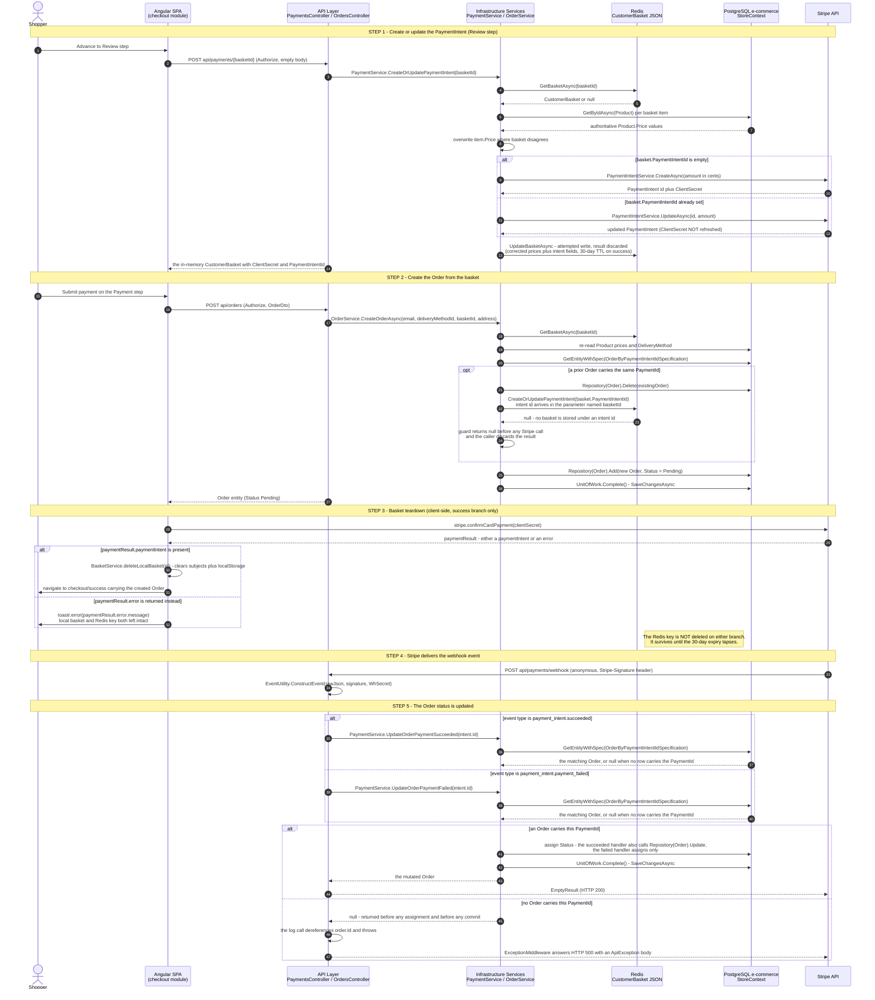
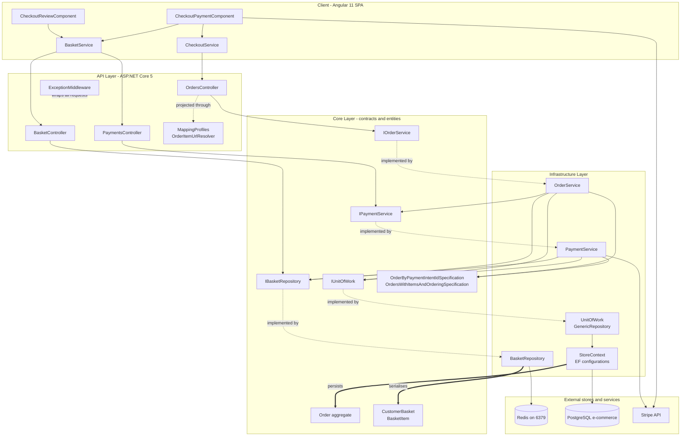
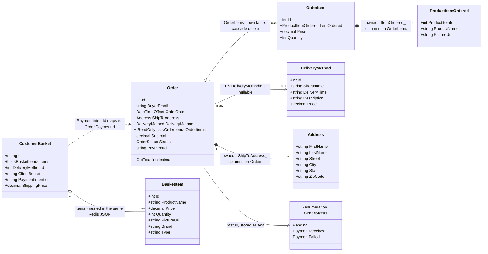
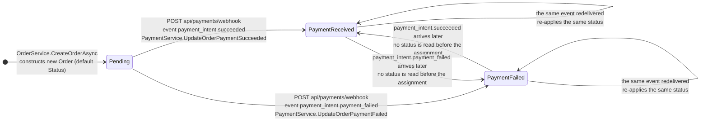
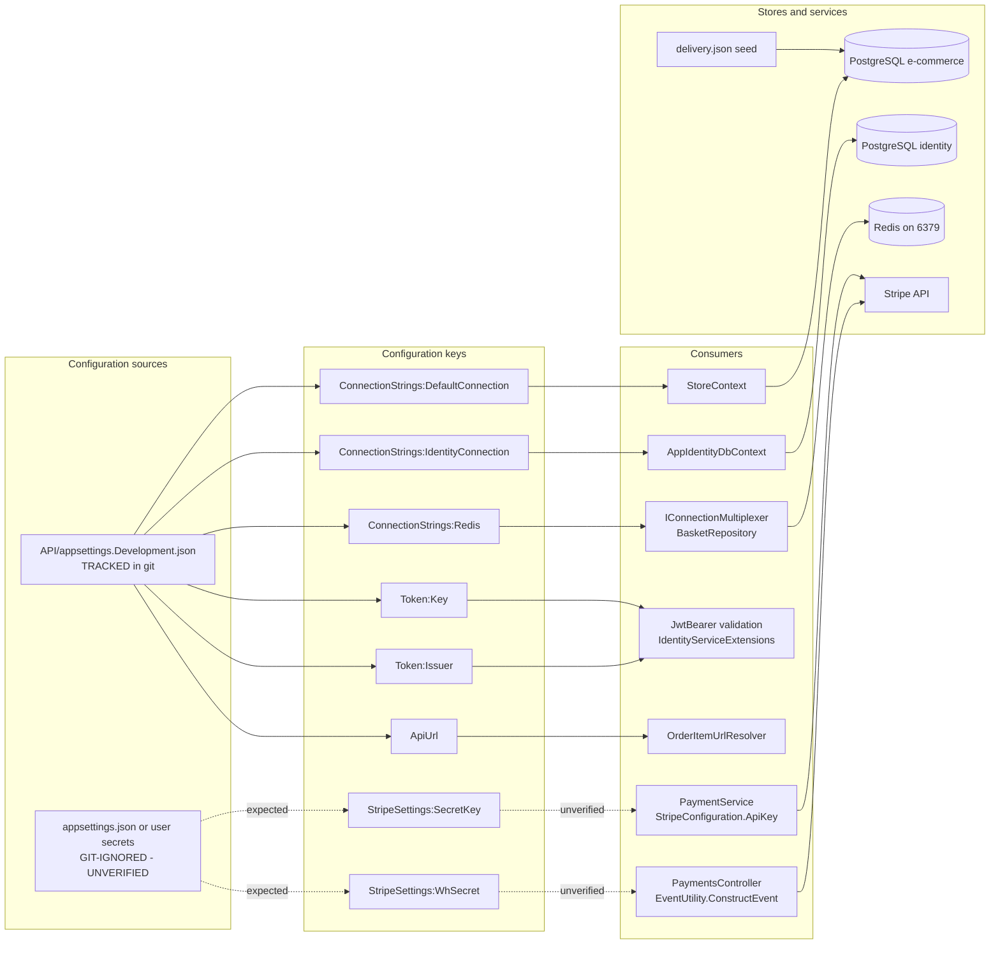

# Checkout Workflow — Basket, Order and Payment Reference (F-003 / F-004 / F-005)

This document is the source-grounded reference for the end-to-end checkout workflow: the path that carries a Redis-resident `CustomerBasket` `Core/Entities/CustomerBasket.cs:L16-L22` through Stripe PaymentIntent creation `Infrastructure/Services/PaymentService.cs:L52-L76`, server-authoritative order materialisation into PostgreSQL `Infrastructure/Services/OrderService.cs:L30-L55`, client-side basket teardown `client/src/app/basket/basket.service.ts:L150-L154`, and asynchronous Stripe webhook-driven order-status settlement `API/Controllers/PaymentsController.cs:L40-L67`. It is written for a developer who has to change checkout safely, so every mechanic in [Section 6](#6-key-mechanics) and every failure mode in [Section 8](#8-failure-modes--edge-cases) closes by stating what breaks downstream when you touch it.

**Citation convention.** Every factual statement carries an inline locator immediately after the claim. Source files use `path:Lnn` or `path:Lnn-Lnn` (for example `API/Controllers/PaymentsController.cs:L44`), prose documents in this repository use `path:§heading` (for example `CHANGES.md:§9.6`), and configuration keys use `path:key.path`. All such paths are repository-relative, and each locator is repeated in full rather than abbreviated, so that any single claim can be checked without reading the sentence before it. Statements about behaviour that this repository exercises but does not itself define carry a bracketed `[ext-N]` marker instead, keyed to the numbered list of official sources below.

**Unverified convention.** Any statement that cannot be confirmed from repository source is marked with a bold `**unverified**` label rather than asserted as fact. Unverified statements fall into exactly three categories, and the complete set is enumerated here so the convention can be audited rather than trusted. **First, configuration this repository does not contain:** the value, storage location and shape of `StripeSettings:SecretKey`, read at `Infrastructure/Services/PaymentService.cs:L29`, and the same three properties of `StripeSettings:WhSecret`, read at `API/Controllers/PaymentsController.cs:L27` — neither key appears in any tracked configuration file. **Second, framework- or provider-side behaviour this repository cannot evidence and that no source in the list below settles:** Stripe's retry cadence and retry ceiling, its delivery guarantees, the internal structure of the `Stripe-Signature` header, the lifetime of a client secret across an intent amendment, AutoMapper's precedence between two registrations for one destination member, the frequency of controller activation, container-storage durability, the empty-response status code the framework selects for an action whose return type is a bare `Task`, whether the serialiser emits any member at all for a method such as `Order.GetTotal()`, and the decimal scale a money value carries on the wire. **Third, every comparison drawn against the project's technical specification**, which is an external document rather than a repository file, as the next paragraph explains. Framework and provider behaviour that one of those numbered sources *does* settle is never placed in this category: it is attributed inline with an `[ext-N]` marker instead. Nothing outside those three categories is inferred or invented.

**External and non-repository sources.** Two classes of source sit outside this repository and therefore cannot carry a `path:Lnn` locator. Each gets an explicit convention rather than a silent omission — `tech spec §N` for the first and `[ext-N]` for the second.

- **The project's technical specification.** A reference of the form `tech spec §N` points at the pre-existing specification document for this project. That document is **not a file in this repository** — no repository path resolves it — so nothing it says can be verified from here. Every comparison this document draws against it is consequently labelled **unverified** on the specification's side. The code side of each comparison always carries a real locator, and where the two disagree the code is authoritative and the divergence is recorded as observed behaviour.
- **Framework and provider documentation.** Behaviour contributed by ASP.NET Core, Entity Framework Core, AutoMapper, StackExchange.Redis or Stripe — as distinct from behaviour written in this repository — is attributed inline with a bracketed `[ext-N]` marker keyed to this list:

    - **[ext-1]** Stripe, *Receive Stripe events in your webhook endpoint* — https://docs.stripe.com/webhooks
    - **[ext-2]** Stripe, *Resolve webhook signature verification errors* — https://docs.stripe.com/webhooks/signature
    - **[ext-3]** Microsoft, *Format response data in ASP.NET Core Web API* — https://learn.microsoft.com/en-us/aspnet/core/web-api/advanced/formatting
    - **[ext-4]** Microsoft, *Routing in ASP.NET Core* — https://learn.microsoft.com/en-us/aspnet/core/fundamentals/routing
    - **[ext-5]** Microsoft, *Model validation in ASP.NET Core MVC* — https://learn.microsoft.com/en-us/aspnet/core/mvc/models/validation
    - **[ext-6]** Microsoft, *DbContext Lifetime, Configuration, and Initialization* — https://learn.microsoft.com/en-us/ef/core/dbcontext-configuration/
    - **[ext-7]** Microsoft, *Using Transactions — EF Core* — https://learn.microsoft.com/en-us/ef/core/saving/transactions
    - **[ext-8]** Microsoft, *Change Tracking in EF Core* — https://learn.microsoft.com/en-us/ef/core/change-tracking/
    - **[ext-9]** AutoMapper, *Flattening* — https://docs.automapper.org/en/stable/Flattening.html
    - **[ext-10]** StackExchange.Redis, *Configuration* — https://stackexchange.github.io/StackExchange.Redis/Configuration.html
    - **[ext-11]** Microsoft, *How to customize property names and values with System.Text.Json* — https://learn.microsoft.com/en-us/dotnet/standard/serialization/system-text-json/customize-properties
    - **[ext-12]** Microsoft, *RangeAttribute Class (System.ComponentModel.DataAnnotations)* — https://learn.microsoft.com/en-us/dotnet/api/system.componentmodel.dataannotations.rangeattribute

**Illustrative-excerpt convention.** Every fenced block in this document is an illustration, never an executed transcript, and each carries an explicit label saying so. A `csharp` fence is introduced by the label *Illustrative source excerpt — not an executed transcript* and reproduces a short passage of real repository source. A `json` or `text` fence appears under an **Example** label in [Section 4](#4-api-reference) that names it an illustrative shape rather than a captured transcript, and depicts the members of a real DTO, entity or seed file with placeholder values chosen to fit each declared type. Every fence is cross-checked against the exact signature, route, DTO or column it depicts. Nothing here was captured from a running process, because the solution declares only three projects — API, Core and Infrastructure — and contains no test project `ecommerce-shop.sln:L6, L8, L10`.

**Line-number caveat.** Locators refer to the repository state at authoring time. Drift is expected rather than erroneous. If the cited lines no longer contain the cited symbol, treat the statement as needing review — that pairing of claim to locator is the maintainability mechanism this document relies on. It has to be, because nothing in the repository can regenerate this content: the only machine-readable description of the checkout surface is the reflection-derived OpenAPI document registered at `API/Startup.cs:L45` and served at `API/Startup.cs:L83`, and none of the three checkout controllers carries a single XML documentation comment for it to read `API/Controllers/BasketController.cs:L21-L40`, `API/Controllers/OrdersController.cs:L28-L61`, `API/Controllers/PaymentsController.cs:L30-L67`.

**Contents.**

- [1. Overview](#1-overview)
- [2. End-to-end sequence](#2-end-to-end-sequence)
- [3. Component & responsibility map](#3-component--responsibility-map)
- [4. API reference](#4-api-reference)
- [5. Data model](#5-data-model)
- [6. Key mechanics](#6-key-mechanics)
- [7. Order status lifecycle](#7-order-status-lifecycle)
- [8. Failure modes & edge cases](#8-failure-modes--edge-cases)
- [9. Configuration dependencies](#9-configuration-dependencies)

**Endpoint count.** The checkout surface is often described as eight endpoints, because the three distinct `BasketController` actions — `GetBasketById` `API/Controllers/BasketController.cs:L21-L26`, `UpdateBasket` `API/Controllers/BasketController.cs:L28-L34` and `DeleteBasketAsync` `API/Controllers/BasketController.cs:L36-L40` — are usually collapsed into the single phrase "basket CRUD". Counted individually against the code, the set is **nine** endpoints, and [Section 4](#4-api-reference) documents all nine. Nine is a superset of eight, so the extra row is not additional scope; it is the third basket action stated explicitly.

**Scope.** This document covers only the Shopping Basket (F-003), Order Processing (F-004) and Payment Processing (F-005) features. Those three feature identifiers and the seventeen requirement identifiers beneath them are drawn from the requirement catalogue at `tech spec §2.2`, which is external to this repository and therefore **unverified** here. What *is* verified is the code surface each identifier maps onto, tabulated below. This document does not describe product catalog browsing, filtering or pagination; authentication and token issuance internals; response caching; customer address management; Angular modules outside `client/src/app/basket/` and `client/src/app/checkout/`; or deployment beyond the runtime dependencies named in [Section 9](#9-configuration-dependencies). Five components outside the three features are mentioned only where checkout touches them directly, each bounded to the sentence or table row that explains the contact.

**Requirement traceability.** All seventeen in-scope requirement identifiers are mapped individually below. One caveat governs the whole table: the catalogue that names these identifiers is an external document, so its wording cannot be quoted or checked from here and the identifier-to-behaviour binding is **unverified** on the catalogue's side. The "Behaviour realised in code" column therefore states what the code actually does for each identifier, derived from the cited symbol rather than from catalogue text, and every one of those citations is verifiable in this repository.

| RQ | Behaviour realised in code | Source symbol and locator | Documented in |
|---|---|---|---|
| F-003 RQ-001 | Retrieve a basket by its client-generated id, answering with an empty basket rather than a 404 when no key exists | `BasketController.GetBasketById` `API/Controllers/BasketController.cs:L21-L26` reaching `BasketRepository.GetBasketAsync` `Infrastructure/Data/BasketRepository.cs:L18-L22` | [4](#4-api-reference) row 1, [8.5](#85-basket-not-found) |
| F-003 RQ-002 | Create or replace a basket wholesale from a client payload, returning the re-read result | `BasketController.UpdateBasket` `API/Controllers/BasketController.cs:L28-L34` reaching `BasketRepository.UpdateBasketAsync` `Infrastructure/Data/BasketRepository.cs:L24-L32` | [4](#4-api-reference) row 2, [5](#5-data-model) |
| F-003 RQ-003 | Delete a basket by id, discarding the repository's boolean result | `BasketController.DeleteBasketAsync` `API/Controllers/BasketController.cs:L36-L40` reaching `KeyDeleteAsync` `Infrastructure/Data/BasketRepository.cs:L34-L37` | [4](#4-api-reference) row 3, [2](#2-end-to-end-sequence) step 3 |
| F-003 RQ-004 | Hold the basket in Redis as serialised JSON under a 30-day expiry, carrying items plus the delivery-method, client-secret and intent fields | `BasketRepository.UpdateBasketAsync` `Infrastructure/Data/BasketRepository.cs:L27` over the shape at `Core/Entities/CustomerBasket.cs:L16-L22` | [5](#5-data-model), [9](#9-configuration-dependencies) |
| F-004 RQ-001 | Create an order from a basket on behalf of the authenticated buyer | `OrdersController.CreateOrder` `API/Controllers/OrdersController.cs:L28-L36` reaching `OrderService.CreateOrderAsync` `Infrastructure/Services/OrderService.cs:L24-L61` | [4](#4-api-reference) row 4, [2](#2-end-to-end-sequence) step 2 |
| F-004 RQ-002 | Resolve the buyer identity from the bearer token rather than from the request body | `RetrieveEmailFromPrincipal` on the action's principal `API/Controllers/OrdersController.cs:L31` under the class-level `[Authorize]` `API/Controllers/OrdersController.cs:L16` | [4](#4-api-reference) row 4, [9](#9-configuration-dependencies) |
| F-004 RQ-003 | Price every line item from the database rather than from the basket, and compute the subtotal from those prices | `OrderService.CreateOrderAsync` product re-read `Infrastructure/Services/OrderService.cs:L32-L34` and subtotal `Infrastructure/Services/OrderService.cs:L40` | [6.1](#61-server-side-price-verification-against-the-database-during-order-and-intent-creation), [8.1](#81-tampered-basket-prices) |
| F-004 RQ-004 | Attach the shipping address as an owned type and the delivery method by foreign key | `Infrastructure/Services/OrderService.cs:L38, L52` configured by `Infrastructure/Data/Config/OrderConfiguration.cs:L12` | [5](#5-data-model) |
| F-004 RQ-005 | Commit the order as one batch through a single Unit of Work completion | `Infrastructure/Services/OrderService.cs:L55` reaching `UnitOfWork.Complete` `Infrastructure/Data/UnitOfWork.cs:L40-L43` | [6.2](#62-unit-of-work-commit), [8.3](#83-unit-of-work-save-failure) |
| F-004 RQ-006 | List a buyer's own orders and retrieve one by id, eager-loading items and delivery method | `API/Controllers/OrdersController.cs:L38-L55` over `Core/Specifications/OrdersWithItemsAndOrderingSpecification.cs:L7-L19` | [4](#4-api-reference) rows 5-6, [5](#5-data-model) |
| F-004 RQ-007 | Expose the selectable delivery methods the shopper chooses between | `OrdersController.GetDeliveryMethods` `API/Controllers/OrdersController.cs:L57-L61` reaching `Infrastructure/Services/OrderService.cs:L75-L78` | [4](#4-api-reference) row 7, [5](#5-data-model), [9](#9-configuration-dependencies) |
| F-005 RQ-001 | Create a Stripe PaymentIntent for a basket that does not yet carry one | `Infrastructure/Services/PaymentService.cs:L56-L67` | [2](#2-end-to-end-sequence) step 1, [6.1](#61-server-side-price-verification-against-the-database-during-order-and-intent-creation) |
| F-005 RQ-002 | Update the existing intent instead when the basket already carries an id | `Infrastructure/Services/PaymentService.cs:L69-L76` | [8.4](#84-re-submitted-intents) |
| F-005 RQ-003 | Compute the charge amount server-side from database prices plus the delivery-method price | `Infrastructure/Services/PaymentService.cs:L36-L50` with the amount expressions at `Infrastructure/Services/PaymentService.cs:L60, L73` | [6.1](#61-server-side-price-verification-against-the-database-during-order-and-intent-creation) |
| F-005 RQ-004 | Return the intent id and client secret on the basket so the browser can confirm the card | `Infrastructure/Services/PaymentService.cs:L65-L66, L78` returned at `API/Controllers/PaymentsController.cs:L37` | [4](#4-api-reference) row 8, [2](#2-end-to-end-sequence) step 1 |
| F-005 RQ-005 | Accept asynchronous Stripe deliveries and authenticate them by signature over the raw payload | `PaymentsController.StripeWebhook` `API/Controllers/PaymentsController.cs:L40-L44` | [4](#4-api-reference) row 9, [6.3](#63-stripe-webhook-signature-verification), [8.2](#82-invalid-webhook-signatures) |
| F-005 RQ-006 | Settle the order's status from the delivered event type | `API/Controllers/PaymentsController.cs:L49-L63` reaching `Infrastructure/Services/PaymentService.cs:L82-L106` | [7](#7-order-status-lifecycle) |

---

## 1. Overview

The checkout workflow converts a Redis-resident basket into a persisted PostgreSQL order whose payment status is settled asynchronously by Stripe. It **starts** when the shopper reaches the Review stage of the four-step Angular stepper — `Address`, `Delivery`, `Review` and `Payment`, declared as four `cdk-step` labels at `client/src/app/checkout/checkout.component.html:L5-L16` — and the Review component asks the SPA to issue `POST api/payments/{basketId}` with an empty body `client/src/app/checkout/checkout-review/checkout-review.component.ts:L23` and `client/src/app/basket/basket.service.ts:L25`, which creates or updates a Stripe PaymentIntent and writes the intent identifier and client secret back into the basket `Infrastructure/Services/PaymentService.cs:L64-L66, L78`. On the Payment step the SPA then calls `POST api/orders`, which re-reads every product price from the database, materialises an `Order` whose status defaults to `Pending`, and commits it `Infrastructure/Services/OrderService.cs:L32-L34, L52-L55` and `Core/Entities/OrderAggregate/Order.cs:L28`. Only after that does the browser confirm the card with Stripe and clear its own basket state `client/src/app/checkout/checkout-payment/checkout-payment.component.ts:L82-L85`. The workflow **ends** when Stripe delivers an asynchronous event to `POST api/payments/webhook` and the matching `Order` row transitions out of `Pending` into either `PaymentReceived` or `PaymentFailed` `API/Controllers/PaymentsController.cs:L40-L67` and `Infrastructure/Services/PaymentService.cs:L88, L102`. Everything between those two endpoints is in scope; the shopper's browser is never the authority on price, and the order row exists before any card is charged.

---

## 2. End-to-end sequence

**Figure 1 — Checkout Workflow End-to-End Sequence** traces the whole path across seven participants. Every branch is expressed inside this single diagram: the create-versus-update PaymentIntent alternative `Infrastructure/Services/PaymentService.cs:L56`, the optional stale-order replacement `Infrastructure/Services/OrderService.cs:L46`, the success-versus-error payment-result alternative that gates basket teardown `client/src/app/checkout/checkout-payment/checkout-payment.component.ts:L84-L90`, and the succeeded-versus-failed webhook alternative `API/Controllers/PaymentsController.cs:L51, L57`.



**Legend for Figure 1.** Solid arrows are outbound calls; dashed arrows are returns. The five `Note over` bands delimit the five workflow steps and are the anchors the narration below groups under. The number `autonumber` attaches to each arrow is the key the narration references, so every arrow has exactly one narration entry and every entry has exactly one arrow — forty-seven of each, spanning the entry endpoint `API/Controllers/PaymentsController.cs:L30-L38` through to the exit endpoint `API/Controllers/PaymentsController.cs:L40-L67`.

Five block constructs carry conditions, and each is drawn to match the branch the code actually takes rather than the branch its name suggests `Infrastructure/Services/PaymentService.cs:L56`, `Infrastructure/Services/OrderService.cs:L46`, `client/src/app/checkout/checkout-payment/checkout-payment.component.ts:L84`, `API/Controllers/PaymentsController.cs:L49` and `Infrastructure/Services/PaymentService.cs:L86, L100`.

- The **step 1 `alt`/`else`** is the create-versus-update intent decision, evaluated at `Infrastructure/Services/PaymentService.cs:L56`; both arms reach Stripe, and only the create arm assigns a client secret back `Infrastructure/Services/PaymentService.cs:L65-L66`.
- The **step 2 `opt`** executes only when a prior order already carries the same Stripe intent identifier `Infrastructure/Services/OrderService.cs:L46`. Note where its second call goes: `CreateOrUpdatePaymentIntent` is invoked with the intent id `Infrastructure/Services/OrderService.cs:L49` into a parameter declared `basketId` `Infrastructure/Services/PaymentService.cs:L27`, so the first thing it does is a Redis lookup keyed on that intent id `Infrastructure/Services/PaymentService.cs:L31` and `Infrastructure/Data/BasketRepository.cs:L20`. For a basket created by the SPA that lookup misses, because the only key the browser ever writes is the GUID it generated `client/src/app/shared/models/basket.ts:L21-L24` and `Infrastructure/Data/BasketRepository.cs:L27`; the null guard then returns immediately `Infrastructure/Services/PaymentService.cs:L34` and **Stripe is never reached on this arrow** — which is why the arrow points at Redis and not at Stripe. That miss is the normal case rather than an invariant: nothing constrains the key to a GUID, so a key equal to a Stripe intent id can be created deliberately, and the arrow would then continue into the intent logic instead of returning at the guard `API/Controllers/BasketController.cs:L28-L34` and `API/Dtos/CustomerBasketDto.cs:L8`. Either way the caller assigns the return value to nothing `Infrastructure/Services/OrderService.cs:L49`.
- The **step 3 `alt`/`else`** is the payment-result branch `client/src/app/checkout/checkout-payment/checkout-payment.component.ts:L84`. Basket teardown and the success navigation happen **only** in the first arm `client/src/app/checkout/checkout-payment/checkout-payment.component.ts:L85-L87`; the second arm raises a toast and leaves both the local basket and the Redis key in place `client/src/app/checkout/checkout-payment/checkout-payment.component.ts:L89`.
- The **first step 5 `alt`/`else`** is the webhook event-type switch `API/Controllers/PaymentsController.cs:L49`, whose two arms are the only two event strings the endpoint handles `API/Controllers/PaymentsController.cs:L51, L57`; every other event type skips both arms and still reaches the same unconditional return `API/Controllers/PaymentsController.cs:L65`.
- The **second step 5 `alt`/`else`** is the `PaymentId` match, and it is drawn explicitly because settlement is conditional on it rather than guaranteed by reaching a handler. Both handlers resolve the order through the Specification and return `null` when nothing matches `Infrastructure/Services/PaymentService.cs:L86` and `Infrastructure/Services/PaymentService.cs:L100`, so the status assignment and the commit sit **inside** the matched arm `Infrastructure/Services/PaymentService.cs:L88-L91` and `Infrastructure/Services/PaymentService.cs:L102-L103` and never execute on the unmatched one. The unmatched arm does not fall quietly through to the 200 either — the controller dereferences `order.Id` in its log call with no null guard `API/Controllers/PaymentsController.cs:L55` and `API/Controllers/PaymentsController.cs:L61`, so the request ends in `ExceptionMiddleware` instead `API/Middleware/ExceptionMiddleware.cs:L31-L39`.

The right-hand note on Redis records the deliberate absence of a server-side basket delete anywhere on this path `Infrastructure/Services/OrderService.cs:L24-L61`.

### Step 1 — Create or update the PaymentIntent (arrows 1-14)

1. The shopper advances to the Review stage of the stepper, declared as `[label]="'Review'"` at `client/src/app/checkout/checkout.component.html:L11`.
2. The SPA issues `POST api/payments/{basketId}` with an empty object as the body — `this.http.post(this.baseUrl + 'payments/' + this.getCurrentBasketValue().id, {})` at `client/src/app/basket/basket.service.ts:L25` — triggered by the Review component at `client/src/app/checkout/checkout-review/checkout-review.component.ts:L23`, which advances the stepper only after the call succeeds `client/src/app/checkout/checkout-review/checkout-review.component.ts:L24`.
3. The controller delegates straight to the payment service with no work of its own `API/Controllers/PaymentsController.cs:L34`.
4. The service loads the basket from Redis `Infrastructure/Services/PaymentService.cs:L31`, which issues `StringGetAsync` against the raw basket id `Infrastructure/Data/BasketRepository.cs:L20`.
5. Redis returns either the deserialised basket or `null` when the key is empty `Infrastructure/Data/BasketRepository.cs:L21`; the service guards that case immediately `Infrastructure/Services/PaymentService.cs:L34`.
6. For each basket item the service reads the product row by the item's id `Infrastructure/Services/PaymentService.cs:L45`.
7. The read resolves through `FindAsync`, so the returned price is the database's `Infrastructure/Data/GenericRepository.cs:L22`.
8. Where the basket's price disagrees with the database, the basket's own price is overwritten in memory `Infrastructure/Services/PaymentService.cs:L46-L48`.
9. When the basket carries no intent id yet, a new PaymentIntent is created `Infrastructure/Services/PaymentService.cs:L64` with the amount computed at `Infrastructure/Services/PaymentService.cs:L60`; the branch is selected at `Infrastructure/Services/PaymentService.cs:L56`.
10. Stripe returns the intent, whose id and client secret are copied onto the basket `Infrastructure/Services/PaymentService.cs:L65-L66`.
11. When the basket already carries an intent id, the existing intent is updated instead `Infrastructure/Services/PaymentService.cs:L75`, with the amount recomputed at `Infrastructure/Services/PaymentService.cs:L73`.
12. The update branch returns the updated intent but assigns nothing back to the basket, so `ClientSecret` keeps its original value `Infrastructure/Services/PaymentService.cs:L69-L76`.
13. The service **attempts** to write the corrected basket — adjusted prices plus the intent fields — back to Redis `Infrastructure/Services/PaymentService.cs:L78`. A successful `StringSetAsync` stores it under the basket id with a fresh 30-day expiry `Infrastructure/Data/BasketRepository.cs:L27`; a failed one makes the repository return `null` instead `Infrastructure/Data/BasketRepository.cs:L29`. The service discards that return value either way `Infrastructure/Services/PaymentService.cs:L78`, so this arrow records an attempted write and not a confirmed one.
14. The controller returns the basket carrying `ClientSecret` and `PaymentIntentId` `API/Controllers/PaymentsController.cs:L37` — the service's own in-memory instance rather than anything read back out of Redis `Infrastructure/Services/PaymentService.cs:L78-L79`, so the response body is identical whether the write of arrow 13 succeeded or failed.

### Step 2 — Create the Order from the basket (arrows 15-27)

15. The shopper submits on the Payment step, entering `submitOrder()` at `client/src/app/checkout/checkout-payment/checkout-payment.component.ts:L78`.
16. The SPA posts to `api/orders` `client/src/app/checkout/checkout.service.ts:L17` with the payload assembled at `client/src/app/checkout/checkout-payment/checkout-payment.component.ts:L115-L121`.
17. The controller resolves the buyer email from the principal `API/Controllers/OrdersController.cs:L31`, maps the address DTO to the order-aggregate address `API/Controllers/OrdersController.cs:L32`, and calls the order service `API/Controllers/OrdersController.cs:L33`.
18. The service fetches the basket from Redis `Infrastructure/Services/OrderService.cs:L27` — with no null check, which is the subject of [Section 8.5](#85-basket-not-found).
19. It re-reads every product row `Infrastructure/Services/OrderService.cs:L32` and the selected delivery method `Infrastructure/Services/OrderService.cs:L38`, then computes the subtotal from the database-sourced prices `Infrastructure/Services/OrderService.cs:L40`.
20. It looks for an existing order carrying the same Stripe intent id `Infrastructure/Services/OrderService.cs:L43-L44`.
21. When one exists, that order is marked for deletion `Infrastructure/Services/OrderService.cs:L48`.
22. The payment service is then called again with the intent id `Infrastructure/Services/OrderService.cs:L49`, and because that method's parameter is declared `basketId` `Infrastructure/Services/PaymentService.cs:L27` the intent id is used as a Redis key `Infrastructure/Services/PaymentService.cs:L31` reaching `StringGetAsync` `Infrastructure/Data/BasketRepository.cs:L20`. The arrow therefore points at Redis, not at Stripe — see [Section 6.4](#64-stale-order-replacement-by-paymentintentid).
23. For a basket the SPA created, Redis holds nothing under an intent id — the only key ever written is the browser-generated GUID `client/src/app/shared/models/basket.ts:L21-L24` and `Infrastructure/Data/BasketRepository.cs:L27` — so the lookup returns empty and the repository yields `null` `Infrastructure/Data/BasketRepository.cs:L21`.
24. The null guard returns immediately `Infrastructure/Services/PaymentService.cs:L34`, so on that normal path **no Stripe call is made on this branch** and no basket is rewritten; the caller assigns the returned `null` to nothing `Infrastructure/Services/OrderService.cs:L49`, so the call is a no-op with one wasted Redis round trip. The no-op is a consequence of how keys happen to be named, not something the code guarantees: `POST api/basket` accepts any non-null string as the id `API/Controllers/BasketController.cs:L28-L34` and `API/Dtos/CustomerBasketDto.cs:L8`, so a caller who stores a basket under a key equal to an intent id would make this lookup hit and the re-call would run the full intent path — see [Section 6.4](#64-stale-order-replacement-by-paymentintentid).
25. A replacement `Order` is constructed with the basket's intent id as its `PaymentId` and added to the context `Infrastructure/Services/OrderService.cs:L52-L53`; its `Status` takes the field-initialiser default `OrderStatus.Pending` `Core/Entities/OrderAggregate/Order.cs:L28`.
26. A single `Complete()` flushes the delete and the insert together `Infrastructure/Services/OrderService.cs:L55`, which is one `SaveChangesAsync` call `Infrastructure/Data/UnitOfWork.cs:L42`; a non-positive result returns `null` `Infrastructure/Services/OrderService.cs:L57`.
27. The controller returns `Ok(order)` — the `Order` entity itself `API/Controllers/OrdersController.cs:L35`.

### Step 3 — Basket teardown, client-side and success-only (arrows 28-32)

This step is named for basket deletion, and the accurate description is narrower than the name in two ways. First, **no server-side deletion happens anywhere on the checkout path**: `OrderService.CreateOrderAsync` contains no call to `DeleteBasketAsync` `Infrastructure/Services/OrderService.cs:L24-L61`, and the client method invoked after payment clears only local state `client/src/app/basket/basket.service.ts:L150-L154`. Second, **even that local teardown is conditional**: it sits inside the success arm of `if (paymentResult.paymentIntent)` `client/src/app/checkout/checkout-payment/checkout-payment.component.ts:L84-L85`, so a declined or errored confirmation leaves the local basket fully intact `client/src/app/checkout/checkout-payment/checkout-payment.component.ts:L88-L89`. A genuine server-side delete does exist — `DELETE api/basket` `API/Controllers/BasketController.cs:L36-L40` reaching `BasketRepository.DeleteBasketAsync` `Infrastructure/Data/BasketRepository.cs:L34-L37`, which the client calls from `deleteBasket()` `client/src/app/basket/basket.service.ts:L141-L149` — but checkout never invokes it. The Redis key therefore survives until its 30-day expiry lapses `Infrastructure/Data/BasketRepository.cs:L27`. The project's technical specification describes the same end state for a basket, as one that persists until it is explicitly deleted or expires `tech spec §4.4.2`; that corroboration is **unverified** here, because the specification is not a file in this repository, but the code side of it is not — the expiry is set at `Infrastructure/Data/BasketRepository.cs:L27` and nothing on the checkout path deletes the key `Infrastructure/Services/OrderService.cs:L24-L61`.

28. The SPA confirms the card with Stripe using the basket's client secret `client/src/app/checkout/checkout-payment/checkout-payment.component.ts:L99`, called at `client/src/app/checkout/checkout-payment/checkout-payment.component.ts:L83`.
29. Stripe returns a result object, and the presence of its `paymentIntent` member is what selects the branch `client/src/app/checkout/checkout-payment/checkout-payment.component.ts:L84`.
30. **Success arm only.** The SPA calls `deleteLocalBasket(basket.id)` `client/src/app/checkout/checkout-payment/checkout-payment.component.ts:L85`, which pushes `null` onto both `BehaviorSubject`s and removes the `basket_id` entry from `localStorage` with no HTTP request at all `client/src/app/basket/basket.service.ts:L151-L153`.
31. **Success arm only.** The SPA navigates to the success route `client/src/app/checkout/checkout-payment/checkout-payment.component.ts:L87`, declared at `client/src/app/checkout/checkout-routing.module.ts:L9`, passing the created order through `NavigationExtras` state `client/src/app/checkout/checkout-payment/checkout-payment.component.ts:L86`.
32. **Error arm.** When `paymentResult.paymentIntent` is absent the component raises a toast from `paymentResult.error.message` `client/src/app/checkout/checkout-payment/checkout-payment.component.ts:L89` and nothing else happens: no teardown, no navigation, and the basket remains in both `localStorage` and Redis `client/src/app/basket/basket.service.ts:L150-L154` and `Infrastructure/Data/BasketRepository.cs:L27`. A thrown confirmation instead lands in the `catch`, which only logs to the browser console `client/src/app/checkout/checkout-payment/checkout-payment.component.ts:L92-L95`.

### Step 4 — Stripe delivers the webhook event (arrows 33-34)

33. Stripe posts the event to the anonymous webhook route `API/Controllers/PaymentsController.cs:L40-L41`, whose body is read as raw text through a `StreamReader` rather than model-bound `API/Controllers/PaymentsController.cs:L43`.
34. The raw payload, the `Stripe-Signature` header and the endpoint signing secret are passed to `EventUtility.ConstructEvent` `API/Controllers/PaymentsController.cs:L44`, with the secret captured once in the constructor `API/Controllers/PaymentsController.cs:L27`. There is no `try`/`catch` here, which fixes this endpoint's failure contract — see [Section 6.3](#63-stripe-webhook-signature-verification).

### Step 5 — The Order status is updated (arrows 35-47)

35. On `payment_intent.succeeded` `API/Controllers/PaymentsController.cs:L51` the controller calls `UpdateOrderPaymentSucceeded` with the intent id `API/Controllers/PaymentsController.cs:L54`.
36. That handler builds `OrderByPaymentIntentIdSpecification` from the intent id `Infrastructure/Services/PaymentService.cs:L84` and resolves it through `GetEntityWithSpec` `Infrastructure/Services/PaymentService.cs:L85`, which is a `FirstOrDefaultAsync` over `Orders` `Infrastructure/Data/GenericRepository.cs:L32`.
37. PostgreSQL yields either an order whose `PaymentId` equals the intent id `Core/Specifications/OrderByPaymentIntentIdSpecification.cs:L9` or nothing at all, and the handler tests exactly that `Infrastructure/Services/PaymentService.cs:L86`.
38. On `payment_intent.payment_failed` `API/Controllers/PaymentsController.cs:L57` the controller calls `UpdateOrderPaymentFailed` `API/Controllers/PaymentsController.cs:L60`.
39. That handler builds and resolves the same Specification `Infrastructure/Services/PaymentService.cs:L98-L99` through the same `FirstOrDefaultAsync` `Infrastructure/Data/GenericRepository.cs:L32`.
40. It receives the same two possible outcomes and guards the null case identically `Infrastructure/Services/PaymentService.cs:L100`.
41. **Matched arm only.** `Status` is assigned — `PaymentReceived` at `Infrastructure/Services/PaymentService.cs:L88`, `PaymentFailed` at `Infrastructure/Services/PaymentService.cs:L102`. The succeeded handler additionally marks the entity `Modified` through the repository `Infrastructure/Services/PaymentService.cs:L89` and `Infrastructure/Data/GenericRepository.cs:L52-L53`; the failed handler does not, so the two arms stage different write sets — see [Section 7](#7-order-status-lifecycle). Neither reads the current status first `Infrastructure/Services/PaymentService.cs:L82-L106`.
42. **Matched arm only.** The assignment is committed by `Complete()` `Infrastructure/Services/PaymentService.cs:L91` and `Infrastructure/Services/PaymentService.cs:L103`, which is one `SaveChangesAsync` `Infrastructure/Data/UnitOfWork.cs:L42`; neither handler inspects the count it returns `Infrastructure/Services/PaymentService.cs:L91, L103`.
43. **Matched arm only.** The handler returns the order it mutated `Infrastructure/Services/PaymentService.cs:L93` and `Infrastructure/Services/PaymentService.cs:L105`, which is the value the controller logs against `API/Controllers/PaymentsController.cs:L55, L61`.
44. **Matched arm only.** The controller answers Stripe with `new EmptyResult()`, an HTTP 200 with no body `API/Controllers/PaymentsController.cs:L65`. That same return is also where an event of any *other* type lands — outside both arms of the diagram, having called no handler at all — because the `switch` has no `default` arm `API/Controllers/PaymentsController.cs:L49-L63`.
45. **Unmatched arm.** When no row carries the intent id both handlers return `null` at their guard — before any status assignment and before any `Complete()` `Infrastructure/Services/PaymentService.cs:L86` and `Infrastructure/Services/PaymentService.cs:L100` — so nothing is written and no commit is attempted.
46. **Unmatched arm.** The controller assigns that `null` to `order` `API/Controllers/PaymentsController.cs:L54, L60` and immediately dereferences `order.Id` inside the log call, with no null guard on either branch `API/Controllers/PaymentsController.cs:L55` and `API/Controllers/PaymentsController.cs:L61`.
47. **Unmatched arm.** The resulting exception unwinds past the unreached `return new EmptyResult();` `API/Controllers/PaymentsController.cs:L65` into `ExceptionMiddleware` `API/Middleware/ExceptionMiddleware.cs:L31`, which answers **HTTP 500** with an `ApiException` body `API/Middleware/ExceptionMiddleware.cs:L35-L39` — the same response a signature failure produces, which is why the two are indistinguishable to Stripe; see [Section 8.2](#82-invalid-webhook-signatures).

---

## 3. Component & responsibility map

**Figure 2 — Checkout Component and Layer Map** shows the layer topology the checkout path spans, from the Angular SPA `client/src/app/basket/basket.service.ts:L13-L14` through the API Layer `API/Controllers/BaseApiController.cs:L5-L6` and the Core Layer contracts `Core/Interfaces/IOrderService.cs:L7-L13` down to the Infrastructure Layer implementations registered against them `API/Extension/ApplicationServicesExtensions.cs:L17-L22` and the two datastores plus Stripe `API/Startup.cs:L31-L42` and `Infrastructure/Services/PaymentService.cs:L29`. Read Figure 2 for the shape; the table beneath it gives each participant's single responsibility.



**Legend for Figure 2.** The diagram uses three distinct edge styles, because the relationships it shows are of three different kinds — runtime invocation, persistence mapping and registration-time indirection `API/Extension/ApplicationServicesExtensions.cs:L17-L22` and `API/Startup.cs:L29-L42` — and conflating them is how a component map starts to mislead.

- **Thin solid arrows are runtime calls** — one component invoking another in the course of a request. `CheckoutReviewComponent` calling `BasketService` `client/src/app/checkout/checkout-review/checkout-review.component.ts:L23`, `BasketService` calling the payments route `client/src/app/basket/basket.service.ts:L25`, `OrderService` depending on `IUnitOfWork` `Infrastructure/Services/OrderService.cs:L14` and `BasketRepository` reaching Redis `Infrastructure/Data/BasketRepository.cs:L20` are all of this kind.
- **Thick `==>` arrows are persistence mappings, not calls.** `StoreContext ==persists==> Order aggregate` records that the context owns the mapping and the change tracking for the aggregate `Infrastructure/Data/StoreContext.cs:L21-L23` and `Infrastructure/Data/Config/OrderConfiguration.cs:L10-L18`; the entity never invokes the context. `BasketRepository ==serialises==> CustomerBasket` points from the repository to the entity for the same reason — the repository serialises and deserialises the basket `Infrastructure/Data/BasketRepository.cs:L21, L27`, and the entity is inert `Core/Entities/CustomerBasket.cs:L16-L22`. Both arrows deliberately run from the active component to the passive type.
- **Dotted arrows are indirection: implementation, configuration or wrapping.** Each `-.implemented by.->` edge links a Core Layer interface to the Infrastructure Layer class registered against it `API/Extension/ApplicationServicesExtensions.cs:L17-L22`. The `-.projected through.->` edge from `OrdersController` to the mapping helpers is not a direct call either: the controller calls `IMapper` `API/Controllers/OrdersController.cs:L45, L54`, and `MappingProfiles` and `OrderItemUrlResolver` are configuration that AutoMapper consults on its behalf, registered once at startup `API/Startup.cs:L29` and `API/Helpers/MappingProfiles.cs:L21-L28`. The `-.wraps all requests.->` edge records that `ExceptionMiddleware` is registered first in the pipeline `API/Startup.cs:L59` and therefore wraps every request in the diagram.

Cylinder nodes are external datastores `API/Startup.cs:L31-L42`. Subgraph boxes are the four code layers plus the external dependencies.

Layer assignment follows the project each type physically lives in, cross-checked against the dependency-injection registrations. The five services this workflow depends on are all registered `Scoped`, in one contiguous block: `IOrderService`, `IPaymentService`, `IUnitOfWork`, `IBasketRepository` and the open generic `IGenericRepository<>` `API/Extension/ApplicationServicesExtensions.cs:L17-L22`, with `IOrderService` at `API/Extension/ApplicationServicesExtensions.cs:L17` and the open generic at `API/Extension/ApplicationServicesExtensions.cs:L22`. The `StoreContext` those five share is registered separately, through `AddDbContext` `API/Startup.cs:L31-L32`, which registers a context as scoped by default [ext-6] — so a single request resolves one context and one change tracker no matter how many of the five wrappers resolve alongside it. The Redis connection is the deliberate exception: `IConnectionMultiplexer` is a `Singleton` `API/Startup.cs:L37-L42`. Note that the extension folder is `API/Extension/` in the singular `API/Extension/ApplicationServicesExtensions.cs:L9`.

| Class/Service | Layer | One-line responsibility | Source |
|---|---|---|---|
| `BasketService` | Client (Angular SPA) | Holds basket state in two `BehaviorSubject`s and calls the basket and payment-intent endpoints | `client/src/app/basket/basket.service.ts:L15-L31` |
| `CheckoutService` | Client (Angular SPA) | Posts the order payload and fetches delivery methods, re-sorting them price-descending in the browser | `client/src/app/checkout/checkout.service.ts:L16-L25` |
| `CheckoutReviewComponent` | Client (Angular SPA) | Triggers PaymentIntent creation on the Review step and advances the stepper on success | `client/src/app/checkout/checkout-review/checkout-review.component.ts:L22-L29` |
| `CheckoutPaymentComponent` | Client (Angular SPA) | Creates the order, then confirms the card with Stripe Elements and clears local basket state | `client/src/app/checkout/checkout-payment/checkout-payment.component.ts:L78-L96` |
| `BaseApiController` | API Layer | Supplies the shared `[ApiController]` behaviour and the `api/[controller]` route prefix every checkout endpoint inherits | `API/Controllers/BaseApiController.cs:L5-L6` |
| `BasketController` | API Layer | Exposes the three anonymous basket actions and maps the inbound basket DTO to the entity | `API/Controllers/BasketController.cs:L21-L40` |
| `OrdersController` | API Layer | Exposes the four authorised order actions and resolves the buyer email from the JWT principal | `API/Controllers/OrdersController.cs:L16-L61` |
| `PaymentsController` | API Layer | Exposes the authorised intent endpoint and the anonymous Stripe webhook, and holds the signing secret | `API/Controllers/PaymentsController.cs:L27-L67` |
| `MappingProfiles` | API Layer | Declares the AutoMapper maps for the basket, the order-aggregate address, the order and its items | `API/Helpers/MappingProfiles.cs:L18-L28` |
| `OrderItemUrlResolver` | API Layer | Prefixes the configured `ApiUrl` onto an order-item picture URL when invoked as that member's mapping value resolver | `API/Helpers/OrderItemUrlResolver.cs:L18-L26` |
| `ExceptionMiddleware` | API Layer | Converts any unhandled exception into a camelCase `ApiException` body with HTTP 500 | `API/Middleware/ExceptionMiddleware.cs:L31-L43` |
| `IOrderService` | Core Layer | Contract for order creation and the three order read operations | `Core/Interfaces/IOrderService.cs:L9-L12` |
| `IPaymentService` | Core Layer | Contract for intent create-or-update and the two order-status mutators | `Core/Interfaces/IPaymentService.cs:L9-L11` |
| `IBasketRepository` | Core Layer | Contract for basket get, upsert and delete against Redis | `Core/Interfaces/IBasketRepository.cs:L8-L10` |
| `IUnitOfWork` | Core Layer | Contract exposing a per-entity repository accessor and a single `Complete()` commit | `Core/Interfaces/IUnitOfWork.cs:L7-L10` |
| `IGenericRepository<T>` | Core Layer | Contract for entity CRUD plus Specification-driven queries | `Core/Interfaces/IGenericRepository.cs:L10-L17` |
| `Order` | Core Layer | Aggregate root holding buyer, address, items, subtotal, status and the Stripe intent id | `Core/Entities/OrderAggregate/Order.cs:L6-L34` |
| `OrderItem` | Core Layer | Line item pairing an ordered-product snapshot with the price and quantity charged | `Core/Entities/OrderAggregate/OrderItem.cs:L3-L18` |
| `ProductItemOrdered` | Core Layer | Owned snapshot of the product as ordered, deliberately not a `BaseEntity` | `Core/Entities/OrderAggregate/ProductItemOrdered.cs:L3-L18` |
| `DeliveryMethod` | Core Layer | Seeded shipping option whose price is added to the subtotal to make the total | `Core/Entities/OrderAggregate/DeliveryMethod.cs:L3-L8` |
| `OrderStatus` | Core Layer | Three-value enumeration defining the order payment lifecycle | `Core/Entities/OrderAggregate/OrderStatus.cs:L5-L12` |
| `OrderAggregate.Address` | Core Layer | Owned six-field shipping address with no identity of its own | `Core/Entities/OrderAggregate/Address.cs:L3-L24` |
| `CustomerBasket` | Core Layer | Redis-resident basket carrying items, the chosen delivery method and the Stripe intent fields | `Core/Entities/CustomerBasket.cs:L16-L22` |
| `BasketItem` | Core Layer | Client-supplied basket line whose price is never trusted by the server | `Core/Entities/BasketItem.cs:L5-L11` |
| `OrderByPaymentIntentIdSpecification` | Core Layer | Single-predicate Specification selecting the order whose `PaymentId` matches a Stripe intent id | `Core/Specifications/OrderByPaymentIntentIdSpecification.cs:L9` |
| `OrdersWithItemsAndOrderingSpecification` | Core Layer | Eager-loads items and delivery method, ordering by date only in its list-returning constructor | `Core/Specifications/OrdersWithItemsAndOrderingSpecification.cs:L7-L19` |
| `OrderService` | Infrastructure Layer | Materialises the order from the basket using database prices, replacing any stale order first | `Infrastructure/Services/OrderService.cs:L24-L61` |
| `PaymentService` | Infrastructure Layer | Creates or updates the Stripe PaymentIntent and applies both webhook-driven status changes | `Infrastructure/Services/PaymentService.cs:L27-L106` |
| `BasketRepository` | Infrastructure Layer | Serialises the basket to Redis under a 30-day expiry and reads or deletes it by key | `Infrastructure/Data/BasketRepository.cs:L18-L37` |
| `UnitOfWork` | Infrastructure Layer | Caches one repository per entity type over a shared context and commits with one `SaveChangesAsync` | `Infrastructure/Data/UnitOfWork.cs:L24-L43` |
| `GenericRepository<T>` | Infrastructure Layer | Executes the entity reads, writes and Specification queries against `StoreContext` | `Infrastructure/Data/GenericRepository.cs:L20-L59` |
| `StoreContext` | Infrastructure Layer | EF Core context owning the `Orders`, `OrderItems` and `DeliveryMethods` sets | `Infrastructure/Data/StoreContext.cs:L21-L23` |
| `OrderConfiguration` | Infrastructure Layer | Configures the owned address, the enum-to-text status conversion and cascade delete of items | `Infrastructure/Data/Config/OrderConfiguration.cs:L12-L17` |
| `OrderItemConfiguration` | Infrastructure Layer | Configures the owned product snapshot and the item price as `decimal(18,2)` | `Infrastructure/Data/Config/OrderItemConfiguration.cs:L11-L13` |
| `DeliveryMethodConfiguration` | Infrastructure Layer | Configures the delivery-method price as `decimal(18,2)` | `Infrastructure/Data/Config/DeliveryMethodConfiguration.cs:L11-L12` |

One namespace detail is worth knowing before you move files around: both Specifications live under `Core/Specifications/` but declare `namespace API.Specifications` `Core/Specifications/OrderByPaymentIntentIdSpecification.cs:L5` and `Core/Specifications/OrdersWithItemsAndOrderingSpecification.cs:L3`. That is why Infrastructure Layer services and the Core Layer repository contract all carry `using API.Specifications;` `Infrastructure/Services/OrderService.cs:L4`, `Infrastructure/Services/PaymentService.cs:L4` and `Core/Interfaces/IGenericRepository.cs:L3` — the folder name and the namespace do not agree.

For historical context on how the basket repository came to be shaped this way, see `CHANGES.md:§6.4` "6.4. Implementing the basket repository" at `CHANGES.md:L1887`. That narrative is a build log rather than a reference: it stops at chapter 9.11 `CHANGES.md:L3674` of 3,731 lines and so never reaches payments, the Stripe webhook or the order status lifecycle, and its header still declares the stack as SQLite `CHANGES.md:L7` while the shipped code registers PostgreSQL through Npgsql `API/Startup.cs:L31-L36`.

---

## 4. API reference

Nine endpoints make up the checkout surface. The `api/` prefix and the controller-name segment of every route come from the shared base controller, which carries `[ApiController]` and `[Route("api/[controller]")]` `API/Controllers/BaseApiController.cs:L5-L6`. Rows 1 to 3 are the endpoint surface of **F-003 Shopping Basket** `API/Controllers/BasketController.cs:L21-L40`, rows 4 to 7 that of **F-004 Order Processing** `API/Controllers/OrdersController.cs:L28-L61`, and rows 8 and 9 that of **F-005 Payment Processing** `API/Controllers/PaymentsController.cs:L30-L67`; the seventeen requirement identifiers behind those three features are enumerated in the traceability table above.

Five of the nine require a JWT, and the two categories of anonymous access are themselves facts about the flow's trust model. The three basket endpoints are unauthenticated and keyed only by a basket id the browser generates itself — `export class Basket implements IBasket { id = uuidv4(); }` `client/src/app/shared/models/basket.ts:L21-L24` — so possession of the id is the only thing standing between a caller and a basket. The webhook is unauthenticated in the token sense and authenticated instead by Stripe's signature over the raw payload `API/Controllers/PaymentsController.cs:L44`.

| Method | Route | Auth | Request DTO | Response DTO | Notable side effects | Source |
|---|---|---|---|---|---|---|
| GET | `api/basket?id={id}` | Anonymous — no `[Authorize]` on class or method | `string id` bound from the query string | `CustomerBasket` | None. Reads the Redis key and returns `Ok(basket ?? new CustomerBasket(id))`, so a missing key yields an empty basket rather than a 404 | `API/Controllers/BasketController.cs:L21-L26` |
| POST | `api/basket` | Anonymous | `CustomerBasketDto` | `CustomerBasket` | Writes the Redis key with a 30-day expiry after mapping DTO to entity, then returns the re-read basket; overwrites any existing basket wholesale | `API/Controllers/BasketController.cs:L28-L34` |
| DELETE | `api/basket?id={id}` | Anonymous | `string id` bound from the query string | None — the action returns a bare `Task`, so the response has no body | Deletes the Redis key; the repository's `bool` result is discarded by the controller | `API/Controllers/BasketController.cs:L36-L40` |
| POST | `api/orders` | `[Authorize]` at class level | `OrderDto` | `Order` entity, not `OrderToReturnDto` | Re-reads every product price and the delivery method from PostgreSQL, may delete a pre-existing order carrying the same `PaymentId` and re-call the intent service, inserts a new `Order` with `Status = Pending`, then commits once; answers `BadRequest` with `ApiResponse(400,"Problem creating order")` when the service returns null | `API/Controllers/OrdersController.cs:L16, L28-L36` |
| GET | `api/orders` | `[Authorize]` at class level | None — the buyer email comes from the JWT principal | `OrderToReturnDto` list, although the action declares an `OrderDto` list | Read-only. Eager-loads `OrderItems` and `DeliveryMethod` and orders by `OrderDate` descending | `API/Controllers/OrdersController.cs:L38-L46` |
| GET | `api/orders/{id}` | `[Authorize]` at class level | `int id` bound from the route | `OrderToReturnDto` | Read-only. Eager-loads the same graph but applies no ordering, and answers `NotFound` with `ApiResponse(404)` when the id and email do not match a row | `API/Controllers/OrdersController.cs:L48-L55` |
| GET | `api/orders/deliveryMethods` | `[Authorize]` at class level | None | `DeliveryMethod` list | Read-only `ListAllAsync` over the seeded table; the browser re-sorts the result price-descending before display | `API/Controllers/OrdersController.cs:L57-L61` |
| POST | `api/payments/{basketId}` | `[Authorize]` at method level | None — the SPA sends an empty body and the basket id travels in the route | `CustomerBasket` | Overwrites each `item.Price` in memory from the product row, creates or updates the Stripe PaymentIntent, and **attempts** to rewrite the basket in Redis `Infrastructure/Services/PaymentService.cs:L78` — that write and its fresh 30-day expiry land only when `StringSetAsync` succeeds `Infrastructure/Data/BasketRepository.cs:L27-L31`, and the service discards the repository's result and returns its own in-memory basket either way `Infrastructure/Services/PaymentService.cs:L78-L79`. Answers `BadRequest` with `ApiResponse(400, "Problem with your basket")` when the basket is missing | `API/Controllers/PaymentsController.cs:L30-L38` |
| POST | `api/payments/webhook` | Anonymous — authenticated by the Stripe signature rather than a token | Raw JSON body plus the `Stripe-Signature` header | `EmptyResult`, an HTTP 200 with no body, on every path the action itself completes; a failed verification or an unmatched `PaymentId` produces an `ApiException` body with HTTP 500 from the middleware instead `API/Middleware/ExceptionMiddleware.cs:L35-L39` | Reads the raw request body and verifies the signature; on the two handled event types it resolves the order by `PaymentId` `Infrastructure/Services/PaymentService.cs:L84-L85, L98-L99` and mutates `Order.Status` and commits **only when a row matches** `Infrastructure/Services/PaymentService.cs:L88-L91, L102-L103` — an unmatched id returns null before any assignment or commit `Infrastructure/Services/PaymentService.cs:L86, L100` and then throws in the controller's unguarded log call `API/Controllers/PaymentsController.cs:L55, L61`. Performs no idempotency check and persists no Stripe event id | `API/Controllers/PaymentsController.cs:L40-L67` |

### Illustrative request and response shapes

One shape is given for each of the nine endpoints, in the order of the table above. Every one is an illustrative shape rather than a captured transcript: there is no test project in the solution — `ecommerce-shop.sln` declares exactly three, API, Core and Infrastructure `ecommerce-shop.sln:L6, L8, L10` — so each shape is assembled from the real DTO or entity declaration and the real client call site, then cross-checked member by member against the signature, route or column it describes `API/Dtos/OrderDto.cs:L5-L7` and `client/src/app/checkout/checkout-payment/checkout-payment.component.ts:L115-L121`. Values are neutral placeholders chosen to fit each declared type; the two identifiers that Stripe owns are written as obvious stand-ins, and no real key, secret or signature appears anywhere in this document `Infrastructure/Services/PaymentService.cs:L65-L66`. Money is written as a plain number in every shape below: what this repository fixes is the stored precision, `decimal(18,2)` on both money columns `Infrastructure/Data/Config/DeliveryMethodConfiguration.cs:L11-L12` and `Infrastructure/Data/Config/OrderItemConfiguration.cs:L12-L13`, and the scale a serialised `decimal` carries on the wire is **unverified** here.

**Example — GET `api/basket?id={id}`.** Illustrative response shape, not a captured transcript. There is no request body: the id travels in the query string because the action takes a bare `string id` under `[HttpGet]` `API/Controllers/BasketController.cs:L21-L22` and the client appends it as `basket?id=` `client/src/app/basket/basket.service.ts:L43`. When no Redis key exists the action returns a freshly constructed empty basket rather than a 404 `API/Controllers/BasketController.cs:L25`, so the members are exactly what the constructor sets plus the declared defaults `Core/Entities/CustomerBasket.cs:L7-L10, L16-L22`:

```json
{
  "id": "b7f1c4de-0000-4a00-9000-000000000000",
  "items": [],
  "deliveryMethodId": null,
  "clientSecret": null,
  "paymentIntentId": null,
  "shippingPrice": 0
}
```

**Example — POST `api/basket`.** Illustrative request and response shape, not a captured transcript. The request binds `CustomerBasketDto` `API/Dtos/CustomerBasketDto.cs:L8-L13` with items shaped by `BasketItemDto` `API/Dtos/BasketItemDto.cs:L7-L20`, and the response is the `CustomerBasket` the repository hands back after the write `API/Controllers/BasketController.cs:L32-L33`. Both directions carry the same member set, because the DTO-to-entity maps are registered without a single member override `API/Helpers/MappingProfiles.cs:L18-L19`. The basket `id` stands in for the GUID the browser generates `client/src/app/shared/models/basket.ts:L21-L24`, the item `id` is the catalog primary key the server later uses as its price re-read key `Core/Entities/BasketItem.cs:L5` and `Infrastructure/Services/PaymentService.cs:L45`, and `deliveryMethodId` is the id of the second seeded delivery method `Infrastructure/Data/SeedData/delivery.json:L9-L15`:

```json
{
  "id": "b7f1c4de-0000-4a00-9000-000000000000",
  "items": [
    {
      "id": 1,
      "productName": "Example product",
      "price": 200,
      "quantity": 1,
      "pictureUrl": "images/products/example.png",
      "brand": "Example brand",
      "type": "Example type"
    }
  ],
  "deliveryMethodId": 2,
  "clientSecret": null,
  "paymentIntentId": null,
  "shippingPrice": 0
}
```

**Example — DELETE `api/basket?id={id}`.** Illustrative shape, not a captured transcript. Neither direction carries a body. The id travels in the query string exactly as it does on the GET `client/src/app/basket/basket.service.ts:L142`, and the action's return type is a bare `Task` `API/Controllers/BasketController.cs:L36-L37`, so nothing is serialised and the `bool` the repository returns is discarded rather than surfaced `API/Controllers/BasketController.cs:L39` and `Core/Interfaces/IBasketRepository.cs:L10`:

```text
request  : DELETE api/basket?id=b7f1c4de-0000-4a00-9000-000000000000        (no body)
response : no body, no ApiResponse envelope, no deletion confirmation
```

Which empty-response status code the framework selects for a bare-`Task` action is **unverified** here; what the code guarantees is only that there is nothing to read `API/Controllers/BasketController.cs:L36-L40`.

**Example — POST `api/orders`.** Illustrative request and response shape, not a captured transcript. The request is assembled by the payment component and posted verbatim `client/src/app/checkout/checkout-payment/checkout-payment.component.ts:L115-L121` and `client/src/app/checkout/checkout.service.ts:L17`, and binds to `OrderDto` `API/Dtos/OrderDto.cs:L5-L7` whose address member is `AddressDto` `API/Dtos/AddressDto.cs:L9-L20`. The component sends no `id` for the address, which is why the `[Required]` `Id` discussed under [Endpoint contracts worth reading twice](#endpoint-contracts-worth-reading-twice) is inert `API/Dtos/AddressDto.cs:L7-L8`:

```json
{
  "basketId": "b7f1c4de-0000-4a00-9000-000000000000",
  "deliveryMethodId": 2,
  "shipToAddress": {
    "firstName": "Ada", "lastName": "Lovelace",
    "street": "1 Analytical Way", "city": "London",
    "state": "LDN", "zipCode": "EC1A"
  }
}
```

The response is the `Order` **entity**, handed back by `Ok(order)` rather than projected through `OrderToReturnDto` `API/Controllers/OrdersController.cs:L35`, so its members are the aggregate's eight declared properties `Core/Entities/OrderAggregate/Order.cs:L22-L29` plus the `Id` it inherits `Core/Entities/OrderAggregate/Order.cs:L6` and `Core/Entities/BaseEntity.cs:L5`. The delivery method and each item's owned `ItemOrdered` are left un-flattened `Core/Entities/OrderAggregate/Order.cs:L25` and `Core/Entities/OrderAggregate/OrderItem.cs:L16-L18`, and each item carries an `Id` of its own because it is an entity in its own right `Core/Entities/OrderAggregate/OrderItem.cs:L3`:

```json
{
  "id": 12,
  "buyerEmail": "ada@example.com",
  "orderDate": "2021-12-12T02:31:44.0000000+00:00",
  "shipToAddress": {
    "firstName": "Ada", "lastName": "Lovelace", "street": "1 Analytical Way",
    "city": "London", "state": "LDN", "zipCode": "EC1A"
  },
  "deliveryMethod": {
    "id": 2, "shortName": "UPS2", "deliveryTime": "2-5 Days",
    "description": "Get it within 5 days", "price": 5
  },
  "orderItems": [
    {
      "id": 30,
      "itemOrdered": {
        "productItemId": 1, "productName": "Example product",
        "pictureUrl": "images/products/example.png"
      },
      "price": 200,
      "quantity": 1
    }
  ],
  "subtotal": 200,
  "status": 0,
  "paymentId": "pi_ILLUSTRATIVE_intent_id"
}
```

Three things about that response repay attention, because each one differs from what the read endpoints return. There is no `total` member at all: the aggregate exposes its total only through the method `GetTotal()` `Core/Entities/OrderAggregate/Order.cs:L31-L34`, whereas a `Total` property exists solely on the read DTO `API/Dtos/OrderToReturnDto.cs:L17` — whether the serialiser emits anything at all for that method is **unverified** here. `status` is the `OrderStatus` enum itself `Core/Entities/OrderAggregate/Order.cs:L28` rather than the member-name string the read endpoints carry `API/Dtos/OrderToReturnDto.cs:L18`, and since no string converter for enums is registered anywhere in the pipeline `API/Startup.cs:L30` the framework's default numeric form applies [ext-11], `Pending` being the first declared member `Core/Entities/OrderAggregate/OrderStatus.cs:L7-L8`; this is the one response in the whole workflow where the status is not the string that [Section 7](#7-order-status-lifecycle) describes. And `orderItems[].itemOrdered.pictureUrl` is the stored path with no host prefix, because the resolver that prepends `ApiUrl` is registered only on the `OrderItem` to `OrderItemDto` map `API/Helpers/MappingProfiles.cs:L28` and `API/Helpers/OrderItemUrlResolver.cs:L22`, and this response never goes through that map `API/Controllers/OrdersController.cs:L35`.

**Example — GET `api/orders`.** Illustrative response shape, not a captured transcript. There is no request payload — the buyer's email is taken from the JWT principal rather than from the caller `API/Controllers/OrdersController.cs:L41`. The action declares `IReadOnlyList<OrderDto>` but returns mapped `OrderToReturnDto` instances `API/Controllers/OrdersController.cs:L39, L45`, whose members are declared at `API/Dtos/OrderToReturnDto.cs:L9-L18` and whose items are `OrderItemDto` `API/Dtos/OrderItemDto.cs:L5-L9`. The list arrives ordered by `OrderDate` descending `Core/Specifications/OrdersWithItemsAndOrderingSpecification.cs:L11`:

```json
[
  {
    "id": 12,
    "buyerEmail": "ada@example.com",
    "orderDate": "2021-12-12T02:31:44.0000000+00:00",
    "shipToAddress": {
      "firstName": "Ada", "lastName": "Lovelace", "street": "1 Analytical Way",
      "city": "London", "state": "LDN", "zipCode": "EC1A"
    },
    "deliveryMethod": "UPS2",
    "shippingPrice": 5,
    "orderItems": [
      {
        "productId": 1,
        "productName": "Example product",
        "pictureUrl": "https://localhost:5001/Content/images/products/example.png",
        "price": 200,
        "quantity": 1
      }
    ],
    "subtotal": 200,
    "total": 205,
    "status": "Pending"
  }
]
```

Four of those members are produced rather than copied across. `deliveryMethod` collapses the navigation entity to its short name `API/Helpers/MappingProfiles.cs:L22` and `shippingPrice` to that same entity's price `API/Helpers/MappingProfiles.cs:L23`. `total` has no explicit registration at all and is resolved from the aggregate's `GetTotal()` by Get-prefix flattening `Core/Entities/OrderAggregate/Order.cs:L31-L34` [ext-9], which is why it equals the subtotal plus the delivery price `Core/Entities/OrderAggregate/Order.cs:L33`. And `pictureUrl` is the stored path prefixed with the configured `ApiUrl` `API/Helpers/OrderItemUrlResolver.cs:L22`, whose tracked value is `https://localhost:5001/Content/` `API/appsettings.Development.json:L18`; that destination member is registered twice `API/Helpers/MappingProfiles.cs:L27-L28`, so which registration wins is **unverified** — the shape above assumes the resolver does.

**Example — GET `api/orders/{id}`.** Illustrative response shape, not a captured transcript, and deliberately shared with the example above: this endpoint returns exactly one `OrderToReturnDto` `API/Controllers/OrdersController.cs:L49, L54`, so its success body is the single array element shown for `GET api/orders` with the enclosing brackets removed, member for member. Two things differ. Nothing orders the result, because the single-order specification adds the same two includes but no ordering clause `Core/Specifications/OrdersWithItemsAndOrderingSpecification.cs:L14-L19`. And when the route id and the caller's email do not identify the same row, the body is the 404 `ApiResponse` envelope described under [Error-response contracts](#error-response-contracts) instead of an order `API/Controllers/OrdersController.cs:L52-L53`.

**Example — GET `api/orders/deliveryMethods`.** Illustrative response shape, not a captured transcript. There is no request payload, and the action returns the seeded rows with no projection `API/Controllers/OrdersController.cs:L60` and `Infrastructure/Services/OrderService.cs:L77`, so each element carries the entity's four declared properties `Core/Entities/OrderAggregate/DeliveryMethod.cs:L5-L8` plus the `Id` it inherits `Core/Entities/BaseEntity.cs:L5`. The four values are the seed itself `Infrastructure/Data/SeedData/delivery.json:L2-L29`:

```json
[
  { "id": 1, "shortName": "UPS1", "deliveryTime": "1-2 Days",  "description": "Fastest delivery time",         "price": 10 },
  { "id": 2, "shortName": "UPS2", "deliveryTime": "2-5 Days",  "description": "Get it within 5 days",          "price": 5 },
  { "id": 3, "shortName": "UPS3", "deliveryTime": "5-10 Days", "description": "Slower but cheap",              "price": 2 },
  { "id": 4, "shortName": "FREE", "deliveryTime": "1-2 Weeks", "description": "Free! You get what you pay for", "price": 0 }
]
```

Nothing on the server orders that list `Infrastructure/Data/GenericRepository.cs:L25-L28`, and the browser re-sorts it by price descending before rendering the radio group `client/src/app/checkout/checkout.service.ts:L22`.

**Example — POST `api/payments/{basketId}`.** Illustrative request and response shape, not a captured transcript. The SPA sends an empty object as the body and carries the basket id in the route `client/src/app/basket/basket.service.ts:L25`, so the request has no members to show. The response is the same `CustomerBasket` shape given for `POST api/basket`, with three differences. It is also reached differently: `POST api/basket` returns the copy the repository re-reads out of Redis after the write `Infrastructure/Data/BasketRepository.cs:L31` and `API/Controllers/BasketController.cs:L32-L33`, whereas this endpoint returns the in-memory object the service has just *attempted* to write, discarding whatever the repository handed back `Infrastructure/Services/PaymentService.cs:L78-L79`. A `StringSetAsync` that reports failure makes that repository call return `null` `Infrastructure/Data/BasketRepository.cs:L29`, and because the result is discarded the body below is byte-identical either way — so this response is not evidence that Redis holds the corrected prices:

```json
{
  "id": "b7f1c4de-0000-4a00-9000-000000000000",
  "items": [
    { "id": 1, "productName": "Example product", "price": 180, "quantity": 1,
      "pictureUrl": "images/products/example.png", "brand": "Example brand", "type": "Example type" }
  ],
  "deliveryMethodId": 2,
  "clientSecret": "ILLUSTRATIVE-client-secret-value",
  "paymentIntentId": "pi_ILLUSTRATIVE_intent_id",
  "shippingPrice": 0
}
```

The item price has moved from the 200 the client posted to the 180 held in the product row, because the service overwrites the basket's copy whenever the two disagree `Infrastructure/Services/PaymentService.cs:L46-L48` — the mechanic [Section 6.1](#61-server-side-price-verification-against-the-database-during-order-and-intent-creation) traces in full. `paymentIntentId` and `clientSecret` are assigned on the create branch `Infrastructure/Services/PaymentService.cs:L65-L66`; on the update branch the id is unchanged and the secret is never rewritten `Infrastructure/Services/PaymentService.cs:L69-L76`, which [Section 8.4](#84-re-submitted-intents) covers. `shippingPrice` stays at its default because nothing in the service ever assigns it `Core/Entities/CustomerBasket.cs:L22`, even though the shipping amount is read `Infrastructure/Services/PaymentService.cs:L40` and folded into the intent total `Infrastructure/Services/PaymentService.cs:L60`.

**Example — POST `api/payments/webhook`.** Illustrative request and response shape, not a captured transcript. The body is read as raw text rather than model-bound `API/Controllers/PaymentsController.cs:L43` and is verified against the `Stripe-Signature` header `API/Controllers/PaymentsController.cs:L44`; the internal structure of that header is **unverified** here. Only two members of the delivered event are ever read — `type` selects the branch `API/Controllers/PaymentsController.cs:L49, L51, L57` and the intent's `id` is the single value handed to the service `API/Controllers/PaymentsController.cs:L54, L60` — so the excerpt below shows those and nothing else, and the remainder of Stripe's envelope is **unverified** here:

```json
{
  "type": "payment_intent.succeeded",
  "data": { "object": { "id": "pi_ILLUSTRATIVE_intent_id" } }
}
```

Every path the controller itself completes returns HTTP 200 with no body: the action ends at `new EmptyResult()` `API/Controllers/PaymentsController.cs:L65`, and an event whose type matches neither case falls straight through the switch to that same return without touching an order `API/Controllers/PaymentsController.cs:L49-L65`. The unhandled-exception paths are the exception to that, and they do return a body. A signature check that throws never reaches the `EmptyResult` at all `API/Controllers/PaymentsController.cs:L44`, and neither does a handler that returned `null` because no order matched the intent id `Infrastructure/Services/PaymentService.cs:L86, L100` and then had its `order.Id` dereferenced by the log call that follows it `API/Controllers/PaymentsController.cs:L55, L61`. Both cases unwind to `ExceptionMiddleware`, which answers with HTTP 500 and a serialised `ApiException` body `API/Middleware/ExceptionMiddleware.cs:L31-L43` — the contract [Section 8.2](#82-invalid-webhook-signatures) traces in full.

### Error-response contracts

Deliberate error returns use `ApiResponse`, which carries `StatusCode` and `Message` `API/Errors/ApiResponse.cs:L11-L12` and fills the message from a status-code default when none is supplied — 400 "You have made a bad request", 401 "You are not authorized", 404 "Resource not found", 500 "Server Error" `API/Errors/ApiResponse.cs:L15-L22`. Unhandled exceptions instead produce `ApiException`, which adds a `Details` member `API/Errors/ApiException.cs:L5-L10` populated with the stack trace only in the Development environment `API/Middleware/ExceptionMiddleware.cs:L37-L39`.

Model-validation failures on `POST api/orders` and `POST api/basket` never reach the action. They are intercepted by the configured `InvalidModelStateResponseFactory` `API/Extension/ApplicationServicesExtensions.cs:L23-L26`, which flattens every model-state entry carrying at least one error into a plain `string[]` of error messages `API/Extension/ApplicationServicesExtensions.cs:L27-L30`. That array is not the response body. It is assigned to the `Errors` member of an `ApiValidationErrorResponose` — the misspelling is the real symbol name `API/Errors/ApiValidationErrorResponose.cs:L5` — and it is that object, not the bare array, which is returned inside the `BadRequestObjectResult` `API/Extension/ApplicationServicesExtensions.cs:L32-L36`.

The envelope a consumer has to parse therefore carries three members. `ApiValidationErrorResponose` derives from `ApiResponse` and calls `base(400)` `API/Errors/ApiValidationErrorResponose.cs:L5-L9`, which sets the inherited `StatusCode` to 400 and fills the inherited `Message` from the status-code default, because the derived constructor supplies no message `API/Errors/ApiResponse.cs:L5-L8, L11-L12`; for 400 that default is "You have made a bad request" `API/Errors/ApiResponse.cs:L17`. The third member is the `Errors` collection itself `API/Errors/ApiValidationErrorResponose.cs:L11`. All three are serialised camelCase by the framework default [ext-3], so the members on the wire are `statusCode`, `message` and `errors`.

**Example — automatic model-validation failure body.** Illustrative shape for a `POST api/basket` whose item carries a price below the minimum and a quantity of zero; not a captured transcript. The two strings are the `ErrorMessage` values configured on `BasketItemDto` `API/Dtos/BasketItemDto.cs:L11, L15`:

```json
{
  "statusCode": 400,
  "message": "You have made a bad request",
  "errors": [
    "Price must be greater than zero",
    "Quantity must be at least 1"
  ]
}
```

Those two basket-item range checks are worth reading precisely, because the boundary they enforce is not the boundary their message describes. `Price` carries `[Range(0.1, double.MaxValue)]` and `Quantity` carries `[Range(1, int.MaxValue)]` `API/Dtos/BasketItemDto.cs:L10-L16`, and both bounds of a `[Range]` are inclusive [ext-12]. A price of exactly `0.1` is therefore accepted, while every positive price below it is rejected — `0.05` fails validation even though the attribute's own message reads "Price must be greater than zero" `API/Dtos/BasketItemDto.cs:L11` — and the same inclusive rule makes a `Quantity` of exactly 1 valid `API/Dtos/BasketItemDto.cs:L15`. Note also what the price check does not do: the value is bounded but never compared against the database, which is precisely why the server re-reads prices itself in [Section 6.1](#61-server-side-price-verification-against-the-database-during-order-and-intent-creation).

Response bodies are camelCase, but nothing in the startup path configures that: `services.AddControllers();` is called with no `AddJsonOptions` argument `API/Startup.cs:L30`, and a repository-wide search finds no `AddJsonOptions` call anywhere. camelCase is the framework's own default for `System.Text.Json` in a Web API project [ext-3]. The one place the codebase configures a naming policy explicitly is inside the exception middleware, which builds its own `JsonSerializerOptions` with `JsonNamingPolicy.CamelCase` before serialising the error body `API/Middleware/ExceptionMiddleware.cs:L41`. The technical specification attributes the camelCase behaviour to `Startup.cs` `tech spec §6.3.1.1`, an attribution that is **unverified** here and that the code contradicts: the behaviour is real but its origin is the framework default [ext-3] rather than any option this project sets `API/Startup.cs:L30`.

None of the three checkout controllers carries XML documentation comments, `ProducesResponseType`, `SwaggerOperation` or an `IncludeXmlComments` registration `API/Controllers/BasketController.cs:L21-L40`, `API/Controllers/OrdersController.cs:L28-L61`, `API/Controllers/PaymentsController.cs:L30-L67`. Their OpenAPI surface — registered at `API/Startup.cs:L45` and mounted into the pipeline at `API/Startup.cs:L83` — is therefore reflection-only: routes, verbs and CLR types with no descriptions, response codes, examples or side effects. This section is the semantic layer that surface cannot supply.

### Endpoint contracts worth reading twice

Six endpoint contracts behave differently from what their signatures suggest; each is set out below with the line that produces it, and none is a recommendation to change anything `API/Controllers/OrdersController.cs:L28-L61` and `API/Controllers/BasketController.cs:L21-L40`.

- **`POST api/orders` returns the `Order` entity, not a DTO.** The action's declared return type is `ActionResult<Order>` and its success path is `return Ok(order);` `API/Controllers/OrdersController.cs:L29, L35`. Consumers therefore receive the aggregate as serialised by the framework, not the flattened `OrderToReturnDto` the read endpoints return. The technical specification states that this endpoint returns `OrderToReturnDto` `tech spec §2.2.4` — a statement that is **unverified** here and that the code contradicts, since the action returns the entity `API/Controllers/OrdersController.cs:L35`.
- **`GET api/orders` declares one type and returns another.** The signature is `Task<ActionResult<IReadOnlyList<OrderDto>>>` `API/Controllers/OrdersController.cs:L39` while the body is `return Ok(_mapper.Map<IReadOnlyList<OrderToReturnDto>>(orders));` `API/Controllers/OrdersController.cs:L45`. The runtime payload is the `OrderToReturnDto` list; the declared `OrderDto` list is what a reflection-derived schema will advertise.
- **`GET api/basket` never returns 404.** A missing Redis key produces a freshly constructed empty basket carrying the requested id `API/Controllers/BasketController.cs:L25`, so "no such basket" and "basket with no items" are indistinguishable to the caller — see [Section 8.5](#85-basket-not-found).
- **`DELETE api/basket` returns nothing at all.** The action is declared `public async Task DeleteBasketAsync(string id)` `API/Controllers/BasketController.cs:L37`, so there is no body and no status object, even though the repository method it awaits returns `Task<bool>` `Core/Interfaces/IBasketRepository.cs:L10` and the underlying `KeyDeleteAsync` reports whether a key was actually removed `Infrastructure/Data/BasketRepository.cs:L36`. The caller cannot tell a successful delete from a no-op.
- **`AddressDto` has a `[Required]` `Id` the order flow never uses.** The property is declared `[Required] public int Id { get; set; }` `API/Dtos/AddressDto.cs:L7-L8`, but the client sends only the six address fields `client/src/app/checkout/checkout-payment/checkout-payment.component.ts:L119` and `client/src/app/checkout/checkout.component.ts:L27-L34`, and the map used by the order path targets `Core.Entities.OrderAggregate.Address` `API/Helpers/MappingProfiles.cs:L20`, which has no `Id` member at all `Core/Entities/OrderAggregate/Address.cs:L19-L24`. Because a non-nullable field is always valid as far as model validation is concerned, `[Required]` on an `int` never rejects a request [ext-5]. The property is inert and unused rather than a live failure mode.
- **Route ordering resolves `deliveryMethods` by precedence, not by declaration order.** `[HttpGet("{id}")]` is declared at `API/Controllers/OrdersController.cs:L48`, ahead of `[HttpGet("deliveryMethods")]` at `API/Controllers/OrdersController.cs:L57`. The framework's route-template precedence treats a literal segment as more specific than a parameter segment [ext-4], so `api/orders/deliveryMethods` reaches the intended action; the resolution depends on that precedence rule rather than on the order the actions appear in.

---

## 5. Data model

Eight types make up the checkout data model, split across two stores, and the split is also the feature boundary: the six PostgreSQL types are the persistence surface of **F-004 Order Processing** `Core/Entities/OrderAggregate/Order.cs:L6-L34`, while the two Redis types are that of **F-003 Shopping Basket** `Core/Entities/CustomerBasket.cs:L16-L22`, and the correlation between them is what **F-005 Payment Processing** writes `Infrastructure/Services/OrderService.cs:L52`. Six are persisted to the PostgreSQL `e-commerce` database through `StoreContext`, which declares the `Orders`, `OrderItems` and `DeliveryMethods` sets `Infrastructure/Data/StoreContext.cs:L21-L23`: `Order`, `OrderItem`, `ProductItemOrdered`, `DeliveryMethod`, the `OrderStatus` enumeration and the `OrderAggregate.Address` owned type. Two live only in Redis as serialised JSON under the basket id with a 30-day expiry `Infrastructure/Data/BasketRepository.cs:L27`: `CustomerBasket` and `BasketItem`.

**Figure 3 — Checkout Data Model** shows the structure and the relationships. Figure 3 is drawn as a `classDiagram` rather than an `erDiagram` deliberately: only a class diagram can express EF Core owned types — `Address` and `ProductItemOrdered`, which have no identity of their own and are persisted as prefixed columns on the owner's table `Infrastructure/Data/Config/OrderConfiguration.cs:L12` and `Infrastructure/Data/Config/OrderItemConfiguration.cs:L11` — and the `<<enumeration>>` stereotype on `OrderStatus` `Core/Entities/OrderAggregate/OrderStatus.cs:L5-L12`.



**Legend for Figure 3.** Four edge notations appear, and the distinction between the first two is the one that matters when you touch the schema — an owned type has no table of its own while a composed child entity does `Infrastructure/Data/Config/OrderConfiguration.cs:L12, L17`.

- **Filled diamond (`*--`) — an EF Core owned type.** The child has no identity and no table of its own; its properties become prefixed columns on the owner's table. Exactly two relationships qualify: `Order` to `Address`, configured by `builder.OwnsOne(o => o.ShipToAddress, ...)` `Infrastructure/Data/Config/OrderConfiguration.cs:L12` and landing as the six `ShipToAddress_*` columns on `Orders` `Infrastructure/Data/Migrations/20211212023144_PostGres initial.cs:L61-L66`; and `OrderItem` to `ProductItemOrdered`, configured by `builder.OwnsOne(i => i.ItemOrdered, ...)` `Infrastructure/Data/Config/OrderItemConfiguration.cs:L11` and landing as the three `ItemOrdered_*` columns on `OrderItems` `Infrastructure/Data/Migrations/20211212023144_PostGres initial.cs:L119-L121`.
- **Hollow diamond (`o--`) — aggregate composition with a separate store.** The child is a real, independently-tabled thing that the parent owns the lifetime of. `Order` to `OrderItem` is this, not an owned type: `OrderItem` derives from `BaseEntity` and therefore has its own `Id` `Core/Entities/OrderAggregate/OrderItem.cs:L3`, it is mapped by `builder.HasMany(o => o.OrderItems).WithOne().OnDelete(DeleteBehavior.Cascade)` `Infrastructure/Data/Config/OrderConfiguration.cs:L17`, and it lives in its own `OrderItems` table with its own primary key `Infrastructure/Data/Migrations/20211212023144_PostGres initial.cs:L113-L127`. `CustomerBasket` to `BasketItem` is also drawn this way, for the Redis analogue of the same idea: the items are nested inside the one serialised JSON value `Infrastructure/Data/BasketRepository.cs:L27` rather than stored under keys of their own.
- **Plain arrow (`-->`) — a foreign key or a typed property.** `Order` to `DeliveryMethod` is the foreign key `DeliveryMethodId`, shown as `0..1` because the column is nullable in the schema even though the aggregate's constructor treats a delivery method as required `Infrastructure/Data/Migrations/20211212023144_PostGres initial.cs:L67` and `Core/Entities/OrderAggregate/Order.cs:L8-L16`. `Order` to `OrderStatus` is the enum-typed property, stored as text through a value conversion `Infrastructure/Data/Config/OrderConfiguration.cs:L13-L16`.
- **Dashed arrow (`..>`) — a logical cross-store correlation with no database constraint whatsoever.** `CustomerBasket ..> Order` carries no foreign key, no index and no unique constraint, as the migration's `Orders` table definition shows `Infrastructure/Data/Migrations/20211212023144_PostGres initial.cs:L53-L70`.

`<<enumeration>>` marks `OrderStatus` `Core/Entities/OrderAggregate/OrderStatus.cs:L5-L12`. One diagram simplification is worth correcting against the source: `CustomerBasket.DeliveryMethodId` is shown as `int` for parser safety but is genuinely `int?` `Core/Entities/CustomerBasket.cs:L18`, and the table below records the true nullability. A `classDiagram` is used rather than an `erDiagram` deliberately — only a class diagram can express the owned-type distinction above and the `<<enumeration>>` stereotype, both of which are load-bearing here.

Column names, column types and nullability in the tables below are taken only from the migration `Infrastructure/Data/Migrations/20211212023144_PostGres initial.cs:L11-L155` and the model snapshot, whose three checkout entities are declared at `Infrastructure/Data/Migrations/StoreContextModelSnapshot.cs:L22` for `DeliveryMethod`, `Infrastructure/Data/Migrations/StoreContextModelSnapshot.cs:L46` for `Order` and `Infrastructure/Data/Migrations/StoreContextModelSnapshot.cs:L79` for `OrderItem`, and their two owned types declared at `Infrastructure/Data/Migrations/StoreContextModelSnapshot.cs:L175` for `ShipToAddress` and `Infrastructure/Data/Migrations/StoreContextModelSnapshot.cs:L220` for `ItemOrdered`. They are never inferred from CLR property types, because in several places the two disagree.

### `Order` — the aggregate root

| Property | CLR type | PostgreSQL column and type | Notes |
|---|---|---|---|
| `Id` | `int`, inherited from `BaseEntity` `Core/Entities/BaseEntity.cs:L5` | `Id` integer, identity by default `Infrastructure/Data/Migrations/20211212023144_PostGres initial.cs:L57-L58` | Primary key `Infrastructure/Data/Migrations/20211212023144_PostGres initial.cs:L74` |
| `BuyerEmail` | `string` `Core/Entities/OrderAggregate/Order.cs:L22` | `BuyerEmail` text, nullable `Infrastructure/Data/Migrations/20211212023144_PostGres initial.cs:L59` | Set from the JWT principal, never from the request body `API/Controllers/OrdersController.cs:L31` |
| `OrderDate` | `DateTimeOffset`, initialised to `DateTimeOffset.Now` `Core/Entities/OrderAggregate/Order.cs:L23` | `OrderDate` timestamp with time zone, not null `Infrastructure/Data/Migrations/20211212023144_PostGres initial.cs:L60` | Assigned by the field initialiser at construction, not by the database |
| `ShipToAddress` | `Address` `Core/Entities/OrderAggregate/Order.cs:L24` | Six text-nullable columns `ShipToAddress_FirstName`, `_LastName`, `_Street`, `_City`, `_State`, `_ZipCode` `Infrastructure/Data/Migrations/20211212023144_PostGres initial.cs:L61-L66` | Owned type, configured with `OwnsOne` `Infrastructure/Data/Config/OrderConfiguration.cs:L12` |
| `DeliveryMethod` | `DeliveryMethod` `Core/Entities/OrderAggregate/Order.cs:L25` | `DeliveryMethodId` integer, nullable `Infrastructure/Data/Migrations/20211212023144_PostGres initial.cs:L67` | Foreign key with `ReferentialAction.Restrict` `Infrastructure/Data/Migrations/20211212023144_PostGres initial.cs:L75-L80`; indexed `Infrastructure/Data/Migrations/20211212023144_PostGres initial.cs:L142-L145` |
| `OrderItems` | `IReadOnlyList<OrderItem>` `Core/Entities/OrderAggregate/Order.cs:L26` | No column; the child rows carry `OrderId` `Infrastructure/Data/Migrations/20211212023144_PostGres initial.cs:L124` | Cascade delete configured on the parent `Infrastructure/Data/Config/OrderConfiguration.cs:L17` |
| `Subtotal` | `decimal` `Core/Entities/OrderAggregate/Order.cs:L27` | `Subtotal` numeric with no precision or scale, not null `Infrastructure/Data/Migrations/20211212023144_PostGres initial.cs:L68` | Computed from database prices, never from basket prices `Infrastructure/Services/OrderService.cs:L40` |
| `Status` | `OrderStatus`, initialised to `OrderStatus.Pending` `Core/Entities/OrderAggregate/Order.cs:L28` | `Status` text, **not null** `Infrastructure/Data/Migrations/20211212023144_PostGres initial.cs:L69` | Stored as the enum member name through a value conversion `Infrastructure/Data/Config/OrderConfiguration.cs:L13-L16` |
| `PaymentId` | `string` `Core/Entities/OrderAggregate/Order.cs:L29` | `PaymentId` text, nullable `Infrastructure/Data/Migrations/20211212023144_PostGres initial.cs:L70` | Holds the Stripe PaymentIntent id; carries no index and no unique constraint `Infrastructure/Data/Migrations/StoreContextModelSnapshot.cs:L62-L63` |
| `GetTotal()` | method returning `decimal` `Core/Entities/OrderAggregate/Order.cs:L31-L34` | Not persisted | Returns `Subtotal + DeliveryMethod.Price` `Core/Entities/OrderAggregate/Order.cs:L33`, so it dereferences the navigation and requires it to be loaded |

The property that holds the Stripe intent id is named `PaymentId`, not `PaymentIntentId` `Core/Entities/OrderAggregate/Order.cs:L29`, while the basket-side property it is copied from is named `PaymentIntentId` `Core/Entities/CustomerBasket.cs:L20`. The two names refer to the same Stripe value. `Order` also declares a parameterless constructor alongside its six-argument one so EF Core can materialise it `Core/Entities/OrderAggregate/Order.cs:L8-L20`.

### `OrderItem` and its owned `ProductItemOrdered`

| Property | CLR type | PostgreSQL column and type | Notes |
|---|---|---|---|
| `Id` | `int`, inherited from `BaseEntity` `Core/Entities/OrderAggregate/OrderItem.cs:L3` | `Id` integer, identity by default `Infrastructure/Data/Migrations/20211212023144_PostGres initial.cs:L117-L118` | Primary key `Infrastructure/Data/Migrations/20211212023144_PostGres initial.cs:L128` |
| `ItemOrdered.ProductItemId` | `int` `Core/Entities/OrderAggregate/ProductItemOrdered.cs:L16` | `ItemOrdered_ProductItemId` integer, nullable `Infrastructure/Data/Migrations/20211212023144_PostGres initial.cs:L119` | Owned-type column; snapshot of the catalog row's id at order time `Infrastructure/Services/OrderService.cs:L33` |
| `ItemOrdered.ProductName` | `string` `Core/Entities/OrderAggregate/ProductItemOrdered.cs:L17` | `ItemOrdered_ProductName` text, nullable `Infrastructure/Data/Migrations/20211212023144_PostGres initial.cs:L120` | Copied from the database row, not from the basket `Infrastructure/Services/OrderService.cs:L33` |
| `ItemOrdered.PictureUrl` | `string` `Core/Entities/OrderAggregate/ProductItemOrdered.cs:L18` | `ItemOrdered_PictureUrl` text, nullable `Infrastructure/Data/Migrations/20211212023144_PostGres initial.cs:L121` | Rewritten with the `ApiUrl` prefix on the way out `API/Helpers/OrderItemUrlResolver.cs:L22` if the resolver registration is the one that takes effect; the destination member is registered twice `API/Helpers/MappingProfiles.cs:L27-L28` and which registration wins is **unverified** |
| `Price` | `decimal` `Core/Entities/OrderAggregate/OrderItem.cs:L17` | `Price` numeric(18,2), not null `Infrastructure/Data/Migrations/20211212023144_PostGres initial.cs:L122` | Configured explicitly as `decimal(18,2)` `Infrastructure/Data/Config/OrderItemConfiguration.cs:L12-L13`; always the database price `Infrastructure/Services/OrderService.cs:L34` |
| `Quantity` | `int` `Core/Entities/OrderAggregate/OrderItem.cs:L18` | `Quantity` integer, not null `Infrastructure/Data/Migrations/20211212023144_PostGres initial.cs:L123` | The one item field taken from the client basket `Infrastructure/Services/OrderService.cs:L34` |
| (parent link) | none — no CLR property | `OrderId` integer, **nullable** `Infrastructure/Data/Migrations/20211212023144_PostGres initial.cs:L124` | Shadow foreign key with `ReferentialAction.Cascade` `Infrastructure/Data/Migrations/20211212023144_PostGres initial.cs:L129-L134`; indexed as `IX_OrderItems_OrderId` `Infrastructure/Data/Migrations/20211212023144_PostGres initial.cs:L137-L140` |

`ProductItemOrdered` is persisted into the `OrderItems` table rather than into a table of its own, and what establishes that is the explicit configuration `builder.OwnsOne(i => i.ItemOrdered, io => { io.WithOwner(); })` `Infrastructure/Data/Config/OrderItemConfiguration.cs:L11`. Consistent with that mapping, the class does not derive from `BaseEntity` and declares no `Id` of its own — it is a plain class `Core/Entities/OrderAggregate/ProductItemOrdered.cs:L3` — so it carries no independent identity to be keyed on or queried through. Read that as a characteristic of the model the `OwnsOne` call produces, not as the reason EF Core owns it.

### `DeliveryMethod`

| Property | CLR type | PostgreSQL column and type | Notes |
|---|---|---|---|
| `Id` | `int`, inherited from `BaseEntity` `Core/Entities/OrderAggregate/DeliveryMethod.cs:L3` | `Id` integer, identity by default `Infrastructure/Data/Migrations/20211212023144_PostGres initial.cs:L15-L16` | Primary key `Infrastructure/Data/Migrations/20211212023144_PostGres initial.cs:L24`; the value the client sends as `deliveryMethodId` `client/src/app/checkout/checkout-payment/checkout-payment.component.ts:L118` |
| `ShortName` | `string` `Core/Entities/OrderAggregate/DeliveryMethod.cs:L5` | `ShortName` text, nullable `Infrastructure/Data/Migrations/20211212023144_PostGres initial.cs:L17` | Flattened into `OrderToReturnDto.DeliveryMethod` `API/Helpers/MappingProfiles.cs:L22` |
| `DeliveryTime` | `string` `Core/Entities/OrderAggregate/DeliveryMethod.cs:L6` | `DeliveryTime` text, nullable `Infrastructure/Data/Migrations/20211212023144_PostGres initial.cs:L18` | Display-only; no code branches on it `Infrastructure/Services/OrderService.cs:L38` |
| `Description` | `string` `Core/Entities/OrderAggregate/DeliveryMethod.cs:L7` | `Description` text, nullable `Infrastructure/Data/Migrations/20211212023144_PostGres initial.cs:L19` | Display-only, sourced from the seed file `Infrastructure/Data/SeedData/delivery.json:L5` |
| `Price` | `decimal` `Core/Entities/OrderAggregate/DeliveryMethod.cs:L8` | `Price` numeric(18,2), not null `Infrastructure/Data/Migrations/20211212023144_PostGres initial.cs:L20` | Configured as `decimal(18,2)` `Infrastructure/Data/Config/DeliveryMethodConfiguration.cs:L11-L12`; feeds both the Stripe amount `Infrastructure/Services/PaymentService.cs:L40` and `GetTotal()` `Core/Entities/OrderAggregate/Order.cs:L33` |

Four rows are seeded, and they are seeded only when the table is already empty `Infrastructure/Data/StoreContextSeed.cs:L53`: `UPS1`, "Fastest delivery time", 1-2 Days, 10 `Infrastructure/Data/SeedData/delivery.json:L2-L8`; `UPS2`, "Get it within 5 days", 2-5 Days, 5 `Infrastructure/Data/SeedData/delivery.json:L9-L15`; `UPS3`, "Slower but cheap", 5-10 Days, 2 `Infrastructure/Data/SeedData/delivery.json:L16-L22`; and `FREE`, "Free! You get what you pay for", 1-2 Weeks, 0 `Infrastructure/Data/SeedData/delivery.json:L23-L29`. Those four are the file's contents and therefore the table's *default* contents — what an empty table gets, not the only rows this flow can use. Both services resolve whichever `DeliveryMethod` row matches the `DeliveryMethodId` the client supplied `Infrastructure/Services/PaymentService.cs:L36-L41` and `Infrastructure/Services/OrderService.cs:L38`, each through a plain primary-key lookup that applies no filter `Infrastructure/Data/GenericRepository.cs:L22`, and the seeder never reconciles a table that already holds rows `Infrastructure/Data/StoreContextSeed.cs:L53`. What every order total actually depends on is that the supplied id resolves to *some* row, because `GetTotal()` dereferences the navigation unconditionally `Core/Entities/OrderAggregate/Order.cs:L33`.

### `OrderStatus`

| Member | CLR form | Persisted form | Notes |
|---|---|---|---|
| `Pending` | enum member carrying `[EnumMember(Value = "Pending")]` `Core/Entities/OrderAggregate/OrderStatus.cs:L7-L8` | the text `Pending` in `Orders.Status` `Infrastructure/Data/Migrations/20211212023144_PostGres initial.cs:L69` | The field-initialiser default for every new order `Core/Entities/OrderAggregate/Order.cs:L28` |
| `PaymentReceived` | enum member carrying `[EnumMember(Value = "Payment Received")]` `Core/Entities/OrderAggregate/OrderStatus.cs:L9-L10` | the text `PaymentReceived` `Infrastructure/Data/Config/OrderConfiguration.cs:L15` | Set only by the succeeded webhook handler `Infrastructure/Services/PaymentService.cs:L88` |
| `PaymentFailed` | enum member carrying `[EnumMember(Value = "Payment Failed")]` `Core/Entities/OrderAggregate/OrderStatus.cs:L11-L12` | the text `PaymentFailed` `Infrastructure/Data/Config/OrderConfiguration.cs:L15` | Set only by the failed webhook handler `Infrastructure/Services/PaymentService.cs:L102` |

The `[EnumMember]` display values are inert on every path this workflow uses. Persistence converts with `o => o.ToString()` `Infrastructure/Data/Config/OrderConfiguration.cs:L15`, which emits the member name rather than the attribute value, and the reverse conversion parses that same name back `Infrastructure/Data/Config/OrderConfiguration.cs:L16`. On the read path, `OrderToReturnDto.Status` is a plain `string` `API/Dtos/OrderToReturnDto.cs:L18` that AutoMapper fills by the same name-based conversion, and a repository-wide search finds no `JsonStringEnumConverter` and no `AddJsonOptions` anywhere to change that. Two consumers therefore observe the member names `Pending`, `PaymentReceived` and `PaymentFailed` — the `Orders.Status` column itself `Infrastructure/Data/Migrations/20211212023144_PostGres initial.cs:L69`, and the two GET endpoints that go through the mapped DTO, `GET api/orders` `API/Controllers/OrdersController.cs:L45` and `GET api/orders/{id}` `API/Controllers/OrdersController.cs:L54`.

**`POST api/orders` is the exception, and the claim has to be narrowed to exclude it.** That action returns the `Order` entity rather than the DTO `API/Controllers/OrdersController.cs:L35`, so its `Status` is still the `OrderStatus` enum when the serialiser reaches it `Core/Entities/OrderAggregate/Order.cs:L28`. With no string converter registered anywhere in the pipeline `API/Startup.cs:L30`, the framework default applies, and that default writes an enum as a number rather than as a name [ext-11] — which is why the illustrative response for that endpoint carries `"status": 0` rather than `"status": "Pending"`; see [Illustrative request and response shapes](#illustrative-request-and-response-shapes). What holds across every path without exception is the narrower statement: the `[EnumMember]` display values are never what renders. The member-name form holds only for the column and the two mapped GET responses. The technical specification's order-status table lists the space-separated forms `tech spec §4.4.1` — **unverified** here, and contradicted by the conversion this project actually configures `Infrastructure/Data/Config/OrderConfiguration.cs:L13-L16`. That divergence is what this paragraph records.

### The `OrderAggregate.Address` owned type

The order's shipping address is `Core/Entities/OrderAggregate/Address.cs`, which declares **no `Id`** and exactly six string properties `Core/Entities/OrderAggregate/Address.cs:L19-L24`, alongside a six-argument constructor and a parameterless one for materialisation `Core/Entities/OrderAggregate/Address.cs:L5-L13, L15-L17`. All six land as prefixed columns on the `Orders` table itself, in declaration order:

| Property | CLR type | PostgreSQL column and type | Notes |
|---|---|---|---|
| `FirstName` | `string` `Core/Entities/OrderAggregate/Address.cs:L19` | `ShipToAddress_FirstName` text, nullable `Infrastructure/Data/Migrations/20211212023144_PostGres initial.cs:L61` | Mapped from `AddressDto.FirstName`, which is `[Required]` on the way in `API/Dtos/AddressDto.cs:L9-L10` |
| `LastName` | `string` `Core/Entities/OrderAggregate/Address.cs:L20` | `ShipToAddress_LastName` text, nullable `Infrastructure/Data/Migrations/20211212023144_PostGres initial.cs:L62` | Mapped from `AddressDto.LastName` `API/Dtos/AddressDto.cs:L11-L12` |
| `Street` | `string` `Core/Entities/OrderAggregate/Address.cs:L21` | `ShipToAddress_Street` text, nullable `Infrastructure/Data/Migrations/20211212023144_PostGres initial.cs:L63` | Mapped from `AddressDto.Street` `API/Dtos/AddressDto.cs:L13-L14` |
| `City` | `string` `Core/Entities/OrderAggregate/Address.cs:L22` | `ShipToAddress_City` text, nullable `Infrastructure/Data/Migrations/20211212023144_PostGres initial.cs:L64` | Mapped from `AddressDto.City` `API/Dtos/AddressDto.cs:L15-L16` |
| `State` | `string` `Core/Entities/OrderAggregate/Address.cs:L23` | `ShipToAddress_State` text, nullable `Infrastructure/Data/Migrations/20211212023144_PostGres initial.cs:L65` | Mapped from `AddressDto.State` `API/Dtos/AddressDto.cs:L17-L18` |
| `ZipCode` | `string` `Core/Entities/OrderAggregate/Address.cs:L24` | `ShipToAddress_ZipCode` text, nullable `Infrastructure/Data/Migrations/20211212023144_PostGres initial.cs:L66` | Mapped from `AddressDto.ZipCode` `API/Dtos/AddressDto.cs:L19-L20` |

**Ownership.** This is an EF Core owned type rather than an entity, declared with `builder.OwnsOne(o => o.ShipToAddress, a => { a.WithOwner(); })` `Infrastructure/Data/Config/OrderConfiguration.cs:L12`. The model snapshot records exactly what that produces: the six properties are declared inside the owned block `Infrastructure/Data/Migrations/StoreContextModelSnapshot.cs:L175, L182-L198`, the owned type's key is a shadow `OrderId` property rather than any member of the class `Infrastructure/Data/Migrations/StoreContextModelSnapshot.cs:L177-L180, L200`, it shares the owner's table `Infrastructure/Data/Migrations/StoreContextModelSnapshot.cs:L202`, and it is bound to the owner through that same foreign key `Infrastructure/Data/Migrations/StoreContextModelSnapshot.cs:L204-L205`. There is consequently no `Addresses` table, no independent primary key and no `DbSet` to query it through — `StoreContext` declares only `Orders`, `OrderItems` and `DeliveryMethods` `Infrastructure/Data/StoreContext.cs:L21-L23`. What establishes the ownership is that `OwnsOne` call itself `Infrastructure/Data/Config/OrderConfiguration.cs:L12`; the class's own lack of an `Id` `Core/Entities/OrderAggregate/Address.cs:L19-L24` is consistent with the resulting model — there is no independent identity to key on — rather than the cause of it.

**Requiredness stops at the API boundary.** Every one of the six members is `[Required]` on the inbound DTO `API/Dtos/AddressDto.cs:L9-L20`, yet all six columns are nullable `Infrastructure/Data/Migrations/20211212023144_PostGres initial.cs:L61-L66`. Validation is therefore enforced only by model binding on the request `API/Extension/ApplicationServicesExtensions.cs:L23-L38`; nothing at the database level prevents a null address component.

**The name collides with an unrelated class.** This is a different type from `Core/Entities/Identity/Address.cs`, which shares the name but declares an `int Id` `Core/Entities/Identity/Address.cs:L7`, a `[Required] AppUserId` `Core/Entities/Identity/Address.cs:L15-L16` and an `AppUser` navigation `Core/Entities/Identity/Address.cs:L17`. The order path uses only the first: the map registered for order creation targets `Core.Entities.OrderAggregate.Address` explicitly `API/Helpers/MappingProfiles.cs:L20`, and `OrderToReturnDto.ShipToAddress` is typed as that same entity rather than as `AddressDto` `API/Dtos/OrderToReturnDto.cs:L3, L12`. When you read `Address` in this codebase, check the namespace first.

### `CustomerBasket` and `BasketItem` in Redis

The basket is not in PostgreSQL at all. It is serialised with `JsonSerializer.Serialize` and stored under the basket id as the Redis key with a 30-day expiry `Infrastructure/Data/BasketRepository.cs:L27`, and read back with `JsonSerializer.Deserialize` `Infrastructure/Data/BasketRepository.cs:L21`. There is no schema, no migration and no constraint on any of it.

| Property | CLR type | Redis JSON member | Notes |
|---|---|---|---|
| `CustomerBasket.Id` | `string` `Core/Entities/CustomerBasket.cs:L16` | `id`, and simultaneously the Redis key itself `Infrastructure/Data/BasketRepository.cs:L27` | A GUID the browser generates `client/src/app/shared/models/basket.ts:L22` and keeps in `localStorage` `client/src/app/basket/basket.service.ts:L87` |
| `CustomerBasket.Items` | `List<BasketItem>`, initialised empty `Core/Entities/CustomerBasket.cs:L17` | `items` array | Iterated without a null guard during order creation `Infrastructure/Services/OrderService.cs:L30` |
| `CustomerBasket.DeliveryMethodId` | `int?` — genuinely nullable `Core/Entities/CustomerBasket.cs:L18` | `deliveryMethodId` | Gate for the shipping lookup: `HasValue` decides whether shipping is priced at all `Infrastructure/Services/PaymentService.cs:L36-L41` |
| `CustomerBasket.ClientSecret` | `string` `Core/Entities/CustomerBasket.cs:L19` | `clientSecret` | Written only on the intent-create branch `Infrastructure/Services/PaymentService.cs:L66`; consumed by the browser to confirm the card `client/src/app/checkout/checkout-payment/checkout-payment.component.ts:L99` |
| `CustomerBasket.PaymentIntentId` | `string` `Core/Entities/CustomerBasket.cs:L20` | `paymentIntentId` | Written on the create branch `Infrastructure/Services/PaymentService.cs:L65`; copied into `Order.PaymentId` at order construction `Infrastructure/Services/OrderService.cs:L52` |
| `CustomerBasket.ShippingPrice` | `decimal` `Core/Entities/CustomerBasket.cs:L22` | `shippingPrice` | Never written by `PaymentService`, which uses a local `shippingPrice` variable instead `Infrastructure/Services/PaymentService.cs:L32, L40`; only the client sets it `client/src/app/basket/basket.service.ts:L37` |
| `BasketItem.Id` | `int` `Core/Entities/BasketItem.cs:L5` | `id` | Used as the product id for the database re-read `Infrastructure/Services/PaymentService.cs:L45` and `Infrastructure/Services/OrderService.cs:L32` |
| `BasketItem.ProductName` | `string` `Core/Entities/BasketItem.cs:L6` | `productName` | Ignored at order creation, which takes the name from the database row `Infrastructure/Services/OrderService.cs:L33` |
| `BasketItem.Price` | `decimal` `Core/Entities/BasketItem.cs:L7` | `price` | Overwritten in place when it disagrees with the database `Infrastructure/Services/PaymentService.cs:L46-L48`, and ignored entirely at order creation `Infrastructure/Services/OrderService.cs:L34` |
| `BasketItem.Quantity` | `int` `Core/Entities/BasketItem.cs:L8` | `quantity` | Trusted as supplied, subject only to the DTO range check `API/Dtos/BasketItemDto.cs:L14-L16` |
| `BasketItem.PictureUrl` | `string` `Core/Entities/BasketItem.cs:L9` | `pictureUrl` | Ignored at order creation in favour of the database value `Infrastructure/Services/OrderService.cs:L33` |
| `BasketItem.Brand` | `string` `Core/Entities/BasketItem.cs:L10` | `brand` | Display-only; the order aggregate has no equivalent member `Core/Entities/OrderAggregate/ProductItemOrdered.cs:L16-L18` |
| `BasketItem.Type` | `string` `Core/Entities/BasketItem.cs:L11` | `type` | Display-only, with no order-side counterpart `Core/Entities/OrderAggregate/ProductItemOrdered.cs:L16-L18` |

### How the two relate

The link between the Redis basket and the PostgreSQL order is a **logical correlation with no database constraint of any kind**. When the order is constructed, `basket.PaymentIntentId` is passed as the last constructor argument and lands in `Order.PaymentId` `Infrastructure/Services/OrderService.cs:L52` and `Core/Entities/OrderAggregate/Order.cs:L15`. From that point on, every lookup that has to find an order from a Stripe identifier goes through that one column: stale-order replacement during order creation `Infrastructure/Services/OrderService.cs:L43-L44`, the succeeded webhook handler `Infrastructure/Services/PaymentService.cs:L84-L85` and the failed webhook handler `Infrastructure/Services/PaymentService.cs:L98-L99`, all using the same single-predicate Specification `Core/Specifications/OrderByPaymentIntentIdSpecification.cs:L9`. Nothing enforces the correlation: `Orders.PaymentId` is a nullable text column `Infrastructure/Data/Migrations/20211212023144_PostGres initial.cs:L70` with no foreign key, no index and no unique constraint `Infrastructure/Data/Migrations/StoreContextModelSnapshot.cs:L62-L63`, and the basket side is a JSON member in a different store `Infrastructure/Data/BasketRepository.cs:L27`. The consequences are traced in [Section 6.4](#64-stale-order-replacement-by-paymentintentid) and [Section 8.4](#84-re-submitted-intents).

### Mapping notes

Three mapping behaviours change the payload in ways the DTO definitions alone do not reveal, and all three live in one profile `API/Helpers/MappingProfiles.cs:L21-L28`.

- **`OrderToReturnDto.Total` is never explicitly mapped.** The `Order` to `OrderToReturnDto` profile configures only two members, `DeliveryMethod` from the method's short name and `ShippingPrice` from its price `API/Helpers/MappingProfiles.cs:L21-L23`. `Total` is populated because AutoMapper's flattening convention matches a destination member to a source method of the same name prefixed with `Get` [ext-9] — here the destination `Total` `API/Dtos/OrderToReturnDto.cs:L17` to the source `GetTotal()` `Core/Entities/OrderAggregate/Order.cs:L31-L34`. The value therefore comes from `Subtotal + DeliveryMethod.Price` `Core/Entities/OrderAggregate/Order.cs:L33` and depends on the delivery-method navigation having been eager-loaded `Core/Specifications/OrdersWithItemsAndOrderingSpecification.cs:L10, L18`.
- **`PictureUrl` is mapped twice for the same destination member.** The `OrderItem` to `OrderItemDto` profile first maps it from `ItemOrdered.PictureUrl` `API/Helpers/MappingProfiles.cs:L27` and then maps the same destination member again from `OrderItemUrlResolver` `API/Helpers/MappingProfiles.cs:L28`. Both registrations are in the profile; which of the two wins is AutoMapper-internal precedence and is therefore **unverified** from this repository. What the second registration would produce is verifiable: the configured `ApiUrl` concatenated with the stored relative path `API/Helpers/OrderItemUrlResolver.cs:L22`, or `null` when the stored path is empty `API/Helpers/OrderItemUrlResolver.cs:L25`. Treat the duplicate registration itself as the fact worth knowing — one of the two is dead configuration, and changing either one is a coin toss until you determine which.
- **The basket maps straight through with no adjustment.** `CustomerBasketDto` maps to `CustomerBasket` and `BasketItemDto` to `BasketItem` with no member configuration at all `API/Helpers/MappingProfiles.cs:L18-L19`, which is why a client-supplied price reaches the entity untouched and has to be corrected server-side later `Infrastructure/Services/PaymentService.cs:L46-L48`.

### Schema facts that contradict the aggregate

Two schema details do not match how the code treats the entities, and both are properties of the shipped migration `Infrastructure/Data/Migrations/20211212023144_PostGres initial.cs:L53-L135` rather than of the CLR model `Core/Entities/OrderAggregate/Order.cs:L22-L34`.

- **Precision is inconsistent across the money columns.** `Orders.Subtotal` is plain `numeric` with no precision or scale `Infrastructure/Data/Migrations/20211212023144_PostGres initial.cs:L68`, corroborated by the snapshot `Infrastructure/Data/Migrations/StoreContextModelSnapshot.cs:L69-L70`, whereas `OrderItems.Price` is `numeric(18,2)` `Infrastructure/Data/Migrations/20211212023144_PostGres initial.cs:L122` and `DeliveryMethods.Price` likewise `Infrastructure/Data/Migrations/20211212023144_PostGres initial.cs:L20`. The difference follows from the configuration: the two `Price` properties are configured explicitly `Infrastructure/Data/Config/OrderItemConfiguration.cs:L12-L13` and `Infrastructure/Data/Config/DeliveryMethodConfiguration.cs:L11-L12`, while `Subtotal` is not configured anywhere `Infrastructure/Data/Config/OrderConfiguration.cs:L12-L17`.
- **Two columns are nullable that the aggregate treats as required.** `Orders.DeliveryMethodId` is `integer, nullable` `Infrastructure/Data/Migrations/20211212023144_PostGres initial.cs:L67` even though `GetTotal()` dereferences the navigation unconditionally `Core/Entities/OrderAggregate/Order.cs:L33`, and `OrderItems.OrderId` is `integer, nullable` `Infrastructure/Data/Migrations/20211212023144_PostGres initial.cs:L124` even though the relationship is configured as a required-looking cascade `Infrastructure/Data/Config/OrderConfiguration.cs:L17`. Both are optional at the database level because the model declares each foreign key as a nullable `int?` — `DeliveryMethodId` on `Order` `Infrastructure/Data/Migrations/StoreContextModelSnapshot.cs:L56-L57` and `OrderId` on `OrderItem` `Infrastructure/Data/Migrations/StoreContextModelSnapshot.cs:L86-L87` — and because neither relationship is marked required: the `Order` to `DeliveryMethod` relationship is configured as `HasOne(...).WithMany().HasForeignKey("DeliveryMethodId")` with no `IsRequired()` `Infrastructure/Data/Migrations/StoreContextModelSnapshot.cs:L169-L173`, and the `OrderItem` to `Order` relationship adds only the cascade behaviour on top of the same three calls `Infrastructure/Data/Migrations/StoreContextModelSnapshot.cs:L213-L218`.

For the history behind the basket type and the order aggregate, see `CHANGES.md:§6.2` "6.2. Setting up a basket class" at `CHANGES.md:L1816` and `CHANGES.md:§9.1` "9.1. Creating the order aggregate" at `CHANGES.md:L2882`. Both carry the same caveat as every other cross-reference in this document: that narrative ends at chapter 9.11 `CHANGES.md:L3674` and never covers payments, the Stripe webhook or the order status lifecycle, and its stack header is stale `CHANGES.md:L7` relative to the Npgsql registration the code actually performs `API/Startup.cs:L31-L36`.

---

## 6. Key mechanics

Four mechanics carry most of the workflow's risk. Each sub-section traces the exact call path and closes with an explicit statement of what breaks downstream if you change it. By feature, [6.1](#61-server-side-price-verification-against-the-database-during-order-and-intent-creation) spans **F-004 Order Processing** and **F-005 Payment Processing**, because the same rule is applied independently in `Infrastructure/Services/OrderService.cs:L32-L34` and `Infrastructure/Services/PaymentService.cs:L45-L49`; [6.2](#62-unit-of-work-commit) is **F-004** `Infrastructure/Data/UnitOfWork.cs:L40-L43`; and [6.3](#63-stripe-webhook-signature-verification) and [6.4](#64-stale-order-replacement-by-paymentintentid) are **F-005** `API/Controllers/PaymentsController.cs:L44` and `Core/Specifications/OrderByPaymentIntentIdSpecification.cs:L9`.

### 6.1 Server-side price verification against the database during order and intent creation

The server never trusts the price the browser sends. It re-reads the product row and uses the database's price, and it does so in **two separate places** with two different consequences `Infrastructure/Services/OrderService.cs:L30-L36` and `Infrastructure/Services/PaymentService.cs:L43-L50`.

**At order creation.** `CreateOrderAsync` fetches the basket `Infrastructure/Services/OrderService.cs:L27`, then loops over its items `Infrastructure/Services/OrderService.cs:L30-L36`. For each one it reads the product by the basket item's id `Infrastructure/Services/OrderService.cs:L32`, builds a snapshot from the database row's id, name and picture URL `Infrastructure/Services/OrderService.cs:L33`, and constructs the line item from the database price and the client's quantity.

*Illustrative source excerpt — not an executed transcript* `Infrastructure/Services/OrderService.cs:L32-L34`:

```csharp
var productItem = await _unitOfWork.Repository<Product>().GetByIdAsync(item.Id);
var itemOrdered = new ProductItemOrdered(productItem.Id, productItem.Name, productItem.PictureUrl);
var orderItem = new OrderItem(itemOrdered, productItem.Price, item.Quantity);
```

`item.Price` — the basket's price — is not referenced anywhere in that construction `Infrastructure/Services/OrderService.cs:L34`. It is ignored entirely, not compared and not corrected. The subtotal is then summed from those database-sourced line items `Infrastructure/Services/OrderService.cs:L40`, so the persisted `Orders.Subtotal` `Infrastructure/Data/Migrations/20211212023144_PostGres initial.cs:L68` cannot reflect a tampered basket.

**At intent creation.** `CreateOrUpdatePaymentIntent` performs the same read `Infrastructure/Services/PaymentService.cs:L45` but then does something the order path does not: it writes the corrected value back onto the basket object when the two disagree `Infrastructure/Services/PaymentService.cs:L46-L48`, and at the end of the method it **attempts to write that corrected basket back to Redis** `Infrastructure/Services/PaymentService.cs:L78`.

Whether the correction outlives the request depends on that write succeeding, and the code never checks. `UpdateBasketAsync` serialises the basket and sets it under the basket id with a 30-day expiry `Infrastructure/Data/BasketRepository.cs:L27`, returns `null` when `StringSetAsync` reports failure `Infrastructure/Data/BasketRepository.cs:L29`, and otherwise re-reads the key and returns that copy `Infrastructure/Data/BasketRepository.cs:L31`. `PaymentService` awaits the call but assigns the result to nothing and returns its own in-memory basket instead `Infrastructure/Services/PaymentService.cs:L78-L79`. So the corrected prices and the expiry reset are stored **only** when the set succeeds, the caller receives the same 200 body either way `API/Controllers/PaymentsController.cs:L37`, and nothing in the response or the logs distinguishes the two outcomes.

**Amount arithmetic.** The Stripe amount is computed identically in both branches `Infrastructure/Services/PaymentService.cs:L60` and `Infrastructure/Services/PaymentService.cs:L73`.

*Illustrative source excerpt — not an executed transcript* `Infrastructure/Services/PaymentService.cs:L60`:

```csharp
Amount = (long) basket.Items.Sum(i => i.Quantity * (i.Price * 100)) + (long) shippingPrice * 100
```

Item money is multiplied to cents before the cast, so item amounts keep their cents. Shipping does not: the cast binds tighter than the multiplication, so `(long) shippingPrice` truncates to whole dollars **before** being multiplied by 100 `Infrastructure/Services/PaymentService.cs:L60`. A shipping price with a fractional part loses it from the amount charged. `shippingPrice` starts at `0m` `Infrastructure/Services/PaymentService.cs:L32` and is only set when the basket carries a delivery method id `Infrastructure/Services/PaymentService.cs:L36-L41`, taken from the selected method's `Price` `Infrastructure/Services/PaymentService.cs:L40`. The four seeded prices are all whole dollars `Infrastructure/Data/SeedData/delivery.json:L7, L14, L21, L28`, so the truncation has no effect on seeded data.

The DTO validation layer is not a substitute for any of this. `BasketItemDto` requires `Price` to be at least `0.1` and `Quantity` to be at least 1, both minima inclusive `API/Dtos/BasketItemDto.cs:L10-L16` and [ext-12], so it rejects zero, negative and any positive price below `0.1` — but it never compares the value to the database. The re-read is the only authority.

**What breaks if you change this.** Removing or reordering the re-read in either place makes the client's price authoritative and the amount charged attacker-controlled — that is the whole of the protection described in [Section 8.1](#81-tampered-basket-prices). The two computations are independent: the Stripe amount is derived in `PaymentService` from basket items `Infrastructure/Services/PaymentService.cs:L60` while the persisted subtotal is derived in `OrderService` from freshly built line items `Infrastructure/Services/OrderService.cs:L40`, so changing the rule in one place without the other de-synchronises what Stripe charges from what the order records.

**That de-synchronisation does not require a code change, and the window already exists.** The two figures are computed in **two separate HTTP requests** — the amount during `POST api/payments/{basketId}` `API/Controllers/PaymentsController.cs:L30-L38`, the subtotal during the later `POST api/orders` `API/Controllers/OrdersController.cs:L28-L36` — and each performs its own authoritative read against its own request-scoped `StoreContext` `API/Startup.cs:L31-L32` [ext-6]. `PaymentService` reads each product row `Infrastructure/Services/PaymentService.cs:L45` and the selected delivery method `Infrastructure/Services/PaymentService.cs:L36-L41` before computing the amount `Infrastructure/Services/PaymentService.cs:L60` or `Infrastructure/Services/PaymentService.cs:L73`; `OrderService` reads the same product rows `Infrastructure/Services/OrderService.cs:L32` and the same delivery method `Infrastructure/Services/OrderService.cs:L38` again before computing the subtotal `Infrastructure/Services/OrderService.cs:L40`. Nothing carries the first read forward: no price is snapshotted onto the intent, no version or timestamp is compared, and no transaction spans the two requests `Infrastructure/Data/UnitOfWork.cs:L40-L43`. This is a plain time-of-check to time-of-use gap — if a `Products.Price` or a `DeliveryMethods.Price` row changes between the two calls, both reads are individually correct and the two totals simply disagree, with Stripe holding the older amount `Infrastructure/Services/PaymentService.cs:L60` and `Orders.Subtotal` holding the newer one `Infrastructure/Services/OrderService.cs:L40`. The same gap reopens on every re-submission, because the update branch recomputes the amount from a fresh read `Infrastructure/Services/PaymentService.cs:L45, L73` while any replacement order recomputes its subtotal from another one `Infrastructure/Services/OrderService.cs:L32, L40`. Widening the interval between the Review step and submission therefore widens the window without touching either loop `client/src/app/checkout/checkout-review/checkout-review.component.ts:L23` and `client/src/app/checkout/checkout-payment/checkout-payment.component.ts:L82`. Because only the intent path attempts to write the basket back `Infrastructure/Services/PaymentService.cs:L78`, moving or removing that call changes two things at once — the stored prices and the key's expiry `Infrastructure/Data/BasketRepository.cs:L27`. Conversely, starting to *check* that write's result `Infrastructure/Data/BasketRepository.cs:L29` and `Infrastructure/Services/PaymentService.cs:L78-L79` would change this endpoint's success contract, because a failed set currently produces the same 200 as a successful one `API/Controllers/PaymentsController.cs:L37`. And because the amount uses `i.Price` after the correction loop has run `Infrastructure/Services/PaymentService.cs:L43-L50, L60`, any reordering that computes the amount before the loop would charge the client's price while persisting the database's.

### 6.2 Unit of Work commit

"Unit of Work" here is narrower than the pattern name suggests, and knowing exactly how narrow is the point of this sub-section: the interface exposes a repository factory and a single commit `Core/Interfaces/IUnitOfWork.cs:L7-L10`, and the commit is one call `Infrastructure/Data/UnitOfWork.cs:L40-L43`.

The contract exposes two members and derives from `IDisposable`: a generic repository accessor and a commit `Core/Interfaces/IUnitOfWork.cs:L7-L10`. The implementation holds one injected `StoreContext` `Infrastructure/Data/UnitOfWork.cs:L11, L14-L17` and caches one repository per entity type in a `Hashtable` keyed on the type's name `Infrastructure/Data/UnitOfWork.cs:L24-L38`, constructing each through reflection `Infrastructure/Data/UnitOfWork.cs:L32-L33` and handing every one of them the same context instance `Infrastructure/Data/UnitOfWork.cs:L33`. That shared context is what makes the pattern work at all: repositories obtained for different entity types write into a single change tracker.

**The `IDisposable` half of that contract is implemented, and what it disposes matters.** `Dispose()` calls `_context.Dispose()` directly on the injected instance `Infrastructure/Data/UnitOfWork.cs:L19-L22` — the same `StoreContext` the container owns and scopes to the request `API/Startup.cs:L31-L32` [ext-6], and the same one every cached repository holds `Infrastructure/Data/UnitOfWork.cs:L33`. Nothing in the checkout path calls it: `OrderService` and `PaymentService` inject `IUnitOfWork` and only ever use the two working members `Infrastructure/Services/OrderService.cs:L14` and `Infrastructure/Services/PaymentService.cs:L17`, and there is no `using` statement or explicit `Dispose()` call on either service's path `Infrastructure/Services/OrderService.cs:L24-L61` and `Infrastructure/Services/PaymentService.cs:L27-L106`. Disposal is therefore left to the container disposing the scoped `UnitOfWork` at the end of the request. The consequence to keep in mind is that this `Dispose()` disposes a context it did not create, so anything that calls it early — a `using` block around a `UnitOfWork`, for instance — takes the request's shared context down with it while other holders still reference it `Infrastructure/Data/UnitOfWork.cs:L19-L22, L33`.

The commit is one line `Infrastructure/Data/UnitOfWork.cs:L42`.

*Illustrative source excerpt — not an executed transcript* `Infrastructure/Data/UnitOfWork.cs:L40-L43`:

```csharp
public async Task<int> Complete()
{
    return await _context.SaveChangesAsync();
}
```

That is the whole of it `Infrastructure/Data/UnitOfWork.cs:L40-L43`. **There is no explicit transaction anywhere** — a repository-wide search finds no `BeginTransaction`, no `TransactionScope` and no explicit isolation level. Atomicity here is therefore only what the provider applies to a single `SaveChangesAsync`, which by default wraps everything saved in that one call in a transaction [ext-7]. One `Complete()` gives you that and nothing more. `Complete()` returns whatever `SaveChangesAsync` returns, which is the **number of state entries written to the database** rather than a general SQL affected-row count `Infrastructure/Data/UnitOfWork.cs:L42` [ext-8], and that integer is the only signal callers get.

The repository operations that stage work into that batch are thin `Infrastructure/Data/GenericRepository.cs:L20-L59`: `GetByIdAsync` is `FindAsync` `Infrastructure/Data/GenericRepository.cs:L22`; `GetEntityWithSpec` applies the Specification and takes `FirstOrDefaultAsync` `Infrastructure/Data/GenericRepository.cs:L32`; `Add` is `Set<T>().Add` `Infrastructure/Data/GenericRepository.cs:L47`; `Delete` is `Set<T>().Remove` `Infrastructure/Data/GenericRepository.cs:L58`; and `Update` attaches the entity and forces its state to `Modified` `Infrastructure/Data/GenericRepository.cs:L52-L53`.

Lifetimes make the sharing safe. All five services are registered `Scoped` `API/Extension/ApplicationServicesExtensions.cs:L17-L22`, so a single request gets one `UnitOfWork`, one `StoreContext` and one change tracker, and `OrderService` plus `PaymentService` therefore stage into the same batch even though they are separate objects `Infrastructure/Services/OrderService.cs:L14` and `Infrastructure/Services/PaymentService.cs:L17`.

In the order-creation path this is what one commit covers: the delete of a stale order `Infrastructure/Services/OrderService.cs:L48` and the insert of its replacement `Infrastructure/Services/OrderService.cs:L53` are both flushed by the single `Complete()` at `Infrastructure/Services/OrderService.cs:L55`, and the only failure check is `if (result <= 0) return null;` `Infrastructure/Services/OrderService.cs:L57`.

**What breaks if you change this.** Because there is no explicit transaction, adding a second `Complete()` call **between** the staged delete and the staged insert splits what is currently one atomic batch into two independently-failing ones, and the delete could commit while the insert does not `Infrastructure/Services/OrderService.cs:L48-L53`. Placement is the whole of that risk: a second `Complete()` positioned after both operations are already staged `Infrastructure/Services/OrderService.cs:L53` commits the same single batch and then commits nothing, which is wasteful rather than unsafe.

**The return value is a guard, not a row count, and precision about it matters.** `if (result <= 0) return null;` is the order path's only explicit failure test `Infrastructure/Services/OrderService.cs:L57`, and on the current path it is sound: `CreateOrderAsync` always stages a new `Order` in the `Added` state before committing `Infrastructure/Services/OrderService.cs:L52-L53` and `Infrastructure/Data/GenericRepository.cs:L45-L48`, an insert that succeeds contributes at least one written state entry [ext-8], so a successful commit here cannot report zero — and adding an unrelated no-op modification to the same batch does not erase that insert. What the guard never sees is the *other* failure path: `SaveChangesAsync` throwing `Infrastructure/Data/UnitOfWork.cs:L42` bypasses the test altogether and unwinds to `ExceptionMiddleware` `API/Middleware/ExceptionMiddleware.cs:L31`, so the two failure modes produce two different HTTP responses — see [Section 8.3](#83-unit-of-work-save-failure). Where the guard *would* mislead is a future caller that commits without staging an insert at all: for such a path zero written state entries is a legitimate outcome [ext-8], and `result <= 0` would report it as a failure.

Two further changes that look dangerous here are not, and the one that actually breaks atomicity is elsewhere. Swapping the `Hashtable` cache `Infrastructure/Data/UnitOfWork.cs:L26-L34` for per-call construction does **not** split the change tracker: `UnitOfWork` holds a single injected `StoreContext` `Infrastructure/Data/UnitOfWork.cs:L11, L14-L17` and passes that same instance into every repository it builds `Infrastructure/Data/UnitOfWork.cs:L33`, and `GenericRepository` has no other way to obtain one — its constructor only accepts what it is handed `Infrastructure/Data/GenericRepository.cs:L13, L15-L18`. Nor does changing any of the five `Scoped` service registrations to `Transient` `API/Extension/ApplicationServicesExtensions.cs:L17-L22`: that yields more `UnitOfWork` and service instances, but each is still given the one context that `AddDbContext` scopes to the request by default `API/Startup.cs:L31-L32` [ext-6], so they go on sharing a single change tracker [ext-8]. What does break cross-repository atomicity is changing the **context's** own lifetime or scope — registering `StoreContext` with a lifetime other than that scoped default `API/Startup.cs:L31-L32` [ext-6], resolving part of the work inside a second service scope, or constructing a `StoreContext` explicitly — because only then do two repositories hold two trackers, and `Complete()` commits just the one it was given `Infrastructure/Data/UnitOfWork.cs:L42`. The webhook handlers depend on that same single-tracker behaviour for a subtler reason set out in [Section 7](#7-order-status-lifecycle). For the original derivation of the pattern here, see `CHANGES.md:§9.6` "9.6. Implementing Unit Of Work Design Pattern" at `CHANGES.md:L3323`, remembering that the narrative stops at chapter 9.11 `CHANGES.md:L3674` and never reaches the payment path that depends on it, and that its stack header is stale `CHANGES.md:L7`.

### 6.3 Stripe webhook signature verification

The webhook is the only anonymous write to PostgreSQL in the workflow — the only unauthenticated route that can change an order's payment status `Infrastructure/Services/PaymentService.cs:L88, L102`. It is not the only anonymous write of any kind, and conflating the two would overstate its uniqueness: `POST api/basket` and `DELETE api/basket` are equally unauthenticated `API/Controllers/BasketController.cs:L28-L34` and `API/Controllers/BasketController.cs:L36-L40`, because `BasketController` carries no `[Authorize]` attribute on its class or on any of its three actions `API/Controllers/BasketController.cs:L21-L40`; what distinguishes them is that they write and delete Redis keys `Infrastructure/Data/BasketRepository.cs:L27` and `Infrastructure/Data/BasketRepository.cs:L36` and touch no order row. The webhook action likewise carries no `[Authorize]` attribute `API/Controllers/PaymentsController.cs:L40-L41`, unlike the intent endpoint above it `API/Controllers/PaymentsController.cs:L30`, and the signature is the only thing authenticating it `API/Controllers/PaymentsController.cs:L44`.

The signing secret is read once, in the controller's constructor, straight from configuration `API/Controllers/PaymentsController.cs:L27`.

*Illustrative source excerpt — not an executed transcript* `API/Controllers/PaymentsController.cs:L27`:

```csharp
_whSecret = config.GetSection("StripeSettings:WhSecret").Value;
```

The request body is read as raw text rather than model-bound `API/Controllers/PaymentsController.cs:L43`.

*Illustrative source excerpt — not an executed transcript* `API/Controllers/PaymentsController.cs:L43-L44`:

```csharp
var json = await new StreamReader(HttpContext.Request.Body).ReadToEndAsync();
var stripeEvent = EventUtility.ConstructEvent(json, Request.Headers["Stripe-Signature"], _whSecret);
```

That is deliberate and load-bearing. Stripe's published contract requires the raw payload, the `Stripe-Signature` header and the endpoint's signing secret [ext-1], and any modification of the body before verification invalidates the signature [ext-2] — so binding a typed parameter, which would deserialise and re-serialise the payload, would break every legitimate delivery. The header carries a timestamp and a `v1` signature [ext-2], though its internal structure is **unverified** from this repository. `ConstructEvent` performs the verification `API/Controllers/PaymentsController.cs:L44`, and it is **not wrapped in a `try`/`catch`** — the file contains no `try` statement at all.

Once an event is constructed, the switch handles exactly two types `API/Controllers/PaymentsController.cs:L49-L63`: `"payment_intent.succeeded"` `API/Controllers/PaymentsController.cs:L51` and `"payment_intent.payment_failed"` `API/Controllers/PaymentsController.cs:L57`. There is no `default` arm, so any other event type falls through to the same unconditional `return new EmptyResult();` `API/Controllers/PaymentsController.cs:L65` having taken no action.

**The failure contract is HTTP 500, not HTTP 400.** Because nothing catches the verification failure `API/Controllers/PaymentsController.cs:L44`, the `StripeException` propagates all the way to `ExceptionMiddleware`, which is registered first in the pipeline `API/Startup.cs:L59` and therefore wraps this endpoint. That middleware logs the exception `API/Middleware/ExceptionMiddleware.cs:L33`, sets `application/json` `API/Middleware/ExceptionMiddleware.cs:L34`, sets the status to `InternalServerError` `API/Middleware/ExceptionMiddleware.cs:L35`, builds an `ApiException` that in Development also carries the message and stack trace `API/Middleware/ExceptionMiddleware.cs:L37-L39`, and serialises it with a camelCase policy `API/Middleware/ExceptionMiddleware.cs:L41`. Stripe's own guidance describes returning a client-error status when verification fails [ext-2]; this endpoint answers 500 with an `ApiException` body instead `API/Middleware/ExceptionMiddleware.cs:L35-L39`. That matters because Stripe treats any non-2xx response as a failed delivery and retries [ext-1]; the exact cadence and ceiling are Stripe-side and therefore **unverified** from this repository.

**There is no idempotency defence.** Stripe may deliver the same event more than once, and its recommended protection is to record the identifiers of processed events and skip repeats [ext-1]. This endpoint stores no Stripe event id and performs no such check `API/Controllers/PaymentsController.cs:L40-L67`, so a redelivered event simply re-runs the same handler and re-applies the same status `Infrastructure/Services/PaymentService.cs:L88` or `Infrastructure/Services/PaymentService.cs:L102`.

One design property does align with the recommended pattern and is worth stating: the order already exists in a pending state before the webhook arrives, because `Order.Status` defaults to `OrderStatus.Pending` at construction `Core/Entities/OrderAggregate/Order.cs:L28` and the order is created during the order call rather than in the webhook `Infrastructure/Services/OrderService.cs:L52-L55`. The webhook only has to transition an existing row, never create one.

Signing secrets are issued per endpoint, differ between Stripe's test and live modes, and are secrets that must not be shared [ext-1] — which is consistent with `appsettings.json` being excluded from version control `.gitignore:L4`. The key's actual value and location are **unverified**; see [Section 9](#9-configuration-dependencies).

**What breaks if you change this.** Replacing the raw-body read with a bound parameter `API/Controllers/PaymentsController.cs:L43` breaks verification outright, and it breaks it in the worst way — every legitimate delivery starts failing while the code still looks correct. Wrapping the verification call in a `try`/`catch` that returns 400 `API/Controllers/PaymentsController.cs:L44` changes the response class Stripe sees and therefore changes its retry behaviour, which is a delivery-semantics change and not merely a cosmetic one. Rotating `WhSecret` without updating the configuration the constructor reads `API/Controllers/PaymentsController.cs:L27` turns every delivery into a 500-and-retry loop, and because the failure is a generic 500 it is indistinguishable in logs from any other unhandled exception `API/Middleware/ExceptionMiddleware.cs:L35`. Inserting any middleware ahead of `ExceptionMiddleware` `API/Startup.cs:L59` changes this endpoint's observable failure contract, as does anything that consumes or buffers the request body before the action runs. Finally, adding a `default` arm to the switch `API/Controllers/PaymentsController.cs:L49-L63` would change the response for every unhandled Stripe event type, all of which currently receive a silent 200. For the repository's own account of the Redis-backed basket this endpoint ultimately settles, see `CHANGES.md:§6.4` at `CHANGES.md:L1887` — again noting it ends at chapter 9.11 `CHANGES.md:L3674` before reaching any of the payment code, and that its stack line is stale `CHANGES.md:L7`.

### 6.4 Stale-order replacement by PaymentIntentId

When the same basket is checked out twice **in sequence**, the second attempt does not create a second order alongside the first — it deletes the first and inserts a replacement `Infrastructure/Services/OrderService.cs:L43-L53`. The mechanism is one Specification `Core/Specifications/OrderByPaymentIntentIdSpecification.cs:L9` and one `if` `Infrastructure/Services/OrderService.cs:L46`.

**Read that as best-effort sequential replacement, not as a one-order-per-intent invariant.** Two properties of the implementation put it well short of an invariant, and both are visible in the code rather than inferred `Infrastructure/Services/OrderService.cs:L43-L53` and `Infrastructure/Data/UnitOfWork.cs:L40-L43`.

- **Concurrent submissions can both insert.** The lookup and the insert are separate statements with no serialising transaction between them `Infrastructure/Services/OrderService.cs:L44, L53` — `Complete()` is a bare `SaveChangesAsync` with no `BeginTransaction` anywhere `Infrastructure/Data/UnitOfWork.cs:L40-L43` — and the read is an unfiltered `FirstOrDefaultAsync` `Infrastructure/Data/GenericRepository.cs:L32` taking no lock and applying no version check. Two overlapping `POST api/orders` calls for the same basket can therefore both run the lookup before either commits, both find nothing to delete `Infrastructure/Services/OrderService.cs:L46`, and both insert `Infrastructure/Services/OrderService.cs:L53`. Nothing at the database level rejects the second: `Orders.PaymentId` carries no unique constraint and no index `Infrastructure/Data/Migrations/20211212023144_PostGres initial.cs:L70` and `Infrastructure/Data/Migrations/StoreContextModelSnapshot.cs:L62-L63`. The two requests also hold two different request-scoped contexts and therefore two different change trackers `API/Startup.cs:L31-L32` [ext-6], so neither sees the other's staged insert.
- **Pre-existing duplicates are only partly cleaned up.** The lookup resolves through `FirstOrDefaultAsync` with no ordering in the Specification `Infrastructure/Data/GenericRepository.cs:L32` and `Core/Specifications/OrderByPaymentIntentIdSpecification.cs:L9`, so it returns **one** unspecified row. `Delete` is then called on exactly that one entity `Infrastructure/Services/OrderService.cs:L48` and `Infrastructure/Data/GenericRepository.cs:L56-L59`. If two rows already share a `PaymentId`, replacement removes one of them and inserts a third, leaving the duplicate behind. The path neither enforces uniqueness nor repairs a violation of it.

The Specification is a single predicate over the order's `PaymentId` column `Core/Specifications/OrderByPaymentIntentIdSpecification.cs:L9`.

*Illustrative source excerpt — not an executed transcript* `Core/Specifications/OrderByPaymentIntentIdSpecification.cs:L9`:

```csharp
public OrderByPaymentIntentIdSpecification(string paymentIntentId) : base(o => o.PaymentId == paymentIntentId)
```

`CreateOrderAsync` builds it from the basket's intent id `Infrastructure/Services/OrderService.cs:L43`, resolves it `Infrastructure/Services/OrderService.cs:L44`, and when a prior order comes back `Infrastructure/Services/OrderService.cs:L46` it stages that order for deletion `Infrastructure/Services/OrderService.cs:L48` and calls the payment service again `Infrastructure/Services/OrderService.cs:L49` before constructing the replacement `Infrastructure/Services/OrderService.cs:L52`. Both the delete and the insert are flushed by the single commit described in [Section 6.2](#62-unit-of-work-commit) `Infrastructure/Services/OrderService.cs:L55`.

Three details of that path are counter-intuitive enough to matter when you modify it `Infrastructure/Services/OrderService.cs:L43-L50`, and the first of the three carries a corollary that is easy to get backwards.

**The re-call passes an intent id into a parameter named `basketId`.** The argument at the call site is `basket.PaymentIntentId` `Infrastructure/Services/OrderService.cs:L49`, while the method it calls declares `CreateOrUpdatePaymentIntent(string basketId)` `Infrastructure/Services/PaymentService.cs:L27`. The receiving method uses that parameter directly as a Redis key `Infrastructure/Services/PaymentService.cs:L31`, so the lookup is performed against a Stripe intent id rather than a basket id. In normal operation it misses. Basket keys are written as `basket.Id` and nothing else `Infrastructure/Data/BasketRepository.cs:L27`, and for a basket the SPA created that value is the GUID the browser generated `client/src/app/shared/models/basket.ts:L21-L24`, so the read returns `null` `Infrastructure/Data/BasketRepository.cs:L21` and the method exits at its guard `Infrastructure/Services/PaymentService.cs:L34` without reaching Stripe or writing Redis.

**That miss is a naming accident, not an invariant, and it is worth knowing which.** Nothing in the write path constrains a basket id to a GUID: `POST api/basket` is anonymous `API/Controllers/BasketController.cs:L28-L34`, its DTO requires only that `Id` be a non-null string `API/Dtos/CustomerBasketDto.cs:L8`, the profile maps the DTO to the entity with no member configuration at all `API/Helpers/MappingProfiles.cs:L18`, and the repository writes exactly the string it is handed as the key `Infrastructure/Data/BasketRepository.cs:L27`. A caller can therefore store a basket under a key equal to a Stripe intent id. If one exists, this lookup hits `Infrastructure/Data/BasketRepository.cs:L20-L21`, the guard is not taken `Infrastructure/Services/PaymentService.cs:L34`, and the re-call proceeds into the rest of the method — re-reading product prices `Infrastructure/Services/PaymentService.cs:L43-L50`, creating or updating a PaymentIntent on that basket's own `PaymentIntentId` `Infrastructure/Services/PaymentService.cs:L56-L76`, and attempting to write that basket back `Infrastructure/Services/PaymentService.cs:L78`. Do not rely on the re-call being inert.

Either way the order-replacement path continues, because the caller neither inspects nor assigns the result `Infrastructure/Services/OrderService.cs:L49`.

**The column is named `PaymentId`, not `PaymentIntentId`.** The order-side property is `PaymentId` `Core/Entities/OrderAggregate/Order.cs:L29` and the basket-side property it is copied from is `PaymentIntentId` `Core/Entities/CustomerBasket.cs:L20`; the Specification's parameter uses the basket name while its predicate uses the order name `Core/Specifications/OrderByPaymentIntentIdSpecification.cs:L9`.

**The lookup column is unindexed and unconstrained.** The migration creates four indexes, and none of them covers `Orders.PaymentId`: `IX_OrderItems_OrderId` `Infrastructure/Data/Migrations/20211212023144_PostGres initial.cs:L137-L140`, `IX_Orders_DeliveryMethodId` `Infrastructure/Data/Migrations/20211212023144_PostGres initial.cs:L142-L145` and two on the catalog table `Infrastructure/Data/Migrations/20211212023144_PostGres initial.cs:L147-L155`. The column block itself declares nothing beyond the type `Infrastructure/Data/Migrations/20211212023144_PostGres initial.cs:L70`, and the model snapshot corroborates it independently: `PaymentId` carries only `HasColumnType("text")` `Infrastructure/Data/Migrations/StoreContextModelSnapshot.cs:L62-L63` and the entity's only index is on `DeliveryMethodId` `Infrastructure/Data/Migrations/StoreContextModelSnapshot.cs:L74`. Every resolution of this Specification is therefore an unindexed scan of `Orders`, and nothing at the database level prevents two rows sharing a `PaymentId`.

That same Specification is the only way either webhook handler finds its order `Infrastructure/Services/PaymentService.cs:L84` and `Infrastructure/Services/PaymentService.cs:L98`, and it resolves through `FirstOrDefaultAsync` `Infrastructure/Data/GenericRepository.cs:L32`. With duplicate rows, which row wins is unspecified — there is no ordering in the Specification `Core/Specifications/OrderByPaymentIntentIdSpecification.cs:L9`.

**What breaks if you change this.** Renaming `Order.PaymentId` `Core/Entities/OrderAggregate/Order.cs:L29` breaks three call sites simultaneously — the Specification's predicate `Core/Specifications/OrderByPaymentIntentIdSpecification.cs:L9`, and through it both webhook handlers `Infrastructure/Services/PaymentService.cs:L84, L98` and stale-order replacement `Infrastructure/Services/OrderService.cs:L43` — and because they all go through the same Specification, a single rename silently changes the behaviour of the entire settlement path rather than just one method. The delete-then-insert shape means the replacement order receives a **new** identity value from the database `Infrastructure/Data/Migrations/20211212023144_PostGres initial.cs:L57-L58`, so any client that stored the earlier order id — for instance the id handed to the success route `client/src/app/checkout/checkout-payment/checkout-payment.component.ts:L86-L87` — is left pointing at a deleted row, and the cascade removes that order's items with it `Infrastructure/Data/Migrations/20211212023144_PostGres initial.cs:L129-L134`. The unindexed scan `Infrastructure/Data/Migrations/StoreContextModelSnapshot.cs:L62-L63` is the performance characteristic of every webhook delivery **that gets as far as a status handler** — one whose signature verifies `API/Controllers/PaymentsController.cs:L44` and whose event type is one of the two the switch matches `API/Controllers/PaymentsController.cs:L51, L57`. A failed verification throws before the switch is evaluated `API/Controllers/PaymentsController.cs:L44, L49` and an unhandled event type falls straight to the return through the absent `default` arm `API/Controllers/PaymentsController.cs:L49-L65`, so neither of those executes the Specification at all. For the deliveries that do reach it the cost scales with the `Orders` table rather than staying constant, and order creation adds one further scan of its own on every call `Infrastructure/Services/OrderService.cs:L43-L44`. And because the replacement runs inside the same commit as the insert `Infrastructure/Services/OrderService.cs:L48-L55`, separating them would make it possible to destroy an existing order without creating its replacement.

---

## 7. Order status lifecycle

The status lifecycle is where **F-004 Order Processing** and **F-005 Payment Processing** meet: the entry transition is written by the order service `Infrastructure/Services/OrderService.cs:L52` and both exit transitions are written by the payment service on behalf of a Stripe event `Infrastructure/Services/PaymentService.cs:L88, L102`. An order has exactly three possible statuses, declared as the three members of `OrderStatus` `Core/Entities/OrderAggregate/OrderStatus.cs:L5-L12`. **Figure 4 — Order Status Lifecycle** shows the machine: one entry transition set by construction, two transitions out of `Pending` each driven by one specific Stripe event, and four further reassignments that exist because neither handler reads the current status before writing the new one `Infrastructure/Services/PaymentService.cs:L86, L88` and `Infrastructure/Services/PaymentService.cs:L100, L102`.



**Legend for Figure 4.** The three rounded nodes are the three `OrderStatus` members `Core/Entities/OrderAggregate/OrderStatus.cs:L8, L10, L12`. `[*]` appears once, on the left, and is the lifecycle entry rather than a status — order construction `Infrastructure/Services/OrderService.cs:L52`. There is deliberately **no exit boundary**: no method in this repository ever removes an order from a settled status or stops it being reassigned, so drawing one would assert a guarantee the code does not make `Infrastructure/Services/PaymentService.cs:L82-L106`. Transitions come in two classes. The two transitions **out of `Pending`** are *nominal* — they are the sequence a normal checkout follows, not a sequence the code enforces — and each label carries three things: the endpoint that receives the trigger, the exact Stripe event string that drives it, and the service method that applies it `API/Controllers/PaymentsController.cs:L51, L57`. The four transitions **between and within the settled statuses** are *unguarded reassignments*: both handlers resolve the order and check only that it is not null `Infrastructure/Services/PaymentService.cs:L86` and `Infrastructure/Services/PaymentService.cs:L100`, then assign unconditionally `Infrastructure/Services/PaymentService.cs:L88` and `Infrastructure/Services/PaymentService.cs:L102`. Neither reads `order.Status` first, so any handled event that arrives for an already-settled order simply overwrites it — including the same event redelivered, which re-applies the status it already holds. That is observed behaviour, recorded here rather than proposed for change; its consequences are traced in [Section 8.4](#84-re-submitted-intents).

| From | To | Driving event | Method | Persistence |
|---|---|---|---|---|
| (construction) | `Pending` | None — no Stripe event is involved. The status is the field-initialiser default `Core/Entities/OrderAggregate/Order.cs:L28` applied when the six-argument constructor runs `Core/Entities/OrderAggregate/Order.cs:L8-L16` | `OrderService.CreateOrderAsync` constructs the order `Infrastructure/Services/OrderService.cs:L52` and stages it `Infrastructure/Services/OrderService.cs:L53` | Written by the single `Complete()` at `Infrastructure/Services/OrderService.cs:L55`, converted to the text `Pending` `Infrastructure/Data/Config/OrderConfiguration.cs:L13-L16` into `Orders.Status` text not null `Infrastructure/Data/Migrations/20211212023144_PostGres initial.cs:L69` |
| `Pending` | `PaymentReceived` | `payment_intent.succeeded` — matched as a literal string in the webhook switch `API/Controllers/PaymentsController.cs:L51` | `PaymentService.UpdateOrderPaymentSucceeded` `Infrastructure/Services/PaymentService.cs:L82-L94`, invoked at `API/Controllers/PaymentsController.cs:L54`; resolves the order by `PaymentId` `Infrastructure/Services/PaymentService.cs:L84-L85`, returns null when nothing matches `Infrastructure/Services/PaymentService.cs:L86`, assigns the status `Infrastructure/Services/PaymentService.cs:L88` and marks the entity `Modified` `Infrastructure/Services/PaymentService.cs:L89` | Committed by `Complete()` `Infrastructure/Services/PaymentService.cs:L91`, stored as the text `PaymentReceived` through the same conversion `Infrastructure/Data/Config/OrderConfiguration.cs:L15`. The write set is **forced rather than detected**: `Update` attaches the entity and sets its state to `Modified` `Infrastructure/Data/GenericRepository.cs:L50-L54`, which marks every property modified [ext-8], so an UPDATE is issued whatever change detection would have concluded. The count `Complete()` returns is discarded `Infrastructure/Services/PaymentService.cs:L91` |
| `Pending` | `PaymentFailed` | `payment_intent.payment_failed` — matched as a literal string in the same switch `API/Controllers/PaymentsController.cs:L57` | `PaymentService.UpdateOrderPaymentFailed` `Infrastructure/Services/PaymentService.cs:L96-L106`, invoked at `API/Controllers/PaymentsController.cs:L60`; resolves the order through the same Specification `Infrastructure/Services/PaymentService.cs:L98-L99`, guards the null case `Infrastructure/Services/PaymentService.cs:L100` and assigns the status `Infrastructure/Services/PaymentService.cs:L102` with no `Update` call | Committed by `Complete()` `Infrastructure/Services/PaymentService.cs:L103`, stored as the text `PaymentFailed` `Infrastructure/Data/Config/OrderConfiguration.cs:L15`. This write set is **detected rather than forced** — there is no `Update` call `Infrastructure/Services/PaymentService.cs:L102-L103`, so the write depends on change detection finding that `Status` differs from the value snapshotted when the order was loaded on this same context [ext-8]. For a genuinely `Pending` order it does differ, so the row is written. The returned count is discarded here too `Infrastructure/Services/PaymentService.cs:L103` |
| `PaymentReceived` or `PaymentFailed` | `PaymentReceived` | `payment_intent.succeeded` again — a redelivery, or a success event arriving after the order already settled `API/Controllers/PaymentsController.cs:L51` | The same `UpdateOrderPaymentSucceeded` `Infrastructure/Services/PaymentService.cs:L82-L94`; its only precondition is that the Specification found a row `Infrastructure/Services/PaymentService.cs:L86`, and the assignment at `Infrastructure/Services/PaymentService.cs:L88` never consults the status it replaces | Committed exactly as the nominal transition is `Infrastructure/Services/PaymentService.cs:L91`, overwriting `Orders.Status` in place `Infrastructure/Data/Config/OrderConfiguration.cs:L15`. Because the state is forced to `Modified` `Infrastructure/Data/GenericRepository.cs:L50-L54`, an UPDATE is issued even when the stored value already equals `PaymentReceived` [ext-8] |
| `PaymentReceived` or `PaymentFailed` | `PaymentFailed` | `payment_intent.payment_failed` again — a redelivery, or a failure event arriving after the order already settled `API/Controllers/PaymentsController.cs:L57` | The same `UpdateOrderPaymentFailed` `Infrastructure/Services/PaymentService.cs:L96-L106`, guarding only the null case `Infrastructure/Services/PaymentService.cs:L100` before assigning `Infrastructure/Services/PaymentService.cs:L102` | Committed by the same single `Complete()` `Infrastructure/Services/PaymentService.cs:L103`; with no `Update` call `Infrastructure/Services/PaymentService.cs:L102-L103` the write rests entirely on change detection `Infrastructure/Data/GenericRepository.cs:L52-L53` [ext-8]. A real `PaymentReceived`-to-`PaymentFailed` change is detected and written, but re-applying `PaymentFailed` to an order that already holds it leaves no property modified, so this arm can commit nothing at all — and because the returned count is discarded `Infrastructure/Services/PaymentService.cs:L103`, nothing distinguishes that no-op from a successful write |

No **other** input moves an order between statuses. The switch handles only those two event strings and has no `default` arm `API/Controllers/PaymentsController.cs:L49-L63`, so every other Stripe event type leaves the status untouched and still receives an HTTP 200 `API/Controllers/PaymentsController.cs:L65`, and no other method in the repository assigns `Order.Status` at all `Infrastructure/Services/PaymentService.cs:L88, L102` and `Core/Entities/OrderAggregate/Order.cs:L28`. Both handlers exit early when the Specification finds no order `Infrastructure/Services/PaymentService.cs:L86` and `Infrastructure/Services/PaymentService.cs:L100`, which is a real possibility given the `PaymentId` lookup described in [Section 6.4](#64-stale-order-replacement-by-paymentintentid).

**What that means when you change this code.** The three statuses are a closed set, but the transitions between them are not constrained by anything in the codebase: the only precondition either handler applies is the null check `Infrastructure/Services/PaymentService.cs:L86, L100`. If you add a status, add a handler, or start treating `PaymentReceived` as final — for fulfilment, refunds or reporting — the guard you are relying on does not exist yet and has to be written. Anything that reads `Orders.Status` as a settled fact `Infrastructure/Data/Migrations/20211212023144_PostGres initial.cs:L69` is reading a value that a later webhook delivery can still change.

### The two handlers are not symmetrical

`UpdateOrderPaymentSucceeded` calls the repository's `Update` after assigning the status `Infrastructure/Services/PaymentService.cs:L89`. `UpdateOrderPaymentFailed` does not — it assigns the status and goes straight to the commit `Infrastructure/Services/PaymentService.cs:L102-L103`. The two methods are otherwise line-for-line equivalent.

**The nominal `Pending` transition persists on both paths, and the reason is change tracking.** `GenericRepository.Update` is `Attach` followed by forcing the entity state to `Modified` `Infrastructure/Data/GenericRepository.cs:L50-L54`. Neither operation is required for a tracked entity, because the order was loaded through `GetEntityWithSpec` on the very same `StoreContext` `Infrastructure/Services/PaymentService.cs:L99` and `Infrastructure/Data/GenericRepository.cs:L32`. That context is registered through `AddDbContext` `API/Startup.cs:L31-L32`, which makes it scoped to the request by default [ext-6], and the `UnitOfWork` hands every repository it builds that one instance `Infrastructure/Data/UnitOfWork.cs:L33`. An entity returned by a query on a context is tracked by that context, and modifications to it are detected when `SaveChanges` is called [ext-8] — so the assignment at `Infrastructure/Services/PaymentService.cs:L102` is picked up by the commit `Infrastructure/Data/UnitOfWork.cs:L42` without any explicit marking. A `Pending` order really does reach `PaymentFailed`, and that write is **not** lost.

**But the two handlers do not stage the same write, and the difference is observable.** The succeeded handler calls `Update` before committing `Infrastructure/Services/PaymentService.cs:L89` while the failed handler does not `Infrastructure/Services/PaymentService.cs:L102-L103`, and three consequences follow that are worth reasoning about rather than dismissing as cosmetic.

- **The write sets differ.** Forcing the state to `Modified` marks every property of the entity modified [ext-8], so the succeeded handler issues an update covering the whole row `Infrastructure/Services/PaymentService.cs:L89` and `Infrastructure/Data/GenericRepository.cs:L50-L54`. The failed handler issues only what change detection found, which on this path is `Status` alone `Infrastructure/Services/PaymentService.cs:L102-L103`.
- **A duplicate failure can be a no-op while a duplicate success is not.** Change detection compares the current value against the value snapshotted when the entity was loaded [ext-8], so re-assigning `PaymentFailed` to an order that already holds `PaymentFailed` leaves nothing modified and the commit can write no row at all `Infrastructure/Services/PaymentService.cs:L102-L103`. The succeeded handler, having forced the state, still issues an update for a redelivered `payment_intent.succeeded` `Infrastructure/Services/PaymentService.cs:L89, L91`. Given that the endpoint performs no idempotency check `API/Controllers/PaymentsController.cs:L40-L67`, redeliveries are exactly the case where this diverges.
- **Neither handler would notice either way.** Both discard the count `Complete()` returns `Infrastructure/Services/PaymentService.cs:L91` and `Infrastructure/Services/PaymentService.cs:L103`, unlike the order path, which tests it and converts a non-positive value into a failure `Infrastructure/Services/OrderService.cs:L55-L57`. A write that persisted and a write that changed nothing are therefore indistinguishable from inside either handler.

The asymmetry also becomes load-bearing the moment the loading strategy changes: an order obtained from outside the tracking context would persist in the succeeded path and not in the failed one `Infrastructure/Data/GenericRepository.cs:L50-L54` and `Infrastructure/Services/PaymentService.cs:L102-L103`.

### What consumers actually see

The `[EnumMember]` display value is what a client never sees; which form it *does* see depends on the endpoint. The database stores `o.ToString()` `Infrastructure/Data/Config/OrderConfiguration.cs:L15`, `OrderToReturnDto.Status` is a plain `string` `API/Dtos/OrderToReturnDto.cs:L18` filled by that same name-based conversion, and there is no `JsonStringEnumConverter` and no `AddJsonOptions` anywhere in the repository to interpose the attribute value. So the two mapped read endpoints report the member names `Pending`, `PaymentReceived` and `PaymentFailed` `API/Controllers/OrdersController.cs:L45, L54`, and so does the `Orders.Status` column `Infrastructure/Data/Migrations/20211212023144_PostGres initial.cs:L69`.

`POST api/orders` does not, and the distinction matters if you consume that response. It returns the `Order` entity rather than the DTO `API/Controllers/OrdersController.cs:L35`, so the serialiser receives the enum itself `Core/Entities/OrderAggregate/Order.cs:L28`; with no string converter registered `API/Startup.cs:L30` the framework default emits a number [ext-11], which is why the illustrative body for that endpoint shows `"status": 0` — see [Section 4](#4-api-reference). What is true of every path in the workflow is the narrower claim: the strings `"Payment Received"` and `"Payment Failed"` declared at `Core/Entities/OrderAggregate/OrderStatus.cs:L9, L11` never appear on any wire or in any column.

Finally, note the ordering that makes this machine reachable at all: the order row is created and committed before the card is ever confirmed `client/src/app/checkout/checkout-payment/checkout-payment.component.ts:L82-L83`, so a `Pending` row exists and is waiting when the webhook arrives. That ordering is also what makes an orphaned `Pending` order possible, which [Section 8.3](#83-unit-of-work-save-failure) covers.

---

## 8. Failure modes & edge cases

Five failure modes matter on this path. Each is set out as trigger, code path, observable outcome and blast radius, and each describes behaviour as the code currently exhibits it. By feature, [8.1](#81-tampered-basket-prices) and [8.3](#83-unit-of-work-save-failure) sit in **F-004 Order Processing** `Infrastructure/Services/OrderService.cs:L30-L36, L55-L57`, [8.2](#82-invalid-webhook-signatures) and [8.4](#84-re-submitted-intents) in **F-005 Payment Processing** `API/Controllers/PaymentsController.cs:L44` and `Infrastructure/Services/PaymentService.cs:L56`, and [8.5](#85-basket-not-found) in **F-003 Shopping Basket** `Infrastructure/Data/BasketRepository.cs:L18-L22`.

### 8.1 Tampered basket prices

**Trigger.** A caller writes a basket whose `item.Price` differs from the product row — trivially available, because `POST api/basket` is anonymous `API/Controllers/BasketController.cs:L28-L34` and the inbound DTO maps to the entity with no member configuration `API/Helpers/MappingProfiles.cs:L18-L19`.

**Code path.** On the intent call, the loop reads the product row `Infrastructure/Services/PaymentService.cs:L45`, compares `item.Price` against `productItem.Price` `Infrastructure/Services/PaymentService.cs:L46`, overwrites the basket's value when they differ `Infrastructure/Services/PaymentService.cs:L48`, and attempts to write the corrected basket back to Redis `Infrastructure/Services/PaymentService.cs:L78` — a write whose result the service discards, returning its in-memory basket instead `Infrastructure/Services/PaymentService.cs:L78-L79`, so the correction outlives the request only when `StringSetAsync` succeeds `Infrastructure/Data/BasketRepository.cs:L27-L31`. The Stripe amount is then computed from the corrected `i.Price` values `Infrastructure/Services/PaymentService.cs:L60`, which are in-memory values and therefore correct for this request whether or not the Redis write landed. On the order call, the correction is not even needed, because the line item is built directly from the database price and the basket's price is never read `Infrastructure/Services/OrderService.cs:L32-L34`, with the subtotal summed from those line items `Infrastructure/Services/OrderService.cs:L40`.

**Observable outcome.** The tampered price is silently replaced. There is no error, no log entry and no rejection anywhere on either path `Infrastructure/Services/PaymentService.cs:L43-L50` and `Infrastructure/Services/OrderService.cs:L30-L36`. The caller receives an HTTP 200 with a basket whose prices have been quietly rewritten `API/Controllers/PaymentsController.cs:L37`, so the response itself is the only signal that anything changed. Both the amount Stripe is asked to charge `Infrastructure/Services/PaymentService.cs:L60` and the subtotal persisted to `Orders.Subtotal` `Infrastructure/Services/OrderService.cs:L40` use database prices. The DTO range check is not part of this defence: it only requires `Price` to be at least `0.1`, an inclusive minimum `API/Dtos/BasketItemDto.cs:L10-L12` and [ext-12], so any tampered value at or above `0.1` passes validation and is then overwritten.

**Blast radius.** This is the workflow's only price-integrity control, and it lives entirely in two loops `Infrastructure/Services/PaymentService.cs:L43-L50` and `Infrastructure/Services/OrderService.cs:L30-L36`. Anything that bypasses them re-exposes the amount to the client: adding a code path that constructs an `OrderItem` from `item.Price` instead of `productItem.Price` `Infrastructure/Services/OrderService.cs:L34`, or computing the Stripe amount before the correction loop runs `Infrastructure/Services/PaymentService.cs:L60`. Because the correction is silent, a regression here produces no error and no log — the first evidence would be a mismatch between charged and recorded amounts. Note also that the silent overwrite makes the intent endpoint an attempted write operation on the basket `Infrastructure/Services/PaymentService.cs:L78`, so callers cannot treat it as read-only, and any caching placed in front of it would serve stale prices. It is an *attempted* write in the strict sense: the repository signals a failed set by returning `null` `Infrastructure/Data/BasketRepository.cs:L29` and the service discards that signal `Infrastructure/Services/PaymentService.cs:L78-L79`, so a basket left holding tampered prices in Redis is indistinguishable from a corrected one at this endpoint. The charge itself is unaffected, because the amount is computed from the in-memory values `Infrastructure/Services/PaymentService.cs:L60`, and so is the persisted order, which never reads basket prices at all `Infrastructure/Services/OrderService.cs:L32-L34`.

### 8.2 Invalid webhook signatures

**Trigger.** A request reaches `POST api/payments/webhook` whose `Stripe-Signature` header does not verify against the configured signing secret — a forged or replayed request, a secret rotated on Stripe's side but not in configuration, or a missing `StripeSettings:WhSecret` leaving the field null `API/Controllers/PaymentsController.cs:L27`.

**Code path.** Verification happens at `API/Controllers/PaymentsController.cs:L44` with no surrounding `try`/`catch` — the file contains no `try` statement at all. The resulting `StripeException` therefore unwinds out of the action and is caught by `ExceptionMiddleware` `API/Middleware/ExceptionMiddleware.cs:L31`, which is registered first in the pipeline `API/Startup.cs:L59`.

**Observable outcome.** **HTTP 500, not HTTP 400.** The middleware sets `application/json` `API/Middleware/ExceptionMiddleware.cs:L34` and the status to `InternalServerError` `API/Middleware/ExceptionMiddleware.cs:L35`, then serialises an `ApiException` with camelCase property names `API/Middleware/ExceptionMiddleware.cs:L41-L43`. In Development the body carries `statusCode`, `message` and `details`, the latter being the stack trace `API/Middleware/ExceptionMiddleware.cs:L38`; outside Development the same object is constructed with the status code alone `API/Middleware/ExceptionMiddleware.cs:L39`, so `message` falls back to "Server Error" `API/Errors/ApiResponse.cs:L20` and `details` takes its default of null `API/Errors/ApiException.cs:L5-L7`. No order is touched, because the exception occurs before the switch `API/Controllers/PaymentsController.cs:L44, L49`. Stripe sees a non-2xx response, treats the delivery as failed and retries it [ext-1]; the cadence and the retry ceiling are Stripe-side behaviour and therefore **unverified** from this repository.

Three further behaviours of this endpoint belong here because they shape what you can learn from a failure `API/Controllers/PaymentsController.cs:L40-L67`.

- **The webhook dereferences `order.Id` with no null guard.** Both service methods can return `null` when the Specification matches nothing `Infrastructure/Services/PaymentService.cs:L86` and `Infrastructure/Services/PaymentService.cs:L100`, but the controller logs `order.Id` unconditionally on both branches `API/Controllers/PaymentsController.cs:L55` and `API/Controllers/PaymentsController.cs:L61`. When no order matches the intent id, that dereference throws and the request takes the same HTTP 500 path as a signature failure `API/Middleware/ExceptionMiddleware.cs:L35` — so Stripe retries, and the two very different causes are indistinguishable from the outside.
- **The log messages carry no format placeholder, so the interesting value never renders.** All four calls pass a message string with no `{}` token followed by an argument `API/Controllers/PaymentsController.cs:L53, L55, L59, L61`. The two that would have recorded the Stripe intent id are `_logger.LogInformation("Payment Succeeded: ", intent.Id)` `API/Controllers/PaymentsController.cs:L53` and `_logger.LogInformation("Payment Failed: ", intent.Id)` `API/Controllers/PaymentsController.cs:L59`; the argument is dropped and the log line contains only the literal prefix. The webhook therefore leaves no record of which intent it processed.
- **There is no idempotency check and no stored event id.** Nothing in the action records that an event was handled `API/Controllers/PaymentsController.cs:L40-L67`, and the `Order` aggregate has no member for a Stripe event id `Core/Entities/OrderAggregate/Order.cs:L22-L29`. A redelivered event re-runs the same handler and re-assigns the same status `Infrastructure/Services/PaymentService.cs:L88` or `Infrastructure/Services/PaymentService.cs:L102`.

**Blast radius.** The failure contract of this endpoint is not defined in the controller — it is defined by `ExceptionMiddleware` sitting first in the pipeline `API/Startup.cs:L59`, so any change to middleware ordering changes what Stripe receives on every failed verification. Because verification failures, missing-order dereferences `API/Controllers/PaymentsController.cs:L55` and any other unhandled exception all produce the same 500 with the same shape `API/Middleware/ExceptionMiddleware.cs:L35-L39`, this endpoint cannot be monitored by status code alone, and the absent log placeholders `API/Controllers/PaymentsController.cs:L53, L59` remove the one correlation key that would have distinguished them. Since a non-2xx triggers a Stripe retry [ext-1], a persistent fault here becomes a repeating delivery loop rather than a single failure — and it matters that the loop and the duplicate-persistence problem are two different things. A retry caused by a failed verification never reaches a handler at all: the exception is thrown at `API/Controllers/PaymentsController.cs:L44`, before the switch is evaluated `API/Controllers/PaymentsController.cs:L49`. A retry caused by an unmatched `PaymentId` does reach a handler but returns at its guard `Infrastructure/Services/PaymentService.cs:L86` and `Infrastructure/Services/PaymentService.cs:L100`, before any assignment and before any commit. Both of those loops can repeat indefinitely while writing nothing at all. It is only a **valid** event that resolves to an existing order which gets as far as the mutator and the commit — and there, with no idempotency check `API/Controllers/PaymentsController.cs:L40-L67`, each redelivery re-executes the status assignment `Infrastructure/Services/PaymentService.cs:L88, L102` and a fresh `SaveChangesAsync` `Infrastructure/Services/PaymentService.cs:L91, L103` and `Infrastructure/Data/UnitOfWork.cs:L42`.

### 8.3 Unit of Work save failure

**Trigger.** The `SaveChangesAsync` behind `Complete()` `Infrastructure/Data/UnitOfWork.cs:L42` either returns `0` or throws while the order is being committed `Infrastructure/Services/OrderService.cs:L55`. Those two outcomes are the whole of what this repository evidences and the whole of what the code distinguishes: one is tested `Infrastructure/Services/OrderService.cs:L57` and the other is not caught anywhere on the path `Infrastructure/Services/OrderService.cs:L24-L61`. What provokes either is provider- and database-side and is not determined by anything in this repository, so no specific cause is claimed here — **unverified**.

**Code path.** The commit is the single `Complete()` call `Infrastructure/Services/OrderService.cs:L55`, which is `_context.SaveChangesAsync()` `Infrastructure/Data/UnitOfWork.cs:L42`. A non-positive count returns `null` from the service `Infrastructure/Services/OrderService.cs:L57`, and the controller converts `null` into a `BadRequest` `API/Controllers/OrdersController.cs:L34`. A thrown exception instead bypasses that check entirely and unwinds to `ExceptionMiddleware` `API/Middleware/ExceptionMiddleware.cs:L31`.

**Observable outcome.** The returned-zero case produces HTTP 400 with `{ "statusCode": 400, "message": "Problem creating order" }` `API/Controllers/OrdersController.cs:L34` and `API/Errors/ApiResponse.cs:L11-L12`. The thrown case produces HTTP 500 with an `ApiException` body `API/Middleware/ExceptionMiddleware.cs:L35-L39`. In neither case is the Redis basket altered, since the order path never writes or deletes it `Infrastructure/Services/OrderService.cs:L24-L61`. And in neither case is the Stripe PaymentIntent cancelled or reversed — the intent stays live exactly as it was created or amended `Infrastructure/Services/PaymentService.cs:L64` and `Infrastructure/Services/PaymentService.cs:L75`.

**What is left in PostgreSQL depends on which of the two batches failed, and the two are not the same.** Both go through the one `Complete()` at `Infrastructure/Services/OrderService.cs:L55`, but they stage different work.

- **A first-time order — an insert alone.** Only the `Add` is staged `Infrastructure/Services/OrderService.cs:L52-L53` and `Infrastructure/Data/GenericRepository.cs:L45-L48`, because the stale-order lookup found nothing to delete `Infrastructure/Services/OrderService.cs:L46`. A failed commit therefore persists no order at all, and the live intent has no order attached to it. This is the orphaned-intent case.
- **A re-submission — a delete plus an insert in one batch.** When a prior order exists, the delete `Infrastructure/Services/OrderService.cs:L48` and the replacement insert `Infrastructure/Services/OrderService.cs:L53` are staged together and flushed by that same single `Complete()` `Infrastructure/Services/OrderService.cs:L55`. Because a single `SaveChangesAsync` wraps everything it saves in one transaction by default [ext-7], a failure rolls the pair back together and the **prior order survives in whatever status it already held** — so the intent is not orphaned here; it still resolves to the earlier row through `PaymentId` `Core/Specifications/OrderByPaymentIntentIdSpecification.cs:L9`. The failure is that the replacement was not applied, not that the order vanished.

The distinction rests entirely on that default: there is no explicit transaction anywhere in the path `Infrastructure/Data/UnitOfWork.cs:L40-L43`, so the atomicity of the delete-plus-insert batch is whatever one `SaveChangesAsync` call provides [ext-7] and nothing more. Split the commit and the second bullet's guarantee disappears with it.

**The order-before-confirmation race belongs here.** `submitOrder()` awaits order creation first and only then confirms the card: `const createdOrder = await this.createOrder(basket);` `client/src/app/checkout/checkout-payment/checkout-payment.component.ts:L82` followed by `const paymentResult = await this.confirmPaymentWithStripe(basket);` `client/src/app/checkout/checkout-payment/checkout-payment.component.ts:L83`. A `Pending` order therefore exists in PostgreSQL before the card has been attempted `Infrastructure/Services/OrderService.cs:L52-L55` and `Core/Entities/OrderAggregate/Order.cs:L28`. If the browser closes, the network drops or the confirmation throws between those two awaits, the order is left in `Pending` and no Stripe event ever arrives to settle it, because the card was never confirmed. Nothing reconciles that: the only writers of order status are the two webhook handlers `Infrastructure/Services/PaymentService.cs:L88, L102`, reached only from the webhook action `API/Controllers/PaymentsController.cs:L54, L60`, and there is no scheduled job, no hosted service and no startup sweep anywhere — startup runs migrations and seeding only `API/Program.cs:L26-L33`. The client's own error handling does not surface the condition either: the `catch` writes to the browser console and clears the loading flag `client/src/app/checkout/checkout-payment/checkout-payment.component.ts:L92-L95`. The technical specification places card confirmation before order creation `tech spec §6.3.4.1` — **unverified** here, and the reverse of what the code does `client/src/app/checkout/checkout-payment/checkout-payment.component.ts:L82-L83`. This race is the consequence of the actual ordering, not of the documented one.

**Blast radius.** The `result <= 0` check is the only failure detection in the order path `Infrastructure/Services/OrderService.cs:L57`, and a thrown commit bypasses it entirely `Infrastructure/Data/UnitOfWork.cs:L42` and `API/Middleware/ExceptionMiddleware.cs:L31`, so any monitoring built on the 400 alone misses half the failures. Adding a second `Complete()` between the staged delete and the staged insert `Infrastructure/Services/OrderService.cs:L48-L53` splits them into separately-failing batches with no explicit transaction to protect them `Infrastructure/Data/UnitOfWork.cs:L40-L43`, which is what would turn the second bullet above into the first.

Retry safety also needs separating along the same two cases, because stale-order replacement only applies to one of them. Since a failed order creation leaves the Stripe intent live `Infrastructure/Services/PaymentService.cs:L64` and the Redis basket intact `Infrastructure/Data/BasketRepository.cs:L27`, a retry can always be attempted. **After a failed first-time insert there is nothing to replace** — the commit persisted no order `Infrastructure/Services/OrderService.cs:L52-L55` — so the retry simply finds no prior row at the lookup `Infrastructure/Services/OrderService.cs:L46` and inserts as if for the first time; the lookup is irrelevant to its safety. **It is a retry after an order was successfully persisted** that depends on the replacement described in [Section 6.4](#64-stale-order-replacement-by-paymentintentid): remove that and repeated submissions accumulate rows against one intent id, which the schema will accept because `Orders.PaymentId` has no unique constraint `Infrastructure/Data/Migrations/StoreContextModelSnapshot.cs:L62-L63`. And even with it, the replacement is sequential and best-effort rather than an invariant, so overlapping retries can still produce duplicates `Infrastructure/Services/OrderService.cs:L44, L53`. And because orphaned `Pending` rows accumulate with nothing to clear them, any report or query that treats `Pending` as "awaiting imminent settlement" will be wrong; `Pending` also means "abandoned", and the status alone cannot distinguish the two `Core/Entities/OrderAggregate/OrderStatus.cs:L8`.

### 8.4 Re-submitted intents

**Trigger.** `POST api/payments/{basketId}` is called a second time for a basket that already carries a `PaymentIntentId`. That means a repeated call of the intent endpoint specifically — the shopper steps back to Review and forward again, which re-runs `createPaymentIntent()` `client/src/app/checkout/checkout-review/checkout-review.component.ts:L23` and `client/src/app/basket/basket.service.ts:L25` — or any other client that posts to that route twice. Re-submitting the *order* is not a trigger for this branch; that case is covered separately below.

**Code path.** The branch is chosen by `if (string.IsNullOrEmpty(basket.PaymentIntentId))` `Infrastructure/Services/PaymentService.cs:L56`. A basket that already has an id takes the else branch `Infrastructure/Services/PaymentService.cs:L69-L76`, which recomputes the amount `Infrastructure/Services/PaymentService.cs:L73` and calls `UpdateAsync` against the existing intent `Infrastructure/Services/PaymentService.cs:L75`. That branch assigns nothing back to the basket: only the create branch sets `ClientSecret` `Infrastructure/Services/PaymentService.cs:L66`. Both branches then converge on the same `UpdateBasketAsync` call `Infrastructure/Services/PaymentService.cs:L78`, and on both the repository's result is discarded `Infrastructure/Services/PaymentService.cs:L78-L79` — so the rewrite is *attempted* regardless of branch and confirmed only when `StringSetAsync` succeeds `Infrastructure/Data/BasketRepository.cs:L27-L31`.

**A repeat order submission is a different path and belongs under stale-order replacement, not here.** A second `POST api/orders` does not call `POST api/payments/{basketId}` at all — the SPA posts only to `api/orders` on submit `client/src/app/checkout/checkout.service.ts:L17` and `client/src/app/checkout/checkout-payment/checkout-payment.component.ts:L82` — so it never re-enters the create-versus-update decision above `Infrastructure/Services/PaymentService.cs:L56`. What it enters is the stale-order lookup, which replaces any prior order carrying that same intent id `Infrastructure/Services/OrderService.cs:L43-L53`. The internal re-call that replacement makes `Infrastructure/Services/OrderService.cs:L49` normally returns at the Redis guard before reaching `UpdateAsync`, because the intent id is used as a basket key `Infrastructure/Services/PaymentService.cs:L27, L31, L34` — the mechanism, and the case where it does *not* return early, is set out in [Section 6.4](#64-stale-order-replacement-by-paymentintentid).

**Observable outcome.** The basket comes back with its **original** `ClientSecret` `Infrastructure/Services/PaymentService.cs:L69-L76`, and that is the value the browser subsequently confirms with `client/src/app/checkout/checkout-payment/checkout-payment.component.ts:L99`. Two things are verifiable here: the update branch assigns nothing back `Infrastructure/Services/PaymentService.cs:L69-L76`, and the intent id it amends is unchanged `Infrastructure/Services/PaymentService.cs:L75`. Whether a client secret stays valid across such an amendment is Stripe-side behaviour and is **unverified** from this repository — which is exactly why the un-refreshed assignment is worth flagging rather than glossing. The Stripe amount is updated `Infrastructure/Services/PaymentService.cs:L73`, and the Redis key's 30-day expiry is reset on every pass whose `StringSetAsync` succeeds `Infrastructure/Data/BasketRepository.cs:L27, L29`. Any prior order for that intent is deleted and re-inserted with a **new** identity value `Infrastructure/Services/OrderService.cs:L48, L52-L53` and `Infrastructure/Data/Migrations/20211212023144_PostGres initial.cs:L57-L58`, taking its line items with it through the cascade `Infrastructure/Data/Migrations/20211212023144_PostGres initial.cs:L129-L134`. Nothing at the database level prevents two rows from sharing a `PaymentId`: the column has no unique constraint and no index `Infrastructure/Data/Migrations/20211212023144_PostGres initial.cs:L70` and `Infrastructure/Data/Migrations/StoreContextModelSnapshot.cs:L62-L63`. Should duplicates ever exist, both webhook handlers resolve through `FirstOrDefaultAsync` with no ordering `Infrastructure/Data/GenericRepository.cs:L32` and `Core/Specifications/OrderByPaymentIntentIdSpecification.cs:L9`, so which row receives the status is unspecified; combined with the absent idempotency check `API/Controllers/PaymentsController.cs:L40-L67`, a redelivered event repeats that same unspecified choice.

**Blast radius.** One order per intent is a **best-effort sequential outcome of application code**, not an invariant `Infrastructure/Services/OrderService.cs:L43-L53`, and there is no database constraint behind it `Infrastructure/Data/Migrations/StoreContextModelSnapshot.cs:L62-L63`. Two consequences follow. Any new code path that inserts an order without first running that lookup can create duplicates the schema will happily accept and the webhook will then resolve arbitrarily `Infrastructure/Data/GenericRepository.cs:L32`. And even code paths that *do* run the lookup can duplicate, because the read and the insert are not serialised `Infrastructure/Services/OrderService.cs:L44, L53` and `Infrastructure/Data/UnitOfWork.cs:L40-L43` — the concurrency case is set out in [Section 6.4](#64-stale-order-replacement-by-paymentintentid). Treat the lookup as a convention the surrounding code honours, not as a guarantee you can lean on.

What the browser actually depends on is that the basket it receives carries a `ClientSecret` that Stripe will accept for confirmation `client/src/app/checkout/checkout-payment/checkout-payment.component.ts:L99`. That is the contract to protect, and the source line's *position* is not it. Removing the assignment, failing to populate the member on a path that reaches the client, or returning a secret that Stripe no longer accepts all break confirmation equally `Infrastructure/Services/PaymentService.cs:L65-L66` — whereas relocating the same assignment somewhere that still populates the member before the basket is returned `Infrastructure/Services/PaymentService.cs:L78-L79` and `API/Controllers/PaymentsController.cs:L37` breaks nothing. The reason the current shape is fragile is narrower: only the create branch assigns `Infrastructure/Services/PaymentService.cs:L66`, so the update branch already returns whatever secret the basket was carrying `Infrastructure/Services/PaymentService.cs:L69-L76`, and whether that value is still usable after an amendment is Stripe-side and **unverified** here. And because every re-submission attempts to rewrite the basket `Infrastructure/Services/PaymentService.cs:L78`, the expiry is extended on each pass whose write succeeds `Infrastructure/Data/BasketRepository.cs:L27-L31`, so a basket that is repeatedly reviewed effectively never expires.

### 8.5 Basket-not-found

**Trigger.** The supplied `basketId` does not resolve to a stored Redis value — a wrong or unknown id, a key whose 30-day expiry has lapsed `Infrastructure/Data/BasketRepository.cs:L27`, or a browser whose `localStorage` entry was cleared `client/src/app/basket/basket.service.ts:L153`. The condition is specifically an **empty value for an available store**: the repository decides on `data.IsNullOrEmpty` and nothing else `Infrastructure/Data/BasketRepository.cs:L20-L21`.

**Code path.** The repository returns `null` whenever the key is empty `Infrastructure/Data/BasketRepository.cs:L21`, and also returns `null` when a write reports failure `Infrastructure/Data/BasketRepository.cs:L29`. The two consumers then behave differently. `PaymentService` guards immediately: `if (basket == null) return null;` `Infrastructure/Services/PaymentService.cs:L34`. `OrderService` does not guard at all — it assigns the result `Infrastructure/Services/OrderService.cs:L27` and then enumerates `basket.Items` `Infrastructure/Services/OrderService.cs:L30`, which is where a null basket fails.

**Observable outcome.** The same underlying condition produces three different responses depending on the endpoint. `POST api/orders` throws a `NullReferenceException` at the enumeration `Infrastructure/Services/OrderService.cs:L30`, which unwinds to `ExceptionMiddleware` and returns **HTTP 500** with an `ApiException` body `API/Middleware/ExceptionMiddleware.cs:L35-L39` — the `BadRequest` intended for a failed order is never reached, because the throw happens long before the null check at `Infrastructure/Services/OrderService.cs:L57`. `POST api/payments/{basketId}` returns a clean **HTTP 400** with `{ "statusCode": 400, "message": "Problem with your basket" }` `API/Controllers/PaymentsController.cs:L35-L36`. `GET api/basket` returns **HTTP 200** with an empty basket carrying the requested id `API/Controllers/BasketController.cs:L25`, so a caller cannot distinguish a basket that never existed, one that expired, and one that exists with no items.

**An unavailable store is a different branch with a different outcome.** A missing value and an unreachable Redis are not the same condition, and only the first produces the `null` described above. `GetBasketAsync` returns `null` solely because `data.IsNullOrEmpty` is true `Infrastructure/Data/BasketRepository.cs:L20-L21`, and the repository contains no `try` statement anywhere in the file `Infrastructure/Data/BasketRepository.cs:L18-L37`, so nothing converts a connection or command failure into that `null`. Whatever the Redis client raises when the singleton connection `API/Startup.cs:L37-L42` cannot serve `StringGetAsync` `Infrastructure/Data/BasketRepository.cs:L20`, `StringSetAsync` `Infrastructure/Data/BasketRepository.cs:L27` or `KeyDeleteAsync` `Infrastructure/Data/BasketRepository.cs:L36` therefore propagates straight out — past `PaymentService`'s guard, which tests a value it never receives `Infrastructure/Services/PaymentService.cs:L31-L34` — to the exception middleware registered first in the pipeline `API/Startup.cs:L59`, which answers **HTTP 500** with an `ApiException` body `API/Middleware/ExceptionMiddleware.cs:L31-L39`. The exception type the client raises is **unverified** here; what this repository evidences is only that it is never caught `Infrastructure/Data/BasketRepository.cs:L18-L37`. The practical consequence is that the clean 400 on `POST api/payments/{basketId}` `API/Controllers/PaymentsController.cs:L35-L36` and the empty-basket 200 on `GET api/basket` `API/Controllers/BasketController.cs:L25` both report an absent value and never an unavailable store, so a Redis outage and a stale basket id are indistinguishable on the order path and distinguishable only by status code on the other two `API/Middleware/ExceptionMiddleware.cs:L35`.

**The Redis key also outlives the checkout the shopper believes finished.** The path never deletes it: `OrderService.CreateOrderAsync` contains no delete `Infrastructure/Services/OrderService.cs:L24-L61`, and the client method invoked after successful payment clears only the two `BehaviorSubject`s and the `localStorage` entry, issuing no HTTP request `client/src/app/basket/basket.service.ts:L150-L154`, invoked at `client/src/app/checkout/checkout-payment/checkout-payment.component.ts:L85`. The key therefore survives for the remainder of its 30-day expiry `Infrastructure/Data/BasketRepository.cs:L27`, still holding the items, the `PaymentIntentId` and the `ClientSecret` `Core/Entities/CustomerBasket.cs:L19-L20`. A caller who still has the id — it is a plain string in `localStorage` `client/src/app/basket/basket.service.ts:L87` and the endpoints are anonymous `API/Controllers/BasketController.cs:L21-L40` — can read that basket back after checkout, and because a re-fetch would repopulate client state `client/src/app/basket/basket.service.ts:L46`, a basket the shopper believes is gone can reappear.

**Blast radius.** The asymmetry between the guarded and unguarded consumers `Infrastructure/Services/PaymentService.cs:L34` versus `Infrastructure/Services/OrderService.cs:L27-L30` means the order endpoint's contract for a missing basket is an unhandled exception, so any monitoring that treats 500s as infrastructure faults will misclassify what is really a client-state problem. Because `GET api/basket` cannot express absence `API/Controllers/BasketController.cs:L25`, no caller can pre-flight the condition — the first indication is the 500 from order creation. Any change to the 30-day expiry `Infrastructure/Data/BasketRepository.cs:L27` changes how long an abandoned checkout stays resumable and how long a used basket stays readable at once, since one constant governs both. And because the intent endpoint attempts to rewrite the key on every call `Infrastructure/Services/PaymentService.cs:L78` — pushing the expiry out again each time the set succeeds `Infrastructure/Data/BasketRepository.cs:L27-L31` — while nothing on the path ever deletes it, the only mechanism that removes a checkout basket at all is expiry.

---

## 9. Configuration dependencies

Eight configuration keys are read on this path. Six are present in tracked configuration `API/appsettings.Development.json:L9-L18`; two are read by code but appear in no tracked file `Infrastructure/Services/PaymentService.cs:L29` and `API/Controllers/PaymentsController.cs:L27`, and are therefore marked **unverified** throughout. By feature, the Redis connection string is what **F-003 Shopping Basket** cannot run without `Infrastructure/Data/BasketRepository.cs:L13-L16`, the `e-commerce` connection string is the same for **F-004 Order Processing** `API/Startup.cs:L31-L32`, and the two `StripeSettings` keys are the same for **F-005 Payment Processing** `Infrastructure/Services/PaymentService.cs:L29` and `API/Controllers/PaymentsController.cs:L27`. **Figure 5 — Checkout Configuration Dependencies** traces each key from the configuration source that supplies it, through the component that reads it, to the store or external service it ultimately reaches; read it before the table, because the table's "Consumed by" column is the middle band of that diagram spelled out with locators.



**Legend for Figure 5.** Left to right, the three bands are configuration sources, the keys they supply, and the components that read them, ending in the stores and services those components reach. A **solid** edge means the key is verified present in a tracked configuration file `API/appsettings.Development.json:L9-L18`. A **dotted** edge means the key is read by code but expected in configuration that is not in the repository, and is therefore labelled **unverified**. Note that the two `StripeSettings` keys are separate nodes with **one consumer each**, because that is the real ownership: `StripeSettings:SecretKey` is read only by `PaymentService`, which assigns it to `StripeConfiguration.ApiKey` `Infrastructure/Services/PaymentService.cs:L29`, and `StripeSettings:WhSecret` is read only by `PaymentsController`, which captures it for signature verification `API/Controllers/PaymentsController.cs:L27, L44`. Neither key is read by the other's consumer, and no code path shares them. The consumer node for the two `Token:` keys is the bearer-**validation** configuration `API/Extension/IdentityServiceExtensions.cs:L21-L22, L27-L28`, not token issuance: issuance sits upstream of checkout and is out of scope here, and the checkout request path only ever validates a token it was handed `API/Controllers/OrdersController.cs:L16` and `API/Controllers/PaymentsController.cs:L30`. **Cylinder** nodes are datastores; plain rectangles are code components or external services. The `delivery.json seed` node feeds the `e-commerce` database rather than a key, because it is data rather than configuration `Infrastructure/Data/StoreContextSeed.cs:L55-L61`.

### The eight keys

| Key | Present in tracked config? | Consumed by | Purpose on this path | Verification status |
|---|---|---|---|---|
| `ConnectionStrings:DefaultConnection` | Yes — `Server=localhost; Port=5432;User Id=appuser; Password=secret; Database=e-commerce` `API/appsettings.Development.json:L10` | `StoreContext`, registered with `UseNpgsql` `API/Startup.cs:L31-L32` | Reaches the `e-commerce` database that holds `Orders`, `OrderItems` and `DeliveryMethods` `Infrastructure/Data/StoreContext.cs:L21-L23`; every price re-read, order insert and status commit goes through it `Infrastructure/Data/UnitOfWork.cs:L42` | Verified |
| `ConnectionStrings:IdentityConnection` | Yes — same server, `Database=identity` `API/appsettings.Development.json:L11` | `AppIdentityDbContext` `API/Startup.cs:L33-L36`, which is wired only into the ASP.NET Core Identity EF stores `API/Extension/IdentityServiceExtensions.cs:L18` | An **upstream** dependency, not a request-path one. The `identity` database backs the accounts and sign-in that issue the JWTs five of the nine endpoints require `API/Controllers/OrdersController.cs:L16` and `API/Controllers/PaymentsController.cs:L30`. An already-authenticated checkout request never reads it: bearer-token validation is configured entirely from `Token:Key` `API/Extension/IdentityServiceExtensions.cs:L27` and `Token:Issuer` `API/Extension/IdentityServiceExtensions.cs:L28`, with no database access, and the buyer's email comes from the validated principal's claims `API/Controllers/OrdersController.cs:L31` | Verified |
| `ConnectionStrings:Redis` | Yes — `localhost` `API/appsettings.Development.json:L12` | A singleton `IConnectionMultiplexer` `API/Startup.cs:L37-L42`, injected into `BasketRepository` `Infrastructure/Data/BasketRepository.cs:L13-L16` | Reaches the store that holds every `CustomerBasket`, including the `PaymentIntentId` and `ClientSecret` the flow depends on `Core/Entities/CustomerBasket.cs:L19-L20`. The string is handed to `ConfigurationOptions.Parse(connectionString, true)` `API/Startup.cs:L39`, whose boolean is `ignoreUnknown`, so unrecognised options are skipped instead of throwing; `AllowAdmin` is a separate option [ext-10] that neither this call nor the connection string sets `API/appsettings.Development.json:L12`, so administrative commands are not enabled | Verified |
| `Token:Key` | Yes — `super secret key` `API/appsettings.Development.json:L15` | The symmetric `IssuerSigningKey` for bearer validation `API/Extension/IdentityServiceExtensions.cs:L27` | Validates the JWT on the five authorised endpoints; a mismatch makes `POST api/orders` and `POST api/payments/{basketId}` unreachable | Verified — incidental |
| `Token:Issuer` | Yes — `https://localhost:5001` `API/appsettings.Development.json:L16` | `ValidIssuer` `API/Extension/IdentityServiceExtensions.cs:L28`, with `ValidateIssuer = true` `API/Extension/IdentityServiceExtensions.cs:L29` and `ValidateAudience = false` `API/Extension/IdentityServiceExtensions.cs:L30` | Issuer is checked, audience is not `API/Extension/IdentityServiceExtensions.cs:L30`; the value is the API's own HTTPS origin, the same origin the CORS policy is written to admit traffic back to `API/Startup.cs:L51` | Verified — incidental |
| `ApiUrl` | Yes — `https://localhost:5001/Content/` `API/appsettings.Development.json:L18` | `OrderItemUrlResolver`, which concatenates it onto the stored relative path `API/Helpers/OrderItemUrlResolver.cs:L22` | Rewrites `PictureUrl` on order items returned by `GET api/orders` and `GET api/orders/{id}` when the resolver registration `API/Helpers/MappingProfiles.cs:L28` is the one that takes effect over the plain member map `API/Helpers/MappingProfiles.cs:L27` — which of the two wins is **unverified**; genuinely in scope either way because the key is read only on this path and can change the order payload rather than the catalog | Verified |
| `StripeSettings:SecretKey` | **No** — absent from every tracked configuration file; `StripeSettings` appears only in two `.cs` reads and no tracked JSON | Assigned to the process-wide static `StripeConfiguration.ApiKey` on every intent call `Infrastructure/Services/PaymentService.cs:L29` | Authenticates PaymentIntent create `Infrastructure/Services/PaymentService.cs:L64` and update `Infrastructure/Services/PaymentService.cs:L75` against Stripe | **unverified** — value, storage location and shape are expected in the git-ignored `appsettings.json` `.gitignore:L4` and cannot be confirmed from this repository |
| `StripeSettings:WhSecret` | **No** — absent from every tracked configuration file, on the same basis | Captured once into `_whSecret` in the controller constructor `API/Controllers/PaymentsController.cs:L27` and passed to `EventUtility.ConstructEvent` `API/Controllers/PaymentsController.cs:L44` | The endpoint signing secret against which every webhook delivery is verified; it is the webhook's only authentication, since the action is anonymous `API/Controllers/PaymentsController.cs:L40-L41` | **unverified** — value, storage location and shape are expected in the git-ignored `appsettings.json` `.gitignore:L4` and cannot be confirmed from this repository |

### The untracked-secret boundary

`.gitignore` is six lines: `.idea`, `obj`, `bin`, `appsettings.json`, `*.db`, `*.rdb` `.gitignore:L1-L6`. Because `appsettings.json` is excluded at `.gitignore:L4`, the only tracked settings file under `API/` is `API/appsettings.Development.json`, and it stops at `ApiUrl` `API/appsettings.Development.json:L18`. Be precise about the word "only": a second tracked copy of the same development file exists as a publish artefact at `publish/appsettings.Development.json`, which is outside this document's scope and is not what the running API reads at `API/Startup.cs:L31-L42`; neither file declares a `StripeSettings` section, which is the claim that matters here. Both Stripe keys are therefore read from configuration that no one can inspect here — `_config["StripeSettings:SecretKey"]` `Infrastructure/Services/PaymentService.cs:L29` and `config.GetSection("StripeSettings:WhSecret").Value` `API/Controllers/PaymentsController.cs:L27` — and their values, storage location and shape are **unverified**. This document does not guess them, and it does not add them to tracked configuration.

Three properties of how those two keys are read are worth knowing before you change anything around them `Infrastructure/Services/PaymentService.cs:L29` and `API/Controllers/PaymentsController.cs:L27`.

- **Neither key is bound to a strongly-typed options class.** Both are read directly off `IConfiguration`, one through the indexer `Infrastructure/Services/PaymentService.cs:L29` and one through `GetSection(...).Value` `API/Controllers/PaymentsController.cs:L27`. The only `services.Configure<>` call in the project targets `ApiBehaviorOptions` for the model-validation response factory `API/Extension/ApplicationServicesExtensions.cs:L23`, not a settings type. There is consequently no startup validation of either key: the application boots normally with both absent.
- **The read timings differ.** `StripeSettings:SecretKey` is re-read and re-assigned to the static `StripeConfiguration.ApiKey` on every invocation of the intent method `Infrastructure/Services/PaymentService.cs:L27-L29`, so a change to configuration takes effect on the next call. `StripeSettings:WhSecret` is captured once per controller instance, in the constructor `API/Controllers/PaymentsController.cs:L27`, and read from the field at verification time `API/Controllers/PaymentsController.cs:L44`. How often that constructor runs is controller-activation behaviour supplied by the framework rather than by anything in this repository, and is therefore **unverified** here; what is verifiable is that the value is not cached in a static and not re-read inside the action.
- **Neither read is null-checked, and neither service wraps its Stripe calls.** `Infrastructure/Services/PaymentService.cs` and `Infrastructure/Services/OrderService.cs` contain no `try` statement, and neither does `API/Controllers/PaymentsController.cs`. Any exception arising from a missing or wrong key therefore unwinds to `ExceptionMiddleware` `API/Middleware/ExceptionMiddleware.cs:L31` and surfaces as HTTP 500 `API/Middleware/ExceptionMiddleware.cs:L35`. For the webhook that is the path described in [Section 8.2](#82-invalid-webhook-signatures); Stripe's own reaction to that response is **unverified** from this repository.

### Runtime services the flow requires

`docker-compose.yml` supplies both datastores the connection strings point at `docker-compose.yml:L1-L37` and `API/appsettings.Development.json:L10-L12`. Only those two services are documented below; the file also declares two administrative browsing containers that sit on no checkout request path, and they are out of scope here `docker-compose.yml:L11-L20, L30-L34`.

| Service | Image and ports | Notable configuration | Source |
|---|---|---|---|
| `redis` | `redis:latest`, published `6379:6379` | `command: ["redis-server", "--appendonly", "yes"]` and a named volume `redis-data:/data` `docker-compose.yml:L7-L9`, declared at `docker-compose.yml:L36-L37` | `docker-compose.yml:L3-L9` |
| `db` | `postgres`, published `5432:5432` | `restart: always` `docker-compose.yml:L23`; `POSTGRES_USER=appuser` and `POSTGRES_PASSWORD=secret` `docker-compose.yml:L25-L26`, matching both connection strings `API/appsettings.Development.json:L10-L11` | `docker-compose.yml:L21-L28` |

Two details of that file are easy to misread. First, **compose declares no database name**: the `db` service sets only a user and a password `docker-compose.yml:L24-L26`, so `e-commerce` and `identity` exist solely because the connection strings name them `API/appsettings.Development.json:L10-L11` and because both contexts run `MigrateAsync` at startup `API/Program.cs:L27, L32`. Second, **the `db` service declares no volume** `docker-compose.yml:L21-L28`, while `redis` declares one and the file defines it at the top level `docker-compose.yml:L8-L9` and `docker-compose.yml:L36-L37`. That asymmetry is the verifiable fact; what it means for durability after a container is removed is container-storage behaviour outside this repository and is therefore **unverified** here. Read it as an asymmetry to check before you rely on either store surviving anything.

Two further runtime values the flow depends on are hardcoded rather than configured, and are recorded here so you know not to look for keys that do not exist. The CORS policy admits exactly one origin, `https://localhost:4200`, written inline in `Startup` `API/Startup.cs:L46-L53`, specifically at `API/Startup.cs:L51` — so the browser origin the checkout SPA must be served from is fixed in code, not in configuration. The SPA's own API base address is not a configuration key either: both checkout services read it from the Angular build-time environment constant rather than from anything the API supplies `client/src/app/basket/basket.service.ts:L14` and `client/src/app/checkout/checkout.service.ts:L12`, and every checkout route in this document is formed by appending to that value `client/src/app/basket/basket.service.ts:L25, L43` and `client/src/app/checkout/checkout.service.ts:L17, L20`. On the client side the Stripe publishable key is likewise a literal in the payment component `client/src/app/checkout/checkout-payment/checkout-payment.component.ts:L37`, where it initialises Stripe Elements before the card inputs are mounted `client/src/app/checkout/checkout-payment/checkout-payment.component.ts:L38-L41`; it is a publishable test-mode key, which is the class of key intended to be public, and no secret key appears anywhere in the repository.

### Delivery-method seed data and what the totals actually require

`GetTotal()` adds the selected delivery method's price to the subtotal `Core/Entities/OrderAggregate/Order.cs:L33`, and `PaymentService` reads the same price when computing the Stripe amount `Infrastructure/Services/PaymentService.cs:L38-L41`, so the `DeliveryMethods` table is a hard dependency of both figures — specifically, the requirement is that the `DeliveryMethodId` the client supplied resolves to a row in it, since both reads are unfiltered primary-key lookups `Infrastructure/Data/GenericRepository.cs:L22`. An empty table is populated from `Infrastructure/Data/SeedData/delivery.json`, whose four rows are consequently the table's default contents rather than its only possible contents: `UPS1` — "Fastest delivery time", 1-2 Days, 10 `Infrastructure/Data/SeedData/delivery.json:L2-L8`; `UPS2` — "Get it within 5 days", 2-5 Days, 5 `Infrastructure/Data/SeedData/delivery.json:L9-L15`; `UPS3` — "Slower but cheap", 5-10 Days, 2 `Infrastructure/Data/SeedData/delivery.json:L16-L22`; and `FREE` — "Free! You get what you pay for", 1-2 Weeks, 0 `Infrastructure/Data/SeedData/delivery.json:L23-L29`.

Seeding is conditional and quiet. The seeder runs only when the table is empty — `if (!context.DeliveryMethods.Any())` `Infrastructure/Data/StoreContextSeed.cs:L53` — reading the file, deserialising it and saving `Infrastructure/Data/StoreContextSeed.cs:L55-L61`, so an existing table is never reconciled against the file. Its `catch` logs the exception message and nothing else `Infrastructure/Data/StoreContextSeed.cs:L64-L67`, which means a seeding failure does not stop startup. The call itself sits inside the startup block that migrates the store context first `API/Program.cs:L27-L28`, wrapped in an outer `try` that likewise only logs `API/Program.cs:L35-L38`. An API that starts cleanly is therefore not evidence that the four delivery methods exist, and without them `GET api/orders/deliveryMethods` returns an empty list `API/Controllers/OrdersController.cs:L60` and the delivery step of the stepper has nothing to select `client/src/app/checkout/checkout.component.html:L8`.
